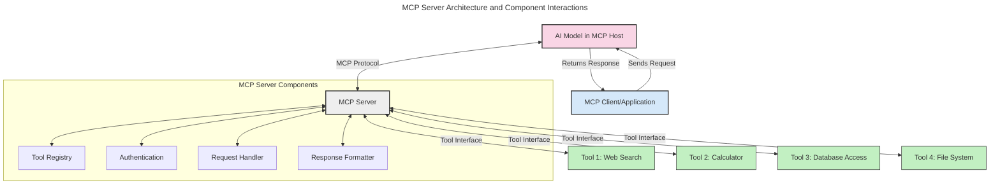
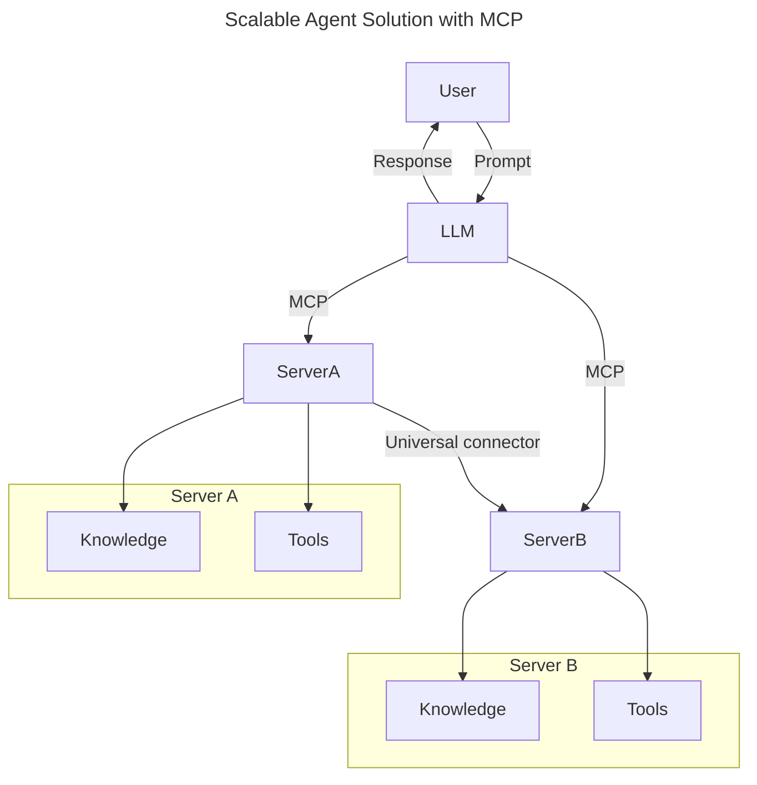
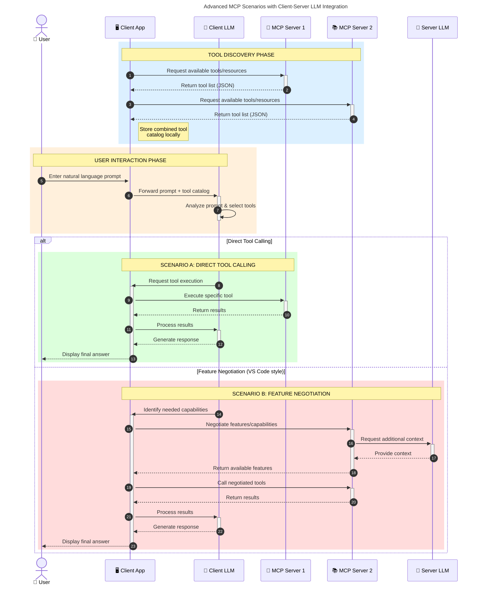

<!--
CO_OP_TRANSLATOR_METADATA:
{
  "original_hash": "105c2ddbb77bc38f7e9df009e1b06e45",
  "translation_date": "2025-07-13T15:34:18+00:00",
  "source_file": "00-Introduction/README.md",
  "language_code": "da"
}
-->
# Introduktion til Model Context Protocol (MCP): Hvorfor det er vigtigt for skalerbare AI-applikationer

Generative AI-applikationer er et stort fremskridt, da de ofte giver brugeren mulighed for at interagere med appen via naturlige sprogkommandoer. Men efterhånden som der investeres mere tid og ressourcer i sådanne apps, vil du sikre, at du nemt kan integrere funktionaliteter og ressourcer på en måde, der gør det let at udvide, at din app kan håndtere mere end én model, og at den kan håndtere forskellige modelkompleksiteter. Kort sagt er det nemt at komme i gang med at bygge Gen AI-apps, men efterhånden som de vokser og bliver mere komplekse, skal du begynde at definere en arkitektur og sandsynligvis bruge en standard for at sikre, at dine apps bygges på en ensartet måde. Her kommer MCP ind i billedet for at organisere tingene og levere en standard.

---

## **🔍 Hvad er Model Context Protocol (MCP)?**

**Model Context Protocol (MCP)** er en **åben, standardiseret grænseflade**, der gør det muligt for store sprogmodeller (LLMs) at interagere problemfrit med eksterne værktøjer, API’er og datakilder. Den tilbyder en ensartet arkitektur, der forbedrer AI-modellers funktionalitet ud over deres træningsdata, hvilket muliggør smartere, skalerbare og mere responsive AI-systemer.

---

## **🎯 Hvorfor standardisering i AI er vigtigt**

Efterhånden som generative AI-applikationer bliver mere komplekse, er det afgørende at anvende standarder, der sikrer **skalerbarhed, udvidelsesmuligheder** og **vedligeholdelse**. MCP imødekommer disse behov ved at:

- Samle model-værktøjsintegrationer
- Reducere skrøbelige, engangsløsninger
- Muliggøre, at flere modeller kan eksistere i samme økosystem

---

## **📚 Læringsmål**

Når du er færdig med denne artikel, vil du kunne:

- Definere **Model Context Protocol (MCP)** og dets anvendelsestilfælde
- Forstå hvordan MCP standardiserer kommunikation mellem model og værktøj
- Identificere de centrale komponenter i MCP-arkitekturen
- Udforske virkelige anvendelser af MCP i erhvervs- og udviklingssammenhænge

---

## **💡 Hvorfor Model Context Protocol (MCP) er en game-changer**

### **🔗 MCP løser fragmentering i AI-interaktioner**

Før MCP krævede integration af modeller med værktøjer:

- Tilpasset kode for hvert værktøj-model-par
- Ikke-standardiserede API’er for hver leverandør
- Hyppige brud ved opdateringer
- Dårlig skalerbarhed med flere værktøjer

### **✅ Fordele ved MCP-standardisering**

| **Fordel**               | **Beskrivelse**                                                                |
|--------------------------|--------------------------------------------------------------------------------|
| Interoperabilitet        | LLM’er arbejder problemfrit med værktøjer fra forskellige leverandører         |
| Konsistens               | Ensartet adfærd på tværs af platforme og værktøjer                             |
| Genbrug                  | Værktøjer bygget én gang kan bruges på tværs af projekter og systemer          |
| Hurtigere udvikling      | Reducer udviklingstid ved at bruge standardiserede, plug-and-play grænseflader |

---

## **🧱 Overordnet MCP-arkitektur**

MCP følger en **klient-server-model**, hvor:

- **MCP Hosts** kører AI-modellerne
- **MCP Clients** initierer forespørgsler
- **MCP Servers** leverer kontekst, værktøjer og kapaciteter

### **Nøglekomponenter:**

- **Ressourcer** – Statisk eller dynamisk data til modeller  
- **Prompter** – Foruddefinerede workflows til styret generering  
- **Værktøjer** – Eksekverbare funktioner som søgning, beregninger  
- **Sampling** – Agent-lignende adfærd via rekursive interaktioner

---

## Hvordan MCP-servers fungerer

MCP-servers fungerer på følgende måde:

- **Forespørgselsflow**:  
    1. MCP Client sender en forespørgsel til AI-modellen, der kører i en MCP Host.  
    2. AI-modellen identificerer, hvornår den har brug for eksterne værktøjer eller data.  
    3. Modellen kommunikerer med MCP Serveren via den standardiserede protokol.

- **MCP Server-funktionalitet**:  
    - Værktøjsregister: Vedligeholder en katalog over tilgængelige værktøjer og deres kapaciteter.  
    - Autentificering: Verificerer tilladelser til værktøjsadgang.  
    - Forespørgselsbehandler: Behandler indkommende værktøjsforespørgsler fra modellen.  
    - Svarformatter: Strukturerer værktøjsoutput i et format, som modellen kan forstå.

- **Værktøjsudførelse**:  
    - Serveren dirigerer forespørgsler til de relevante eksterne værktøjer  
    - Værktøjerne udfører deres specialiserede funktioner (søgning, beregning, databaseforespørgsler osv.)  
    - Resultater returneres til modellen i et ensartet format.

- **Svarafslutning**:  
    - AI-modellen integrerer værktøjsoutput i sit svar.  
    - Det endelige svar sendes tilbage til klientapplikationen.

```mermaid
---
title: MCP Server Architecture and Component Interactions
description: A diagram showing how AI models interact with MCP servers and various tools, depicting the request flow and server components including Tool Registry, Authentication, Request Handler, and Response Formatter
---
graph TD
    A[AI Model in MCP Host] <-->|MCP Protocol| B[MCP Server]
    B <-->|Tool Interface| C[Tool 1: Web Search]
    B <-->|Tool Interface| D[Tool 2: Calculator]
    B <-->|Tool Interface| E[Tool 3: Database Access]
    B <-->|Tool Interface| F[Tool 4: File System]
    
    Client[MCP Client/Application] -->|Sends Request| A
    A -->|Returns Response| Client
    
    subgraph "MCP Server Components"
        B
        G[Tool Registry]
        H[Authentication]
        I[Request Handler]
        J[Response Formatter]
    end
    
    B <--> G
    B <--> H
    B <--> I
    B <--> J
    
    style A fill:#f9d5e5,stroke:#333,stroke-width:2px
    style B fill:#eeeeee,stroke:#333,stroke-width:2px
    style Client fill:#d5e8f9,stroke:#333,stroke-width:2px
    style C fill:#c2f0c2,stroke:#333,stroke-width:1px
    style D fill:#c2f0c2,stroke:#333,stroke-width:1px
    style E fill:#c2f0c2,stroke:#333,stroke-width:1px
    style F fill:#c2f0c2,stroke:#333,stroke-width:1px    
```

## 👨‍💻 Sådan bygger du en MCP-server (med eksempler)

MCP-servers giver dig mulighed for at udvide LLM’s kapaciteter ved at levere data og funktionalitet.

Klar til at prøve? Her er eksempler på, hvordan du opretter en simpel MCP-server i forskellige sprog:

- **Python-eksempel**: https://github.com/modelcontextprotocol/python-sdk

- **TypeScript-eksempel**: https://github.com/modelcontextprotocol/typescript-sdk

- **Java-eksempel**: https://github.com/modelcontextprotocol/java-sdk

- **C#/.NET-eksempel**: https://github.com/modelcontextprotocol/csharp-sdk

## 🌍 Virkelige anvendelsestilfælde for MCP

MCP muliggør en bred vifte af applikationer ved at udvide AI’s kapaciteter:

| **Anvendelse**              | **Beskrivelse**                                                                |
|----------------------------|--------------------------------------------------------------------------------|
| Enterprise Data Integration | Forbind LLM’er til databaser, CRM’er eller interne værktøjer                   |
| Agentiske AI-systemer       | Muliggør autonome agenter med værktøjsadgang og beslutningsworkflows          |
| Multi-modale applikationer  | Kombiner tekst-, billede- og lydværktøjer i én samlet AI-app                   |
| Realtidsdata-integration    | Bring live data ind i AI-interaktioner for mere præcise og aktuelle resultater |

### 🧠 MCP = Universel standard for AI-interaktioner

Model Context Protocol (MCP) fungerer som en universel standard for AI-interaktioner, ligesom USB-C standardiserede fysiske forbindelser for enheder. I AI-verdenen giver MCP en ensartet grænseflade, der gør det muligt for modeller (klienter) at integrere problemfrit med eksterne værktøjer og dataleverandører (servere). Det eliminerer behovet for forskellige, tilpassede protokoller for hver API eller datakilde.

Under MCP følger et MCP-kompatibelt værktøj (kaldet en MCP-server) en samlet standard. Disse servere kan liste de værktøjer eller handlinger, de tilbyder, og udføre disse handlinger, når de bliver bedt om det af en AI-agent. AI-agentplatforme, der understøtter MCP, kan opdage tilgængelige værktøjer fra serverne og kalde dem via denne standardprotokol.

### 💡 Gør adgang til viden lettere

Ud over at tilbyde værktøjer faciliterer MCP også adgang til viden. Det gør det muligt for applikationer at give kontekst til store sprogmodeller (LLMs) ved at forbinde dem til forskellige datakilder. For eksempel kan en MCP-server repræsentere en virksomheds dokumentlager, så agenter kan hente relevant information efter behov. En anden server kan håndtere specifikke handlinger som at sende e-mails eller opdatere poster. Fra agentens perspektiv er det blot værktøjer, den kan bruge – nogle værktøjer returnerer data (videns-kontekst), mens andre udfører handlinger. MCP håndterer begge dele effektivt.

En agent, der forbinder til en MCP-server, lærer automatisk serverens tilgængelige kapaciteter og tilgængelige data gennem et standardformat. Denne standardisering muliggør dynamisk tilgængelighed af værktøjer. For eksempel gør tilføjelsen af en ny MCP-server til en agents system dens funktioner straks brugbare uden yderligere tilpasning af agentens instruktioner.

Denne strømlinede integration stemmer overens med flowet vist i mermaid-diagrammet, hvor servere leverer både værktøjer og viden, hvilket sikrer problemfri samarbejde på tværs af systemer.

### 👉 Eksempel: Skalerbar agentløsning

```mermaid
---
title: Scalable Agent Solution with MCP
description: A diagram illustrating how a user interacts with an LLM that connects to multiple MCP servers, with each server providing both knowledge and tools, creating a scalable AI system architecture
---
graph TD
    User -->|Prompt| LLM
    LLM -->|Response| User
    LLM -->|MCP| ServerA
    LLM -->|MCP| ServerB
    ServerA -->|Universal connector| ServerB
    ServerA --> KnowledgeA
    ServerA --> ToolsA
    ServerB --> KnowledgeB
    ServerB --> ToolsB

    subgraph Server A
        KnowledgeA[Knowledge]
        ToolsA[Tools]
    end

    subgraph Server B
        KnowledgeB[Knowledge]
        ToolsB[Tools]
    end
```

### 🔄 Avancerede MCP-scenarier med klient-side LLM-integration

Ud over den grundlæggende MCP-arkitektur findes der avancerede scenarier, hvor både klient og server indeholder LLM’er, hvilket muliggør mere sofistikerede interaktioner:

```mermaid
---
title: Advanced MCP Scenarios with Client-Server LLM Integration
description: A sequence diagram showing the detailed interaction flow between user, client application, client LLM, multiple MCP servers, and server LLM, illustrating tool discovery, user interaction, direct tool calling, and feature negotiation phases
---
sequenceDiagram
    autonumber
    actor User as 👤 User
    participant ClientApp as 🖥️ Client App
    participant ClientLLM as 🧠 Client LLM
    participant Server1 as 🔧 MCP Server 1
    participant Server2 as 📚 MCP Server 2
    participant ServerLLM as 🤖 Server LLM
    
    %% Discovery Phase
    rect rgb(220, 240, 255)
        Note over ClientApp, Server2: TOOL DISCOVERY PHASE
        ClientApp->>+Server1: Request available tools/resources
        Server1-->>-ClientApp: Return tool list (JSON)
        ClientApp->>+Server2: Request available tools/resources
        Server2-->>-ClientApp: Return tool list (JSON)
        Note right of ClientApp: Store combined tool<br/>catalog locally
    end
    
    %% User Interaction
    rect rgb(255, 240, 220)
        Note over User, ClientLLM: USER INTERACTION PHASE
        User->>+ClientApp: Enter natural language prompt
        ClientApp->>+ClientLLM: Forward prompt + tool catalog
        ClientLLM->>-ClientLLM: Analyze prompt & select tools
    end
    
    %% Scenario A: Direct Tool Calling
    alt Direct Tool Calling
        rect rgb(220, 255, 220)
            Note over ClientApp, Server1: SCENARIO A: DIRECT TOOL CALLING
            ClientLLM->>+ClientApp: Request tool execution
            ClientApp->>+Server1: Execute specific tool
            Server1-->>-ClientApp: Return results
            ClientApp->>+ClientLLM: Process results
            ClientLLM-->>-ClientApp: Generate response
            ClientApp-->>-User: Display final answer
        end
    
    %% Scenario B: Feature Negotiation (VS Code style)
    else Feature Negotiation (VS Code style)
        rect rgb(255, 220, 220)
            Note over ClientApp, ServerLLM: SCENARIO B: FEATURE NEGOTIATION
            ClientLLM->>+ClientApp: Identify needed capabilities
            ClientApp->>+Server2: Negotiate features/capabilities
            Server2->>+ServerLLM: Request additional context
            ServerLLM-->>-Server2: Provide context
            Server2-->>-ClientApp: Return available features
            ClientApp->>+Server2: Call negotiated tools
            Server2-->>-ClientApp: Return results
            ClientApp->>+ClientLLM: Process results
            ClientLLM-->>-ClientApp: Generate response
            ClientApp-->>-User: Display final answer
        end
    end
```

## 🔐 Praktiske fordele ved MCP

Her er de praktiske fordele ved at bruge MCP:

- **Aktualitet**: Modeller kan få adgang til opdateret information ud over deres træningsdata  
- **Udvidelse af kapaciteter**: Modeller kan bruge specialiserede værktøjer til opgaver, de ikke er trænet til  
- **Reducerede hallucinationer**: Eksterne datakilder giver faktuel forankring  
- **Privatliv**: Følsomme data kan forblive i sikre miljøer i stedet for at være indlejret i prompts

## 📌 Vigtige pointer

Følgende er vigtige pointer ved brug af MCP:

- **MCP** standardiserer, hvordan AI-modeller interagerer med værktøjer og data  
- Fremmer **udvidelsesmuligheder, konsistens og interoperabilitet**  
- MCP hjælper med at **forkorte udviklingstid, forbedre pålidelighed og udvide modelkapaciteter**  
- Klient-server-arkitekturen **muliggør fleksible, udvidelige AI-applikationer**

## 🧠 Øvelse

Tænk på en AI-applikation, du gerne vil bygge.

- Hvilke **eksterne værktøjer eller data** kunne forbedre dens kapaciteter?  
- Hvordan kunne MCP gøre integrationen **enklere og mere pålidelig**?

## Yderligere ressourcer

- [MCP GitHub Repository](https://github.com/modelcontextprotocol)

## Hvad er det næste

Næste: [Kapitel 1: Kernebegreber](../01-CoreConcepts/README.md)

**Ansvarsfraskrivelse**:  
Dette dokument er blevet oversat ved hjælp af AI-oversættelsestjenesten [Co-op Translator](https://github.com/Azure/co-op-translator). Selvom vi bestræber os på nøjagtighed, bedes du være opmærksom på, at automatiserede oversættelser kan indeholde fejl eller unøjagtigheder. Det oprindelige dokument på dets oprindelige sprog bør betragtes som den autoritative kilde. For kritisk information anbefales professionel menneskelig oversættelse. Vi påtager os intet ansvar for misforståelser eller fejltolkninger, der opstår som følge af brugen af denne oversættelse.