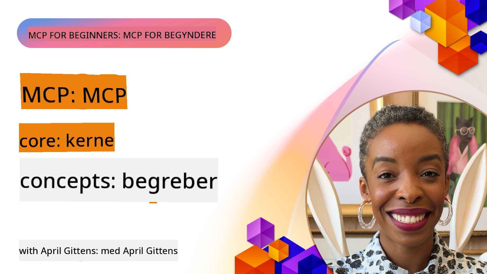
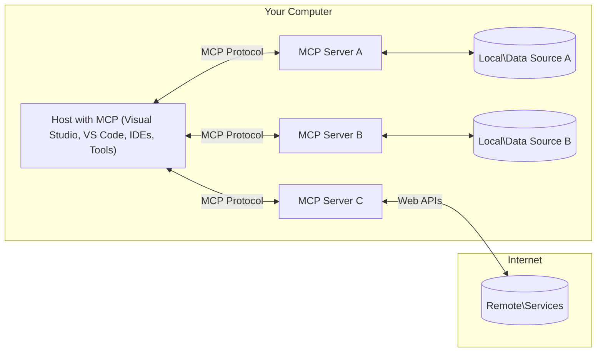

<!--
CO_OP_TRANSLATOR_METADATA:
{
  "original_hash": "904b59de1de9264801242d90a42cdd9d",
  "translation_date": "2025-09-05T11:08:30+00:00",
  "source_file": "01-CoreConcepts/README.md",
  "language_code": "da"
}
-->
# MCP Core Concepts: Beherskelse af Model Context Protocol til AI-integration

[](https://youtu.be/earDzWGtE84)

_(Klik på billedet ovenfor for at se videoen til denne lektion)_

[Model Context Protocol (MCP)](https://github.com/modelcontextprotocol) er en kraftfuld, standardiseret ramme, der optimerer kommunikationen mellem Large Language Models (LLMs) og eksterne værktøjer, applikationer og datakilder. 
Denne guide vil føre dig gennem MCP's kernekoncepter. Du vil lære om dens klient-server-arkitektur, essentielle komponenter, kommunikationsmekanik og bedste praksis for implementering.

- **Eksplicit brugeraccept**: Al adgang til data og operationer kræver eksplicit godkendelse fra brugeren før udførelse. Brugeren skal klart forstå, hvilke data der vil blive tilgået, og hvilke handlinger der vil blive udført, med detaljeret kontrol over tilladelser og autorisationer.

- **Beskyttelse af dataprivacy**: Brugerdata må kun eksponeres med eksplicit samtykke og skal beskyttes af robuste adgangskontroller gennem hele interaktionslivscyklussen. Implementeringer skal forhindre uautoriseret dataoverførsel og opretholde strenge privatlivsgrænser.

- **Sikker værktøjsudførelse**: Hver værktøjsanvendelse kræver eksplicit brugeraccept med en klar forståelse af værktøjets funktionalitet, parametre og potentielle konsekvenser. Robuste sikkerhedsgrænser skal forhindre utilsigtet, usikker eller ondsindet værktøjsudførelse.

- **Transportlagssikkerhed**: Alle kommunikationskanaler bør anvende passende kryptering og autentifikationsmekanismer. Fjernforbindelser skal implementere sikre transportprotokoller og korrekt håndtering af legitimationsoplysninger.

#### Implementeringsretningslinjer:

- **Tilladelsesstyring**: Implementer detaljerede tilladelsessystemer, der giver brugere kontrol over, hvilke servere, værktøjer og ressourcer der er tilgængelige
- **Autentifikation & autorisation**: Brug sikre autentifikationsmetoder (OAuth, API-nøgler) med korrekt tokenhåndtering og udløb  
- **Inputvalidering**: Valider alle parametre og dataindgange i henhold til definerede skemaer for at forhindre injektionsangreb
- **Auditlogning**: Oprethold omfattende logfiler over alle operationer til sikkerhedsmonitorering og overholdelse

## Oversigt

Denne lektion udforsker den grundlæggende arkitektur og de komponenter, der udgør Model Context Protocol (MCP)-økosystemet. Du vil lære om klient-server-arkitekturen, nøglekomponenterne og kommunikationsmekanismerne, der driver MCP-interaktioner.

## Centrale læringsmål

Ved afslutningen af denne lektion vil du:

- Forstå MCP's klient-server-arkitektur.
- Identificere roller og ansvar for Hosts, Clients og Servers.
- Analysere de kernefunktioner, der gør MCP til et fleksibelt integrationslag.
- Lære, hvordan information flyder inden for MCP-økosystemet.
- Få praktisk indsigt gennem kodeeksempler i .NET, Java, Python og JavaScript.

## MCP-arkitektur: En dybere indsigt

MCP-økosystemet er bygget på en klient-server-model. Denne modulære struktur gør det muligt for AI-applikationer at interagere med værktøjer, databaser, API'er og kontekstuelle ressourcer effektivt. Lad os bryde denne arkitektur ned i dens kernekomponenter.

I sin kerne følger MCP en klient-server-arkitektur, hvor en host-applikation kan forbinde til flere servere:



- **MCP Hosts**: Programmer som VSCode, Claude Desktop, IDE'er eller AI-værktøjer, der ønsker at tilgå data via MCP
- **MCP Clients**: Protokolklienter, der opretholder 1:1-forbindelser med servere
- **MCP Servers**: Letvægtsprogrammer, der hver eksponerer specifikke funktioner gennem den standardiserede Model Context Protocol
- **Lokale datakilder**: Din computers filer, databaser og tjenester, som MCP-servere kan tilgå sikkert
- **Fjernservices**: Eksterne systemer tilgængelige via internettet, som MCP-servere kan forbinde til via API'er.

MCP-protokollen er en udviklende standard, der bruger dato-baseret versionering (YYYY-MM-DD-format). Den nuværende protokolversion er **2025-06-18**. Du kan se de seneste opdateringer til [protokolspecifikationen](https://modelcontextprotocol.io/specification/2025-06-18/)

### 1. Hosts

I Model Context Protocol (MCP) er **Hosts** AI-applikationer, der fungerer som den primære grænseflade, hvorigennem brugere interagerer med protokollen. Hosts koordinerer og administrerer forbindelser til flere MCP-servere ved at oprette dedikerede MCP-klienter for hver serverforbindelse. Eksempler på Hosts inkluderer:

- **AI-applikationer**: Claude Desktop, Visual Studio Code, Claude Code
- **Udviklingsmiljøer**: IDE'er og kodeeditorer med MCP-integration  
- **Skræddersyede applikationer**: Specialbyggede AI-agenter og værktøjer

**Hosts** er applikationer, der koordinerer AI-modelinteraktioner. De:

- **Orkestrerer AI-modeller**: Udfører eller interagerer med LLM'er for at generere svar og koordinere AI-arbejdsgange
- **Administrerer klientforbindelser**: Opretter og vedligeholder én MCP-klient pr. MCP-serverforbindelse
- **Kontrollerer brugergrænsefladen**: Håndterer samtaleflow, brugerinteraktioner og præsentation af svar  
- **Sikrer sikkerhed**: Kontrollerer tilladelser, sikkerhedsbegrænsninger og autentifikation
- **Håndterer brugeraccept**: Administrerer brugerens godkendelse til datadeling og værktøjsudførelse

### 2. Clients

**Clients** er essentielle komponenter, der opretholder dedikerede én-til-én-forbindelser mellem Hosts og MCP-servere. Hver MCP-klient oprettes af Host for at forbinde til en specifik MCP-server, hvilket sikrer organiserede og sikre kommunikationskanaler. Flere klienter gør det muligt for Hosts at forbinde til flere servere samtidigt.

**Clients** er forbindelseskomponenter inden for host-applikationen. De:

- **Protokolkommunikation**: Sender JSON-RPC 2.0-anmodninger til servere med prompts og instruktioner
- **Kapacitetsforhandling**: Forhandler understøttede funktioner og protokolversioner med servere under initialisering
- **Værktøjsudførelse**: Administrerer værktøjsudførelsesanmodninger fra modeller og behandler svar
- **Realtidsopdateringer**: Håndterer notifikationer og opdateringer i realtid fra servere
- **Svarbehandling**: Behandler og formaterer serveres svar til visning for brugere

### 3. Servers

**Servers** er programmer, der leverer kontekst, værktøjer og funktioner til MCP-klienter. De kan udføres lokalt (på samme maskine som Host) eller eksternt (på eksterne platforme) og er ansvarlige for at håndtere klientanmodninger og levere strukturerede svar. Servere eksponerer specifik funktionalitet gennem den standardiserede Model Context Protocol.

**Servers** er tjenester, der leverer kontekst og funktioner. De:

- **Funktionregistrering**: Registrerer og eksponerer tilgængelige primitive (ressourcer, prompts, værktøjer) til klienter
- **Anmodningsbehandling**: Modtager og udfører værktøjsopkald, ressourceanmodninger og promptanmodninger fra klienter
- **Kontekstlevering**: Leverer kontekstuel information og data for at forbedre modelsvar
- **Tilstandsstyring**: Opretholder sessionstilstand og håndterer tilstandsbaserede interaktioner, når det er nødvendigt
- **Realtidsnotifikationer**: Sender notifikationer om kapacitetsændringer og opdateringer til tilsluttede klienter

Servere kan udvikles af enhver for at udvide modelkapaciteter med specialiseret funktionalitet, og de understøtter både lokale og eksterne implementeringsscenarier.

### 4. Serverprimitiver

Servere i Model Context Protocol (MCP) leverer tre kerne**primitiver**, der definerer de grundlæggende byggesten for rige interaktioner mellem klienter, hosts og sprogmodeller. Disse primitivere specificerer typerne af kontekstuel information og handlinger, der er tilgængelige gennem protokollen.

MCP-servere kan eksponere enhver kombination af følgende tre kerneprimitiver:

#### Ressourcer 

**Ressourcer** er datakilder, der leverer kontekstuel information til AI-applikationer. De repræsenterer statisk eller dynamisk indhold, der kan forbedre modellens forståelse og beslutningstagning:

- **Kontekstuelle data**: Struktureret information og kontekst til AI-modelforbrug
- **Vidensbaser**: Dokumentarkiver, artikler, manualer og forskningspapirer
- **Lokale datakilder**: Filer, databaser og lokal systeminformation  
- **Eksterne data**: API-svar, webtjenester og fjernsystemdata
- **Dynamisk indhold**: Realtidsdata, der opdateres baseret på eksterne forhold

Ressourcer identificeres af URI'er og understøtter opdagelse via `resources/list` og hentning via `resources/read` metoder:

```text
file://documents/project-spec.md
database://production/users/schema
api://weather/current
```

#### Prompts

**Prompts** er genanvendelige skabeloner, der hjælper med at strukturere interaktioner med sprogmodeller. De leverer standardiserede interaktionsmønstre og skabelonarbejdsgange:

- **Skabelonbaserede interaktioner**: Forstrukturerede beskeder og samtalestartere
- **Arbejdsgangsskabeloner**: Standardiserede sekvenser til almindelige opgaver og interaktioner
- **Few-shot eksempler**: Eksempelbaserede skabeloner til modelinstruktion
- **Systemprompts**: Grundlæggende prompts, der definerer modeladfærd og kontekst
- **Dynamiske skabeloner**: Parameteriserede prompts, der tilpasser sig specifikke kontekster

Prompts understøtter variabel substitution og kan opdages via `prompts/list` og hentes med `prompts/get`:

```markdown
Generate a {{task_type}} for {{product}} targeting {{audience}} with the following requirements: {{requirements}}
```

#### Værktøjer

**Værktøjer** er eksekverbare funktioner, som AI-modeller kan påkalde for at udføre specifikke handlinger. De repræsenterer "verberne" i MCP-økosystemet, der gør det muligt for modeller at interagere med eksterne systemer:

- **Eksekverbare funktioner**: Diskrete operationer, som modeller kan påkalde med specifikke parametre
- **Integration med eksterne systemer**: API-opkald, databaseforespørgsler, filoperationer, beregninger
- **Unik identitet**: Hvert værktøj har et unikt navn, beskrivelse og parameter-skema
- **Struktureret I/O**: Værktøjer accepterer validerede parametre og returnerer strukturerede, typede svar
- **Handlingskapaciteter**: Gør det muligt for modeller at udføre virkelige handlinger og hente live data

Værktøjer defineres med JSON Schema til parametervalidation og opdages via `tools/list` og udføres via `tools/call`:

```typescript
server.tool(
  "search_products", 
  {
    query: z.string().describe("Search query for products"),
    category: z.string().optional().describe("Product category filter"),
    max_results: z.number().default(10).describe("Maximum results to return")
  }, 
  async (params) => {
    // Execute search and return structured results
    return await productService.search(params);
  }
);
```

## Klientprimitiver

I Model Context Protocol (MCP) kan **klienter** eksponere primitivere, der gør det muligt for servere at anmode om yderligere kapaciteter fra host-applikationen. Disse klientbaserede primitivere muliggør rigere, mere interaktive serverimplementeringer, der kan tilgå AI-modelkapaciteter og brugerinteraktioner.

### Sampling

**Sampling** gør det muligt for servere at anmode om sprogmodelkompletteringer fra klientens AI-applikation. Denne primitive gør det muligt for servere at tilgå LLM-kapaciteter uden at inkludere deres egne modelafhængigheder:

- **Model-uafhængig adgang**: Servere kan anmode om kompletteringer uden at inkludere LLM SDK'er eller administrere modeladgang
- **Server-initieret AI**: Gør det muligt for servere autonomt at generere indhold ved hjælp af klientens AI-model
- **Recursiv LLM-interaktion**: Understøtter komplekse scenarier, hvor servere har brug for AI-assistance til behandling
- **Dynamisk indholdsgenerering**: Gør det muligt for servere at skabe kontekstuelle svar ved hjælp af hostens model

Sampling initieres gennem `sampling/complete` metoden, hvor servere sender kompletteringsanmodninger til klienter.

### Elicitation  

**Elicitation** gør det muligt for servere at anmode om yderligere information eller bekræftelse fra brugere via klientgrænsefladen:

- **Brugerinputanmodninger**: Servere kan bede om yderligere information, når det er nødvendigt for værktøjsudførelse
- **Bekræftelsesdialoger**: Anmod om brugerens godkendelse til følsomme eller betydningsfulde operationer
- **Interaktive arbejdsgange**: Gør det muligt for servere at skabe trin-for-trin brugerinteraktioner
- **Dynamisk parameterindsamling**: Indsamle manglende eller valgfrie parametre under værktøjsudførelse

Elicitation-anmodninger foretages ved hjælp af `elicitation/request` metoden for at indsamle brugerinput via klientens grænseflade.

### Logging

**Logging** gør det muligt for servere at sende strukturerede logbeskeder til klienter for fejlfinding, overvågning og operationel synlighed:

- **Fejlfinding**: Gør det muligt for servere at levere detaljerede eksekveringslogfiler til fejlsøgning
- **Operationel overvågning**: Send statusopdateringer og ydelsesmålinger til klienter
- **Fejlrapportering**: Lever detaljeret fejlkontekst og diagnostisk information
- **Auditspor**: Opret omfattende logfiler over serveroperationer og beslutninger

Logbeskeder sendes til klienter for at give gennemsigtighed i serveroperationer og lette fejlfinding.

## Informationsflow i MCP

Model Context Protocol (MCP) definerer et struktureret flow af information mellem hosts, klienter, servere og modeller. At forstå dette flow hjælper med at klarlægge, hvordan brugeranmodninger behandles, og hvordan eksterne værktøjer og data integreres i modelsvar.

- **Host initierer forbindelse**  
  Host-applikationen (såsom en IDE eller chatgrænseflade) etablerer en forbindelse til en MCP-server, typisk via STDIO, WebSocket eller en anden understøttet transport.

- **Kapacitetsforhandling**  
  Klienten (indlejret i hosten) og serveren udveksler information om deres understøttede funktioner, værktøjer, ressourcer og protokolversioner. Dette sikrer, at begge parter forstår, hvilke kapaciteter der er tilgængelige for sessionen.

- **Brugeranmodning**  
  Brugeren interagerer med hosten (f.eks. indtaster en prompt eller kommando). Hosten indsamler denne input og sender den til klienten til behandling.

- **Ressource- eller værktøjsbrug**  
  - Klienten kan anmode om yderligere kontekst eller ressourcer fra serveren (såsom filer, databaseposter eller vidensbaseartikler) for at berige modellens forståelse.
  - Hvis modellen vurderer, at et værktøj er nødvendigt (f.eks. for at hente data, udføre en beregning eller kalde en API), sender klienten en værktøjsanvendelsesanmodning til serveren, der specificerer værktøjets navn og parametre.

- **Serverudførelse**  
  Serveren modtager ressource- eller værktøjsanmodningen, udfører de nødvendige operationer (såsom at køre en funktion, forespørge en database eller hente en fil) og returnerer resultaterne til klienten i et struktureret format.

- **Svargenerering**  
  Klienten integrerer serverens svar (ressourcedata, værktøjsoutput osv.) i den igangværende modelinteraktion. Modellen bruger denne information til at generere et omfattende og kontekstuelt relevant svar.

- **Resultatpræsentation**  
  Hosten modtager det endelige output fra klienten og præsenterer det for brugeren, ofte inklusive både modellens genererede tekst og eventuelle resultater fra værktøjsudførelser eller ressourceopslag.

Dette flow gør det muligt for MCP at understøtte avancerede, interaktive og kontekstbevidste AI-applikationer ved problemfrit at forbinde modeller med eksterne værktøjer og datakilder.

## Protokolarkitektur & lag

MCP består af to adskilte arkitekturlag, der
- **JSON-RPC 2.0-protokol**: Al kommunikation bruger standardiseret JSON-RPC 2.0-meddelelsesformat til metodekald, svar og notifikationer  
- **Livscyklusstyring**: Håndterer forbindelsesinitialisering, kapabilitetsforhandling og sessionsterminering mellem klienter og servere  
- **Serverprimitiver**: Muliggør, at servere kan levere kernefunktionalitet gennem værktøjer, ressourcer og prompts  
- **Klientprimitiver**: Muliggør, at servere kan anmode om sampling fra LLM'er, indhente brugerinput og sende logbeskeder  
- **Notifikationer i realtid**: Understøtter asynkrone notifikationer for dynamiske opdateringer uden polling  

#### Nøglefunktioner:

- **Protokolversionsforhandling**: Bruger dato-baseret versionering (ÅÅÅÅ-MM-DD) for at sikre kompatibilitet  
- **Kapabilitetsopdagelse**: Klienter og servere udveksler information om understøttede funktioner under initialisering  
- **Tilstandssessioner**: Bevarer forbindelsestilstand på tværs af flere interaktioner for kontekstkontinuitet  

### Transportlag

**Transportlaget** styrer kommunikationskanaler, meddelelsesindramning og autentifikation mellem MCP-deltagere:

#### Understøttede transportmekanismer:

1. **STDIO Transport**:
   - Bruger standard input/output-strømme til direkte proceskommunikation  
   - Optimalt til lokale processer på samme maskine uden netværksomkostninger  
   - Almindeligt anvendt til lokale MCP-serverimplementeringer  

2. **Streamable HTTP Transport**:
   - Bruger HTTP POST til klient-til-server-meddelelser  
   - Valgfri Server-Sent Events (SSE) til server-til-klient-streaming  
   - Muliggør fjernserverkommunikation på tværs af netværk  
   - Understøtter standard HTTP-autentifikation (bearer tokens, API-nøgler, brugerdefinerede headers)  
   - MCP anbefaler OAuth til sikker token-baseret autentifikation  

#### Transportabstraktion:

Transportlaget abstraherer kommunikationsdetaljer fra datalaget, hvilket muliggør brug af samme JSON-RPC 2.0-meddelelsesformat på tværs af alle transportmekanismer. Denne abstraktion gør det muligt for applikationer at skifte mellem lokale og fjernservere problemfrit.

### Sikkerhedsovervejelser

MCP-implementeringer skal overholde flere kritiske sikkerhedsprincipper for at sikre sikre, pålidelige og trygge interaktioner på tværs af alle protokoloperationer:

- **Brugersamtykke og kontrol**: Brugere skal give eksplicit samtykke, før data tilgås eller operationer udføres. De skal have klar kontrol over, hvilke data der deles, og hvilke handlinger der er autoriseret, understøttet af intuitive brugergrænseflader til gennemgang og godkendelse af aktiviteter.

- **Databeskyttelse**: Brugerdata må kun eksponeres med eksplicit samtykke og skal beskyttes af passende adgangskontroller. MCP-implementeringer skal beskytte mod uautoriseret datatransmission og sikre, at privatliv opretholdes gennem alle interaktioner.

- **Værktøjssikkerhed**: Før et værktøj aktiveres, kræves eksplicit brugersamtykke. Brugere skal have en klar forståelse af hvert værktøjs funktionalitet, og robuste sikkerhedsgrænser skal håndhæves for at forhindre utilsigtet eller usikker værktøjsudførelse.

Ved at følge disse sikkerhedsprincipper sikrer MCP, at brugertillid, privatliv og sikkerhed opretholdes på tværs af alle protokolinteraktioner, samtidig med at kraftfulde AI-integrationer muliggøres.

## Eksempler på kode: Nøglekomponenter

Nedenfor er kodeeksempler i flere populære programmeringssprog, der illustrerer, hvordan man implementerer nøglekomponenter og værktøjer i en MCP-server.

### .NET Eksempel: Oprettelse af en simpel MCP-server med værktøjer

Her er et praktisk .NET-kodeeksempel, der demonstrerer, hvordan man implementerer en simpel MCP-server med brugerdefinerede værktøjer. Eksemplet viser, hvordan man definerer og registrerer værktøjer, håndterer anmodninger og forbinder serveren ved hjælp af Model Context Protocol.

```csharp
using System;
using System.Threading.Tasks;
using ModelContextProtocol.Server;
using ModelContextProtocol.Server.Transport;
using ModelContextProtocol.Server.Tools;

public class WeatherServer
{
    public static async Task Main(string[] args)
    {
        // Create an MCP server
        var server = new McpServer(
            name: "Weather MCP Server",
            version: "1.0.0"
        );
        
        // Register our custom weather tool
        server.AddTool<string, WeatherData>("weatherTool", 
            description: "Gets current weather for a location",
            execute: async (location) => {
                // Call weather API (simplified)
                var weatherData = await GetWeatherDataAsync(location);
                return weatherData;
            });
        
        // Connect the server using stdio transport
        var transport = new StdioServerTransport();
        await server.ConnectAsync(transport);
        
        Console.WriteLine("Weather MCP Server started");
        
        // Keep the server running until process is terminated
        await Task.Delay(-1);
    }
    
    private static async Task<WeatherData> GetWeatherDataAsync(string location)
    {
        // This would normally call a weather API
        // Simplified for demonstration
        await Task.Delay(100); // Simulate API call
        return new WeatherData { 
            Temperature = 72.5,
            Conditions = "Sunny",
            Location = location
        };
    }
}

public class WeatherData
{
    public double Temperature { get; set; }
    public string Conditions { get; set; }
    public string Location { get; set; }
}
```

### Java Eksempel: MCP-serverkomponenter

Dette eksempel demonstrerer den samme MCP-server og værktøjsregistrering som .NET-eksemplet ovenfor, men implementeret i Java.

```java
import io.modelcontextprotocol.server.McpServer;
import io.modelcontextprotocol.server.McpToolDefinition;
import io.modelcontextprotocol.server.transport.StdioServerTransport;
import io.modelcontextprotocol.server.tool.ToolExecutionContext;
import io.modelcontextprotocol.server.tool.ToolResponse;

public class WeatherMcpServer {
    public static void main(String[] args) throws Exception {
        // Create an MCP server
        McpServer server = McpServer.builder()
            .name("Weather MCP Server")
            .version("1.0.0")
            .build();
            
        // Register a weather tool
        server.registerTool(McpToolDefinition.builder("weatherTool")
            .description("Gets current weather for a location")
            .parameter("location", String.class)
            .execute((ToolExecutionContext ctx) -> {
                String location = ctx.getParameter("location", String.class);
                
                // Get weather data (simplified)
                WeatherData data = getWeatherData(location);
                
                // Return formatted response
                return ToolResponse.content(
                    String.format("Temperature: %.1f°F, Conditions: %s, Location: %s", 
                    data.getTemperature(), 
                    data.getConditions(), 
                    data.getLocation())
                );
            })
            .build());
        
        // Connect the server using stdio transport
        try (StdioServerTransport transport = new StdioServerTransport()) {
            server.connect(transport);
            System.out.println("Weather MCP Server started");
            // Keep server running until process is terminated
            Thread.currentThread().join();
        }
    }
    
    private static WeatherData getWeatherData(String location) {
        // Implementation would call a weather API
        // Simplified for example purposes
        return new WeatherData(72.5, "Sunny", location);
    }
}

class WeatherData {
    private double temperature;
    private String conditions;
    private String location;
    
    public WeatherData(double temperature, String conditions, String location) {
        this.temperature = temperature;
        this.conditions = conditions;
        this.location = location;
    }
    
    public double getTemperature() {
        return temperature;
    }
    
    public String getConditions() {
        return conditions;
    }
    
    public String getLocation() {
        return location;
    }
}
```

### Python Eksempel: Bygning af en MCP-server

Dette eksempel bruger fastmcp, så sørg for at installere det først:

```python
pip install fastmcp
```  
Kodeeksempel:

```python
#!/usr/bin/env python3
import asyncio
from fastmcp import FastMCP
from fastmcp.transports.stdio import serve_stdio

# Create a FastMCP server
mcp = FastMCP(
    name="Weather MCP Server",
    version="1.0.0"
)

@mcp.tool()
def get_weather(location: str) -> dict:
    """Gets current weather for a location."""
    return {
        "temperature": 72.5,
        "conditions": "Sunny",
        "location": location
    }

# Alternative approach using a class
class WeatherTools:
    @mcp.tool()
    def forecast(self, location: str, days: int = 1) -> dict:
        """Gets weather forecast for a location for the specified number of days."""
        return {
            "location": location,
            "forecast": [
                {"day": i+1, "temperature": 70 + i, "conditions": "Partly Cloudy"}
                for i in range(days)
            ]
        }

# Register class tools
weather_tools = WeatherTools()

# Start the server
if __name__ == "__main__":
    asyncio.run(serve_stdio(mcp))
```

### JavaScript Eksempel: Oprettelse af en MCP-server

Dette eksempel viser oprettelse af en MCP-server i JavaScript og hvordan man registrerer to værktøjer relateret til vejret.

```javascript
// Using the official Model Context Protocol SDK
import { McpServer } from "@modelcontextprotocol/sdk/server/mcp.js";
import { StdioServerTransport } from "@modelcontextprotocol/sdk/server/stdio.js";
import { z } from "zod"; // For parameter validation

// Create an MCP server
const server = new McpServer({
  name: "Weather MCP Server",
  version: "1.0.0"
});

// Define a weather tool
server.tool(
  "weatherTool",
  {
    location: z.string().describe("The location to get weather for")
  },
  async ({ location }) => {
    // This would normally call a weather API
    // Simplified for demonstration
    const weatherData = await getWeatherData(location);
    
    return {
      content: [
        { 
          type: "text", 
          text: `Temperature: ${weatherData.temperature}°F, Conditions: ${weatherData.conditions}, Location: ${weatherData.location}` 
        }
      ]
    };
  }
);

// Define a forecast tool
server.tool(
  "forecastTool",
  {
    location: z.string(),
    days: z.number().default(3).describe("Number of days for forecast")
  },
  async ({ location, days }) => {
    // This would normally call a weather API
    // Simplified for demonstration
    const forecast = await getForecastData(location, days);
    
    return {
      content: [
        { 
          type: "text", 
          text: `${days}-day forecast for ${location}: ${JSON.stringify(forecast)}` 
        }
      ]
    };
  }
);

// Helper functions
async function getWeatherData(location) {
  // Simulate API call
  return {
    temperature: 72.5,
    conditions: "Sunny",
    location: location
  };
}

async function getForecastData(location, days) {
  // Simulate API call
  return Array.from({ length: days }, (_, i) => ({
    day: i + 1,
    temperature: 70 + Math.floor(Math.random() * 10),
    conditions: i % 2 === 0 ? "Sunny" : "Partly Cloudy"
  }));
}

// Connect the server using stdio transport
const transport = new StdioServerTransport();
server.connect(transport).catch(console.error);

console.log("Weather MCP Server started");
```

Dette JavaScript-eksempel demonstrerer, hvordan man opretter en MCP-klient, der forbinder til en server, sender en prompt og behandler svaret, inklusive eventuelle værktøjskald, der blev foretaget.

## Sikkerhed og autorisation

MCP inkluderer flere indbyggede koncepter og mekanismer til styring af sikkerhed og autorisation gennem hele protokollen:

1. **Kontrol af værktøjstilladelser**:  
   Klienter kan specificere, hvilke værktøjer en model må bruge under en session. Dette sikrer, at kun eksplicit autoriserede værktøjer er tilgængelige, hvilket reducerer risikoen for utilsigtede eller usikre operationer. Tilladelser kan konfigureres dynamisk baseret på brugerpræferencer, organisatoriske politikker eller interaktionens kontekst.

2. **Autentifikation**:  
   Servere kan kræve autentifikation, før der gives adgang til værktøjer, ressourcer eller følsomme operationer. Dette kan involvere API-nøgler, OAuth-tokens eller andre autentifikationsmetoder. Korrekt autentifikation sikrer, at kun betroede klienter og brugere kan aktivere server-side kapabiliteter.

3. **Validering**:  
   Parametervalidering håndhæves for alle værktøjskald. Hvert værktøj definerer de forventede typer, formater og begrænsninger for dets parametre, og serveren validerer indkommende anmodninger i overensstemmelse hermed. Dette forhindrer fejlformet eller ondsindet input i at nå værktøjsimplementeringer og hjælper med at opretholde operationernes integritet.

4. **Ratebegrænsning**:  
   For at forhindre misbrug og sikre retfærdig brug af serverressourcer kan MCP-servere implementere ratebegrænsning for værktøjskald og ressourceadgang. Ratebegrænsninger kan anvendes pr. bruger, pr. session eller globalt og hjælper med at beskytte mod denial-of-service-angreb eller overdreven ressourceforbrug.

Ved at kombinere disse mekanismer giver MCP en sikker grundlag for integration af sprogmodeller med eksterne værktøjer og datakilder, samtidig med at brugere og udviklere får detaljeret kontrol over adgang og brug.

## Protokolmeddelelser og kommunikationsflow

MCP-kommunikation bruger strukturerede **JSON-RPC 2.0**-meddelelser til at facilitere klare og pålidelige interaktioner mellem værter, klienter og servere. Protokollen definerer specifikke meddelelsesmønstre for forskellige typer operationer:

### Kerne-meddelelsestyper:

#### **Initialiseringsmeddelelser**
- **`initialize` Anmodning**: Etablerer forbindelse og forhandler protokolversion og kapabiliteter  
- **`initialize` Svar**: Bekræfter understøttede funktioner og serverinformation  
- **`notifications/initialized`**: Signalerer, at initialisering er fuldført, og sessionen er klar  

#### **Opdagelsesmeddelelser**
- **`tools/list` Anmodning**: Opdager tilgængelige værktøjer fra serveren  
- **`resources/list` Anmodning**: Lister tilgængelige ressourcer (datakilder)  
- **`prompts/list` Anmodning**: Henter tilgængelige promptskabeloner  

#### **Eksekveringsmeddelelser**  
- **`tools/call` Anmodning**: Eksekverer et specifikt værktøj med angivne parametre  
- **`resources/read` Anmodning**: Henter indhold fra en specifik ressource  
- **`prompts/get` Anmodning**: Henter en promptskabelon med valgfrie parametre  

#### **Klient-side meddelelser**
- **`sampling/complete` Anmodning**: Serveren anmoder om LLM-fuldførelse fra klienten  
- **`elicitation/request`**: Serveren anmoder om brugerinput via klientgrænsefladen  
- **Logbeskeder**: Serveren sender strukturerede logbeskeder til klienten  

#### **Notifikationsmeddelelser**
- **`notifications/tools/list_changed`**: Serveren informerer klienten om ændringer i værktøjslisten  
- **`notifications/resources/list_changed`**: Serveren informerer klienten om ændringer i ressourcelisten  
- **`notifications/prompts/list_changed`**: Serveren informerer klienten om ændringer i promptlisten  

### Meddelelsesstruktur:

Alle MCP-meddelelser følger JSON-RPC 2.0-format med:  
- **Anmodningsmeddelelser**: Indeholder `id`, `method` og valgfrie `params`  
- **Svarmeddelelser**: Indeholder `id` og enten `result` eller `error`  
- **Notifikationsmeddelelser**: Indeholder `method` og valgfrie `params` (ingen `id` eller svar forventet)  

Denne strukturerede kommunikation sikrer pålidelige, sporbare og udvidelige interaktioner, der understøtter avancerede scenarier som realtidsopdateringer, værktøjskædning og robust fejlhåndtering.

## Vigtige pointer

- **Arkitektur**: MCP bruger en klient-server-arkitektur, hvor værter administrerer flere klientforbindelser til servere  
- **Deltagere**: Økosystemet inkluderer værter (AI-applikationer), klienter (protokolforbindelser) og servere (kapabilitetsleverandører)  
- **Transportmekanismer**: Kommunikation understøtter STDIO (lokal) og Streamable HTTP med valgfri SSE (fjern)  
- **Kerneprimitiver**: Servere eksponerer værktøjer (eksekverbare funktioner), ressourcer (datakilder) og prompts (skabeloner)  
- **Klientprimitiver**: Servere kan anmode om sampling (LLM-fuldførelser), elicitation (brugerinput) og logning fra klienter  
- **Protokolfundament**: Bygget på JSON-RPC 2.0 med dato-baseret versionering (nuværende: 2025-06-18)  
- **Realtidskapabiliteter**: Understøtter notifikationer for dynamiske opdateringer og realtidssynkronisering  
- **Sikkerhed først**: Eksplicit brugersamtykke, databeskyttelse og sikker transport er kernekrav  

## Øvelse

Design et simpelt MCP-værktøj, der ville være nyttigt inden for dit område. Definér:  
1. Hvad værktøjet skal hedde  
2. Hvilke parametre det skal acceptere  
3. Hvilket output det skal returnere  
4. Hvordan en model kunne bruge dette værktøj til at løse brugerproblemer  

---

## Hvad er næste

Næste: [Kapitel 2: Sikkerhed](../02-Security/README.md)  

---

**Ansvarsfraskrivelse**:  
Dette dokument er blevet oversat ved hjælp af AI-oversættelsestjenesten [Co-op Translator](https://github.com/Azure/co-op-translator). Selvom vi bestræber os på nøjagtighed, skal du være opmærksom på, at automatiserede oversættelser kan indeholde fejl eller unøjagtigheder. Det originale dokument på dets oprindelige sprog bør betragtes som den autoritative kilde. For kritisk information anbefales professionel menneskelig oversættelse. Vi påtager os intet ansvar for misforståelser eller fejltolkninger, der måtte opstå som følge af brugen af denne oversættelse.