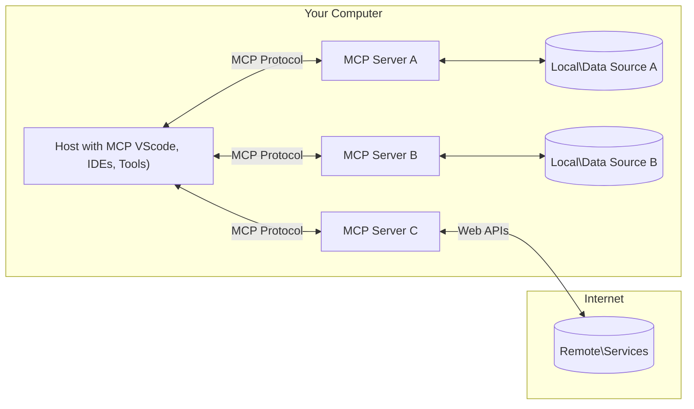

<!--
CO_OP_TRANSLATOR_METADATA:
{
  "original_hash": "355b12a5970c5c9e6db0bee970c751ba",
  "translation_date": "2025-07-13T16:08:07+00:00",
  "source_file": "01-CoreConcepts/README.md",
  "language_code": "da"
}
-->
# 📖 MCP Core Concepts: Mestring af Model Context Protocol til AI-integration

[Model Context Protocol (MCP)](https://github.com/modelcontextprotocol) er en kraftfuld, standardiseret ramme, der optimerer kommunikationen mellem store sprogmodeller (LLMs) og eksterne værktøjer, applikationer og datakilder. Denne SEO-optimerede guide vil føre dig gennem MCP’s kernebegreber, så du får en forståelse for dens klient-server-arkitektur, væsentlige komponenter, kommunikationsmekanismer og bedste praksis for implementering.

## Oversigt

Denne lektion udforsker den grundlæggende arkitektur og de komponenter, der udgør Model Context Protocol (MCP) økosystemet. Du vil lære om klient-server-arkitekturen, nøglekomponenter og kommunikationsmekanismer, der driver MCP-interaktioner.

## 👩‍🎓 Vigtige læringsmål

Når du er færdig med denne lektion, vil du:

- Forstå MCP’s klient-server-arkitektur.
- Identificere roller og ansvar for Hosts, Clients og Servers.
- Analysere de centrale funktioner, der gør MCP til et fleksibelt integrationslag.
- Lære, hvordan information flyder inden for MCP-økosystemet.
- Få praktisk indsigt gennem kodeeksempler i .NET, Java, Python og JavaScript.

## 🔎 MCP Arkitektur: Et dybere kig

MCP-økosystemet er bygget på en klient-server-model. Denne modulære struktur gør det muligt for AI-applikationer effektivt at interagere med værktøjer, databaser, API’er og kontekstuelle ressourcer. Lad os bryde denne arkitektur ned i dens kernekomponenter.

I sin kerne følger MCP en klient-server-arkitektur, hvor en host-applikation kan forbinde til flere servere:



- **MCP Hosts**: Programmer som VSCode, Claude Desktop, IDE’er eller AI-værktøjer, der ønsker at få adgang til data via MCP
- **MCP Clients**: Protokolklienter, der opretholder 1:1-forbindelser med servere
- **MCP Servers**: Letvægtsprogrammer, der hver især eksponerer specifikke funktioner gennem den standardiserede Model Context Protocol
- **Lokale datakilder**: Din computers filer, databaser og tjenester, som MCP-servere kan få sikker adgang til
- **Fjernservices**: Eksterne systemer tilgængelige over internettet, som MCP-servere kan forbinde til via API’er.

MCP-protokollen er en udviklende standard, og du kan se de seneste opdateringer i [protokolspecifikationen](https://modelcontextprotocol.io/specification/2025-06-18/)

### 1. Hosts

I Model Context Protocol (MCP) spiller Hosts en afgørende rolle som den primære grænseflade, hvorigennem brugere interagerer med protokollen. Hosts er applikationer eller miljøer, der initierer forbindelser til MCP-servere for at få adgang til data, værktøjer og prompts. Eksempler på Hosts inkluderer integrerede udviklingsmiljøer (IDEs) som Visual Studio Code, AI-værktøjer som Claude Desktop eller specialbyggede agenter designet til specifikke opgaver.

**Hosts** er LLM-applikationer, der initierer forbindelser. De:

- Udfører eller interagerer med AI-modeller for at generere svar.
- Initierer forbindelser til MCP-servere.
- Styrer samtaleforløbet og brugergrænsefladen.
- Kontrollerer tilladelser og sikkerhedsbegrænsninger.
- Håndterer brugerens samtykke til datadeling og værktøjsudførelse.

### 2. Clients

Clients er essentielle komponenter, der faciliterer interaktionen mellem Hosts og MCP-servere. Clients fungerer som mellemled, der gør det muligt for Hosts at få adgang til og anvende funktionaliteter leveret af MCP-servere. De spiller en vigtig rolle i at sikre glidende kommunikation og effektiv dataudveksling inden for MCP-arkitekturen.

**Clients** er forbindelser inden for host-applikationen. De:

- Sender forespørgsler til servere med prompts/instruktioner.
- Forhandler kapabiliteter med servere.
- Håndterer anmodninger om værktøjsudførelse fra modeller.
- Behandler og viser svar til brugerne.

### 3. Servers

Servers er ansvarlige for at håndtere forespørgsler fra MCP-klienter og levere passende svar. De styrer forskellige operationer som datahentning, værktøjsudførelse og promptgenerering. Servers sikrer, at kommunikationen mellem clients og Hosts er effektiv og pålidelig, samtidig med at integriteten af interaktionsprocessen opretholdes.

**Servers** er tjenester, der leverer kontekst og funktionaliteter. De:

- Registrerer tilgængelige funktioner (ressourcer, prompts, værktøjer)
- Modtager og udfører værktøjskald fra klienten
- Leverer kontekstuel information for at forbedre modelrespons
- Returnerer output til klienten
- Opretholder tilstand på tværs af interaktioner, når det er nødvendigt

Servers kan udvikles af alle for at udvide modelkapabiliteter med specialiseret funktionalitet.

### 4. Serverfunktioner

Servers i Model Context Protocol (MCP) tilbyder grundlæggende byggesten, der muliggør rige interaktioner mellem clients, hosts og sprogmodeller. Disse funktioner er designet til at forbedre MCP’s kapabiliteter ved at tilbyde struktureret kontekst, værktøjer og prompts.

MCP-servere kan tilbyde en eller flere af følgende funktioner:

#### 📑 Ressourcer

Ressourcer i Model Context Protocol (MCP) omfatter forskellige typer kontekst og data, som brugere eller AI-modeller kan anvende. Disse inkluderer:

- **Kontekstuel data**: Information og kontekst, som brugere eller AI-modeller kan bruge til beslutningstagning og opgaveudførelse.
- **Vidensbaser og dokumentarkiver**: Samlinger af strukturerede og ustrukturerede data, såsom artikler, manualer og forskningspapirer, der giver værdifuld indsigt og information.
- **Lokale filer og databaser**: Data gemt lokalt på enheder eller i databaser, tilgængelige til behandling og analyse.
- **API’er og webservices**: Eksterne grænseflader og tjenester, der tilbyder yderligere data og funktionaliteter, hvilket muliggør integration med forskellige online ressourcer og værktøjer.

Et eksempel på en ressource kan være et databaseskema eller en fil, der kan tilgås således:

```text
file://log.txt
database://schema
```

### 🤖 Prompts

Prompts i Model Context Protocol (MCP) inkluderer forskellige foruddefinerede skabeloner og interaktionsmønstre designet til at strømline brugerarbejdsgange og forbedre kommunikationen. Disse inkluderer:

- **Skabelonbeskeder og arbejdsgange**: Forudstrukturerede beskeder og processer, der guider brugere gennem specifikke opgaver og interaktioner.
- **Foruddefinerede interaktionsmønstre**: Standardiserede sekvenser af handlinger og svar, der fremmer konsekvent og effektiv kommunikation.
- **Specialiserede samtaleskabeloner**: Tilpassede skabeloner skræddersyet til specifikke typer samtaler, der sikrer relevante og kontekstuelt passende interaktioner.

En promptskabelon kan se således ud:

```markdown
Generate a product slogan based on the following {{product}} with the following {{keywords}}
```

#### ⛏️ Værktøjer

Værktøjer i Model Context Protocol (MCP) er funktioner, som AI-modellen kan udføre for at løse specifikke opgaver. Disse værktøjer er designet til at forbedre AI-modellens kapabiliteter ved at tilbyde strukturerede og pålidelige operationer. Nøgleaspekter inkluderer:

- **Funktioner, som AI-modellen kan udføre**: Værktøjer er eksekverbare funktioner, som AI-modellen kan kalde for at udføre forskellige opgaver.
- **Unikt navn og beskrivelse**: Hvert værktøj har et særskilt navn og en detaljeret beskrivelse, der forklarer dets formål og funktionalitet.
- **Parametre og output**: Værktøjer accepterer specifikke parametre og returnerer strukturerede output, hvilket sikrer konsistente og forudsigelige resultater.
- **Diskrete funktioner**: Værktøjer udfører diskrete funktioner som web-søgninger, beregninger og databaseforespørgsler.

Et eksempel på et værktøj kunne se således ud:

```typescript
server.tool(
  "GetProducts",
  {
    pageSize: z.string().optional(),
    pageCount: z.string().optional()
  }, () => {
    // return results from API
  }
)
```

## Clientfunktioner

I Model Context Protocol (MCP) tilbyder clients flere nøglefunktioner til servere, som forbedrer den samlede funktionalitet og interaktion inden for protokollen. En af de bemærkelsesværdige funktioner er Sampling.

### 👉 Sampling

- **Server-initierede agentiske handlinger**: Clients muliggør, at servere kan initiere specifikke handlinger eller adfærd autonomt, hvilket øger systemets dynamiske kapabiliteter.
- **Rekursive LLM-interaktioner**: Denne funktion tillader rekursive interaktioner med store sprogmodeller (LLMs), hvilket muliggør mere komplekse og iterative opgavebehandlinger.
- **Anmodning om yderligere modelkompletteringer**: Servere kan anmode om yderligere svar fra modellen for at sikre, at svarene er grundige og kontekstuelt relevante.

## Informationsflow i MCP

Model Context Protocol (MCP) definerer en struktureret informationsstrøm mellem hosts, clients, servers og modeller. At forstå denne strøm hjælper med at klarlægge, hvordan brugerforespørgsler behandles, og hvordan eksterne værktøjer og data integreres i modelrespons.

- **Host initierer forbindelse**  
  Host-applikationen (såsom et IDE eller chat-interface) etablerer en forbindelse til en MCP-server, typisk via STDIO, WebSocket eller en anden understøttet transport.

- **Kapabilitetsforhandling**  
  Clienten (indlejret i hosten) og serveren udveksler information om deres understøttede funktioner, værktøjer, ressourcer og protokolversioner. Dette sikrer, at begge parter forstår, hvilke kapabiliteter der er tilgængelige for sessionen.

- **Brugerforespørgsel**  
  Brugeren interagerer med hosten (f.eks. indtaster en prompt eller kommando). Hosten indsamler denne input og sender den til clienten til behandling.

- **Brug af ressource eller værktøj**  
  - Clienten kan anmode om yderligere kontekst eller ressourcer fra serveren (såsom filer, databaseposter eller vidensbaseartikler) for at berige modellens forståelse.  
  - Hvis modellen vurderer, at et værktøj er nødvendigt (f.eks. for at hente data, udføre en beregning eller kalde en API), sender clienten en anmodning om værktøjskald til serveren med angivelse af værktøjets navn og parametre.

- **Serverudførelse**  
  Serveren modtager ressource- eller værktøjsanmodningen, udfører de nødvendige operationer (såsom at køre en funktion, forespørge en database eller hente en fil) og returnerer resultaterne til clienten i et struktureret format.

- **Svargenerering**  
  Clienten integrerer serverens svar (ressourcedata, værktøjsoutput osv.) i den igangværende modelinteraktion. Modellen bruger disse oplysninger til at generere et omfattende og kontekstuelt relevant svar.

- **Resultatpræsentation**  
  Hosten modtager det endelige output fra clienten og præsenterer det for brugeren, ofte inklusive både den tekst, modellen har genereret, og eventuelle resultater fra værktøjsudførelser eller ressourceopslag.

Denne strøm muliggør, at MCP kan understøtte avancerede, interaktive og kontekstbevidste AI-applikationer ved sømløst at forbinde modeller med eksterne værktøjer og datakilder.

## Protokoldetaljer

MCP (Model Context Protocol) er bygget oven på [JSON-RPC 2.0](https://www.jsonrpc.org/), hvilket giver et standardiseret, sprogagnostisk beskedformat til kommunikation mellem hosts, clients og servers. Dette fundament muliggør pålidelige, strukturerede og udvidelige interaktioner på tværs af forskellige platforme og programmeringssprog.

### Vigtige protokolfunktioner

MCP udvider JSON-RPC 2.0 med yderligere konventioner for værktøjskald, ressourceadgang og promptstyring. Den understøtter flere transportlag (STDIO, WebSocket, SSE) og muliggør sikker, udvidelig og sprogagnostisk kommunikation mellem komponenter.

#### 🧢 Basal protokol

- **JSON-RPC beskedformat**: Alle forespørgsler og svar bruger JSON-RPC 2.0-specifikationen, hvilket sikrer en ensartet struktur for metodekald, parametre, resultater og fejlhåndtering.
- **Stateful forbindelser**: MCP-sessioner opretholder tilstand på tværs af flere forespørgsler, hvilket understøtter løbende samtaler, kontekstakkumulering og ressourcestyring.
- **Kapabilitetsforhandling**: Under forbindelsesopsætning udveksler clients og servers information om understøttede funktioner, protokolversioner, tilgængelige værktøjer og ressourcer. Dette sikrer, at begge parter forstår hinandens kapabiliteter og kan tilpasse sig derefter.

#### ➕ Yderligere værktøjer

Nedenfor er nogle ekstra værktøjer og protokoludvidelser, som MCP tilbyder for at forbedre udvikleroplevelsen og muliggøre avancerede scenarier:

- **Konfigurationsmuligheder**: MCP tillader dynamisk konfiguration af sessionsparametre, såsom værktøjstilladelser, ressourceadgang og modelindstillinger, tilpasset hver interaktion.
- **Fremdriftssporing**: Langvarige operationer kan rapportere statusopdateringer, hvilket muliggør responsive brugergrænseflader og bedre brugeroplevelse under komplekse opgaver.
- **Annullering af forespørgsler**: Clients kan annullere igangværende forespørgsler, så brugere kan afbryde operationer, der ikke længere er nødvendige eller tager for lang tid.
- **Fejlrapportering**: Standardiserede fejlmeddelelser og koder hjælper med at diagnosticere problemer, håndtere fejl elegant og give brugbare tilbagemeldinger til brugere og udviklere.
- **Logning**: Både clients og servers kan udsende strukturerede logs til revision, fejlfinding og overvågning af protokolinteraktioner.

Ved at udnytte disse protokolfunktioner sikrer MCP robust, sikker og fleksibel kommunikation mellem sprogmodeller og eksterne værktøjer eller datakilder.

### 🔐 Sikkerhedsovervejelser

MCP-implementeringer bør følge flere nøgleprincipper for sikkerhed for at sikre sikre og pålidelige interaktioner:

- **Brugersamtykke og kontrol**: Brugere skal give eksplicit samtykke, før data tilgås eller operationer udføres. De skal have klar kontrol over, hvilke data der deles, og hvilke handlinger der autoriseres, understøttet af intuitive brugergrænseflader til gennemgang og godkendelse af aktiviteter.

- **Dataprivatliv**: Brugerdata må kun eksponeres med eksplicit samtykke og skal beskyttes af passende adgangskontroller. MCP-implementeringer skal forhindre uautoriseret datatransmission og sikre, at privatliv opretholdes gennem alle interaktioner.

- **Værktøjssikkerhed**: Før ethvert værktøj kaldes, kræves eksplicit brugersamtykke. Brugere skal have en klar forståelse af hvert værktøjs funktionalitet, og robuste sikkerhedsgrænser skal håndhæves for at forhindre utilsigtet eller usikker værktøjsudførelse.

Ved at følge disse principper sikrer MCP, at brugertillid, privatliv og sikkerhed opretholdes i alle protokolinteraktioner.

## Kodeeksempler: Nøglekomponenter

Nedenfor er kodeeksempler i flere populære programmeringssprog, der illustrerer, hvordan man implementerer nøglekomponenter og værktøjer til MCP-servere.

### .NET-eksempel: Oprettelse af en simpel MCP-server med værktøjer

Her er et praktisk .NET-kodeeksempel, der demonstrerer, hvordan man implementerer en simpel MCP-server med brugerdefinerede værktøjer. Eksemplet viser, hvordan man definerer og registrerer værktøjer, håndterer forespørgsler og forbinder serveren via Model Context Protocol.

```csharp
using System;
using System.Threading.Tasks;
using ModelContextProtocol.Server;
using ModelContextProtocol.Server.Transport;
using ModelContextProtocol.Server.Tools;

public class WeatherServer
{
    public static async Task Main(string[] args)
    {
        // Create an MCP server
        var server = new McpServer(
            name: "Weather MCP Server",
            version: "1.0.0"
        );
        
        // Register our custom weather tool
        server.AddTool<string, WeatherData>("weatherTool", 
            description: "Gets current weather for a location",
            execute: async (location) => {
                // Call weather API (simplified)
                var weatherData = await GetWeatherDataAsync(location);
                return weatherData;
            });
        
        // Connect the server using stdio transport
        var transport = new StdioServerTransport();
        await server.ConnectAsync(transport);
        
        Console.WriteLine("Weather MCP Server started");
        
        // Keep the server running until process is terminated
        await Task.Delay(-1);
    }
    
    private static async Task<WeatherData> GetWeatherDataAsync(string location)
    {
        // This would normally call a weather API
        // Simplified for demonstration
        await Task.Delay(100); // Simulate API call
        return new WeatherData { 
            Temperature = 72.5,
            Conditions = "Sunny",
            Location = location
        };
    }
}

public class WeatherData
{
    public double Temperature { get; set; }
    public string Conditions { get; set; }
    public string Location { get; set; }
}
```

### Java-eksempel: MCP-serverkomponenter

Dette eksempel demonstrerer den samme MCP-server og værktøjsregistrering som .NET-eksemplet ovenfor, men implementeret i Java.

```java
import io.modelcontextprotocol.server.McpServer;
import io.modelcontextprotocol.server.McpToolDefinition;
import io.modelcontextprotocol.server.transport.StdioServerTransport;
import io.modelcontextprotocol.server.tool.ToolExecutionContext;
import io.modelcontextprotocol.server.tool.ToolResponse;

public class WeatherMcpServer {
    public static void main(String[] args) throws Exception {
        // Create an MCP server
        McpServer server = McpServer.builder()
            .name("Weather MCP Server")
            .version("1.0.0")
            .build();
            
        // Register a weather tool
        server.registerTool(McpToolDefinition.builder("weatherTool")
            .description("Gets current weather for a location")
            .parameter("location", String.class)
            .execute((ToolExecutionContext ctx) -> {
                String location = ctx.getParameter("location", String.class);
                
                // Get weather data (simplified)
                WeatherData data = getWeatherData(location);
                
                // Return formatted response
                return ToolResponse.content(
                    String.format("Temperature: %.1f°F, Conditions: %s, Location: %s", 
                    data.getTemperature(), 
                    data.getConditions(), 
                    data.getLocation())
                );
            })
            .build());
        
        // Connect the server using stdio transport
        try (StdioServerTransport transport = new StdioServerTransport()) {
            server.connect(transport);
            System.out.println("Weather MCP Server started");
            // Keep server running until process is terminated
            Thread.currentThread().join();
        }
    }
    
    private static WeatherData getWeatherData(String location) {
        // Implementation would call a weather API
        // Simplified for example purposes
        return new WeatherData(72.5, "Sunny", location);
    }
}

class WeatherData {
    private double temperature;
    private String conditions;
    private String location;
    
    public WeatherData(double temperature, String conditions, String location) {
        this.temperature = temperature;
        this.conditions = conditions;
        this.location = location;
    }
    
    public double getTemperature() {
        return temperature;
    }
    
    public String getConditions() {
        return conditions;
    }
    
    public String getLocation() {
        return location;
    }
}
```

### Python-eksempel: Opbygning af en MCP-server

I dette eksempel viser vi, hvordan man bygger en MCP-server i Python. Du får også vist to forskellige måder at oprette værktøjer på.

```python
#!/usr/bin/env python3
import asyncio
from mcp.server.fastmcp import FastMCP
from mcp.server.transports.stdio import serve_stdio

# Create a FastMCP server
mcp = FastMCP(
    name="Weather MCP Server",
    version="1.0.0"
)

@mcp.tool()
def get_weather(location: str) -> dict:
    """Gets current weather for a location."""
    # This would normally call a weather API
    # Simplified for demonstration
    return {
        "temperature": 72.5,
        "conditions": "Sunny",
        "location": location
    }

# Alternative approach using a class
class WeatherTools:
    @mcp.tool()
    def forecast(self, location: str, days: int = 1) -> dict:
        """Gets weather forecast for a location for the specified number of days."""
        # This would normally call a weather API forecast endpoint
        # Simplified for demonstration
        return {
            "location": location,
            "forecast": [
                {"day": i+1, "temperature": 70 + i, "conditions": "Partly Cloudy"}
                for i in range(days)
            ]
        }

# Instantiate the class to register its tools
weather_tools = WeatherTools()

# Start the server using stdio transport
if __name__ == "__main__":
    asyncio.run(serve_stdio(mcp))
```

### JavaScript-eksempel: Oprettelse af en MCP-server

Dette eksempel viser oprettelse af en MCP-server i JavaScript og hvordan man registrerer to vejrudsigtsrelaterede værktøjer.

```javascript
// Using the official Model Context Protocol SDK
import { McpServer } from "@modelcontextprotocol/sdk/server/mcp.js";
import { StdioServerTransport } from "@modelcontextprotocol/sdk/server/stdio.js";
import { z } from "zod"; // For parameter validation

// Create an MCP server
const server = new McpServer({
  name: "Weather MCP Server",
  version: "1.0.0"
});

// Define a weather tool
server.tool(
  "weatherTool",
  {
    location: z.string().describe("The location to get weather for")
  },
  async ({ location }) => {
    // This would normally call a weather API
    // Simplified for demonstration
    const weatherData = await getWeatherData(location);
    
    return {
      content: [
        { 
          type: "text", 
          text: `Temperature: ${weatherData.temperature}°F, Conditions: ${weatherData.conditions}, Location: ${weatherData.location}` 
        }
      ]
    };
  }
);

// Define a forecast tool
server.tool(
  "forecastTool",
  {
    location: z.string(),
    days: z.number().default(3).describe("Number of days for forecast")
  },
  async ({ location, days }) => {
    // This would normally call a weather API
    // Simplified for demonstration
    const forecast = await getForecastData(location, days);
    
    return {
      content: [
        { 
          type: "text", 
          text: `${days}-day forecast for ${location}: ${JSON.stringify(forecast)}` 
        }
      ]
    };
  }
);

// Helper functions
async function getWeatherData(location) {
  // Simulate API call
  return {
    temperature: 72.5,
    conditions: "Sunny",
    location: location
  };
}

async function getForecastData(location, days) {
  // Simulate API call
  return Array.from({ length: days }, (_, i) => ({
    day: i + 1,
    temperature: 70 + Math.floor(Math.random() * 10),
    conditions: i % 2 === 0 ? "Sunny" : "Partly Cloudy"
  }));
}

// Connect the server using stdio transport
const transport = new StdioServerTransport();
server.connect(transport).catch(console.error);

console.log("Weather MCP Server started");
```

Dette JavaScript-eksempel demonstrerer, hvordan man opretter en MCP-client
MCP inkluderer flere indbyggede koncepter og mekanismer til at håndtere sikkerhed og autorisation gennem hele protokollen:

1. **Værktøjstilladelseskontrol**:  
  Klienter kan angive, hvilke værktøjer en model må bruge under en session. Dette sikrer, at kun eksplicit godkendte værktøjer er tilgængelige, hvilket reducerer risikoen for utilsigtede eller usikre handlinger. Tilladelser kan konfigureres dynamisk baseret på brugerpræferencer, organisationspolitikker eller konteksten for interaktionen.

2. **Autentificering**:  
  Servere kan kræve autentificering, før der gives adgang til værktøjer, ressourcer eller følsomme operationer. Dette kan involvere API-nøgler, OAuth-tokens eller andre autentificeringsmetoder. Korrekt autentificering sikrer, at kun betroede klienter og brugere kan aktivere server-side funktioner.

3. **Validering**:  
  Parameter-validering håndhæves for alle værktøjskald. Hvert værktøj definerer de forventede typer, formater og begrænsninger for sine parametre, og serveren validerer indkommende forespørgsler i overensstemmelse hermed. Dette forhindrer fejlbehæftet eller ondsindet input i at nå værktøjsimplementeringerne og hjælper med at opretholde operationernes integritet.

4. **Ratebegrænsning**:  
  For at forhindre misbrug og sikre fair brug af serverressourcer kan MCP-servere implementere ratebegrænsning for værktøjskald og adgang til ressourcer. Ratebegrænsninger kan anvendes pr. bruger, pr. session eller globalt, og hjælper med at beskytte mod denial-of-service-angreb eller overdreven ressourceforbrug.

Ved at kombinere disse mekanismer giver MCP et sikkert fundament for integration af sprogmodeller med eksterne værktøjer og datakilder, samtidig med at brugere og udviklere får detaljeret kontrol over adgang og brug.

## Protokolbeskeder

MCP-kommunikation bruger strukturerede JSON-beskeder for at muliggøre klare og pålidelige interaktioner mellem klienter, servere og modeller. De vigtigste beskedtyper inkluderer:

- **Client Request**  
  Sendes fra klienten til serveren og indeholder typisk:
  - Brugerens prompt eller kommando
  - Samtalehistorik for kontekst
  - Værktøjskonfiguration og tilladelser
  - Eventuel yderligere metadata eller sessionsinformation

- **Model Response**  
  Returneres af modellen (via klienten) og indeholder:
  - Genereret tekst eller færdiggørelse baseret på prompt og kontekst
  - Valgfrie instruktioner til værktøjskald, hvis modellen vurderer, at et værktøj skal aktiveres
  - Referencer til ressourcer eller yderligere kontekst efter behov

- **Tool Request**  
  Sendes fra klienten til serveren, når et værktøj skal udføres. Denne besked indeholder:
  - Navnet på det værktøj, der skal aktiveres
  - Parametre, som værktøjet kræver (valideret mod værktøjets skema)
  - Kontekstuel information eller identifikatorer til sporing af forespørgslen

- **Tool Response**  
  Returneres af serveren efter udførelse af et værktøj. Denne besked indeholder:
  - Resultaterne af værktøjsudførelsen (strukturerede data eller indhold)
  - Eventuelle fejl eller statusinformation, hvis værktøjskaldet mislykkedes
  - Valgfrit yderligere metadata eller logfiler relateret til udførelsen

Disse strukturerede beskeder sikrer, at hvert trin i MCP-arbejdsgangen er eksplicit, sporbar og udvidelsesvenlig, hvilket understøtter avancerede scenarier som flertrins-samtaler, kædning af værktøjer og robust fejlhåndtering.

## Vigtige pointer

- MCP bruger en klient-server-arkitektur til at forbinde modeller med eksterne funktioner
- Økosystemet består af klienter, hosts, servere, værktøjer og datakilder
- Kommunikation kan foregå via STDIO, SSE eller WebSockets
- Værktøjer er de grundlæggende funktionalitetsenheder, der eksponeres for modeller
- Strukturerede kommunikationsprotokoller sikrer konsistente interaktioner

## Øvelse

Design et simpelt MCP-værktøj, der ville være nyttigt inden for dit område. Definér:
1. Hvad værktøjet skal hedde
2. Hvilke parametre det skal acceptere
3. Hvilket output det skal returnere
4. Hvordan en model kunne bruge dette værktøj til at løse brugerens problemer


---

## Hvad er det næste

Næste: [Chapter 2: Security](../02-Security/README.md)

**Ansvarsfraskrivelse**:  
Dette dokument er blevet oversat ved hjælp af AI-oversættelsestjenesten [Co-op Translator](https://github.com/Azure/co-op-translator). Selvom vi bestræber os på nøjagtighed, bedes du være opmærksom på, at automatiserede oversættelser kan indeholde fejl eller unøjagtigheder. Det oprindelige dokument på dets oprindelige sprog bør betragtes som den autoritative kilde. For kritisk information anbefales professionel menneskelig oversættelse. Vi påtager os intet ansvar for misforståelser eller fejltolkninger, der opstår som følge af brugen af denne oversættelse.