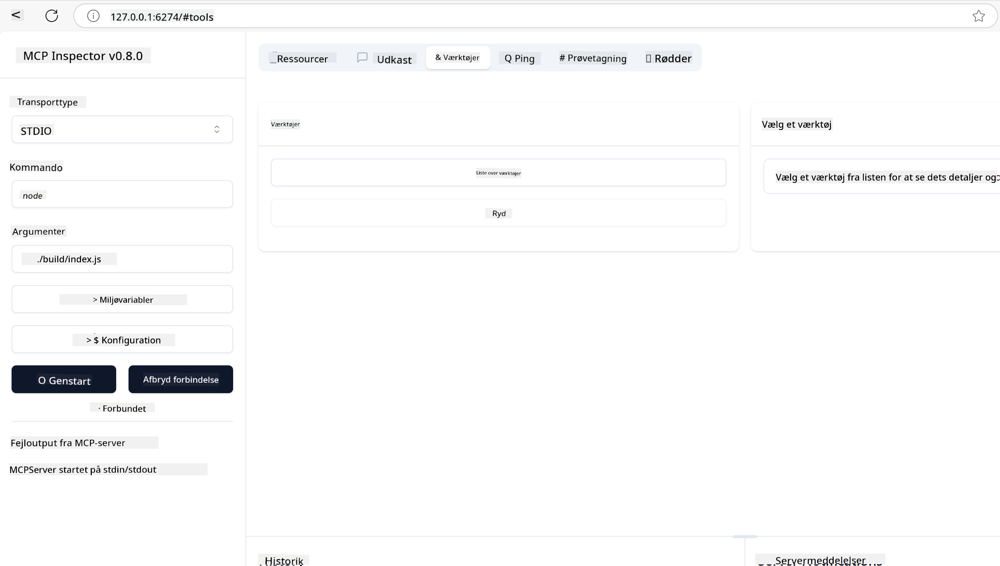
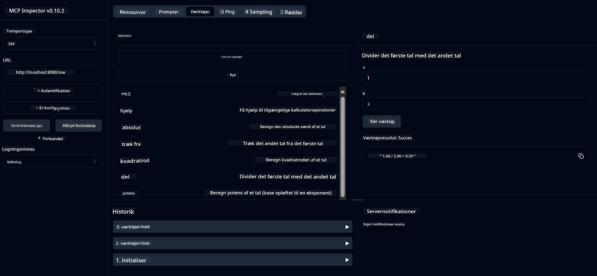

<!--
CO_OP_TRANSLATOR_METADATA:
{
  "original_hash": "ec11ee93f31fdadd94facd3e3d22f9e6",
  "translation_date": "2025-09-09T21:56:21+00:00",
  "source_file": "03-GettingStarted/01-first-server/README.md",
  "language_code": "da"
}
-->
# Kom godt i gang med MCP

Velkommen til dine første skridt med Model Context Protocol (MCP)! Uanset om du er ny inden for MCP eller ønsker at uddybe din forståelse, vil denne guide føre dig gennem den essentielle opsætning og udviklingsproces. Du vil opdage, hvordan MCP muliggør problemfri integration mellem AI-modeller og applikationer, og lære, hvordan du hurtigt gør dit miljø klar til at bygge og teste MCP-baserede løsninger.

> TLDR; Hvis du bygger AI-applikationer, ved du, at du kan tilføje værktøjer og andre ressourcer til din LLM (large language model) for at gøre den mere vidende. Men hvis du placerer disse værktøjer og ressourcer på en server, kan appen og serverens kapaciteter bruges af enhver klient med/uden en LLM.

## Oversigt

Denne lektion giver praktisk vejledning i opsætning af MCP-miljøer og opbygning af dine første MCP-applikationer. Du vil lære, hvordan du opsætter de nødvendige værktøjer og frameworks, bygger grundlæggende MCP-servere, opretter host-applikationer og tester dine implementeringer.

Model Context Protocol (MCP) er en åben protokol, der standardiserer, hvordan applikationer leverer kontekst til LLM'er. Tænk på MCP som en USB-C-port for AI-applikationer – det giver en standardiseret måde at forbinde AI-modeller til forskellige datakilder og værktøjer.

## Læringsmål

Ved afslutningen af denne lektion vil du kunne:

- Opsætte udviklingsmiljøer for MCP i C#, Java, Python, TypeScript og Rust
- Bygge og implementere grundlæggende MCP-servere med brugerdefinerede funktioner (ressourcer, prompts og værktøjer)
- Oprette host-applikationer, der forbinder til MCP-servere
- Teste og fejlfinde MCP-implementeringer

## Opsætning af dit MCP-miljø

Før du begynder at arbejde med MCP, er det vigtigt at forberede dit udviklingsmiljø og forstå den grundlæggende arbejdsgang. Denne sektion vil guide dig gennem de indledende opsætningsskridt for at sikre en problemfri start med MCP.

### Forudsætninger

Før du dykker ned i MCP-udvikling, skal du sikre dig, at du har:

- **Udviklingsmiljø**: For det valgte sprog (C#, Java, Python, TypeScript eller Rust)
- **IDE/Editor**: Visual Studio, Visual Studio Code, IntelliJ, Eclipse, PyCharm eller en moderne kodeeditor
- **Pakkestyringsværktøjer**: NuGet, Maven/Gradle, pip, npm/yarn eller Cargo
- **API-nøgler**: Til de AI-tjenester, du planlægger at bruge i dine host-applikationer

## Grundlæggende MCP-serverstruktur

En MCP-server inkluderer typisk:

- **Serverkonfiguration**: Opsætning af port, autentifikation og andre indstillinger
- **Ressourcer**: Data og kontekst, der stilles til rådighed for LLM'er
- **Værktøjer**: Funktionalitet, som modeller kan anvende
- **Prompts**: Skabeloner til generering eller strukturering af tekst

Her er et forenklet eksempel i TypeScript:

```typescript
import { McpServer, ResourceTemplate } from "@modelcontextprotocol/sdk/server/mcp.js";
import { StdioServerTransport } from "@modelcontextprotocol/sdk/server/stdio.js";
import { z } from "zod";

// Create an MCP server
const server = new McpServer({
  name: "Demo",
  version: "1.0.0"
});

// Add an addition tool
server.tool("add",
  { a: z.number(), b: z.number() },
  async ({ a, b }) => ({
    content: [{ type: "text", text: String(a + b) }]
  })
);

// Add a dynamic greeting resource
server.resource(
  "file",
  // The 'list' parameter controls how the resource lists available files. Setting it to undefined disables listing for this resource.
  new ResourceTemplate("file://{path}", { list: undefined }),
  async (uri, { path }) => ({
    contents: [{
      uri: uri.href,
      text: `File, ${path}!`
    }]
  })
);

// Add a file resource that reads the file contents
server.resource(
  "file",
  new ResourceTemplate("file://{path}", { list: undefined }),
  async (uri, { path }) => {
    let text;
    try {
      text = await fs.readFile(path, "utf8");
    } catch (err) {
      text = `Error reading file: ${err.message}`;
    }
    return {
      contents: [{
        uri: uri.href,
        text
      }]
    };
  }
);

server.prompt(
  "review-code",
  { code: z.string() },
  ({ code }) => ({
    messages: [{
      role: "user",
      content: {
        type: "text",
        text: `Please review this code:\n\n${code}`
      }
    }]
  })
);

// Start receiving messages on stdin and sending messages on stdout
const transport = new StdioServerTransport();
await server.connect(transport);
```

I den foregående kode:

- Importerer vi de nødvendige klasser fra MCP TypeScript SDK.
- Opretter og konfigurerer vi en ny MCP-serverinstans.
- Registrerer vi et brugerdefineret værktøj (`calculator`) med en handlerfunktion.
- Starter vi serveren for at lytte efter indkommende MCP-anmodninger.

## Test og fejlfinding

Før du begynder at teste din MCP-server, er det vigtigt at forstå de tilgængelige værktøjer og bedste praksis for fejlfinding. Effektiv test sikrer, at din server opfører sig som forventet og hjælper dig med hurtigt at identificere og løse problemer. Følgende sektion beskriver anbefalede fremgangsmåder til validering af din MCP-implementering.

MCP tilbyder værktøjer til at hjælpe dig med at teste og fejlfinde dine servere:

- **Inspector-værktøj**, en grafisk grænseflade, der giver dig mulighed for at forbinde til din server og teste dine værktøjer, prompts og ressourcer.
- **curl**, du kan også forbinde til din server ved hjælp af et kommandolinjeværktøj som curl eller andre klienter, der kan oprette og køre HTTP-kommandoer.

### Brug af MCP Inspector

[MCP Inspector](https://github.com/modelcontextprotocol/inspector) er et visuelt testværktøj, der hjælper dig med:

1. **Opdage serverkapaciteter**: Automatisk registrere tilgængelige ressourcer, værktøjer og prompts
2. **Teste værktøjsudførelse**: Prøve forskellige parametre og se svar i realtid
3. **Se servermetadata**: Undersøge serverinfo, skemaer og konfigurationer

```bash
# ex TypeScript, installing and running MCP Inspector
npx @modelcontextprotocol/inspector node build/index.js
```

Når du kører ovenstående kommandoer, vil MCP Inspector starte en lokal webgrænseflade i din browser. Du kan forvente at se et dashboard, der viser dine registrerede MCP-servere, deres tilgængelige værktøjer, ressourcer og prompts. Grænsefladen giver dig mulighed for interaktivt at teste værktøjsudførelse, inspicere servermetadata og se svar i realtid, hvilket gør det lettere at validere og fejlfinde dine MCP-serverimplementeringer.

Her er et skærmbillede af, hvordan det kan se ud:



## Almindelige opsætningsproblemer og løsninger

| Problem | Mulig løsning |
|---------|---------------|
| Forbindelse nægtet | Tjek om serveren kører, og om porten er korrekt |
| Fejl ved værktøjsudførelse | Gennemgå parametervalidering og fejlhåndtering |
| Autentifikationsfejl | Bekræft API-nøgler og tilladelser |
| Skemavalideringsfejl | Sørg for, at parametrene matcher det definerede skema |
| Server starter ikke | Tjek for portkonflikter eller manglende afhængigheder |
| CORS-fejl | Konfigurer korrekte CORS-headere for cross-origin-anmodninger |
| Autentifikationsproblemer | Bekræft token gyldighed og tilladelser |

## Lokal udvikling

Til lokal udvikling og test kan du køre MCP-servere direkte på din maskine:

1. **Start serverprocessen**: Kør din MCP-serverapplikation
2. **Konfigurer netværk**: Sørg for, at serveren er tilgængelig på den forventede port
3. **Forbind klienter**: Brug lokale forbindelses-URL'er som `http://localhost:3000`

```bash
# Example: Running a TypeScript MCP server locally
npm run start
# Server running at http://localhost:3000
```

## Byg din første MCP-server

Vi har dækket [Kernekoncepter](/01-CoreConcepts/README.md) i en tidligere lektion, nu er det tid til at omsætte den viden til praksis.

### Hvad en server kan gøre

Før vi begynder at skrive kode, lad os minde os selv om, hvad en server kan gøre:

En MCP-server kan for eksempel:

- Tilgå lokale filer og databaser
- Forbinde til eksterne API'er
- Udføre beregninger
- Integrere med andre værktøjer og tjenester
- Tilbyde en brugergrænseflade til interaktion

Fantastisk, nu hvor vi ved, hvad vi kan gøre med den, lad os begynde at kode.

## Øvelse: Opret en server

For at oprette en server skal du følge disse trin:

- Installer MCP SDK.
- Opret et projekt og opsæt projektstrukturen.
- Skriv serverkoden.
- Test serveren.

### -1- Opret projekt

#### TypeScript

```sh
# Create project directory and initialize npm project
mkdir calculator-server
cd calculator-server
npm init -y
```

#### Python

```sh
# Create project dir
mkdir calculator-server
cd calculator-server
# Open the folder in Visual Studio Code - Skip this if you are using a different IDE
code .
```

#### .NET

```sh
dotnet new console -n McpCalculatorServer
cd McpCalculatorServer
```

#### Java

For Java, opret et Spring Boot-projekt:

```bash
curl https://start.spring.io/starter.zip \
  -d dependencies=web \
  -d javaVersion=21 \
  -d type=maven-project \
  -d groupId=com.example \
  -d artifactId=calculator-server \
  -d name=McpServer \
  -d packageName=com.microsoft.mcp.sample.server \
  -o calculator-server.zip
```

Udpak zip-filen:

```bash
unzip calculator-server.zip -d calculator-server
cd calculator-server
# optional remove the unused test
rm -rf src/test/java
```

Tilføj følgende komplette konfiguration til din *pom.xml*-fil:

```xml
<?xml version="1.0" encoding="UTF-8"?>
<project xmlns="http://maven.apache.org/POM/4.0.0"
    xmlns:xsi="http://www.w3.org/2001/XMLSchema-instance"
    xsi:schemaLocation="http://maven.apache.org/POM/4.0.0 http://maven.apache.org/xsd/maven-4.0.0.xsd">
    <modelVersion>4.0.0</modelVersion>
    
    <!-- Spring Boot parent for dependency management -->
    <parent>
        <groupId>org.springframework.boot</groupId>
        <artifactId>spring-boot-starter-parent</artifactId>
        <version>3.5.0</version>
        <relativePath />
    </parent>

    <!-- Project coordinates -->
    <groupId>com.example</groupId>
    <artifactId>calculator-server</artifactId>
    <version>0.0.1-SNAPSHOT</version>
    <name>Calculator Server</name>
    <description>Basic calculator MCP service for beginners</description>

    <!-- Properties -->
    <properties>
        <java.version>21</java.version>
        <maven.compiler.source>21</maven.compiler.source>
        <maven.compiler.target>21</maven.compiler.target>
    </properties>

    <!-- Spring AI BOM for version management -->
    <dependencyManagement>
        <dependencies>
            <dependency>
                <groupId>org.springframework.ai</groupId>
                <artifactId>spring-ai-bom</artifactId>
                <version>1.0.0-SNAPSHOT</version>
                <type>pom</type>
                <scope>import</scope>
            </dependency>
        </dependencies>
    </dependencyManagement>

    <!-- Dependencies -->
    <dependencies>
        <dependency>
            <groupId>org.springframework.ai</groupId>
            <artifactId>spring-ai-starter-mcp-server-webflux</artifactId>
        </dependency>
        <dependency>
            <groupId>org.springframework.boot</groupId>
            <artifactId>spring-boot-starter-actuator</artifactId>
        </dependency>
        <dependency>
         <groupId>org.springframework.boot</groupId>
         <artifactId>spring-boot-starter-test</artifactId>
         <scope>test</scope>
      </dependency>
    </dependencies>

    <!-- Build configuration -->
    <build>
        <plugins>
            <plugin>
                <groupId>org.springframework.boot</groupId>
                <artifactId>spring-boot-maven-plugin</artifactId>
            </plugin>
            <plugin>
                <groupId>org.apache.maven.plugins</groupId>
                <artifactId>maven-compiler-plugin</artifactId>
                <configuration>
                    <release>21</release>
                </configuration>
            </plugin>
        </plugins>
    </build>

    <!-- Repositories for Spring AI snapshots -->
    <repositories>
        <repository>
            <id>spring-milestones</id>
            <name>Spring Milestones</name>
            <url>https://repo.spring.io/milestone</url>
            <snapshots>
                <enabled>false</enabled>
            </snapshots>
        </repository>
        <repository>
            <id>spring-snapshots</id>
            <name>Spring Snapshots</name>
            <url>https://repo.spring.io/snapshot</url>
            <releases>
                <enabled>false</enabled>
            </releases>
        </repository>
    </repositories>
</project>
```

#### Rust

```sh
mkdir calculator-server
cd calculator-server
cargo init
```

### -2- Tilføj afhængigheder

Nu hvor du har oprettet dit projekt, lad os tilføje afhængigheder:

#### TypeScript

```sh
# If not already installed, install TypeScript globally
npm install typescript -g

# Install the MCP SDK and Zod for schema validation
npm install @modelcontextprotocol/sdk zod
npm install -D @types/node typescript
```

#### Python

```sh
# Create a virtual env and install dependencies
python -m venv venv
venv\Scripts\activate
pip install "mcp[cli]"
```

#### Java

```bash
cd calculator-server
./mvnw clean install -DskipTests
```

#### Rust

```sh
cargo add rmcp --features server,transport-io
cargo add serde
cargo add tokio --features rt-multi-thread
```

### -3- Opret projektfiler

#### TypeScript

Åbn *package.json*-filen og erstat indholdet med følgende for at sikre, at du kan bygge og køre serveren:

```json
{
  "name": "calculator-server",
  "version": "1.0.0",
  "main": "index.js",
  "type": "module",
  "scripts": {
    "start": "tsc && node ./build/index.js",
    "build": "tsc && node ./build/index.js"
  },
  "keywords": [],
  "author": "",
  "license": "ISC",
  "description": "A simple calculator server using Model Context Protocol",
  "dependencies": {
    "@modelcontextprotocol/sdk": "^1.16.0",
    "zod": "^3.25.76"
  },
  "devDependencies": {
    "@types/node": "^24.0.14",
    "typescript": "^5.8.3"
  }
}
```

Opret en *tsconfig.json* med følgende indhold:

```json
{
  "compilerOptions": {
    "target": "ES2022",
    "module": "Node16",
    "moduleResolution": "Node16",
    "outDir": "./build",
    "rootDir": "./src",
    "strict": true,
    "esModuleInterop": true,
    "skipLibCheck": true,
    "forceConsistentCasingInFileNames": true
  },
  "include": ["src/**/*"],
  "exclude": ["node_modules"]
}
```

Opret en mappe til din kildekode:

```sh
mkdir src
touch src/index.ts
```

#### Python

Opret en fil *server.py*

```sh
touch server.py
```

#### .NET

Installer de nødvendige NuGet-pakker:

```sh
dotnet add package ModelContextProtocol --prerelease
dotnet add package Microsoft.Extensions.Hosting
```

#### Java

For Java Spring Boot-projekter oprettes projektstrukturen automatisk.

#### Rust

For Rust oprettes en *src/main.rs*-fil som standard, når du kører `cargo init`. Åbn filen og slet standardkoden.

### -4- Opret serverkode

#### TypeScript

Opret en fil *index.ts* og tilføj følgende kode:

```typescript
import { McpServer, ResourceTemplate } from "@modelcontextprotocol/sdk/server/mcp.js";
import { StdioServerTransport } from "@modelcontextprotocol/sdk/server/stdio.js";
import { z } from "zod";
 
// Create an MCP server
const server = new McpServer({
  name: "Calculator MCP Server",
  version: "1.0.0"
});
```

Nu har du en server, men den gør ikke meget, lad os rette det.

#### Python

```python
# server.py
from mcp.server.fastmcp import FastMCP

# Create an MCP server
mcp = FastMCP("Demo")
```

#### .NET

```csharp
using Microsoft.Extensions.DependencyInjection;
using Microsoft.Extensions.Hosting;
using Microsoft.Extensions.Logging;
using ModelContextProtocol.Server;
using System.ComponentModel;

var builder = Host.CreateApplicationBuilder(args);
builder.Logging.AddConsole(consoleLogOptions =>
{
    // Configure all logs to go to stderr
    consoleLogOptions.LogToStandardErrorThreshold = LogLevel.Trace;
});

builder.Services
    .AddMcpServer()
    .WithStdioServerTransport()
    .WithToolsFromAssembly();
await builder.Build().RunAsync();

// add features
```

#### Java

For Java skal du oprette de centrale serverkomponenter. Først skal du ændre hovedapplikationsklassen:

*src/main/java/com/microsoft/mcp/sample/server/McpServerApplication.java*:

```java
package com.microsoft.mcp.sample.server;

import org.springframework.ai.tool.ToolCallbackProvider;
import org.springframework.ai.tool.method.MethodToolCallbackProvider;
import org.springframework.boot.SpringApplication;
import org.springframework.boot.autoconfigure.SpringBootApplication;
import org.springframework.context.annotation.Bean;
import com.microsoft.mcp.sample.server.service.CalculatorService;

@SpringBootApplication
public class McpServerApplication {

    public static void main(String[] args) {
        SpringApplication.run(McpServerApplication.class, args);
    }
    
    @Bean
    public ToolCallbackProvider calculatorTools(CalculatorService calculator) {
        return MethodToolCallbackProvider.builder().toolObjects(calculator).build();
    }
}
```

Opret calculator-tjenesten *src/main/java/com/microsoft/mcp/sample/server/service/CalculatorService.java*:

```java
package com.microsoft.mcp.sample.server.service;

import org.springframework.ai.tool.annotation.Tool;
import org.springframework.stereotype.Service;

/**
 * Service for basic calculator operations.
 * This service provides simple calculator functionality through MCP.
 */
@Service
public class CalculatorService {

    /**
     * Add two numbers
     * @param a The first number
     * @param b The second number
     * @return The sum of the two numbers
     */
    @Tool(description = "Add two numbers together")
    public String add(double a, double b) {
        double result = a + b;
        return formatResult(a, "+", b, result);
    }

    /**
     * Subtract one number from another
     * @param a The number to subtract from
     * @param b The number to subtract
     * @return The result of the subtraction
     */
    @Tool(description = "Subtract the second number from the first number")
    public String subtract(double a, double b) {
        double result = a - b;
        return formatResult(a, "-", b, result);
    }

    /**
     * Multiply two numbers
     * @param a The first number
     * @param b The second number
     * @return The product of the two numbers
     */
    @Tool(description = "Multiply two numbers together")
    public String multiply(double a, double b) {
        double result = a * b;
        return formatResult(a, "*", b, result);
    }

    /**
     * Divide one number by another
     * @param a The numerator
     * @param b The denominator
     * @return The result of the division
     */
    @Tool(description = "Divide the first number by the second number")
    public String divide(double a, double b) {
        if (b == 0) {
            return "Error: Cannot divide by zero";
        }
        double result = a / b;
        return formatResult(a, "/", b, result);
    }

    /**
     * Calculate the power of a number
     * @param base The base number
     * @param exponent The exponent
     * @return The result of raising the base to the exponent
     */
    @Tool(description = "Calculate the power of a number (base raised to an exponent)")
    public String power(double base, double exponent) {
        double result = Math.pow(base, exponent);
        return formatResult(base, "^", exponent, result);
    }

    /**
     * Calculate the square root of a number
     * @param number The number to find the square root of
     * @return The square root of the number
     */
    @Tool(description = "Calculate the square root of a number")
    public String squareRoot(double number) {
        if (number < 0) {
            return "Error: Cannot calculate square root of a negative number";
        }
        double result = Math.sqrt(number);
        return String.format("√%.2f = %.2f", number, result);
    }

    /**
     * Calculate the modulus (remainder) of division
     * @param a The dividend
     * @param b The divisor
     * @return The remainder of the division
     */
    @Tool(description = "Calculate the remainder when one number is divided by another")
    public String modulus(double a, double b) {
        if (b == 0) {
            return "Error: Cannot divide by zero";
        }
        double result = a % b;
        return formatResult(a, "%", b, result);
    }

    /**
     * Calculate the absolute value of a number
     * @param number The number to find the absolute value of
     * @return The absolute value of the number
     */
    @Tool(description = "Calculate the absolute value of a number")
    public String absolute(double number) {
        double result = Math.abs(number);
        return String.format("|%.2f| = %.2f", number, result);
    }

    /**
     * Get help about available calculator operations
     * @return Information about available operations
     */
    @Tool(description = "Get help about available calculator operations")
    public String help() {
        return "Basic Calculator MCP Service\n\n" +
               "Available operations:\n" +
               "1. add(a, b) - Adds two numbers\n" +
               "2. subtract(a, b) - Subtracts the second number from the first\n" +
               "3. multiply(a, b) - Multiplies two numbers\n" +
               "4. divide(a, b) - Divides the first number by the second\n" +
               "5. power(base, exponent) - Raises a number to a power\n" +
               "6. squareRoot(number) - Calculates the square root\n" + 
               "7. modulus(a, b) - Calculates the remainder of division\n" +
               "8. absolute(number) - Calculates the absolute value\n\n" +
               "Example usage: add(5, 3) will return 5 + 3 = 8";
    }

    /**
     * Format the result of a calculation
     */
    private String formatResult(double a, String operator, double b, double result) {
        return String.format("%.2f %s %.2f = %.2f", a, operator, b, result);
    }
}
```

**Valgfrie komponenter til en produktionsklar tjeneste:**

Opret en opstartsopsætning *src/main/java/com/microsoft/mcp/sample/server/config/StartupConfig.java*:

```java
package com.microsoft.mcp.sample.server.config;

import org.springframework.boot.CommandLineRunner;
import org.springframework.context.annotation.Bean;
import org.springframework.context.annotation.Configuration;

@Configuration
public class StartupConfig {
    
    @Bean
    public CommandLineRunner startupInfo() {
        return args -> {
            System.out.println("\n" + "=".repeat(60));
            System.out.println("Calculator MCP Server is starting...");
            System.out.println("SSE endpoint: http://localhost:8080/sse");
            System.out.println("Health check: http://localhost:8080/actuator/health");
            System.out.println("=".repeat(60) + "\n");
        };
    }
}
```

Opret en sundhedskontrol *src/main/java/com/microsoft/mcp/sample/server/controller/HealthController.java*:

```java
package com.microsoft.mcp.sample.server.controller;

import org.springframework.http.ResponseEntity;
import org.springframework.web.bind.annotation.GetMapping;
import org.springframework.web.bind.annotation.RestController;
import java.time.LocalDateTime;
import java.util.HashMap;
import java.util.Map;

@RestController
public class HealthController {
    
    @GetMapping("/health")
    public ResponseEntity<Map<String, Object>> healthCheck() {
        Map<String, Object> response = new HashMap<>();
        response.put("status", "UP");
        response.put("timestamp", LocalDateTime.now().toString());
        response.put("service", "Calculator MCP Server");
        return ResponseEntity.ok(response);
    }
}
```

Opret en undtagelseshåndtering *src/main/java/com/microsoft/mcp/sample/server/exception/GlobalExceptionHandler.java*:

```java
package com.microsoft.mcp.sample.server.exception;

import org.springframework.http.HttpStatus;
import org.springframework.http.ResponseEntity;
import org.springframework.web.bind.annotation.ExceptionHandler;
import org.springframework.web.bind.annotation.RestControllerAdvice;

@RestControllerAdvice
public class GlobalExceptionHandler {

    @ExceptionHandler(IllegalArgumentException.class)
    public ResponseEntity<ErrorResponse> handleIllegalArgumentException(IllegalArgumentException ex) {
        ErrorResponse error = new ErrorResponse(
            "Invalid_Input", 
            "Invalid input parameter: " + ex.getMessage());
        return new ResponseEntity<>(error, HttpStatus.BAD_REQUEST);
    }

    public static class ErrorResponse {
        private String code;
        private String message;

        public ErrorResponse(String code, String message) {
            this.code = code;
            this.message = message;
        }

        // Getters
        public String getCode() { return code; }
        public String getMessage() { return message; }
    }
}
```

Opret et brugerdefineret banner *src/main/resources/banner.txt*:

```text
_____      _            _       _             
 / ____|    | |          | |     | |            
| |     __ _| | ___ _   _| | __ _| |_ ___  _ __ 
| |    / _` | |/ __| | | | |/ _` | __/ _ \| '__|
| |___| (_| | | (__| |_| | | (_| | || (_) | |   
 \_____\__,_|_|\___|\__,_|_|\__,_|\__\___/|_|   
                                                
Calculator MCP Server v1.0
Spring Boot MCP Application
```

#### Rust

Tilføj følgende kode til toppen af *src/main.rs*-filen. Dette importerer de nødvendige biblioteker og moduler til din MCP-server.

```rust
use rmcp::{
    handler::server::{router::tool::ToolRouter, tool::Parameters},
    model::{ServerCapabilities, ServerInfo},
    schemars, tool, tool_handler, tool_router,
    transport::stdio,
    ServerHandler, ServiceExt,
};
use std::error::Error;
```

Calculator-serveren vil være en simpel en, der kan lægge to tal sammen. Lad os oprette en struct til at repræsentere calculator-anmodningen.

```rust
#[derive(Debug, serde::Deserialize, schemars::JsonSchema)]
pub struct CalculatorRequest {
    pub a: f64,
    pub b: f64,
}
```

Opret derefter en struct til at repræsentere calculator-serveren. Denne struct vil holde værktøjsrouteren, som bruges til at registrere værktøjer.

```rust
#[derive(Debug, Clone)]
pub struct Calculator {
    tool_router: ToolRouter<Self>,
}
```

Nu kan vi implementere `Calculator`-structen for at oprette en ny instans af serveren og implementere serverhandleren for at levere serverinformation.

```rust
#[tool_router]
impl Calculator {
    pub fn new() -> Self {
        Self {
            tool_router: Self::tool_router(),
        }
    }
}

#[tool_handler]
impl ServerHandler for Calculator {
    fn get_info(&self) -> ServerInfo {
        ServerInfo {
            instructions: Some("A simple calculator tool".into()),
            capabilities: ServerCapabilities::builder().enable_tools().build(),
            ..Default::default()
        }
    }
}
```

Endelig skal vi implementere hovedfunktionen for at starte serveren. Denne funktion vil oprette en instans af `Calculator`-structen og servere den over standard input/output.

```rust
#[tokio::main]
async fn main() -> Result<(), Box<dyn Error>> {
    let service = Calculator::new().serve(stdio()).await?;
    service.waiting().await?;
    Ok(())
}
```

Serveren er nu opsat til at levere grundlæggende information om sig selv. Næste trin er at tilføje et værktøj til at udføre addition.

### -5- Tilføj et værktøj og en ressource

Tilføj et værktøj og en ressource ved at tilføje følgende kode:

#### TypeScript

```typescript
server.tool(
  "add",
  { a: z.number(), b: z.number() },
  async ({ a, b }) => ({
    content: [{ type: "text", text: String(a + b) }]
  })
);

server.resource(
  "greeting",
  new ResourceTemplate("greeting://{name}", { list: undefined }),
  async (uri, { name }) => ({
    contents: [{
      uri: uri.href,
      text: `Hello, ${name}!`
    }]
  })
);
```

Dit værktøj tager parametrene `a` og `b` og kører en funktion, der producerer et svar i følgende form:

```typescript
{
  contents: [{
    type: "text", content: "some content"
  }]
}
```

Din ressource tilgås via en streng "greeting" og tager parameteren `name` og producerer et lignende svar som værktøjet:

```typescript
{
  uri: "<href>",
  text: "a text"
}
```

#### Python

```python
# Add an addition tool
@mcp.tool()
def add(a: int, b: int) -> int:
    """Add two numbers"""
    return a + b


# Add a dynamic greeting resource
@mcp.resource("greeting://{name}")
def get_greeting(name: str) -> str:
    """Get a personalized greeting"""
    return f"Hello, {name}!"
```

I den foregående kode har vi:

- Defineret et værktøj `add`, der tager parametrene `a` og `p`, begge heltal.
- Oprettet en ressource kaldet `greeting`, der tager parameteren `name`.

#### .NET

Tilføj dette til din Program.cs-fil:

```csharp
[McpServerToolType]
public static class CalculatorTool
{
    [McpServerTool, Description("Adds two numbers")]
    public static string Add(int a, int b) => $"Sum {a + b}";
}
```

#### Java

Værktøjerne er allerede blevet oprettet i det foregående trin.

#### Rust

Tilføj et nyt værktøj inde i `impl Calculator`-blokken:

```rust
#[tool(description = "Adds a and b")]
async fn add(
    &self,
    Parameters(CalculatorRequest { a, b }): Parameters<CalculatorRequest>,
) -> String {
    (a + b).to_string()
}
```

### -6- Endelig kode

Lad os tilføje den sidste kode, vi har brug for, så serveren kan starte:

#### TypeScript

```typescript
// Start receiving messages on stdin and sending messages on stdout
const transport = new StdioServerTransport();
await server.connect(transport);
```

Her er den fulde kode:

```typescript
// index.ts
import { McpServer, ResourceTemplate } from "@modelcontextprotocol/sdk/server/mcp.js";
import { StdioServerTransport } from "@modelcontextprotocol/sdk/server/stdio.js";
import { z } from "zod";

// Create an MCP server
const server = new McpServer({
  name: "Calculator MCP Server",
  version: "1.0.0"
});

// Add an addition tool
server.tool(
  "add",
  { a: z.number(), b: z.number() },
  async ({ a, b }) => ({
    content: [{ type: "text", text: String(a + b) }]
  })
);

// Add a dynamic greeting resource
server.resource(
  "greeting",
  new ResourceTemplate("greeting://{name}", { list: undefined }),
  async (uri, { name }) => ({
    contents: [{
      uri: uri.href,
      text: `Hello, ${name}!`
    }]
  })
);

// Start receiving messages on stdin and sending messages on stdout
const transport = new StdioServerTransport();
server.connect(transport);
```

#### Python

```python
# server.py
from mcp.server.fastmcp import FastMCP

# Create an MCP server
mcp = FastMCP("Demo")


# Add an addition tool
@mcp.tool()
def add(a: int, b: int) -> int:
    """Add two numbers"""
    return a + b


# Add a dynamic greeting resource
@mcp.resource("greeting://{name}")
def get_greeting(name: str) -> str:
    """Get a personalized greeting"""
    return f"Hello, {name}!"

# Main execution block - this is required to run the server
if __name__ == "__main__":
    mcp.run()
```

#### .NET

Opret en Program.cs-fil med følgende indhold:

```csharp
using Microsoft.Extensions.DependencyInjection;
using Microsoft.Extensions.Hosting;
using Microsoft.Extensions.Logging;
using ModelContextProtocol.Server;
using System.ComponentModel;

var builder = Host.CreateApplicationBuilder(args);
builder.Logging.AddConsole(consoleLogOptions =>
{
    // Configure all logs to go to stderr
    consoleLogOptions.LogToStandardErrorThreshold = LogLevel.Trace;
});

builder.Services
    .AddMcpServer()
    .WithStdioServerTransport()
    .WithToolsFromAssembly();
await builder.Build().RunAsync();

[McpServerToolType]
public static class CalculatorTool
{
    [McpServerTool, Description("Adds two numbers")]
    public static string Add(int a, int b) => $"Sum {a + b}";
}
```

#### Java

Din komplette hovedapplikationsklasse skal se sådan ud:

```java
// McpServerApplication.java
package com.microsoft.mcp.sample.server;

import org.springframework.ai.tool.ToolCallbackProvider;
import org.springframework.ai.tool.method.MethodToolCallbackProvider;
import org.springframework.boot.SpringApplication;
import org.springframework.boot.autoconfigure.SpringBootApplication;
import org.springframework.context.annotation.Bean;
import com.microsoft.mcp.sample.server.service.CalculatorService;

@SpringBootApplication
public class McpServerApplication {

    public static void main(String[] args) {
        SpringApplication.run(McpServerApplication.class, args);
    }
    
    @Bean
    public ToolCallbackProvider calculatorTools(CalculatorService calculator) {
        return MethodToolCallbackProvider.builder().toolObjects(calculator).build();
    }
}
```

#### Rust

Den endelige kode for Rust-serveren skal se sådan ud:

```rust
use rmcp::{
    ServerHandler, ServiceExt,
    handler::server::{router::tool::ToolRouter, tool::Parameters},
    model::{ServerCapabilities, ServerInfo},
    schemars, tool, tool_handler, tool_router,
    transport::stdio,
};
use std::error::Error;

#[derive(Debug, serde::Deserialize, schemars::JsonSchema)]
pub struct CalculatorRequest {
    pub a: f64,
    pub b: f64,
}

#[derive(Debug, Clone)]
pub struct Calculator {
    tool_router: ToolRouter<Self>,
}

#[tool_router]
impl Calculator {
    pub fn new() -> Self {
        Self {
            tool_router: Self::tool_router(),
        }
    }
    
    #[tool(description = "Adds a and b")]
    async fn add(
        &self,
        Parameters(CalculatorRequest { a, b }): Parameters<CalculatorRequest>,
    ) -> String {
        (a + b).to_string()
    }
}

#[tool_handler]
impl ServerHandler for Calculator {
    fn get_info(&self) -> ServerInfo {
        ServerInfo {
            instructions: Some("A simple calculator tool".into()),
            capabilities: ServerCapabilities::builder().enable_tools().build(),
            ..Default::default()
        }
    }
}

#[tokio::main]
async fn main() -> Result<(), Box<dyn Error>> {
    let service = Calculator::new().serve(stdio()).await?;
    service.waiting().await?;
    Ok(())
}
```

### -7- Test serveren

Start serveren med følgende kommando:

#### TypeScript

```sh
npm run build
```

#### Python

```sh
mcp run server.py
```

> For at bruge MCP Inspector skal du bruge `mcp dev server.py`, som automatisk starter Inspector og leverer den nødvendige proxy-session-token. Hvis du bruger `mcp run server.py`, skal du manuelt starte Inspector og konfigurere forbindelsen.

#### .NET

Sørg for, at du er i din projektmappe:

```sh
cd McpCalculatorServer
dotnet run
```

#### Java

```bash
./mvnw clean install -DskipTests
java -jar target/calculator-server-0.0.1-SNAPSHOT.jar
```

#### Rust

Kør følgende kommandoer for at formatere og køre serveren:

```sh
cargo fmt
cargo run
```

### -8- Kør med inspector

Inspector er et fantastisk værktøj, der kan starte din server og lade dig interagere med den, så du kan teste, at den fungerer. Lad os starte den op:

> [!NOTE]
> Det kan se anderledes ud i "command"-feltet, da det indeholder kommandoen til at køre en server med din specifikke runtime.

#### TypeScript

```sh
npx @modelcontextprotocol/inspector node build/index.js
```

eller tilføj det til din *package.json* som: `"inspector": "npx @modelcontextprotocol/inspector node build/index.js"` og kør derefter `npm run inspector`.

Python wrapper et Node.js-værktøj kaldet inspector. Det er muligt at kalde dette værktøj som følger:

```sh
mcp dev server.py
```

Men det implementerer ikke alle metoder, der er tilgængelige på værktøjet, så det anbefales at køre Node.js-værktøjet direkte som nedenfor:

```sh
npx @modelcontextprotocol/inspector mcp run server.py
```

Hvis du bruger et værktøj eller IDE, der giver dig mulighed for at konfigurere kommandoer og argumenter til at køre scripts, skal du sørge for at indstille `python` i `Command`-feltet og `server.py` som `Arguments`. Dette sikrer, at scriptet kører korrekt.

#### .NET

Sørg for, at du er i din projektmappe:

```sh
cd McpCalculatorServer
npx @modelcontextprotocol/inspector dotnet run
```

#### Java

Sørg for, at din calculator-server kører. Kør derefter inspector:

```cmd
npx @modelcontextprotocol/inspector
```

I inspector-webgrænsefladen:

1. Vælg "SSE" som transporttype
2. Indstil URL'en til: `http://localhost:8080/sse`
3. Klik på "Connect"


**Du er nu forbundet til serveren**
**Java-serverens testsektion er nu afsluttet**

Den næste sektion handler om at interagere med serveren.

Du bør se følgende brugergrænseflade:


1. Forbind til serveren ved at vælge knappen "Connect".
   Når du har forbundet til serveren, bør du nu se følgende:

   

1. Vælg "Tools" og "listTools", du bør se "Add" dukke op. Vælg "Add" og udfyld parameter-værdierne.

   Du bør se følgende svar, dvs. et resultat fra "add"-værktøjet:

   

Tillykke, du har formået at oprette og køre din første server!

#### Rust

For at køre Rust-serveren med MCP Inspector CLI, brug følgende kommando:

```sh
npx @modelcontextprotocol/inspector cargo run --cli --method tools/call --tool-name add --tool-arg a=1 b=2
```

### Officielle SDK'er

MCP tilbyder officielle SDK'er til flere sprog:

- [C# SDK](https://github.com/modelcontextprotocol/csharp-sdk) - Vedligeholdes i samarbejde med Microsoft
- [Java SDK](https://github.com/modelcontextprotocol/java-sdk) - Vedligeholdes i samarbejde med Spring AI
- [TypeScript SDK](https://github.com/modelcontextprotocol/typescript-sdk) - Den officielle TypeScript-implementering
- [Python SDK](https://github.com/modelcontextprotocol/python-sdk) - Den officielle Python-implementering
- [Kotlin SDK](https://github.com/modelcontextprotocol/kotlin-sdk) - Den officielle Kotlin-implementering
- [Swift SDK](https://github.com/modelcontextprotocol/swift-sdk) - Vedligeholdes i samarbejde med Loopwork AI
- [Rust SDK](https://github.com/modelcontextprotocol/rust-sdk) - Den officielle Rust-implementering

## Vigtige pointer

- Opsætning af et MCP-udviklingsmiljø er enkelt med sprog-specifikke SDK'er
- Opbygning af MCP-servere indebærer oprettelse og registrering af værktøjer med klare skemaer
- Test og fejlfinding er afgørende for pålidelige MCP-implementeringer

## Eksempler

- [Java Calculator](../samples/java/calculator/README.md)
- [.Net Calculator](../../../../03-GettingStarted/samples/csharp)
- [JavaScript Calculator](../samples/javascript/README.md)
- [TypeScript Calculator](../samples/typescript/README.md)
- [Python Calculator](../../../../03-GettingStarted/samples/python)
- [Rust Calculator](../../../../03-GettingStarted/samples/rust)

## Opgave

Opret en simpel MCP-server med et værktøj efter eget valg:

1. Implementer værktøjet i dit foretrukne sprog (.NET, Java, Python, TypeScript eller Rust).
2. Definer inputparametre og returværdier.
3. Kør inspektorværktøjet for at sikre, at serveren fungerer som forventet.
4. Test implementeringen med forskellige inputs.

## Løsning

[Løsning](./solution/README.md)

## Yderligere ressourcer

- [Byg agenter ved hjælp af Model Context Protocol på Azure](https://learn.microsoft.com/azure/developer/ai/intro-agents-mcp)
- [Fjern-MCP med Azure Container Apps (Node.js/TypeScript/JavaScript)](https://learn.microsoft.com/samples/azure-samples/mcp-container-ts/mcp-container-ts/)
- [.NET OpenAI MCP Agent](https://learn.microsoft.com/samples/azure-samples/openai-mcp-agent-dotnet/openai-mcp-agent-dotnet/)

## Hvad er næste skridt

Næste: [Kom godt i gang med MCP-klienter](../02-client/README.md)

---

**Ansvarsfraskrivelse**:  
Dette dokument er blevet oversat ved hjælp af AI-oversættelsestjenesten [Co-op Translator](https://github.com/Azure/co-op-translator). Selvom vi bestræber os på at sikre nøjagtighed, skal du være opmærksom på, at automatiserede oversættelser kan indeholde fejl eller unøjagtigheder. Det originale dokument på dets oprindelige sprog bør betragtes som den autoritative kilde. For kritisk information anbefales professionel menneskelig oversættelse. Vi påtager os ikke ansvar for eventuelle misforståelser eller fejltolkninger, der opstår som følge af brugen af denne oversættelse.