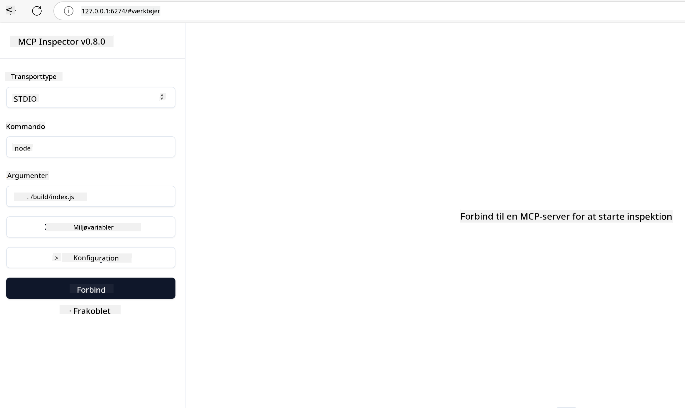
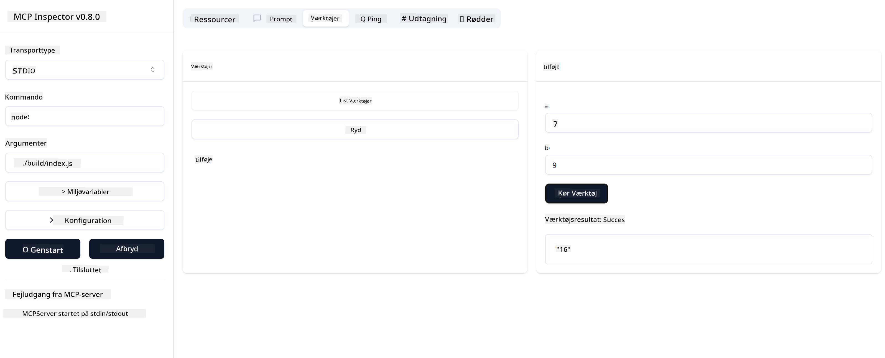

<!--
CO_OP_TRANSLATOR_METADATA:
{
  "original_hash": "5331ffd328a54b90f76706c52b673e27",
  "translation_date": "2025-05-17T08:40:03+00:00",
  "source_file": "03-GettingStarted/01-first-server/README.md",
  "language_code": "da"
}
-->
# Kom godt i gang med MCP

Velkommen til dine første skridt med Model Context Protocol (MCP)! Uanset om du er ny til MCP eller ønsker at uddybe din forståelse, vil denne guide lede dig gennem den nødvendige opsætning og udviklingsproces. Du vil opdage, hvordan MCP muliggør problemfri integration mellem AI-modeller og applikationer, og lære, hvordan du hurtigt gør dit miljø klar til at bygge og teste MCP-drevne løsninger.

> TLDR; Hvis du bygger AI-apps, ved du, at du kan tilføje værktøjer og andre ressourcer til din LLM (stor sprogmodel) for at gøre LLM mere vidende. Men hvis du placerer disse værktøjer og ressourcer på en server, kan appen og serverens kapaciteter bruges af enhver klient med/uden en LLM.

## Oversigt

Denne lektion giver praktisk vejledning i opsætning af MCP-miljøer og bygning af dine første MCP-applikationer. Du vil lære, hvordan du opsætter de nødvendige værktøjer og rammer, bygger grundlæggende MCP-servere, skaber værtsapplikationer og tester dine implementeringer.

Model Context Protocol (MCP) er en åben protokol, der standardiserer, hvordan applikationer giver kontekst til LLM'er. Tænk på MCP som en USB-C-port til AI-applikationer - det giver en standardiseret måde at forbinde AI-modeller til forskellige datakilder og værktøjer.

## Læringsmål

Ved slutningen af denne lektion vil du kunne:

- Opsætte udviklingsmiljøer for MCP i C#, Java, Python, TypeScript og JavaScript
- Bygge og implementere grundlæggende MCP-servere med brugerdefinerede funktioner (ressourcer, prompts og værktøjer)
- Oprette værtsapplikationer, der forbinder til MCP-servere
- Teste og fejlfinde MCP-implementeringer

## Opsætning af dit MCP-miljø

Før du begynder at arbejde med MCP, er det vigtigt at forberede dit udviklingsmiljø og forstå den grundlæggende arbejdsgang. Dette afsnit vil guide dig gennem de indledende opsætningstrin for at sikre en gnidningsfri start med MCP.

### Forudsætninger

Før du dykker ned i MCP-udvikling, skal du sikre dig, at du har:

- **Udviklingsmiljø**: For dit valgte sprog (C#, Java, Python, TypeScript eller JavaScript)
- **IDE/Editor**: Visual Studio, Visual Studio Code, IntelliJ, Eclipse, PyCharm eller enhver moderne kodeeditor
- **Pakkehåndterere**: NuGet, Maven/Gradle, pip eller npm/yarn
- **API-nøgler**: For alle AI-tjenester, du planlægger at bruge i dine værtsapplikationer

## Grundlæggende MCP-serverstruktur

En MCP-server inkluderer typisk:

- **Serverkonfiguration**: Opsætning af port, autentifikation og andre indstillinger
- **Ressourcer**: Data og kontekst gjort tilgængelige for LLM'er
- **Værktøjer**: Funktionalitet, som modeller kan påkalde
- **Prompts**: Skabeloner til generering eller strukturering af tekst

Her er et forenklet eksempel i TypeScript:

```typescript
import { Server, Tool, Resource } from "@modelcontextprotocol/typescript-server-sdk";

// Create a new MCP server
const server = new Server({
  port: 3000,
  name: "Example MCP Server",
  version: "1.0.0"
});

// Register a tool
server.registerTool({
  name: "calculator",
  description: "Performs basic calculations",
  parameters: {
    expression: {
      type: "string",
      description: "The math expression to evaluate"
    }
  },
  handler: async (params) => {
    const result = eval(params.expression);
    return { result };
  }
});

// Start the server
server.start();
```

I den foregående kode gør vi:

- Importerer de nødvendige klasser fra MCP TypeScript SDK.
- Opretter og konfigurerer en ny MCP-serverinstans.
- Registrerer et brugerdefineret værktøj (`calculator`) med en håndteringsfunktion.
- Starter serveren for at lytte efter indkommende MCP-anmodninger.

## Test og Fejlfinding

Før du begynder at teste din MCP-server, er det vigtigt at forstå de tilgængelige værktøjer og bedste praksis for fejlfinding. Effektiv test sikrer, at din server opfører sig som forventet og hjælper dig med hurtigt at identificere og løse problemer. Det følgende afsnit skitserer anbefalede tilgange til at validere din MCP-implementering.

MCP leverer værktøjer til at hjælpe dig med at teste og fejlfinde dine servere:

- **Inspector-værktøj**, denne grafiske grænseflade giver dig mulighed for at forbinde til din server og teste dine værktøjer, prompts og ressourcer.
- **curl**, du kan også forbinde til din server ved hjælp af et kommandolinjeværktøj som curl eller andre klienter, der kan oprette og køre HTTP-kommandoer.

### Brug af MCP Inspector

[MCP Inspector](https://github.com/modelcontextprotocol/inspector) er et visuelt testværktøj, der hjælper dig med at:

1. **Opdage serverfunktioner**: Automatisk registrere tilgængelige ressourcer, værktøjer og prompts
2. **Test værktøjsudførelse**: Prøv forskellige parametre og se svar i realtid
3. **Se servermetadata**: Undersøg serverinfo, skemaer og konfigurationer

```bash
# ex TypeScript, installing and running MCP Inspector
npx @modelcontextprotocol/inspector node build/index.js
```

Når du kører ovenstående kommandoer, vil MCP Inspector starte en lokal webgrænseflade i din browser. Du kan forvente at se et dashboard, der viser dine registrerede MCP-servere, deres tilgængelige værktøjer, ressourcer og prompts. Grænsefladen giver dig mulighed for interaktivt at teste værktøjsudførelse, inspicere servermetadata og se realtidssvar, hvilket gør det lettere at validere og fejlfinde dine MCP-serverimplementeringer.

Her er et skærmbillede af, hvordan det kan se ud:


## Almindelige opsætningsproblemer og løsninger

| Problem | Mulig løsning |
|---------|---------------|
| Forbindelse nægtet | Tjek om serveren kører, og om porten er korrekt |
| Fejl ved værktøjsudførelse | Gennemgå parametervalidation og fejlhåndtering |
| Autentifikationsfejl | Bekræft API-nøgler og tilladelser |
| Skemavalideringsfejl | Sørg for, at parametrene matcher det definerede skema |
| Server starter ikke | Tjek for portkonflikter eller manglende afhængigheder |
| CORS-fejl | Konfigurer korrekte CORS-headere til forespørgsler på tværs af oprindelser |
| Autentifikationsproblemer | Bekræft token gyldighed og tilladelser |

## Lokal udvikling

For lokal udvikling og test kan du køre MCP-servere direkte på din maskine:

1. **Start serverprocessen**: Kør din MCP-serverapplikation
2. **Konfigurer netværk**: Sørg for, at serveren er tilgængelig på den forventede port
3. **Forbind klienter**: Brug lokale forbindelses-URL'er som `http://localhost:3000`

```bash
# Example: Running a TypeScript MCP server locally
npm run start
# Server running at http://localhost:3000
```

## Byg din første MCP-server

Vi har dækket [Kernebegreber](/01-CoreConcepts/README.md) i en tidligere lektion, nu er det tid til at bruge den viden.

### Hvad en server kan gøre

Før vi begynder at skrive kode, lad os minde os selv om, hvad en server kan gøre:

En MCP-server kan for eksempel:

- Få adgang til lokale filer og databaser
- Forbinde til eksterne API'er
- Udføre beregninger
- Integrere med andre værktøjer og tjenester
- Give en brugergrænseflade til interaktion

Fantastisk, nu hvor vi ved, hvad vi kan gøre for det, lad os begynde at kode.

## Øvelse: Opret en server

For at oprette en server skal du følge disse trin:

- Installer MCP SDK'en.
- Opret et projekt og opsæt projektstrukturen.
- Skriv serverkoden.
- Test serveren.

### -1- Installer SDK

Dette varierer lidt afhængigt af din valgte runtime, så vælg en af nedenstående runtimes:

Generativ AI kan generere tekst, billeder og endda kode.
Du er trænet på data op til oktober 2023.

### -2- Opret projekt

Nu hvor du har installeret din SDK, lad os oprette et projekt næste:

### -3- Opret projektfiler

### -4- Opret serverkode

### -5- Tilføj et værktøj og en ressource

Tilføj et værktøj og en ressource ved at tilføje følgende kode:

### -6 Endelig kode

Lad os tilføje den sidste kode, vi har brug for, så serveren kan starte:

### -7- Test serveren

Start serveren med følgende kommando:

### -8- Kør ved hjælp af inspektøren

Inspektøren er et fantastisk værktøj, der kan starte din server og lade dig interagere med den, så du kan teste, at den fungerer. Lad os starte den op:

> [!NOTE]
> det kan se anderledes ud i "kommando"-feltet, da det indeholder kommandoen til at køre en server med din specifikke runtime.

Du bør se følgende brugergrænseflade:



1. Forbind til serveren ved at vælge knappen Forbind
   Når du forbinder til serveren, bør du nu se følgende:

   

1. Vælg "Tools" og "listTools", du bør se "Add" dukke op, vælg "Add" og udfyld parameterværdierne.

   Du bør se følgende svar, dvs. et resultat fra "add"-værktøjet:

   

Tillykke, du har formået at oprette og køre din første server!

### Officielle SDK'er

MCP leverer officielle SDK'er til flere sprog:
- [C# SDK](https://github.com/modelcontextprotocol/csharp-sdk) - Vedligeholdt i samarbejde med Microsoft
- [Java SDK](https://github.com/modelcontextprotocol/java-sdk) - Vedligeholdt i samarbejde med Spring AI
- [TypeScript SDK](https://github.com/modelcontextprotocol/typescript-sdk) - Den officielle TypeScript-implementering
- [Python SDK](https://github.com/modelcontextprotocol/python-sdk) - Den officielle Python-implementering
- [Kotlin SDK](https://github.com/modelcontextprotocol/kotlin-sdk) - Den officielle Kotlin-implementering
- [Swift SDK](https://github.com/modelcontextprotocol/swift-sdk) - Vedligeholdt i samarbejde med Loopwork AI
- [Rust SDK](https://github.com/modelcontextprotocol/rust-sdk) - Den officielle Rust-implementering

## Nøglepunkter

- Opsætning af et MCP-udviklingsmiljø er ligetil med sprog-specifikke SDK'er
- Bygning af MCP-servere involverer oprettelse og registrering af værktøjer med klare skemaer
- Test og fejlfinding er afgørende for pålidelige MCP-implementeringer

## Eksempler

- [Java Calculator](../samples/java/calculator/README.md)
- [.Net Calculator](../../../../03-GettingStarted/samples/csharp)
- [JavaScript Calculator](../samples/javascript/README.md)
- [TypeScript Calculator](../samples/typescript/README.md)
- [Python Calculator](../../../../03-GettingStarted/samples/python)

## Opgave

Opret en simpel MCP-server med et værktøj efter eget valg:
1. Implementer værktøjet i dit foretrukne sprog (.NET, Java, Python eller JavaScript).
2. Definer inputparametre og returværdier.
3. Kør inspektørværktøjet for at sikre, at serveren fungerer som tilsigtet.
4. Test implementeringen med forskellige input.

## Løsning

[Løsning](./solution/README.md)

## Yderligere ressourcer

- [MCP GitHub Repository](https://github.com/microsoft/mcp-for-beginners)

## Hvad er det næste

Næste: [Kom godt i gang med MCP-klienter](/03-GettingStarted/02-client/README.md)

**Ansvarsfraskrivelse**:  
Dette dokument er blevet oversat ved hjælp af AI-oversættelsestjenesten [Co-op Translator](https://github.com/Azure/co-op-translator). Mens vi stræber efter nøjagtighed, bedes du være opmærksom på, at automatiserede oversættelser kan indeholde fejl eller unøjagtigheder. Det originale dokument på dets oprindelige sprog bør betragtes som den autoritative kilde. For kritisk information anbefales professionel menneskelig oversættelse. Vi er ikke ansvarlige for eventuelle misforståelser eller fejltolkninger, der måtte opstå ved brug af denne oversættelse.