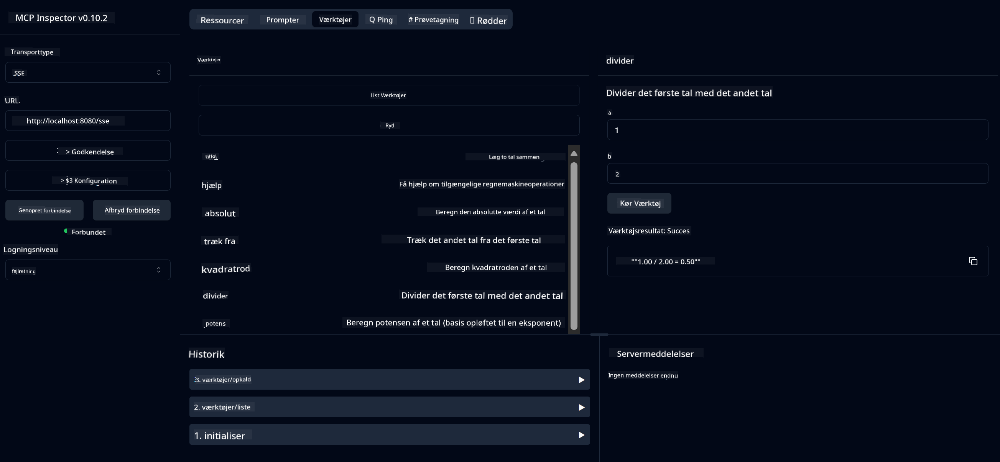

<!--
CO_OP_TRANSLATOR_METADATA:
{
  "original_hash": "ed9cab32cc67c12d8969b407aa47100a",
  "translation_date": "2025-07-13T17:54:53+00:00",
  "source_file": "03-GettingStarted/01-first-server/solution/java/README.md",
  "language_code": "da"
}
-->
# Basic Calculator MCP Service

Denne service leverer grundlæggende lommeregnerfunktioner via Model Context Protocol (MCP) ved brug af Spring Boot med WebFlux transport. Den er designet som et simpelt eksempel for begyndere, der vil lære om MCP-implementeringer.

For mere information, se reference-dokumentationen for [MCP Server Boot Starter](https://docs.spring.io/spring-ai/reference/api/mcp/mcp-server-boot-starter-docs.html).


## Brug af servicen

Servicen eksponerer følgende API-endpoints gennem MCP-protokollen:

- `add(a, b)`: Læg to tal sammen
- `subtract(a, b)`: Træk det andet tal fra det første
- `multiply(a, b)`: Gange to tal
- `divide(a, b)`: Divider det første tal med det andet (med kontrol for nul)
- `power(base, exponent)`: Beregn potens af et tal
- `squareRoot(number)`: Beregn kvadratroden (med kontrol for negative tal)
- `modulus(a, b)`: Beregn resten ved division
- `absolute(number)`: Beregn den absolutte værdi

## Afhængigheder

Projektet kræver følgende nøgleafhængigheder:

```xml
<dependency>
    <groupId>org.springframework.ai</groupId>
    <artifactId>spring-ai-starter-mcp-server-webflux</artifactId>
</dependency>
```

## Byg projektet

Byg projektet med Maven:
```bash
./mvnw clean install -DskipTests
```

## Kør serveren

### Brug af Java

```bash
java -jar target/calculator-server-0.0.1-SNAPSHOT.jar
```

### Brug af MCP Inspector

MCP Inspector er et nyttigt værktøj til at interagere med MCP-services. For at bruge det med denne lommeregner-service:

1. **Installer og kør MCP Inspector** i et nyt terminalvindue:
   ```bash
   npx @modelcontextprotocol/inspector
   ```

2. **Åbn web-UI'et** ved at klikke på den URL, som appen viser (typisk http://localhost:6274)

3. **Konfigurer forbindelsen**:
   - Sæt transporttypen til "SSE"
   - Sæt URL'en til din kørende servers SSE-endpoint: `http://localhost:8080/sse`
   - Klik på "Connect"

4. **Brug værktøjerne**:
   - Klik på "List Tools" for at se tilgængelige lommeregnerfunktioner
   - Vælg et værktøj og klik på "Run Tool" for at udføre en operation



**Ansvarsfraskrivelse**:  
Dette dokument er blevet oversat ved hjælp af AI-oversættelsestjenesten [Co-op Translator](https://github.com/Azure/co-op-translator). Selvom vi bestræber os på nøjagtighed, bedes du være opmærksom på, at automatiserede oversættelser kan indeholde fejl eller unøjagtigheder. Det oprindelige dokument på dets oprindelige sprog bør betragtes som den autoritative kilde. For kritisk information anbefales professionel menneskelig oversættelse. Vi påtager os intet ansvar for misforståelser eller fejltolkninger, der opstår som følge af brugen af denne oversættelse.