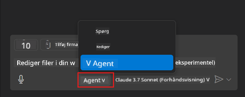
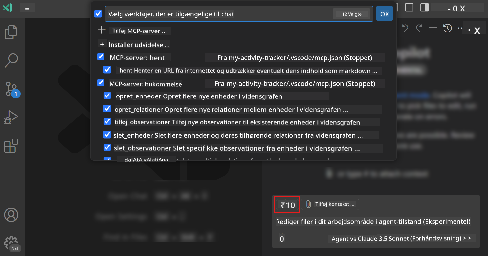
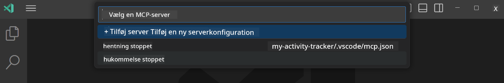
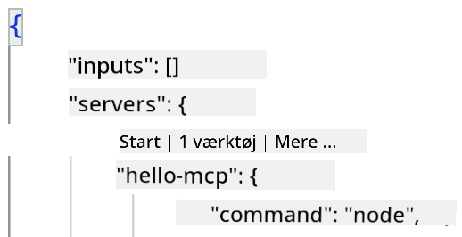
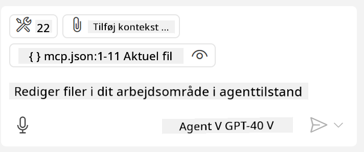
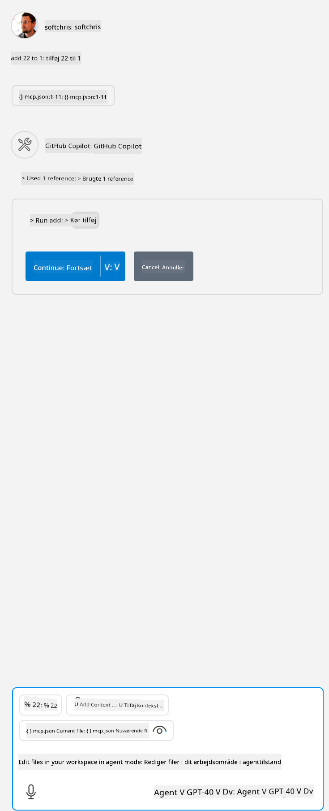

<!--
CO_OP_TRANSLATOR_METADATA:
{
  "original_hash": "d940b5e0af75e3a3a4d1c3179120d1d9",
  "translation_date": "2025-08-26T17:52:30+00:00",
  "source_file": "03-GettingStarted/04-vscode/README.md",
  "language_code": "da"
}
-->
# Forbrug af en server fra GitHub Copilot Agent-tilstand

Visual Studio Code og GitHub Copilot kan fungere som en klient og forbruge en MCP-server. Hvorfor skulle vi ønske at gøre det, spørger du måske? Jo, det betyder, at de funktioner, MCP-serveren har, nu kan bruges direkte i dit IDE. Forestil dig for eksempel, at du tilføjer GitHubs MCP-server – det ville give dig mulighed for at kontrollere GitHub via prompts i stedet for at skrive specifikke kommandoer i terminalen. Eller forestil dig generelt alt, der kunne forbedre din udvikleroplevelse, alt sammen styret af naturligt sprog. Nu begynder du at se fordelen, ikke?

## Oversigt

Denne lektion dækker, hvordan man bruger Visual Studio Code og GitHub Copilots Agent-tilstand som en klient til din MCP-server.

## Læringsmål

Ved slutningen af denne lektion vil du være i stand til at:

- Forbruge en MCP-server via Visual Studio Code.
- Køre funktioner som værktøjer via GitHub Copilot.
- Konfigurere Visual Studio Code til at finde og administrere din MCP-server.

## Brug

Du kan styre din MCP-server på to forskellige måder:

- Brugergrænseflade, du vil se, hvordan dette gøres senere i dette kapitel.
- Terminal, det er muligt at styre ting fra terminalen ved hjælp af `code`-eksekverbare fil:

  For at tilføje en MCP-server til din brugerprofil skal du bruge --add-mcp-kommandoen og angive JSON-serverkonfigurationen i formen {\"name\":\"server-name\",\"command\":...}.

  ```
  code --add-mcp "{\"name\":\"my-server\",\"command\": \"uvx\",\"args\": [\"mcp-server-fetch\"]}"
  ```

### Skærmbilleder





Lad os tale mere om, hvordan vi bruger den visuelle grænseflade i de næste afsnit.

## Fremgangsmåde

Her er, hvordan vi skal gribe dette an på et overordnet niveau:

- Konfigurer en fil til at finde vores MCP-server.
- Start/forbind til den nævnte server for at få den til at liste sine funktioner.
- Brug de nævnte funktioner via GitHub Copilot Chat-grænsefladen.

Fint, nu hvor vi forstår flowet, lad os prøve at bruge en MCP-server gennem Visual Studio Code via en øvelse.

## Øvelse: Forbrug af en server

I denne øvelse vil vi konfigurere Visual Studio Code til at finde din MCP-server, så den kan bruges fra GitHub Copilot Chat-grænsefladen.

### -0- Forberedelse, aktiver MCP-serveropdagelse

Du skal muligvis aktivere opdagelse af MCP-servere.

1. Gå til `File -> Preferences -> Settings` i Visual Studio Code.

1. Søg efter "MCP" og aktiver `chat.mcp.discovery.enabled` i settings.json-filen.

### -1- Opret konfigurationsfil

Start med at oprette en konfigurationsfil i din projektrod. Du skal bruge en fil kaldet MCP.json og placere den i en mappe kaldet .vscode. Det skal se sådan ud:

```text
.vscode
|-- mcp.json
```

Lad os derefter se, hvordan vi kan tilføje en serverpost.

### -2- Konfigurer en server

Tilføj følgende indhold til *mcp.json*:

```json
{
    "inputs": [],
    "servers": {
       "hello-mcp": {
           "command": "node",
           "args": [
               "build/index.js"
           ]
       }
    }
}
```

Her er et simpelt eksempel ovenfor på, hvordan man starter en server skrevet i Node.js. For andre runtime-miljøer skal du angive den korrekte kommando til at starte serveren ved hjælp af `command` og `args`.

### -3- Start serveren

Nu hvor du har tilføjet en post, lad os starte serveren:

1. Find din post i *mcp.json* og sørg for, at du finder "play"-ikonet:

    

1. Klik på "play"-ikonet. Du bør se værktøjsikonet i GitHub Copilot Chat øge antallet af tilgængelige værktøjer. Hvis du klikker på det nævnte værktøjsikon, vil du se en liste over registrerede værktøjer. Du kan markere/afmarkere hvert værktøj afhængigt af, om du vil have GitHub Copilot til at bruge dem som kontekst:

  

1. For at køre et værktøj skal du skrive en prompt, som du ved matcher beskrivelsen af et af dine værktøjer, for eksempel en prompt som denne: "add 22 to 1":

  

  Du bør se et svar, der siger 23.

## Opgave

Prøv at tilføje en serverpost til din *mcp.json*-fil, og sørg for, at du kan starte/stoppe serveren. Sørg også for, at du kan kommunikere med værktøjerne på din server via GitHub Copilot Chat-grænsefladen.

## Løsning

[Løsning](./solution/README.md)

## Vigtige pointer

De vigtigste pointer fra dette kapitel er følgende:

- Visual Studio Code er en fremragende klient, der giver dig mulighed for at forbruge flere MCP-servere og deres værktøjer.
- GitHub Copilot Chat-grænsefladen er, hvordan du interagerer med serverne.
- Du kan bede brugeren om input som API-nøgler, der kan sendes til MCP-serveren, når du konfigurerer serverposten i *mcp.json*-filen.

## Eksempler

- [Java-lommeregner](../samples/java/calculator/README.md)
- [.Net-lommeregner](../../../../03-GettingStarted/samples/csharp)
- [JavaScript-lommeregner](../samples/javascript/README.md)
- [TypeScript-lommeregner](../samples/typescript/README.md)
- [Python-lommeregner](../../../../03-GettingStarted/samples/python)

## Yderligere ressourcer

- [Visual Studio-dokumentation](https://code.visualstudio.com/docs/copilot/chat/mcp-servers)

## Hvad er det næste?

- Næste: [Oprettelse af en stdio-server](../05-stdio-server/README.md)

---

**Ansvarsfraskrivelse**:  
Dette dokument er blevet oversat ved hjælp af AI-oversættelsestjenesten [Co-op Translator](https://github.com/Azure/co-op-translator). Selvom vi bestræber os på nøjagtighed, skal du være opmærksom på, at automatiserede oversættelser kan indeholde fejl eller unøjagtigheder. Det originale dokument på dets oprindelige sprog bør betragtes som den autoritative kilde. For kritisk information anbefales professionel menneskelig oversættelse. Vi påtager os ikke ansvar for eventuelle misforståelser eller fejltolkninger, der måtte opstå som følge af brugen af denne oversættelse.