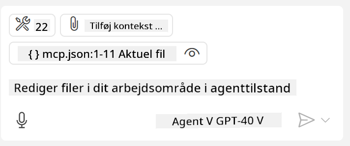

<!--
CO_OP_TRANSLATOR_METADATA:
{
  "original_hash": "c37fabfbc0dcbc9a4afb6d17e7d3be9f",
  "translation_date": "2025-05-17T11:09:46+00:00",
  "source_file": "03-GettingStarted/04-vscode/README.md",
  "language_code": "da"
}
-->
Lad os tale mere om, hvordan vi bruger det visuelle interface i de næste afsnit.

## Fremgangsmåde

Sådan skal vi gribe det an på et overordnet niveau:

- Konfigurer en fil til at finde vores MCP Server.
- Start/Forbind til den nævnte server for at få den til at liste sine funktioner.
- Brug de nævnte funktioner gennem GitHub Copilots chatinterface.

Fantastisk, nu hvor vi forstår forløbet, lad os prøve at bruge en MCP Server gennem Visual Studio Code via en øvelse.

## Øvelse: Forbrug af en server

I denne øvelse vil vi konfigurere Visual Studio Code til at finde din MCP server, så den kan bruges fra GitHub Copilots chatinterface.

### -0- Forberedelse, aktiver MCP Server opdagelse

Du skal muligvis aktivere opdagelse af MCP Servere.

1. Gå til `File -> Preferences -> Settings` in Visual Studio Code.

1. Search for "MCP" and enable `chat.mcp.discovery.enabled` i settings.json filen.

### -1- Opret konfigurationsfil

Start med at oprette en konfigurationsfil i din projektrod, du skal bruge en fil kaldet MCP.json og placere den i en mappe kaldet .vscode. Det skal se sådan ud:

```text
.vscode
|-- mcp.json
```

Lad os derefter se, hvordan vi kan tilføje en serverpost.

### -2- Konfigurer en server

Tilføj følgende indhold til *mcp.json*:

```json
{
    "inputs": [],
    "servers": {
       "hello-mcp": {
           "command": "cmd",
           "args": [
               "/c", "node", "<absolute path>\\build\\index.js"
           ]
       }
    }
}
```

Her er et simpelt eksempel ovenfor, hvordan man starter en server skrevet i Node.js, for andre runtime skal du angive den korrekte kommando til at starte serveren ved hjælp af `command` and `args`.

### -3- Start serveren

Nu hvor du har tilføjet en post, lad os starte serveren:

1. Find din post i *mcp.json* og sørg for at finde "play"-ikonet:

    

1. Klik på "play"-ikonet, du bør se værktøjsikonet i GitHub Copilot chat øge antallet af tilgængelige værktøjer. Hvis du klikker på det nævnte værktøjsikon, vil du se en liste over registrerede værktøjer. Du kan markere/afmarkere hvert værktøj afhængigt af, om du vil have GitHub Copilot til at bruge dem som kontekst:

  

1. For at køre et værktøj, skriv en prompt, som du ved vil matche beskrivelsen af et af dine værktøjer, for eksempel en prompt som "add 22 to 1":

  

  Du bør se et svar, der siger 23.

## Opgave

Prøv at tilføje en serverpost til din *mcp.json* fil og sørg for, at du kan starte/stoppe serveren. Sørg også for, at du kan kommunikere med værktøjerne på din server via GitHub Copilots chatinterface.

## Løsning

[Løsning](./solution/README.md)

## Vigtige Pointer

De vigtigste pointer fra dette kapitel er følgende:

- Visual Studio Code er en fremragende klient, der lader dig forbruge flere MCP Servere og deres værktøjer.
- GitHub Copilots chatinterface er, hvordan du interagerer med serverne.
- Du kan bede brugeren om input som API-nøgler, der kan sendes til MCP Serveren, når du konfigurerer serverposten i *mcp.json* filen.

## Eksempler

- [Java Lommeregner](../samples/java/calculator/README.md)
- [.Net Lommeregner](../../../../03-GettingStarted/samples/csharp)
- [JavaScript Lommeregner](../samples/javascript/README.md)
- [TypeScript Lommeregner](../samples/typescript/README.md)
- [Python Lommeregner](../../../../03-GettingStarted/samples/python) 

## Yderligere Ressourcer

- [Visual Studio docs](https://code.visualstudio.com/docs/copilot/chat/mcp-servers)

## Hvad er det næste

- Næste: [Oprettelse af en SSE Server](/03-GettingStarted/05-sse-server/README.md)

**Ansvarsfraskrivelse**:  
Dette dokument er blevet oversat ved hjælp af AI-oversættelsestjenesten [Co-op Translator](https://github.com/Azure/co-op-translator). Selvom vi bestræber os på nøjagtighed, skal du være opmærksom på, at automatiserede oversættelser kan indeholde fejl eller unøjagtigheder. Det originale dokument på dets oprindelige sprog bør betragtes som den autoritative kilde. For kritisk information anbefales professionel menneskelig oversættelse. Vi er ikke ansvarlige for misforståelser eller fejltolkninger, der opstår som følge af brugen af denne oversættelse.