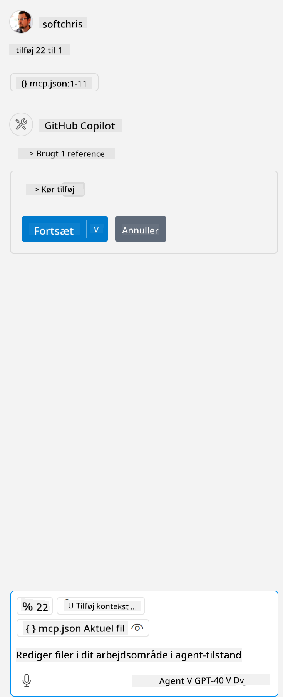

<!--
CO_OP_TRANSLATOR_METADATA:
{
  "original_hash": "96e08a8c1049dab757deb64cce4ea1e8",
  "translation_date": "2025-05-17T11:21:35+00:00",
  "source_file": "03-GettingStarted/04-vscode/solution/README.md",
  "language_code": "da"
}
-->
# Kør eksemplet

Her antager vi, at du allerede har en fungerende serverkode. Venligst find en server fra et af de tidligere kapitler.

## Opsæt mcp.json

Her er en fil, du kan bruge som reference, [mcp.json](../../../../../03-GettingStarted/04-vscode/solution/mcp.json).

Ændr serverindgangen efter behov for at pege på den absolutte sti til din server inklusive den nødvendige fulde kommando for at køre.

I det eksempel, der er omtalt ovenfor, ser serverindgangen sådan ud:

```json
"hello-mcp": {
    "command": "cmd",
    "args": [
        "/c", "node", "<absolute path>\\build\\index.js"
    ]
}
```

Dette svarer til at køre en kommando som denne: `cmd /c node <absolute path>\\build\index.js`. 

- Change this server entry to fit where your server file is located or to what's needed to startup your server depending on your chosen runtime and server location.

## Consume the features in the server

- Click the `play` icon, once you've added *mcp.json* to *./vscode* folder, 

    Observe the tooling icon change to increase the number of available tools. Tooling icon is located right above the chat field in GitHub Copilot.

## Run a tool

- Type a prompt in your chat window that matches the description of your tool. For example to trigger the tool `add` skriv noget som "add 3 to 20".

    Du bør se et værktøj blive præsenteret over chattekstboksen, der angiver, at du skal vælge at køre værktøjet som i denne visuelle:

    

    Valg af værktøjet bør give et numerisk resultat, der siger "23", hvis din prompt var som vi nævnte tidligere.

**Ansvarsfraskrivelse**:  
Dette dokument er blevet oversat ved hjælp af AI-oversættelsestjenesten [Co-op Translator](https://github.com/Azure/co-op-translator). Selvom vi bestræber os på nøjagtighed, skal du være opmærksom på, at automatiserede oversættelser kan indeholde fejl eller unøjagtigheder. Det originale dokument på dets oprindelige sprog bør betragtes som den autoritative kilde. For kritisk information anbefales professionel menneskelig oversættelse. Vi er ikke ansvarlige for eventuelle misforståelser eller fejltolkninger, der måtte opstå ved brugen af denne oversættelse.