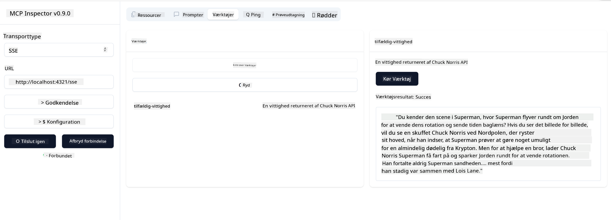

<!--
CO_OP_TRANSLATOR_METADATA:
{
  "original_hash": "64645691bf0985f1760b948123edf269",
  "translation_date": "2025-06-13T10:51:56+00:00",
  "source_file": "03-GettingStarted/05-sse-server/README.md",
  "language_code": "da"
}
-->
Nu hvor vi ved lidt mere om SSE, lad os bygge en SSE-server næste.

## Øvelse: Oprette en SSE-server

For at oprette vores server skal vi huske to ting:

- Vi skal bruge en webserver til at eksponere endpoints for forbindelse og beskeder.
- Byg vores server som vi normalt gør med værktøjer, ressourcer og prompts, som da vi brugte stdio.

### -1- Opret en serverinstans

For at oprette vores server bruger vi de samme typer som med stdio. Dog skal vi vælge SSE som transport.

---

Lad os tilføje de nødvendige ruter næste.

### -2- Tilføj ruter

Lad os tilføje ruter, der håndterer forbindelsen og indkommende beskeder:

---

Lad os tilføje funktioner til serveren næste.

### -3- Tilføjelse af serverfunktioner

Nu hvor vi har defineret alt det specifikke for SSE, lad os tilføje serverfunktioner som værktøjer, prompts og ressourcer.

---

Din komplette kode skulle se sådan ud:

---

Fint, vi har en server, der bruger SSE, lad os prøve den af næste.

## Øvelse: Debugging af en SSE-server med Inspector

Inspector er et fremragende værktøj, som vi så i en tidligere lektion [Opret din første server](/03-GettingStarted/01-first-server/README.md). Lad os se, om vi også kan bruge Inspector her:

### -1- Kørsel af inspector

For at køre inspector skal du først have en SSE-server kørende, så lad os gøre det:

1. Kør serveren

---

1. Kør inspector

    > [!NOTE]
    > Kør dette i et separat terminalvindue fra det, hvor serveren kører. Bemærk også, at du skal tilpasse kommandoen nedenfor til den URL, hvor din server kører.

    ```sh
    npx @modelcontextprotocol/inspector --cli http://localhost:8000/sse --method tools/list
    ```

    Kørsel af inspector ser ens ud i alle runtime-miljøer. Bemærk, at i stedet for at angive en sti til vores server og en kommando til at starte serveren, angiver vi URL’en, hvor serveren kører, og vi specificerer også `/sse` ruten.

### -2- Prøv værktøjet af

Forbind til serveren ved at vælge SSE i dropdown-listen og udfyld URL-feltet med adressen, hvor din server kører, fx http:localhost:4321/sse. Klik derefter på "Connect"-knappen. Som før, vælg at liste værktøjer, vælg et værktøj og indtast inputværdier. Du skulle gerne se et resultat som nedenfor:



Fint, du kan arbejde med inspector, lad os se, hvordan vi kan arbejde med Visual Studio Code næste.

## Opgave

Prøv at bygge din server ud med flere funktioner. Se [denne side](https://api.chucknorris.io/) for eksempelvis at tilføje et værktøj, der kalder et API. Du bestemmer, hvordan serveren skal se ud. God fornøjelse :)

## Løsning

[Løsning](./solution/README.md) Her er en mulig løsning med fungerende kode.

## Vigtige pointer

De vigtigste pointer fra dette kapitel er:

- SSE er den anden understøttede transport ved siden af stdio.
- For at understøtte SSE skal du håndtere indkommende forbindelser og beskeder via et webframework.
- Du kan bruge både Inspector og Visual Studio Code til at forbruge en SSE-server, ligesom med stdio-servere. Bemærk dog forskellen mellem stdio og SSE. For SSE skal du starte serveren separat og derefter køre inspector-værktøjet. For inspector-værktøjet er der også forskelle, idet du skal angive URL’en.

## Eksempler

- [Java Calculator](../samples/java/calculator/README.md)
- [.Net Calculator](../../../../03-GettingStarted/samples/csharp)
- [JavaScript Calculator](../samples/javascript/README.md)
- [TypeScript Calculator](../samples/typescript/README.md)
- [Python Calculator](../../../../03-GettingStarted/samples/python)

## Yderligere ressourcer

- [SSE](https://developer.mozilla.org/en-US/docs/Web/API/Server-sent_events)

## Hvad er det næste

- Næste: [HTTP Streaming med MCP (Streamable HTTP)](/03-GettingStarted/06-http-streaming/README.md)

**Ansvarsfraskrivelse**:  
Dette dokument er blevet oversat ved hjælp af AI-oversættelsestjenesten [Co-op Translator](https://github.com/Azure/co-op-translator). Selvom vi bestræber os på nøjagtighed, bedes du være opmærksom på, at automatiserede oversættelser kan indeholde fejl eller unøjagtigheder. Det oprindelige dokument på dets modersmål bør betragtes som den autoritative kilde. For kritisk information anbefales professionel menneskelig oversættelse. Vi påtager os intet ansvar for misforståelser eller fejltolkninger, der opstår som følge af brugen af denne oversættelse.