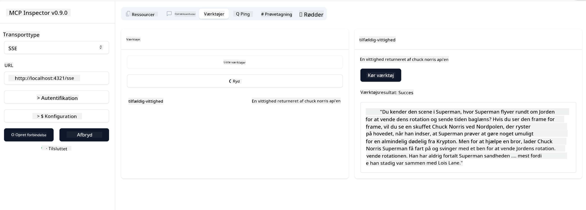

<!--
CO_OP_TRANSLATOR_METADATA:
{
  "original_hash": "0a8086dc4bf89448f83e7936db972c42",
  "translation_date": "2025-05-17T11:36:50+00:00",
  "source_file": "03-GettingStarted/05-sse-server/README.md",
  "language_code": "da"
}
-->
Nu hvor vi ved lidt mere om SSE, lad os bygge en SSE-server næste gang.

## Øvelse: Opret en SSE-server

For at oprette vores server skal vi huske to ting:

- Vi skal bruge en webserver til at eksponere endpoints for forbindelse og meddelelser.
- Byg vores server som vi normalt gør med værktøjer, ressourcer og prompts, da vi brugte stdio.

### -1- Opret en serverinstans

For at oprette vores server bruger vi de samme typer som med stdio. Men for transporten skal vi vælge SSE.

Lad os tilføje de nødvendige ruter næste gang.

### -2- Tilføj ruter

Lad os tilføje ruter næste gang, der håndterer forbindelsen og indkommende meddelelser:

Lad os tilføje kapaciteter til serveren næste gang.

### -3- Tilføjelse af serverkapaciteter

Nu hvor vi har defineret alt, der er specifikt for SSE, lad os tilføje serverkapaciteter som værktøjer, prompts og ressourcer.

Din fulde kode bør se sådan ud:

Fantastisk, vi har en server, der bruger SSE, lad os tage den for en tur næste gang.

## Øvelse: Fejlfinding af en SSE-server med Inspector

Inspector er et fantastisk værktøj, som vi så i en tidligere lektion [Opret din første server](/03-GettingStarted/01-first-server/README.md). Lad os se, om vi kan bruge Inspector også her:

### -1- Kør inspektøren

For at køre inspektøren skal du først have en SSE-server kørende, så lad os gøre det næste:

1. Kør serveren

1. Kør inspektøren

    > ![NOTE]
    > Kør dette i et separat terminalvindue end serveren kører i. Bemærk også, at du skal justere nedenstående kommando, så den passer til URL'en, hvor din server kører.

    ```sh
    npx @modelcontextprotocol/inspector --cli http://localhost:8000/sse --method tools/list
    ```

    At køre inspektøren ser ens ud i alle runtime-miljøer. Bemærk, hvordan vi i stedet for at angive en sti til vores server og en kommando til at starte serveren i stedet angiver URL'en, hvor serveren kører, og vi specificerer også `/sse`-ruten.

### -2- Afprøv værktøjet

Forbind serveren ved at vælge SSE i dropdown-listen og udfyld URL-feltet, hvor din server kører, for eksempel http:localhost:4321/sse. Klik nu på "Connect"-knappen. Som før skal du vælge at liste værktøjer, vælge et værktøj og give inputværdier. Du skulle se et resultat som nedenfor:



Fantastisk, du er i stand til at arbejde med inspektøren, lad os se, hvordan vi kan arbejde med Visual Studio Code næste gang.

## Opgave

Prøv at udvide din server med flere kapaciteter. Se [denne side](https://api.chucknorris.io/) for eksempel for at tilføje et værktøj, der kalder en API, du bestemmer, hvordan serveren skal se ud. Hav det sjovt :)

## Løsning

[Løsning](./solution/README.md) Her er en mulig løsning med fungerende kode.

## Vigtige punkter

De vigtigste punkter fra dette kapitel er følgende:

- SSE er den anden understøttede transport ved siden af stdio.
- For at understøtte SSE skal du håndtere indkommende forbindelser og meddelelser ved hjælp af en webframework.
- Du kan bruge både Inspector og Visual Studio Code til at konsumere SSE-servere, ligesom stdio-servere. Bemærk, hvordan det adskiller sig lidt mellem stdio og SSE. For SSE skal du starte serveren separat og derefter køre dit inspektørværktøj. For inspektørværktøjet er der også nogle forskelle i, at du skal angive URL'en.

## Eksempler

- [Java Lommeregner](../samples/java/calculator/README.md)
- [.Net Lommeregner](../../../../03-GettingStarted/samples/csharp)
- [JavaScript Lommeregner](../samples/javascript/README.md)
- [TypeScript Lommeregner](../samples/typescript/README.md)
- [Python Lommeregner](../../../../03-GettingStarted/samples/python) 

## Yderligere ressourcer

- [SSE](https://developer.mozilla.org/en-US/docs/Web/API/Server-sent_events)

## Hvad er det næste

- Næste: [Kom godt i gang med AI Toolkit for VSCode](/03-GettingStarted/06-aitk/README.md)

**Ansvarsfraskrivelse**:  
Dette dokument er blevet oversat ved hjælp af AI-oversættelsestjenesten [Co-op Translator](https://github.com/Azure/co-op-translator). Mens vi bestræber os på nøjagtighed, bedes du være opmærksom på, at automatiserede oversættelser kan indeholde fejl eller unøjagtigheder. Det originale dokument på dets oprindelige sprog bør betragtes som den autoritative kilde. For kritisk information anbefales professionel menneskelig oversættelse. Vi er ikke ansvarlige for eventuelle misforståelser eller fejltolkninger, der måtte opstå som følge af brugen af denne oversættelse.