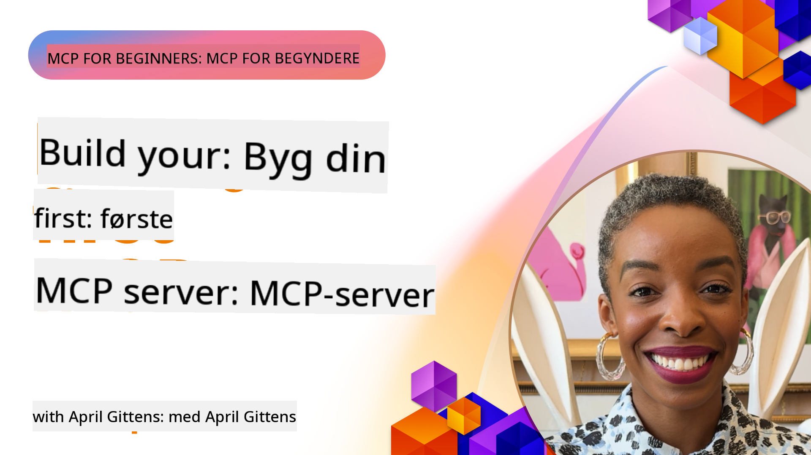

<!--
CO_OP_TRANSLATOR_METADATA:
{
  "original_hash": "1197b6dbde36773e04a5ae826557fdb9",
  "translation_date": "2025-08-26T17:52:11+00:00",
  "source_file": "03-GettingStarted/README.md",
  "language_code": "da"
}
-->
## Kom godt i gang  

_(Klik på billedet ovenfor for at se videoen til denne lektion)_

Denne sektion består af flere lektioner:

- **1 Din første server**, i denne første lektion lærer du, hvordan du opretter din første server og inspicerer den med inspektionsværktøjet, en værdifuld måde at teste og fejlfinde din server på, [til lektionen](01-first-server/README.md)

- **2 Klient**, i denne lektion lærer du, hvordan du skriver en klient, der kan forbinde til din server, [til lektionen](02-client/README.md)

- **3 Klient med LLM**, en endnu bedre måde at skrive en klient på er ved at tilføje en LLM, så den kan "forhandle" med din server om, hvad der skal gøres, [til lektionen](03-llm-client/README.md)

- **4 Forbrug af en server GitHub Copilot Agent-tilstand i Visual Studio Code**. Her ser vi på, hvordan man kører vores MCP-server fra Visual Studio Code, [til lektionen](04-vscode/README.md)

- **5 stdio Transport Server** stdio transport er den anbefalede standard for MCP-server-til-klient-kommunikation i den nuværende specifikation, der giver sikker kommunikation baseret på underprocesser [til lektionen](05-stdio-server/README.md)

- **6 HTTP Streaming med MCP (Streamable HTTP)**. Lær om moderne HTTP-streaming, statusnotifikationer og hvordan man implementerer skalerbare, realtids MCP-servere og -klienter ved hjælp af Streamable HTTP. [til lektionen](06-http-streaming/README.md)

- **7 Udnyttelse af AI Toolkit til VSCode** for at forbruge og teste dine MCP-klienter og -servere [til lektionen](07-aitk/README.md)

- **8 Testning**. Her fokuserer vi især på, hvordan vi kan teste vores server og klient på forskellige måder, [til lektionen](08-testing/README.md)

- **9 Udrulning**. Dette kapitel ser på forskellige måder at udrulle dine MCP-løsninger på, [til lektionen](09-deployment/README.md)

Model Context Protocol (MCP) er en åben protokol, der standardiserer, hvordan applikationer giver kontekst til LLM'er. Tænk på MCP som en USB-C-port for AI-applikationer - den giver en standardiseret måde at forbinde AI-modeller til forskellige datakilder og værktøjer.

## Læringsmål

Ved afslutningen af denne lektion vil du være i stand til at:

- Opsætte udviklingsmiljøer for MCP i C#, Java, Python, TypeScript og JavaScript
- Bygge og udrulle grundlæggende MCP-servere med brugerdefinerede funktioner (ressourcer, prompts og værktøjer)
- Oprette værtsapplikationer, der forbinder til MCP-servere
- Teste og fejlfinde MCP-implementeringer
- Forstå almindelige opsætningsudfordringer og deres løsninger
- Forbinde dine MCP-implementeringer til populære LLM-tjenester

## Opsætning af dit MCP-miljø

Før du begynder at arbejde med MCP, er det vigtigt at forberede dit udviklingsmiljø og forstå den grundlæggende arbejdsgang. Denne sektion vil guide dig gennem de indledende opsætningsskridt for at sikre en god start med MCP.

### Forudsætninger

Før du dykker ned i MCP-udvikling, skal du sikre dig, at du har:

- **Udviklingsmiljø**: For det valgte sprog (C#, Java, Python, TypeScript eller JavaScript)
- **IDE/Editor**: Visual Studio, Visual Studio Code, IntelliJ, Eclipse, PyCharm eller enhver moderne kodeeditor
- **Pakkestyringsværktøjer**: NuGet, Maven/Gradle, pip eller npm/yarn
- **API-nøgler**: Til de AI-tjenester, du planlægger at bruge i dine værtsapplikationer

### Officielle SDK'er

I de kommende kapitler vil du se løsninger bygget med Python, TypeScript, Java og .NET. Her er alle de officielt understøttede SDK'er.

MCP tilbyder officielle SDK'er til flere sprog:
- [C# SDK](https://github.com/modelcontextprotocol/csharp-sdk) - Vedligeholdes i samarbejde med Microsoft
- [Java SDK](https://github.com/modelcontextprotocol/java-sdk) - Vedligeholdes i samarbejde med Spring AI
- [TypeScript SDK](https://github.com/modelcontextprotocol/typescript-sdk) - Den officielle TypeScript-implementering
- [Python SDK](https://github.com/modelcontextprotocol/python-sdk) - Den officielle Python-implementering
- [Kotlin SDK](https://github.com/modelcontextprotocol/kotlin-sdk) - Den officielle Kotlin-implementering
- [Swift SDK](https://github.com/modelcontextprotocol/swift-sdk) - Vedligeholdes i samarbejde med Loopwork AI
- [Rust SDK](https://github.com/modelcontextprotocol/rust-sdk) - Den officielle Rust-implementering

## Vigtige pointer

- Opsætning af et MCP-udviklingsmiljø er ligetil med sprog-specifikke SDK'er
- Opbygning af MCP-servere indebærer oprettelse og registrering af værktøjer med klare skemaer
- MCP-klienter forbinder til servere og modeller for at udnytte udvidede funktioner
- Testning og fejlfinding er afgørende for pålidelige MCP-implementeringer
- Udrulningsmuligheder spænder fra lokal udvikling til cloud-baserede løsninger

## Øvelse

Vi har et sæt eksempler, der supplerer de øvelser, du vil se i alle kapitler i denne sektion. Derudover har hvert kapitel også deres egne øvelser og opgaver.

- [Java Calculator](./samples/java/calculator/README.md)
- [.Net Calculator](../../../03-GettingStarted/samples/csharp)
- [JavaScript Calculator](./samples/javascript/README.md)
- [TypeScript Calculator](./samples/typescript/README.md)
- [Python Calculator](../../../03-GettingStarted/samples/python)

## Yderligere ressourcer

- [Byg agenter ved hjælp af Model Context Protocol på Azure](https://learn.microsoft.com/azure/developer/ai/intro-agents-mcp)
- [Remote MCP med Azure Container Apps (Node.js/TypeScript/JavaScript)](https://learn.microsoft.com/samples/azure-samples/mcp-container-ts/mcp-container-ts/)
- [.NET OpenAI MCP Agent](https://learn.microsoft.com/samples/azure-samples/openai-mcp-agent-dotnet/openai-mcp-agent-dotnet/)

## Hvad er det næste

Næste: [Oprettelse af din første MCP-server](01-first-server/README.md)

---

**Ansvarsfraskrivelse**:  
Dette dokument er blevet oversat ved hjælp af AI-oversættelsestjenesten [Co-op Translator](https://github.com/Azure/co-op-translator). Selvom vi bestræber os på nøjagtighed, skal du være opmærksom på, at automatiserede oversættelser kan indeholde fejl eller unøjagtigheder. Det originale dokument på dets oprindelige sprog bør betragtes som den autoritative kilde. For kritisk information anbefales professionel menneskelig oversættelse. Vi påtager os ikke ansvar for eventuelle misforståelser eller fejltolkninger, der opstår som følge af brugen af denne oversættelse.