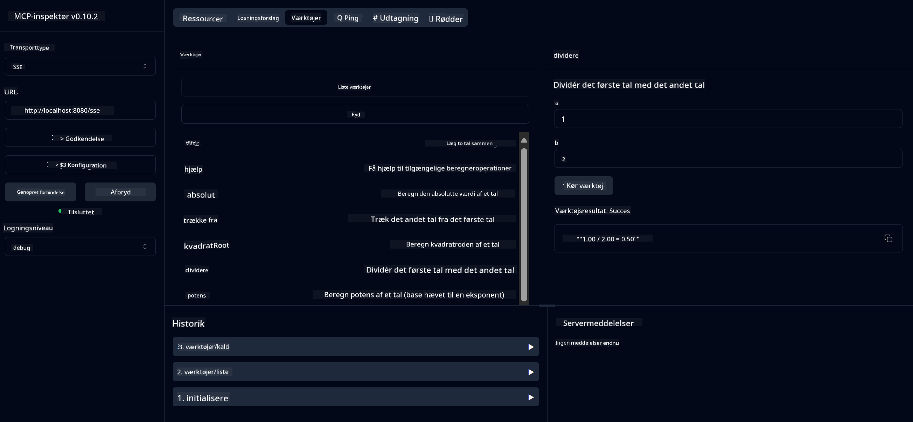

<!--
CO_OP_TRANSLATOR_METADATA:
{
  "original_hash": "13231e9951b68efd9df8c56bd5cdb27e",
  "translation_date": "2025-05-17T13:12:39+00:00",
  "source_file": "03-GettingStarted/samples/java/calculator/README.md",
  "language_code": "da"
}
-->
# Grundlæggende Lommeregner MCP Service

Denne service tilbyder grundlæggende lommeregnerfunktioner gennem Model Context Protocol (MCP) ved hjælp af Spring Boot med WebFlux transport. Den er designet som et enkelt eksempel for begyndere, der lærer om MCP-implementeringer.

For mere information, se [MCP Server Boot Starter](https://docs.spring.io/spring-ai/reference/api/mcp/mcp-server-boot-starter-docs.html) reference dokumentation.

## Oversigt

Servicen viser:
- Understøttelse af SSE (Server-Sent Events)
- Automatisk værktøjsregistrering ved hjælp af Spring AI's `@Tool` annotation
- Grundlæggende lommeregnerfunktioner:
  - Addition, subtraktion, multiplikation, division
  - Potensberegning og kvadratrod
  - Modulus (resterende) og absolut værdi
  - Hjælpefunktion til beskrivelse af operationer

## Funktioner

Denne lommeregner service tilbyder følgende kapaciteter:

1. **Grundlæggende aritmetiske operationer**:
   - Addition af to tal
   - Subtraktion af et tal fra et andet
   - Multiplikation af to tal
   - Division af et tal med et andet (med nul divisionskontrol)

2. **Avancerede operationer**:
   - Potensberegning (hæve en base til en eksponent)
   - Kvadratrodsberegning (med negativ tal kontrol)
   - Modulus (resterende) beregning
   - Absolut værdi beregning

3. **Hjælpesystem**:
   - Indbygget hjælpefunktion, der forklarer alle tilgængelige operationer

## Brug af Servicen

Servicen eksponerer følgende API endpoints gennem MCP-protokollen:

- `add(a, b)`: Lægge to tal sammen
- `subtract(a, b)`: Trække det andet tal fra det første
- `multiply(a, b)`: Multiplicere to tal
- `divide(a, b)`: Dividere det første tal med det andet (med nul kontrol)
- `power(base, exponent)`: Beregne potensen af et tal
- `squareRoot(number)`: Beregne kvadratroden (med negativ tal kontrol)
- `modulus(a, b)`: Beregne resten ved division
- `absolute(number)`: Beregne den absolutte værdi
- `help()`: Få information om tilgængelige operationer

## Testklient

En simpel testklient er inkluderet i `com.microsoft.mcp.sample.client` pakken. `SampleCalculatorClient` klassen demonstrerer de tilgængelige operationer af lommeregner servicen.

## Brug af LangChain4j Klient

Projektet inkluderer en LangChain4j eksempelklient i `com.microsoft.mcp.sample.client.LangChain4jClient`, der demonstrerer hvordan man integrerer lommeregner servicen med LangChain4j og GitHub modeller:

### Forudsætninger

1. **GitHub Token Opsætning**:
   
   For at bruge GitHubs AI-modeller (som phi-4), skal du bruge en GitHub personlig adgangstoken:

   a. Gå til dine GitHub kontoindstillinger: https://github.com/settings/tokens
   
   b. Klik "Generer ny token" → "Generer ny token (klassisk)"
   
   c. Giv din token et beskrivende navn
   
   d. Vælg følgende scopes:
      - `repo` (Fuld kontrol over private repositories)
      - `read:org` (Læs org og team medlemskab, læs org projekter)
      - `gist` (Opret gists)
      - `user:email` (Adgang til bruger emailadresser (kun læsning))
   
   e. Klik "Generer token" og kopier din nye token
   
   f. Sæt det som en miljøvariabel:
      
      På Windows:
      ```
      set GITHUB_TOKEN=your-github-token
      ```
      
      På macOS/Linux:
      ```bash
      export GITHUB_TOKEN=your-github-token
      ```

   g. For vedvarende opsætning, tilføj det til dine miljøvariabler gennem systemindstillinger

2. Tilføj LangChain4j GitHub afhængighed til dit projekt (allerede inkluderet i pom.xml):
   ```xml
   <dependency>
       <groupId>dev.langchain4j</groupId>
       <artifactId>langchain4j-github</artifactId>
       <version>${langchain4j.version}</version>
   </dependency>
   ```

3. Sørg for at lommeregner serveren kører på `localhost:8080`

### Kørsel af LangChain4j Klient

Dette eksempel demonstrerer:
- Forbindelse til lommeregner MCP server via SSE transport
- Brug af LangChain4j til at skabe en chat bot, der udnytter lommeregner operationer
- Integration med GitHub AI modeller (nu ved hjælp af phi-4 model)

Klienten sender følgende prøveforespørgsler for at demonstrere funktionalitet:
1. Beregning af summen af to tal
2. Find kvadratroden af et tal
3. Få hjælp information om tilgængelige lommeregner operationer

Kør eksemplet og tjek konsoloutput for at se hvordan AI-modellen bruger lommeregner værktøjerne til at svare på forespørgsler.

### GitHub Model Konfiguration

LangChain4j klienten er konfigureret til at bruge GitHubs phi-4 model med følgende indstillinger:

```java
ChatLanguageModel model = GitHubChatModel.builder()
    .apiKey(System.getenv("GITHUB_TOKEN"))
    .timeout(Duration.ofSeconds(60))
    .modelName("phi-4")
    .logRequests(true)
    .logResponses(true)
    .build();
```

For at bruge forskellige GitHub modeller, skal du blot ændre `modelName` parameteren til en anden understøttet model (f.eks., "claude-3-haiku-20240307", "llama-3-70b-8192", osv.).

## Afhængigheder

Projektet kræver følgende nøgle afhængigheder:

```xml
<!-- For MCP Server -->
<dependency>
    <groupId>org.springframework.ai</groupId>
    <artifactId>spring-ai-starter-mcp-server-webflux</artifactId>
</dependency>

<!-- For LangChain4j integration -->
<dependency>
    <groupId>dev.langchain4j</groupId>
    <artifactId>langchain4j-mcp</artifactId>
    <version>${langchain4j.version}</version>
</dependency>

<!-- For GitHub models support -->
<dependency>
    <groupId>dev.langchain4j</groupId>
    <artifactId>langchain4j-github</artifactId>
    <version>${langchain4j.version}</version>
</dependency>
```

## Bygning af Projektet

Byg projektet ved hjælp af Maven:
```bash
./mvnw clean install -DskipTests
```

## Kørsel af Serveren

### Brug af Java

```bash
java -jar target/calculator-server-0.0.1-SNAPSHOT.jar
```

### Brug af MCP Inspector

MCP Inspector er et nyttigt værktøj til interaktion med MCP services. For at bruge det med denne lommeregner service:

1. **Installer og kør MCP Inspector** i et nyt terminal vindue:
   ```bash
   npx @modelcontextprotocol/inspector
   ```

2. **Adgang til web UI** ved at klikke på URL'en vist af appen (typisk http://localhost:6274)

3. **Konfigurer forbindelsen**:
   - Sæt transporttypen til "SSE"
   - Sæt URL'en til din kørende servers SSE endpoint: `http://localhost:8080/sse`
   - Klik "Connect"

4. **Brug værktøjerne**:
   - Klik "List Tools" for at se tilgængelige lommeregner operationer
   - Vælg et værktøj og klik "Run Tool" for at udføre en operation



### Brug af Docker

Projektet inkluderer en Dockerfile til containeriseret deployment:

1. **Byg Docker image**:
   ```bash
   docker build -t calculator-mcp-service .
   ```

2. **Kør Docker container**:
   ```bash
   docker run -p 8080:8080 calculator-mcp-service
   ```

Dette vil:
- Bygge et multi-stage Docker image med Maven 3.9.9 og Eclipse Temurin 24 JDK
- Oprette et optimeret container image
- Eksponere servicen på port 8080
- Starte MCP lommeregner servicen inde i containeren

Du kan få adgang til servicen på `http://localhost:8080` når containeren kører.

## Fejlfinding

### Almindelige Problemer med GitHub Token

1. **Token Tilladelsesproblemer**: Hvis du får en 403 Forbidden fejl, tjek at din token har de korrekte tilladelser som angivet i forudsætningerne.

2. **Token Ikke Fundet**: Hvis du får en "No API key found" fejl, sørg for at GITHUB_TOKEN miljøvariabelen er korrekt sat.

3. **Rate Limitering**: GitHub API har rate grænser. Hvis du støder på en rate limit fejl (status kode 429), vent et par minutter før du prøver igen.

4. **Token Udløber**: GitHub tokens kan udløbe. Hvis du modtager autentificeringsfejl efter nogen tid, generer en ny token og opdater din miljøvariabel.

Hvis du har brug for yderligere assistance, tjek [LangChain4j dokumentation](https://github.com/langchain4j/langchain4j) eller [GitHub API dokumentation](https://docs.github.com/en/rest).

**Ansvarsfraskrivelse**:  
Dette dokument er blevet oversat ved hjælp af AI-oversættelsestjenesten [Co-op Translator](https://github.com/Azure/co-op-translator). Selvom vi bestræber os på at opnå nøjagtighed, bedes du være opmærksom på, at automatiserede oversættelser kan indeholde fejl eller unøjagtigheder. Det originale dokument på dets oprindelige sprog bør betragtes som den autoritative kilde. For kritisk information anbefales professionel menneskelig oversættelse. Vi er ikke ansvarlige for eventuelle misforståelser eller fejltolkninger, der måtte opstå ved brugen af denne oversættelse.