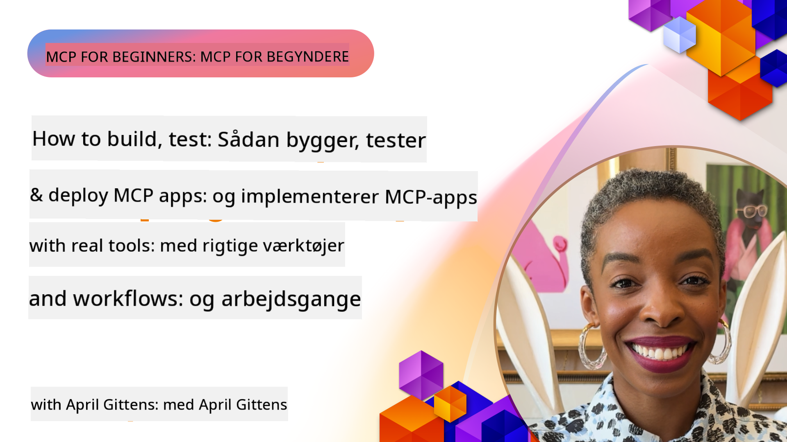
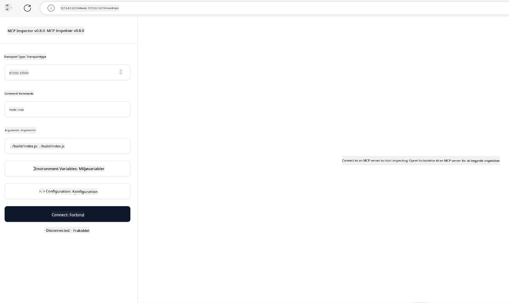

<!--
CO_OP_TRANSLATOR_METADATA:
{
  "original_hash": "83efa75a69bc831277263a6f1ae53669",
  "translation_date": "2025-08-18T15:09:49+00:00",
  "source_file": "04-PracticalImplementation/README.md",
  "language_code": "da"
}
-->
# Praktisk Implementering

[](https://youtu.be/vCN9-mKBDfQ)

_(Klik på billedet ovenfor for at se videoen til denne lektion)_

Praktisk implementering er der, hvor kraften i Model Context Protocol (MCP) bliver håndgribelig. Selvom det er vigtigt at forstå teorien og arkitekturen bag MCP, opstår den reelle værdi, når du anvender disse koncepter til at bygge, teste og implementere løsninger, der løser virkelige problemer. Dette kapitel bygger bro mellem konceptuel viden og praktisk udvikling og guider dig gennem processen med at bringe MCP-baserede applikationer til live.

Uanset om du udvikler intelligente assistenter, integrerer AI i forretningsprocesser eller bygger skræddersyede værktøjer til databehandling, giver MCP en fleksibel grundstruktur. Dets sprogagnostiske design og officielle SDK'er til populære programmeringssprog gør det tilgængeligt for en bred vifte af udviklere. Ved at udnytte disse SDK'er kan du hurtigt prototype, iterere og skalere dine løsninger på tværs af forskellige platforme og miljøer.

I de følgende afsnit finder du praktiske eksempler, kodeeksempler og implementeringsstrategier, der viser, hvordan du kan implementere MCP i C#, Java med Spring, TypeScript, JavaScript og Python. Du vil også lære, hvordan du debugger og tester dine MCP-servere, administrerer API'er og implementerer løsninger i skyen ved hjælp af Azure. Disse praktiske ressourcer er designet til at accelerere din læring og hjælpe dig med selvtillid til at bygge robuste, produktionsklare MCP-applikationer.

## Oversigt

Denne lektion fokuserer på de praktiske aspekter af MCP-implementering på tværs af flere programmeringssprog. Vi vil udforske, hvordan man bruger MCP SDK'er i C#, Java med Spring, TypeScript, JavaScript og Python til at bygge robuste applikationer, debugge og teste MCP-servere samt skabe genanvendelige ressourcer, prompts og værktøjer.

## Læringsmål

Ved afslutningen af denne lektion vil du være i stand til at:

- Implementere MCP-løsninger ved hjælp af officielle SDK'er i forskellige programmeringssprog
- Systematisk debugge og teste MCP-servere
- Oprette og bruge serverfunktioner (Ressourcer, Prompts og Værktøjer)
- Designe effektive MCP-arbejdsgange til komplekse opgaver
- Optimere MCP-implementeringer for ydeevne og pålidelighed

## Officielle SDK-ressourcer

Model Context Protocol tilbyder officielle SDK'er til flere sprog:

- [C# SDK](https://github.com/modelcontextprotocol/csharp-sdk)
- [Java med Spring SDK](https://github.com/modelcontextprotocol/java-sdk) **Bemærk:** kræver afhængighed af [Project Reactor](https://projectreactor.io). (Se [diskussionsemne 246](https://github.com/orgs/modelcontextprotocol/discussions/246).)
- [TypeScript SDK](https://github.com/modelcontextprotocol/typescript-sdk)
- [Python SDK](https://github.com/modelcontextprotocol/python-sdk)
- [Kotlin SDK](https://github.com/modelcontextprotocol/kotlin-sdk)

## Arbejde med MCP SDK'er

Dette afsnit giver praktiske eksempler på implementering af MCP på tværs af flere programmeringssprog. Du kan finde kodeeksempler i `samples`-mappen organiseret efter sprog.

### Tilgængelige eksempler

Repositoryet inkluderer [eksempelimplementeringer](../../../04-PracticalImplementation/samples) på følgende sprog:

- [C#](./samples/csharp/README.md)
- [Java med Spring](./samples/java/containerapp/README.md)
- [TypeScript](./samples/typescript/README.md)
- [JavaScript](./samples/javascript/README.md)
- [Python](./samples/python/README.md)

Hvert eksempel demonstrerer centrale MCP-koncepter og implementeringsmønstre for det specifikke sprog og økosystem.

## Centrale serverfunktioner

MCP-servere kan implementere en hvilken som helst kombination af disse funktioner:

### Ressourcer

Ressourcer giver kontekst og data til brugeren eller AI-modellen:

- Dokumentarkiver
- Vidensbaser
- Strukturerede datakilder
- Filsystemer

### Prompts

Prompts er skabelonbeskeder og arbejdsgange til brugere:

- Foruddefinerede samtaleskabeloner
- Guidede interaktionsmønstre
- Specialiserede dialogstrukturer

### Værktøjer

Værktøjer er funktioner, som AI-modellen kan udføre:

- Databehandlingsværktøjer
- Integrationer med eksterne API'er
- Beregningskapaciteter
- Søgefunktionalitet

## Eksempelimplementeringer: C#-implementering

Det officielle C# SDK-repository indeholder flere eksempelimplementeringer, der demonstrerer forskellige aspekter af MCP:

- **Grundlæggende MCP-klient**: Simpelt eksempel, der viser, hvordan man opretter en MCP-klient og kalder værktøjer
- **Grundlæggende MCP-server**: Minimal serverimplementering med grundlæggende værktøjsregistrering
- **Avanceret MCP-server**: Fuldt udstyret server med værktøjsregistrering, autentifikation og fejlhåndtering
- **ASP.NET-integration**: Eksempler, der viser integration med ASP.NET Core
- **Mønstre for værktøjsimplementering**: Forskellige mønstre til implementering af værktøjer med forskellig kompleksitet

C# MCP SDK er i preview, og API'er kan ændre sig. Vi vil løbende opdatere denne blog, efterhånden som SDK'et udvikler sig.

### Nøglefunktioner

- [C# MCP Nuget ModelContextProtocol](https://www.nuget.org/packages/ModelContextProtocol)
- Byg din [første MCP-server](https://devblogs.microsoft.com/dotnet/build-a-model-context-protocol-mcp-server-in-csharp/).

For komplette C#-implementeringseksempler, besøg det [officielle C# SDK-eksempelsrepository](https://github.com/modelcontextprotocol/csharp-sdk)

## Eksempelimplementering: Java med Spring-implementering

Java med Spring SDK tilbyder robuste MCP-implementeringsmuligheder med funktioner i virksomhedsklasse.

### Nøglefunktioner

- Integration med Spring Framework
- Stærk typesikkerhed
- Understøttelse af reaktiv programmering
- Omfattende fejlhåndtering

For et komplet Java med Spring-implementeringseksempel, se [Java med Spring-eksempel](samples/java/containerapp/README.md) i eksempelmappen.

## Eksempelimplementering: JavaScript-implementering

JavaScript SDK giver en let og fleksibel tilgang til MCP-implementering.

### Nøglefunktioner

- Understøttelse af Node.js og browser
- Promise-baseret API
- Nem integration med Express og andre frameworks
- WebSocket-understøttelse til streaming

For et komplet JavaScript-implementeringseksempel, se [JavaScript-eksempel](samples/javascript/README.md) i eksempelmappen.

## Eksempelimplementering: Python-implementering

Python SDK tilbyder en Pythonisk tilgang til MCP-implementering med fremragende integrationer til ML-rammeværker.

### Nøglefunktioner

- Async/await-understøttelse med asyncio
- FastAPI-integration
- Enkel værktøjsregistrering
- Naturlig integration med populære ML-biblioteker

For et komplet Python-implementeringseksempel, se [Python-eksempel](samples/python/README.md) i eksempelmappen.

## API-administration

Azure API Management er en fremragende løsning til at sikre MCP-servere. Ideen er at placere en Azure API Management-instans foran din MCP-server og lade den håndtere funktioner, som du sandsynligvis vil have, såsom:

- Hastighedsbegrænsning
- Tokenadministration
- Overvågning
- Belastningsbalancering
- Sikkerhed

### Azure-eksempel

Her er et Azure-eksempel, der gør netop dette, dvs. [opretter en MCP-server og sikrer den med Azure API Management](https://github.com/Azure-Samples/remote-mcp-apim-functions-python).

Se, hvordan autorisationsflowet fungerer i nedenstående billede:


I det foregående billede sker følgende:

- Autentifikation/autorisation finder sted ved hjælp af Microsoft Entra.
- Azure API Management fungerer som en gateway og bruger politikker til at dirigere og administrere trafik.
- Azure Monitor logger alle forespørgsler til yderligere analyse.

#### Autorisationsflow

Lad os se nærmere på autorisationsflowet:


#### MCP-autorisationsspecifikation

Lær mere om [MCP-autorisationsspecifikationen](https://modelcontextprotocol.io/specification/2025-03-26/basic/authorization#2-10-third-party-authorization-flow)

## Implementer Remote MCP Server til Azure

Lad os se, om vi kan implementere det eksempel, vi nævnte tidligere:

1. Klon repoen

    ```bash
    git clone https://github.com/Azure-Samples/remote-mcp-apim-functions-python.git
    cd remote-mcp-apim-functions-python
    ```

1. Registrer `Microsoft.App` ressourceudbyder.

   - Hvis du bruger Azure CLI, skal du køre `az provider register --namespace Microsoft.App --wait`.
   - Hvis du bruger Azure PowerShell, skal du køre `Register-AzResourceProvider -ProviderNamespace Microsoft.App`. Kør derefter `(Get-AzResourceProvider -ProviderNamespace Microsoft.App).RegistrationState` efter et stykke tid for at kontrollere, om registreringen er fuldført.

1. Kør denne [azd](https://aka.ms/azd)-kommando for at klargøre API Management-tjenesten, Function App (med kode) og alle andre nødvendige Azure-ressourcer

    ```shell
    azd up
    ```

    Denne kommando bør implementere alle cloud-ressourcer på Azure

### Test din server med MCP Inspector

1. I et **nyt terminalvindue**, installer og kør MCP Inspector

    ```shell
    npx @modelcontextprotocol/inspector
    ```

    Du bør se en grænseflade, der ligner:

    

1. CTRL-klik for at indlæse MCP Inspector-webappen fra den URL, der vises af appen (f.eks. [http://127.0.0.1:6274/#resources](http://127.0.0.1:6274/#resources))
1. Indstil transporttypen til `SSE`
1. Indstil URL'en til din kørende API Management SSE-endpoint, der vises efter `azd up`, og **Forbind**:

    ```shell
    https://<apim-servicename-from-azd-output>.azure-api.net/mcp/sse
    ```

1. **List Tools**. Klik på et værktøj og **Run Tool**.  

Hvis alle trin er udført korrekt, bør du nu være forbundet til MCP-serveren og kunne kalde et værktøj.

## MCP-servere til Azure

[Remote-mcp-functions](https://github.com/Azure-Samples/remote-mcp-functions-dotnet): Dette sæt af repositories er en hurtigstartsskabelon til at bygge og implementere brugerdefinerede remote MCP (Model Context Protocol) servere ved hjælp af Azure Functions med Python, C# .NET eller Node/TypeScript.

Eksemplerne giver en komplet løsning, der gør det muligt for udviklere at:

- Bygge og køre lokalt: Udvikle og debugge en MCP-server på en lokal maskine
- Implementere til Azure: Nem implementering til skyen med en simpel `azd up`-kommando
- Forbinde fra klienter: Forbinde til MCP-serveren fra forskellige klienter, herunder VS Codes Copilot-agenttilstand og MCP Inspector-værktøjet

### Nøglefunktioner

- Sikkerhed som standard: MCP-serveren er sikret ved hjælp af nøgler og HTTPS
- Autentifikationsmuligheder: Understøtter OAuth ved hjælp af indbygget autentifikation og/eller API Management
- Netværksisolering: Muliggør netværksisolering ved hjælp af Azure Virtual Networks (VNET)
- Serverløs arkitektur: Udnytter Azure Functions til skalerbar, hændelsesdrevet udførelse
- Lokal udvikling: Omfattende lokal udviklings- og debug-understøttelse
- Enkel implementering: Strømlinet implementeringsproces til Azure

Repositoryet inkluderer alle nødvendige konfigurationsfiler, kildekode og infrastrukturbeskrivelser for hurtigt at komme i gang med en produktionsklar MCP-serverimplementering.

- [Azure Remote MCP Functions Python](https://github.com/Azure-Samples/remote-mcp-functions-python) - Eksempel på implementering af MCP ved hjælp af Azure Functions med Python

- [Azure Remote MCP Functions .NET](https://github.com/Azure-Samples/remote-mcp-functions-dotnet) - Eksempel på implementering af MCP ved hjælp af Azure Functions med C# .NET

- [Azure Remote MCP Functions Node/Typescript](https://github.com/Azure-Samples/remote-mcp-functions-typescript) - Eksempel på implementering af MCP ved hjælp af Azure Functions med Node/TypeScript.

## Vigtige pointer

- MCP SDK'er giver sprog-specifikke værktøjer til at implementere robuste MCP-løsninger
- Debugging og testning er afgørende for pålidelige MCP-applikationer
- Genanvendelige promptskabeloner muliggør konsistente AI-interaktioner
- Veludformede arbejdsgange kan orkestrere komplekse opgaver ved hjælp af flere værktøjer
- Implementering af MCP-løsninger kræver overvejelse af sikkerhed, ydeevne og fejlhåndtering

## Øvelse

Design en praktisk MCP-arbejdsgang, der adresserer et virkeligt problem i din branche:

1. Identificer 3-4 værktøjer, der ville være nyttige til at løse dette problem
2. Opret et arbejdsgangsdiagram, der viser, hvordan disse værktøjer interagerer
3. Implementer en grundlæggende version af et af værktøjerne ved hjælp af dit foretrukne sprog
4. Opret en promptskabelon, der hjælper modellen med effektivt at bruge dit værktøj

## Yderligere ressourcer

---

Næste: [Avancerede emner](../05-AdvancedTopics/README.md)

**Ansvarsfraskrivelse**:  
Dette dokument er blevet oversat ved hjælp af AI-oversættelsestjenesten [Co-op Translator](https://github.com/Azure/co-op-translator). Selvom vi bestræber os på nøjagtighed, skal det bemærkes, at automatiserede oversættelser kan indeholde fejl eller unøjagtigheder. Det originale dokument på dets oprindelige sprog bør betragtes som den autoritative kilde. For kritisk information anbefales professionel menneskelig oversættelse. Vi påtager os ikke ansvar for eventuelle misforståelser eller fejltolkninger, der måtte opstå som følge af brugen af denne oversættelse.