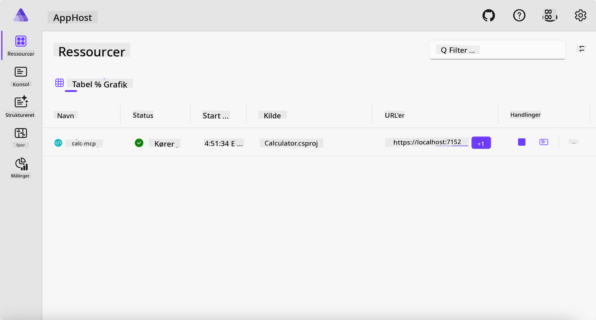
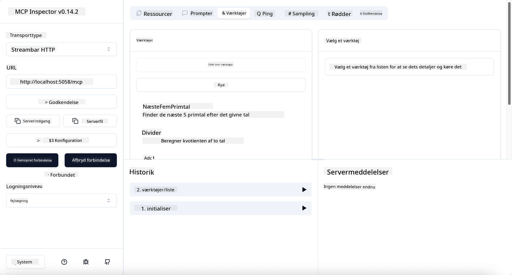
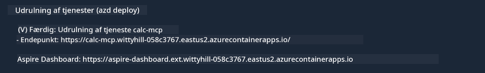

<!--
CO_OP_TRANSLATOR_METADATA:
{
  "original_hash": "0bc7bd48f55f1565f1d95ccb2c16f728",
  "translation_date": "2025-07-13T23:07:32+00:00",
  "source_file": "04-PracticalImplementation/samples/csharp/README.md",
  "language_code": "da"
}
-->
# Eksempel

Det forrige eksempel viser, hvordan man bruger et lokalt .NET-projekt med typen `stdio`. Og hvordan man kører serveren lokalt i en container. Dette er en god løsning i mange situationer. Men det kan være nyttigt at have serveren kørende eksternt, for eksempel i et cloud-miljø. Her kommer typen `http` ind i billedet.

Hvis man kigger på løsningen i mappen `04-PracticalImplementation`, kan det se meget mere komplekst ud end det forrige eksempel. Men i virkeligheden er det ikke tilfældet. Hvis man ser nærmere på projektet `src/Calculator`, vil man se, at det stort set er den samme kode som i det tidligere eksempel. Den eneste forskel er, at vi bruger et andet bibliotek, `ModelContextProtocol.AspNetCore`, til at håndtere HTTP-forespørgslerne. Og vi ændrer metoden `IsPrime` til at være privat, bare for at vise, at man kan have private metoder i sin kode. Resten af koden er den samme som før.

De andre projekter kommer fra [.NET Aspire](https://learn.microsoft.com/dotnet/aspire/get-started/aspire-overview). At have .NET Aspire i løsningen forbedrer udviklerens oplevelse under udvikling og test og hjælper med observabilitet. Det er ikke nødvendigt for at køre serveren, men det er god praksis at have det med i sin løsning.

## Start serveren lokalt

1. Fra VS Code (med C# DevKit-udvidelsen) naviger ned til mappen `04-PracticalImplementation/samples/csharp`.
1. Kør følgende kommando for at starte serveren:

   ```bash
    dotnet watch run --project ./src/AppHost
   ```

1. Når en webbrowser åbner .NET Aspire-dashboardet, bemærk `http`-URL’en. Den burde være noget i stil med `http://localhost:5058/`.

   

## Test Streamable HTTP med MCP Inspector

Hvis du har Node.js 22.7.5 eller nyere, kan du bruge MCP Inspector til at teste din server.

Start serveren og kør følgende kommando i en terminal:

```bash
npx @modelcontextprotocol/inspector http://localhost:5058
```



- Vælg `Streamable HTTP` som transporttype.
- Indtast URL’en til serveren, som du noterede tidligere, i feltet Url, og tilføj `/mcp`. Det skal være `http` (ikke `https`), noget i stil med `http://localhost:5058/mcp`.
- Vælg Connect-knappen.

En fordel ved Inspector er, at den giver god indsigt i, hvad der foregår.

- Prøv at liste de tilgængelige værktøjer
- Prøv nogle af dem, det burde fungere som før.

## Test MCP Server med GitHub Copilot Chat i VS Code

For at bruge Streamable HTTP-transporten med GitHub Copilot Chat, skal du ændre konfigurationen af `calc-mcp` serveren, som du oprettede tidligere, så den ser sådan ud:

```jsonc
// .vscode/mcp.json
{
  "servers": {
    "calc-mcp": {
      "type": "http",
      "url": "http://localhost:5058/mcp"
    }
  }
}
```

Lav nogle tests:

- Spørg efter "3 prime numbers after 6780". Bemærk, hvordan Copilot bruger de nye værktøjer `NextFivePrimeNumbers` og kun returnerer de første 3 primtal.
- Spørg efter "7 prime numbers after 111" for at se, hvad der sker.
- Spørg efter "John has 24 lollies and wants to distribute them all to his 3 kids. How many lollies does each kid have?" for at se, hvad der sker.

## Deploy serveren til Azure

Lad os deploye serveren til Azure, så flere kan bruge den.

Fra en terminal, naviger til mappen `04-PracticalImplementation/samples/csharp` og kør følgende kommando:

```bash
azd up
```

Når deployment er færdig, skulle du gerne se en besked som denne:



Tag URL’en og brug den i MCP Inspector og i GitHub Copilot Chat.

```jsonc
// .vscode/mcp.json
{
  "servers": {
    "calc-mcp": {
      "type": "http",
      "url": "https://calc-mcp.gentleriver-3977fbcf.australiaeast.azurecontainerapps.io/mcp"
    }
  }
}
```

## Hvad nu?

Vi har prøvet forskellige transporttyper og testværktøjer. Vi har også deployet din MCP-server til Azure. Men hvad hvis vores server skal have adgang til private ressourcer? For eksempel en database eller en privat API? I næste kapitel vil vi se, hvordan vi kan forbedre sikkerheden på vores server.

**Ansvarsfraskrivelse**:  
Dette dokument er blevet oversat ved hjælp af AI-oversættelsestjenesten [Co-op Translator](https://github.com/Azure/co-op-translator). Selvom vi bestræber os på nøjagtighed, bedes du være opmærksom på, at automatiserede oversættelser kan indeholde fejl eller unøjagtigheder. Det oprindelige dokument på dets oprindelige sprog bør betragtes som den autoritative kilde. For kritisk information anbefales professionel menneskelig oversættelse. Vi påtager os intet ansvar for misforståelser eller fejltolkninger, der opstår som følge af brugen af denne oversættelse.