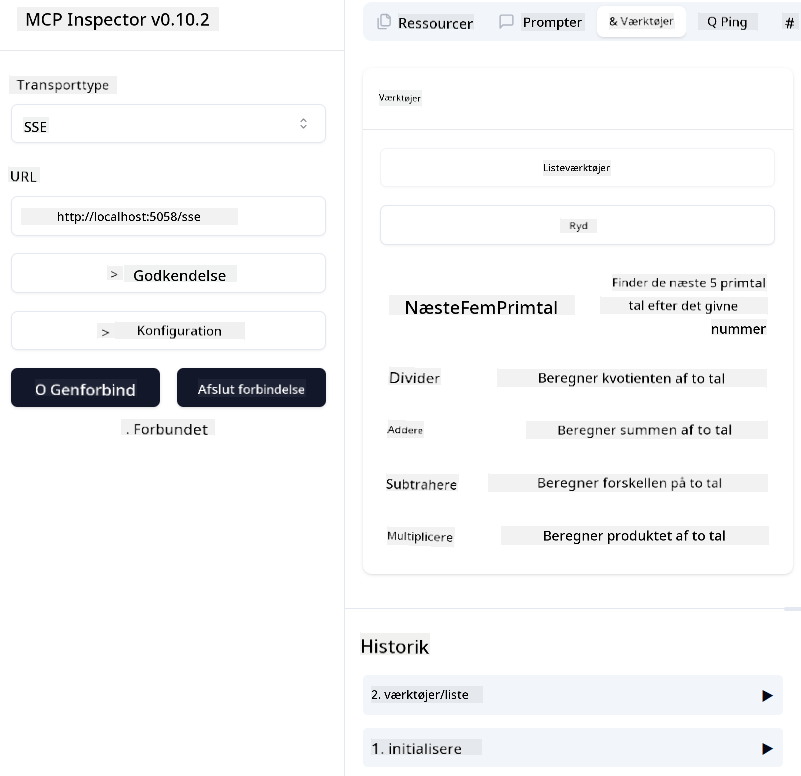
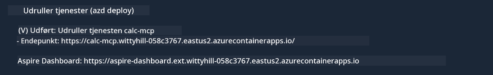

<!--
CO_OP_TRANSLATOR_METADATA:
{
  "original_hash": "5020a3e1a1c7f30c00f9e37f1fa208e3",
  "translation_date": "2025-05-17T14:09:23+00:00",
  "source_file": "04-PracticalImplementation/samples/csharp/README.md",
  "language_code": "da"
}
-->
# Eksempel

Det tidligere eksempel viser, hvordan man bruger et lokalt .NET-projekt med typen `sdio`. Og hvordan man kører serveren lokalt i en container. Dette er en god løsning i mange situationer. Dog kan det være nyttigt at have serveren kørende eksternt, som i et cloud-miljø. Det er her, typen `http` kommer ind i billedet.

Når man ser på løsningen i mappen `04-PracticalImplementation`, kan det virke meget mere komplekst end det tidligere eksempel. Men i virkeligheden er det det ikke. Hvis du ser nærmere på projektet `src/mcpserver/mcpserver.csproj`, vil du se, at det for det meste er den samme kode som det tidligere eksempel. Den eneste forskel er, at vi bruger et andet bibliotek `ModelContextProtocol.AspNetCore` til at håndtere HTTP-anmodningerne. Og vi ændrer metoden `IsPrime` for at gøre den privat, blot for at vise, at du kan have private metoder i din kode. Resten af koden er den samme som før.

De andre projekter er fra [.NET Aspire](https://learn.microsoft.com/dotnet/aspire/get-started/aspire-overview). At have .NET Aspire i løsningen vil forbedre udviklerens oplevelse under udvikling og test og hjælpe med observabilitet. Det er ikke nødvendigt for at køre serveren, men det er en god praksis at have det i din løsning.

## Start serveren lokalt

1. Fra VS Code (med C# DevKit-udvidelsen), åbn løsningen `04-PracticalImplementation\samples\csharp\src\Calculator-chap4.sln`.
2. Tryk på `F5` for at starte serveren. Det skulle starte en webbrowser med .NET Aspire dashboardet.

eller

1. Fra en terminal, naviger til mappen `04-PracticalImplementation\samples\csharp\src`
2. Udfør følgende kommando for at starte serveren:
   ```bash
    dotnet run --project .\AppHost
   ```

3. Fra Dashboardet, bemærk URL'en `http`. Det skulle være noget i stil med `http://localhost:5058/`.

## Test `SSE` med ModelContext Protocol Inspector

Hvis du har Node.js 22.7.5 eller højere, kan du bruge ModelContext Protocol Inspector til at teste din server.

Start serveren og kør følgende kommando i en terminal:

```bash
npx @modelcontextprotocol/inspector@latest
```



- Vælg `SSE` as the Transport type. SSE stand for Server-Sent Events. 
- In the Url field, enter the URL of the server noted earlier,and append `/sse`. Det skulle være `http` (ikke `https`) something like `http://localhost:5058/sse`.
- select the Connect button.

A nice thing about the Inspector is that it provide a nice visibility on what is happening.

- Try listing the availables tools
- Try some of them, it should works just like before.


## Test `SSE` with Github Copilot Chat in VS Code

To use the `SSE` transport with Github Copilot Chat, change the configuration of the `mcp-calc` server oprettet tidligere til at se sådan ud:

```json
"mcp-calc": {
    "type": "sse",
    "url": "http://localhost:5058/sse"
}
```

Foretag nogle tests:
- Bed om de 3 primtal efter 6780. Bemærk, hvordan Copilot vil bruge de nye værktøjer `NextFivePrimeNumbers` og kun returnere de første 3 primtal.
- Bed om de 7 primtal efter 111, for at se hvad der sker.


# Udrul serveren til Azure

Lad os udrulle serveren til Azure, så flere kan bruge den.

Fra en terminal, naviger til mappen `04-PracticalImplementation\samples\csharp\src` og kør følgende kommando:

```bash
azd init
```

Dette vil oprette nogle få filer lokalt for at gemme konfigurationen af Azure-ressourcerne og din Infrastruktur som kode (IaC).

Derefter, kør følgende kommando for at udrulle serveren til Azure:

```bash
azd up
```

Når udrulningen er færdig, bør du se en besked som denne:



Naviger til Aspire dashboardet og bemærk `HTTP` URL'en for at bruge den i MCP Inspector og i Github Copilot Chat.


## Hvad er det næste?

Vi prøver forskellige transporttyper, testværktøjer og vi udruller også vores MCP-server til Azure. Men hvad hvis vores server skal have adgang til private ressourcer? For eksempel en database eller en privat API? I næste kapitel vil vi se, hvordan vi kan forbedre sikkerheden på vores server.

**Ansvarsfraskrivelse**:  
Dette dokument er blevet oversat ved hjælp af AI-oversættelsestjenesten [Co-op Translator](https://github.com/Azure/co-op-translator). Selvom vi bestræber os på nøjagtighed, skal du være opmærksom på, at automatiserede oversættelser kan indeholde fejl eller unøjagtigheder. Det originale dokument på dets oprindelige sprog bør betragtes som den autoritative kilde. For kritisk information anbefales professionel menneskelig oversættelse. Vi er ikke ansvarlige for misforståelser eller fejltolkninger som følge af brugen af denne oversættelse.