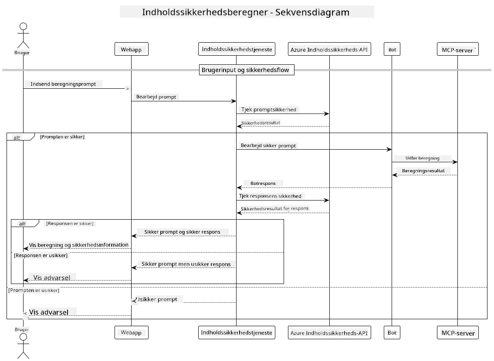

<!--
CO_OP_TRANSLATOR_METADATA:
{
  "original_hash": "e5ea5e7582f70008ea9bec3b3820f20a",
  "translation_date": "2025-05-17T14:27:44+00:00",
  "source_file": "04-PracticalImplementation/samples/java/containerapp/README.md",
  "language_code": "da"
}
-->
## Systemarkitektur

Dette projekt demonstrerer en webapplikation, der bruger indholdssikkerhedskontrol, før brugerens anmodninger sendes til en beregningstjeneste via Model Context Protocol (MCP).



### Sådan fungerer det

1. **Brugerinput**: Brugeren indtaster en beregningsanmodning i webgrænsefladen
2. **Indholdssikkerhedsscreening (Input)**: Anmodningen analyseres af Azure Content Safety API
3. **Sikkerhedsbeslutning (Input)**:
   - Hvis indholdet er sikkert (alvorlighed < 2 i alle kategorier), fortsætter det til beregneren
   - Hvis indholdet er markeret som potentielt skadeligt, stopper processen og returnerer en advarsel
4. **Beregnerintegration**: Sikkert indhold behandles af LangChain4j, som kommunikerer med MCP-beregnerserveren
5. **Indholdssikkerhedsscreening (Output)**: Botens svar analyseres af Azure Content Safety API
6. **Sikkerhedsbeslutning (Output)**:
   - Hvis botsvaret er sikkert, vises det til brugeren
   - Hvis botsvaret er markeret som potentielt skadeligt, erstattes det med en advarsel
7. **Svar**: Resultater (hvis sikre) vises til brugeren sammen med begge sikkerhedsanalyser

## Brug af Model Context Protocol (MCP) med Beregningstjenester

Dette projekt demonstrerer, hvordan man bruger Model Context Protocol (MCP) til at kalde beregner-MCP-tjenester fra LangChain4j. Implementeringen bruger en lokal MCP-server, der kører på port 8080 til at levere beregningsoperationer.

### Opsætning af Azure Content Safety Service

Før du bruger indholdssikkerhedsfunktionerne, skal du oprette en Azure Content Safety service-ressource:

1. Log ind på [Azure Portal](https://portal.azure.com)
2. Klik på "Opret en ressource" og søg efter "Content Safety"
3. Vælg "Content Safety" og klik på "Opret"
4. Indtast et unikt navn til din ressource
5. Vælg dit abonnement og ressourcegruppe (eller opret en ny)
6. Vælg en understøttet region (tjek [Region availability](https://azure.microsoft.com/en-us/global-infrastructure/services/?products=cognitive-services) for detaljer)
7. Vælg et passende pristrin
8. Klik på "Opret" for at implementere ressourcen
9. Når implementeringen er færdig, klik på "Gå til ressource"
10. I venstre panel, under "Resource Management", vælg "Keys and Endpoint"
11. Kopiér en af nøglerne og endpoint-URL'en til brug i næste trin

### Konfigurering af Miljøvariabler

Indstil `GITHUB_TOKEN` miljøvariablen til GitHub-modeller autentifikation:
```sh
export GITHUB_TOKEN=<your_github_token>
```

For indholdssikkerhedsfunktioner, indstil:
```sh
export CONTENT_SAFETY_ENDPOINT=<your_content_safety_endpoint>
export CONTENT_SAFETY_KEY=<your_content_safety_key>
```

Disse miljøvariabler bruges af applikationen til at autentificere med Azure Content Safety-tjenesten. Hvis disse variabler ikke er indstillet, vil applikationen bruge pladsholderværdier til demonstrationsformål, men indholdssikkerhedsfunktionerne vil ikke fungere korrekt.

### Start af Beregner MCP Server

Før du kører klienten, skal du starte beregner-MCP-serveren i SSE-tilstand på localhost:8080.

## Projektbeskrivelse

Dette projekt demonstrerer integrationen af Model Context Protocol (MCP) med LangChain4j til at kalde beregningstjenester. Nøglefunktioner inkluderer:

- Brug af MCP til at oprette forbindelse til en beregningstjeneste for grundlæggende matematiske operationer
- Dobbeltlag indholdssikkerhedskontrol på både brugeranmodninger og botsvar
- Integration med GitHub's gpt-4.1-nano model via LangChain4j
- Brug af Server-Sent Events (SSE) til MCP-transport

## Indholdssikkerhedsintegration

Projektet inkluderer omfattende indholdssikkerhedsfunktioner for at sikre, at både brugerinput og systemresponser er fri for skadeligt indhold:

1. **Inputscreening**: Alle brugeranmodninger analyseres for skadelige indholdskategorier som hadefuld tale, vold, selvskade og seksuelt indhold, før de behandles.

2. **Outputscreening**: Selv når potentielt ucensurerede modeller bruges, kontrollerer systemet alle genererede svar gennem de samme indholdssikkerhedsfiltre, før de vises til brugeren.

Denne dobbeltlags tilgang sikrer, at systemet forbliver sikkert uanset hvilken AI-model der bruges, og beskytter brugere mod både skadelige input og potentielt problematiske AI-genererede output.

## Webklient

Applikationen inkluderer en brugervenlig webgrænseflade, der giver brugere mulighed for at interagere med Content Safety Calculator-systemet:

### Webgrænsefladefunktioner

- Enkel, intuitiv formular til indtastning af beregningsanmodninger
- Dobbeltlag indholdssikkerhedsvalidering (input og output)
- Real-time feedback på anmodning og svar sikkerhed
- Farvekodede sikkerhedsindikatorer for nem fortolkning
- Rent, responsivt design der fungerer på forskellige enheder
- Eksempler på sikre anmodninger for at vejlede brugere

### Brug af Webklienten

1. Start applikationen:
   ```sh
   mvn spring-boot:run
   ```

2. Åbn din browser og naviger til `http://localhost:8087`

3. Indtast en beregningsanmodning i det angivne tekstområde (f.eks. "Beregn summen af 24.5 og 17.3")

4. Klik på "Indsend" for at behandle din anmodning

5. Se resultaterne, som vil inkludere:
   - Indholdssikkerhedsanalyse af din anmodning
   - Det beregnede resultat (hvis anmodningen var sikker)
   - Indholdssikkerhedsanalyse af botens svar
   - Eventuelle sikkerhedsadvarsler, hvis enten input eller output blev markeret

Webklienten håndterer automatisk begge indholdssikkerhedsverifikationsprocesser, hvilket sikrer, at alle interaktioner er sikre og passende uanset hvilken AI-model der bruges.

**Ansvarsfraskrivelse**:  
Dette dokument er blevet oversat ved hjælp af AI-oversættelsestjenesten [Co-op Translator](https://github.com/Azure/co-op-translator). Selvom vi bestræber os på at opnå nøjagtighed, bedes du være opmærksom på, at automatiserede oversættelser kan indeholde fejl eller unøjagtigheder. Det originale dokument på dets oprindelige sprog bør betragtes som den autoritative kilde. For kritisk information anbefales professionel menneskelig oversættelse. Vi er ikke ansvarlige for eventuelle misforståelser eller fejltolkninger som følge af brugen af denne oversættelse.