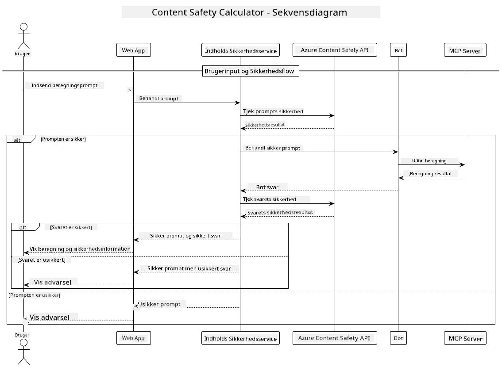

<!--
CO_OP_TRANSLATOR_METADATA:
{
  "original_hash": "e5ea5e7582f70008ea9bec3b3820f20a",
  "translation_date": "2025-07-13T23:17:08+00:00",
  "source_file": "04-PracticalImplementation/samples/java/containerapp/README.md",
  "language_code": "da"
}
-->
## Systemarkitektur

Dette projekt demonstrerer en webapplikation, der bruger indholdssikkerhedskontrol, før brugerforespørgsler sendes til en kalkulatortjeneste via Model Context Protocol (MCP).



### Sådan fungerer det

1. **Brugerinput**: Brugeren indtaster en beregningsforespørgsel i webgrænsefladen  
2. **Indholdssikkerhedskontrol (Input)**: Forespørgslen analyseres af Azure Content Safety API  
3. **Sikkerhedsafgørelse (Input)**:  
   - Hvis indholdet er sikkert (alvorlighed < 2 i alle kategorier), fortsætter det til kalkulatoren  
   - Hvis indholdet markeres som potentielt skadeligt, stoppes processen, og der returneres en advarsel  
4. **Kalkulatorintegration**: Sikkert indhold behandles af LangChain4j, som kommunikerer med MCP kalkulatorserveren  
5. **Indholdssikkerhedskontrol (Output)**: Botens svar analyseres af Azure Content Safety API  
6. **Sikkerhedsafgørelse (Output)**:  
   - Hvis botsvaret er sikkert, vises det til brugeren  
   - Hvis botsvaret markeres som potentielt skadeligt, erstattes det med en advarsel  
7. **Svar**: Resultater (hvis sikre) vises til brugeren sammen med begge sikkerhedsanalyser

## Brug af Model Context Protocol (MCP) med kalkulatortjenester

Dette projekt viser, hvordan man bruger Model Context Protocol (MCP) til at kalde kalkulator-MCP-tjenester fra LangChain4j. Implementeringen bruger en lokal MCP-server, der kører på port 8080, til at levere kalkulationsfunktioner.

### Opsætning af Azure Content Safety Service

Før du bruger indholdssikkerhedsfunktionerne, skal du oprette en Azure Content Safety service-ressource:

1. Log ind på [Azure Portal](https://portal.azure.com)  
2. Klik på "Create a resource" og søg efter "Content Safety"  
3. Vælg "Content Safety" og klik på "Create"  
4. Indtast et unikt navn til din ressource  
5. Vælg dit abonnement og ressourcegruppe (eller opret en ny)  
6. Vælg en understøttet region (tjek [Region availability](https://azure.microsoft.com/en-us/global-infrastructure/services/?products=cognitive-services) for detaljer)  
7. Vælg en passende prisplan  
8. Klik på "Create" for at implementere ressourcen  
9. Når implementeringen er færdig, klik på "Go to resource"  
10. I venstre panel under "Resource Management" vælg "Keys and Endpoint"  
11. Kopiér en af nøglerne og endpoint-URL’en til brug i næste trin

### Konfiguration af miljøvariabler

Sæt miljøvariablen `GITHUB_TOKEN` til autentificering af GitHub-modeller:  
```sh
export GITHUB_TOKEN=<your_github_token>
```

For indholdssikkerhedsfunktioner, sæt:  
```sh
export CONTENT_SAFETY_ENDPOINT=<your_content_safety_endpoint>
export CONTENT_SAFETY_KEY=<your_content_safety_key>
```

Disse miljøvariabler bruges af applikationen til at autentificere mod Azure Content Safety service. Hvis disse variabler ikke er sat, vil applikationen bruge pladsholderværdier til demonstrationsformål, men indholdssikkerhedsfunktionerne vil ikke fungere korrekt.

### Start af Calculator MCP Server

Før du kører klienten, skal du starte calculator MCP-serveren i SSE-tilstand på localhost:8080.

## Projektbeskrivelse

Dette projekt demonstrerer integrationen af Model Context Protocol (MCP) med LangChain4j til at kalde kalkulatortjenester. Nøglefunktioner inkluderer:

- Brug af MCP til at forbinde til en kalkulatortjeneste for grundlæggende matematiske operationer  
- Dobbeltlags indholdssikkerhedskontrol på både brugerforespørgsler og botsvar  
- Integration med GitHubs gpt-4.1-nano model via LangChain4j  
- Brug af Server-Sent Events (SSE) til MCP-transport

## Indholdssikkerhedsintegration

Projektet indeholder omfattende indholdssikkerhedsfunktioner for at sikre, at både brugerinput og systemets svar er fri for skadeligt indhold:

1. **Inputkontrol**: Alle brugerforespørgsler analyseres for skadelige indholdskategorier som hadtale, vold, selvskade og seksuelt indhold, før de behandles.  

2. **Outputkontrol**: Selv ved brug af potentielt ukensurerede modeller kontrollerer systemet alle genererede svar gennem de samme indholdssikkerhedsfiltre, før de vises for brugeren.

Denne dobbeltlagsmetode sikrer, at systemet forbliver sikkert uanset hvilken AI-model der anvendes, og beskytter brugerne mod både skadelige input og potentielt problematiske AI-genererede output.

## Webklient

Applikationen inkluderer en brugervenlig webgrænseflade, der giver brugerne mulighed for at interagere med Content Safety Calculator-systemet:

### Funktioner i webgrænsefladen

- Enkel, intuitiv formular til indtastning af beregningsforespørgsler  
- Dobbeltlags indholdssikkerhedsvalidering (input og output)  
- Feedback i realtid om forespørgsels- og svar-sikkerhed  
- Farvekodede sikkerhedsindikatorer for nem fortolkning  
- Rent, responsivt design, der fungerer på forskellige enheder  
- Eksempler på sikre forespørgsler til at guide brugerne

### Brug af webklienten

1. Start applikationen:  
   ```sh
   mvn spring-boot:run
   ```

2. Åbn din browser og gå til `http://localhost:8087`

3. Indtast en beregningsforespørgsel i det angivne tekstfelt (f.eks. "Calculate the sum of 24.5 and 17.3")

4. Klik på "Submit" for at behandle din anmodning

5. Se resultaterne, som vil inkludere:  
   - Indholdssikkerhedsanalyse af din forespørgsel  
   - Det beregnede resultat (hvis forespørgslen var sikker)  
   - Indholdssikkerhedsanalyse af botens svar  
   - Eventuelle sikkerhedsadvarsler, hvis enten input eller output blev markeret

Webklienten håndterer automatisk begge indholdssikkerhedsverifikationsprocesser og sikrer, at alle interaktioner er sikre og passende, uanset hvilken AI-model der anvendes.

**Ansvarsfraskrivelse**:  
Dette dokument er blevet oversat ved hjælp af AI-oversættelsestjenesten [Co-op Translator](https://github.com/Azure/co-op-translator). Selvom vi bestræber os på nøjagtighed, bedes du være opmærksom på, at automatiserede oversættelser kan indeholde fejl eller unøjagtigheder. Det oprindelige dokument på dets oprindelige sprog bør betragtes som den autoritative kilde. For kritisk information anbefales professionel menneskelig oversættelse. Vi påtager os intet ansvar for misforståelser eller fejltolkninger, der opstår som følge af brugen af denne oversættelse.