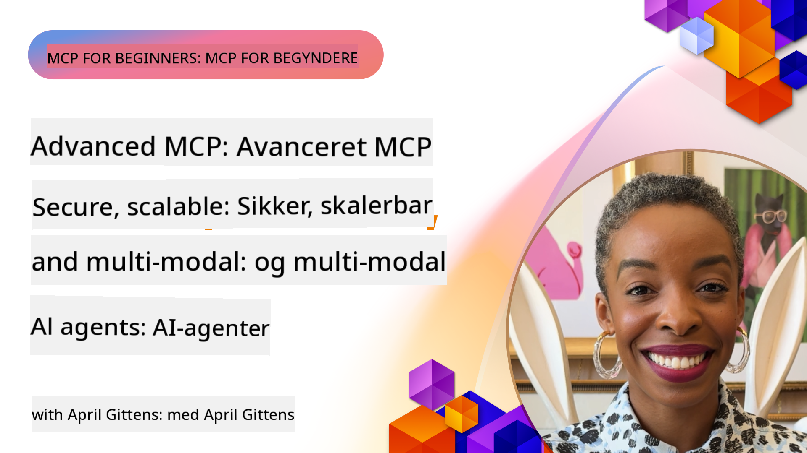

<!--
CO_OP_TRANSLATOR_METADATA:
{
  "original_hash": "d204bc94ea6027d06a703b21b711ca57",
  "translation_date": "2025-08-18T15:11:39+00:00",
  "source_file": "05-AdvancedTopics/README.md",
  "language_code": "da"
}
-->
# Avancerede emner i MCP

_(Klik på billedet ovenfor for at se videoen til denne lektion)_

Dette kapitel dækker en række avancerede emner inden for implementering af Model Context Protocol (MCP), herunder multimodal integration, skalerbarhed, sikkerhedsprincipper og integration i virksomheder. Disse emner er afgørende for at bygge robuste og produktionsklare MCP-applikationer, der kan opfylde kravene i moderne AI-systemer.

## Oversigt

Denne lektion udforsker avancerede koncepter inden for implementering af Model Context Protocol med fokus på multimodal integration, skalerbarhed, sikkerhedsprincipper og integration i virksomheder. Disse emner er essentielle for at bygge MCP-applikationer i produktionskvalitet, der kan håndtere komplekse krav i virksomhedsmiljøer.

## Læringsmål

Ved afslutningen af denne lektion vil du være i stand til at:

- Implementere multimodale funktioner inden for MCP-rammer
- Designe skalerbare MCP-arkitekturer til højbelastningsscenarier
- Anvende sikkerhedsprincipper i overensstemmelse med MCP's sikkerhedsstandarder
- Integrere MCP med virksomheders AI-systemer og rammeværk
- Optimere ydeevne og pålidelighed i produktionsmiljøer

## Lektioner og eksempler på projekter

| Link | Titel | Beskrivelse |
|------|-------|-------------|
| [5.1 Integration med Azure](./mcp-integration/README.md) | Integration med Azure | Lær, hvordan du integrerer din MCP-server på Azure |
| [5.2 Multimodale eksempler](./mcp-multi-modality/README.md) | MCP Multimodale eksempler | Eksempler på lyd, billeder og multimodale svar |
| [5.3 MCP OAuth2-eksempel](../../../05-AdvancedTopics/mcp-oauth2-demo) | MCP OAuth2 Demo | Minimal Spring Boot-app, der viser OAuth2 med MCP, både som autorisations- og ressourcestyring. Demonstrerer sikker tokenudstedelse, beskyttede endpoints, Azure Container Apps-udrulning og API Management-integration. |
| [5.4 Root Contexts](./mcp-root-contexts/README.md) | Root Contexts | Lær mere om root contexts og hvordan man implementerer dem |
| [5.5 Routing](./mcp-routing/README.md) | Routing | Lær om forskellige typer routing |
| [5.6 Sampling](./mcp-sampling/README.md) | Sampling | Lær, hvordan du arbejder med sampling |
| [5.7 Skalering](./mcp-scaling/README.md) | Skalering | Lær om skalering |
| [5.8 Sikkerhed](./mcp-security/README.md) | Sikkerhed | Sikr din MCP-server |
| [5.9 Websøgnings-eksempel](./web-search-mcp/README.md) | Websøgnings-MCP | Python MCP-server og -klient, der integrerer med SerpAPI til realtids web-, nyheds-, produkt-søgning og Q&A. Demonstrerer multi-tool orkestrering, ekstern API-integration og robust fejlhåndtering. |
| [5.10 Realtidsstreaming](./mcp-realtimestreaming/README.md) | Streaming | Realtidsdatastreaming er blevet essentielt i dagens datadrevne verden, hvor virksomheder og applikationer kræver øjeblikkelig adgang til information for at træffe rettidige beslutninger. |
| [5.11 Realtids websøgning](./mcp-realtimesearch/README.md) | Websøgning | Realtids websøgnings-MCP transformerer realtids websøgning ved at tilbyde en standardiseret tilgang til kontekststyring på tværs af AI-modeller, søgemaskiner og applikationer. |
| [5.12 Entra ID-autentificering for Model Context Protocol-servere](./mcp-security-entra/README.md) | Entra ID-autentificering | Microsoft Entra ID tilbyder en robust cloud-baseret identitets- og adgangsstyringsløsning, der hjælper med at sikre, at kun autoriserede brugere og applikationer kan interagere med din MCP-server. |
| [5.13 Azure AI Foundry Agent Integration](./mcp-foundry-agent-integration/README.md) | Azure AI Foundry Integration | Lær, hvordan du integrerer Model Context Protocol-servere med Azure AI Foundry-agenter, hvilket muliggør kraftfuld værktøjsorkestrering og virksomheders AI-funktioner med standardiserede forbindelser til eksterne datakilder. |
| [5.14 Kontekst Engineering](./mcp-contextengineering/README.md) | Kontekst Engineering | Fremtidens muligheder inden for kontekst engineering-teknikker for MCP-servere, herunder kontekstoptimering, dynamisk kontekststyring og strategier for effektiv prompt engineering inden for MCP-rammer. |

## Yderligere referencer

For de mest opdaterede oplysninger om avancerede MCP-emner, se:
- [MCP Dokumentation](https://modelcontextprotocol.io/)
- [MCP Specifikation](https://spec.modelcontextprotocol.io/)
- [GitHub Repository](https://github.com/modelcontextprotocol)

## Vigtige pointer

- Multimodale MCP-implementeringer udvider AI's kapaciteter ud over tekstbehandling
- Skalering er afgørende for virksomheders implementeringer og kan adresseres gennem horisontal og vertikal skalering
- Omfattende sikkerhedsforanstaltninger beskytter data og sikrer korrekt adgangskontrol
- Integration med platforme som Azure OpenAI og Microsoft AI Foundry forbedrer MCP's kapaciteter
- Avancerede MCP-implementeringer drager fordel af optimerede arkitekturer og omhyggelig ressourcehåndtering

## Øvelse

Design en MCP-implementering i virksomhedskvalitet til et specifikt brugsscenarie:

1. Identificer multimodale krav til dit brugsscenarie
2. Skitser de sikkerhedskontroller, der er nødvendige for at beskytte følsomme data
3. Design en skalerbar arkitektur, der kan håndtere varierende belastning
4. Planlæg integrationspunkter med virksomheders AI-systemer
5. Dokumenter potentielle flaskehalse i ydeevnen og strategier for at afhjælpe dem

## Yderligere ressourcer

- [Azure OpenAI Dokumentation](https://learn.microsoft.com/en-us/azure/ai-services/openai/)
- [Microsoft AI Foundry Dokumentation](https://learn.microsoft.com/en-us/ai-services/)

---

## Hvad er det næste

- [5.1 MCP Integration](./mcp-integration/README.md)

**Ansvarsfraskrivelse**:  
Dette dokument er blevet oversat ved hjælp af AI-oversættelsestjenesten [Co-op Translator](https://github.com/Azure/co-op-translator). Selvom vi bestræber os på at sikre nøjagtighed, skal det bemærkes, at automatiserede oversættelser kan indeholde fejl eller unøjagtigheder. Det originale dokument på dets oprindelige sprog bør betragtes som den autoritative kilde. For kritisk information anbefales professionel menneskelig oversættelse. Vi påtager os ikke ansvar for eventuelle misforståelser eller fejltolkninger, der måtte opstå som følge af brugen af denne oversættelse.