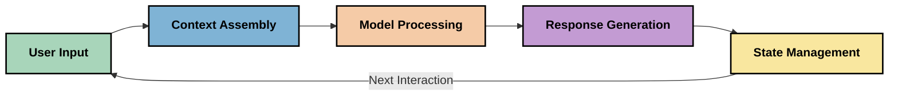
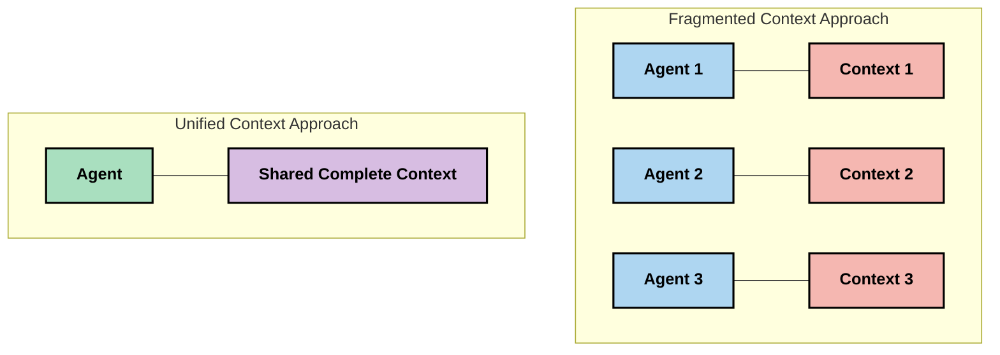
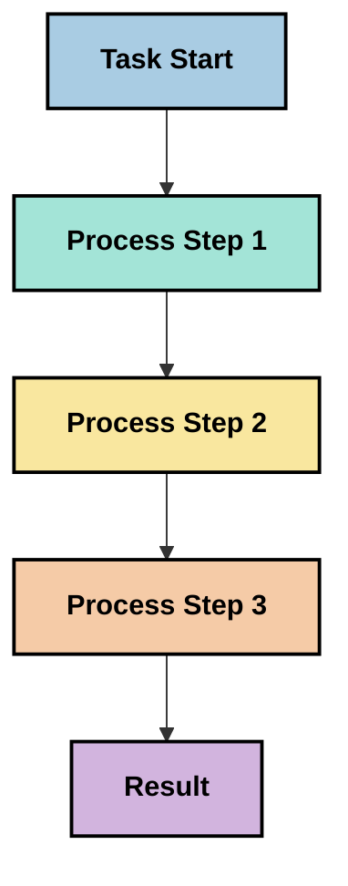
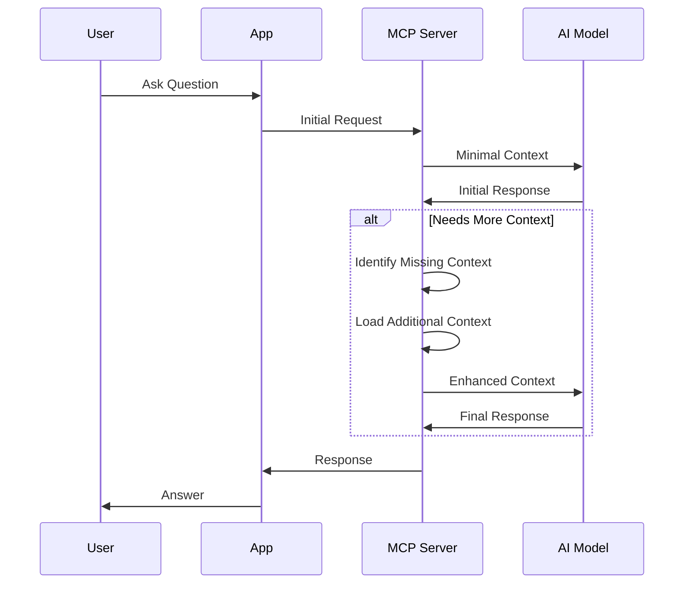
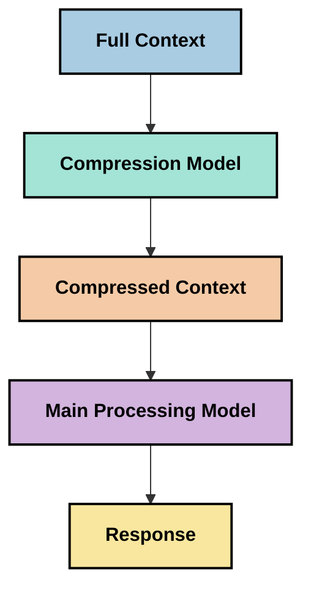

<!--
CO_OP_TRANSLATOR_METADATA:
{
  "original_hash": "5762e8e74dd99d8b7dbb31e69a82561e",
  "translation_date": "2025-07-17T08:33:33+00:00",
  "source_file": "05-AdvancedTopics/mcp-contextengineering/README.md",
  "language_code": "da"
}
-->
# Context Engineering: Et Fremvoksende Begreb i MCP-Økosystemet

## Oversigt

Context engineering er et nyt begreb inden for AI, der undersøger, hvordan information struktureres, leveres og vedligeholdes gennem interaktioner mellem klienter og AI-tjenester. Efterhånden som Model Context Protocol (MCP)-økosystemet udvikler sig, bliver det stadig vigtigere at forstå, hvordan man effektivt håndterer kontekst. Dette modul introducerer begrebet context engineering og udforsker dets potentielle anvendelser i MCP-implementeringer.

## Læringsmål

Når du har gennemført dette modul, vil du kunne:

- Forstå det nye begreb context engineering og dets mulige rolle i MCP-applikationer
- Identificere centrale udfordringer i kontekststyring, som MCP-protokolens design adresserer
- Udforske teknikker til at forbedre modelpræstation gennem bedre kontekstbehandling
- Overveje metoder til at måle og evaluere kontekstens effektivitet
- Anvende disse nye koncepter til at forbedre AI-oplevelser via MCP-rammeværket

## Introduktion til Context Engineering

Context engineering er et nyt område, der fokuserer på bevidst design og styring af informationsflow mellem brugere, applikationer og AI-modeller. I modsætning til etablerede felter som prompt engineering er context engineering stadig under udvikling, hvor praktikere arbejder på at løse de unikke udfordringer ved at give AI-modeller den rette information på det rette tidspunkt.

Efterhånden som store sprogmodeller (LLMs) er blevet mere avancerede, er kontekstens betydning blevet mere tydelig. Kvaliteten, relevansen og strukturen af den kontekst, vi leverer, påvirker direkte modellens output. Context engineering undersøger dette forhold og søger at udvikle principper for effektiv kontekststyring.

> "I 2025 er modellerne derude ekstremt intelligente. Men selv den klogeste menneske vil ikke kunne udføre sit arbejde effektivt uden konteksten for, hvad de bliver bedt om at gøre... 'Context engineering' er næste niveau af prompt engineering. Det handler om at gøre dette automatisk i et dynamisk system." — Walden Yan, Cognition AI

Context engineering kan omfatte:

1. **Context Selection**: At afgøre, hvilken information der er relevant for en given opgave
2. **Context Structuring**: At organisere information for at maksimere modellens forståelse
3. **Context Delivery**: At optimere, hvordan og hvornår information sendes til modellerne
4. **Context Maintenance**: At styre tilstand og udvikling af kontekst over tid
5. **Context Evaluation**: At måle og forbedre kontekstens effektivitet

Disse fokusområder er særligt relevante for MCP-økosystemet, som tilbyder en standardiseret måde for applikationer at levere kontekst til LLM’er.

## Perspektivet: Context Journey

En måde at visualisere context engineering på er at følge den rejse, information tager gennem et MCP-system:



### Centrale faser i Context Journey:

1. **User Input**: Rå information fra brugeren (tekst, billeder, dokumenter)
2. **Context Assembly**: Sammenstilling af brugerinput med systemkontekst, samtalehistorik og anden hentet information
3. **Model Processing**: AI-modellen behandler den samlede kontekst
4. **Response Generation**: Modellen producerer output baseret på den leverede kontekst
5. **State Management**: Systemet opdaterer sin interne tilstand baseret på interaktionen

Dette perspektiv fremhæver kontekstens dynamiske natur i AI-systemer og rejser vigtige spørgsmål om, hvordan man bedst håndterer information i hver fase.

## Fremvoksende Principper i Context Engineering

Efterhånden som feltet context engineering tager form, begynder nogle tidlige principper at dukke op blandt praktikere. Disse principper kan hjælpe med at informere valg i MCP-implementeringer:

### Princip 1: Del Kontekst Fuldstændigt

Kontekst bør deles fuldstændigt mellem alle systemets komponenter i stedet for at være fragmenteret på tværs af flere agenter eller processer. Når konteksten er opdelt, kan beslutninger truffet i én del af systemet komme i konflikt med beslutninger andre steder.



I MCP-applikationer antyder dette, at man designer systemer, hvor konteksten flyder gnidningsløst gennem hele pipeline i stedet for at være opdelt.

### Princip 2: Anerkend, at Handlinger Indeholder Implicitte Beslutninger

Hver handling, en model foretager, indeholder implicitte beslutninger om, hvordan konteksten skal fortolkes. Når flere komponenter handler på forskellige kontekster, kan disse implicitte beslutninger komme i konflikt og føre til inkonsistente resultater.

Dette princip har vigtige konsekvenser for MCP-applikationer:
- Foretræk lineær behandling af komplekse opgaver frem for parallel udførelse med fragmenteret kontekst
- Sørg for, at alle beslutningspunkter har adgang til den samme kontekstuelle information
- Design systemer, hvor senere trin kan se den fulde kontekst af tidligere beslutninger

### Princip 3: Balancer Kontekstdybde med Vinduesbegrænsninger

Efterhånden som samtaler og processer bliver længere, overskrides kontekstvinduerne til sidst. Effektiv context engineering undersøger metoder til at håndtere spændingen mellem omfattende kontekst og tekniske begrænsninger.

Mulige tilgange, der udforskes, inkluderer:
- Kontekstkomprimering, der bevarer væsentlig information samtidig med at tokenforbruget reduceres
- Progressiv indlæsning af kontekst baseret på relevans for aktuelle behov
- Opsummering af tidligere interaktioner, mens nøglebeslutninger og fakta bevares

## Udfordringer med Kontekst og MCP-Protokolens Design

Model Context Protocol (MCP) er designet med forståelse for de unikke udfordringer ved kontekststyring. At forstå disse udfordringer hjælper med at forklare centrale aspekter af MCP-protokollens design:

### Udfordring 1: Begrænsninger i Kontekstvindue  
De fleste AI-modeller har faste størrelser på kontekstvinduer, hvilket begrænser, hvor meget information de kan behandle ad gangen.

**MCP Design Respons:**  
- Protokollen understøtter struktureret, ressourcebaseret kontekst, der kan refereres effektivt  
- Ressourcer kan opdeles i sider og indlæses progressivt

### Udfordring 2: Bestemmelse af Relevans  
Det er vanskeligt at afgøre, hvilken information der er mest relevant at inkludere i konteksten.

**MCP Design Respons:**  
- Fleksible værktøjer tillader dynamisk hentning af information efter behov  
- Strukturerede prompts muliggør ensartet kontekstorganisering

### Udfordring 3: Vedvarende Kontekst  
At styre tilstand på tværs af interaktioner kræver omhyggelig sporing af kontekst.

**MCP Design Respons:**  
- Standardiseret sessionstyring  
- Klart definerede interaktionsmønstre for kontekstens udvikling

### Udfordring 4: Multi-Modale Kontekster  
Forskellige datatyper (tekst, billeder, strukturerede data) kræver forskellig håndtering.

**MCP Design Respons:**  
- Protokolens design understøtter forskellige indholdstyper  
- Standardiseret repræsentation af multi-modal information

### Udfordring 5: Sikkerhed og Privatliv  
Kontekst indeholder ofte følsomme oplysninger, som skal beskyttes.

**MCP Design Respons:**  
- Klare grænser mellem klient- og serveransvar  
- Lokale behandlingsmuligheder for at minimere dataeksponering

At forstå disse udfordringer og hvordan MCP adresserer dem, giver et fundament for at udforske mere avancerede teknikker inden for context engineering.

## Fremvoksende Tilgange til Context Engineering

Efterhånden som context engineering udvikler sig, dukker flere lovende tilgange op. Disse repræsenterer den nuværende tankegang snarere end etablerede bedste praksisser og vil sandsynligvis udvikle sig med erfaring fra MCP-implementeringer.

### 1. Enkelttrådet Lineær Behandling

I modsætning til multi-agent-arkitekturer, der fordeler kontekst, oplever nogle praktikere, at enkelttrådet lineær behandling giver mere konsistente resultater. Dette stemmer overens med princippet om at bevare en samlet kontekst.



Selvom denne tilgang kan virke mindre effektiv end parallel behandling, giver den ofte mere sammenhængende og pålidelige resultater, fordi hvert trin bygger på en fuldstændig forståelse af tidligere beslutninger.

### 2. Opdeling og Prioritering af Kontekst

At opdele store kontekster i håndterbare stykker og prioritere det vigtigste.

```python
# Conceptual Example: Context Chunking and Prioritization
def process_with_chunked_context(documents, query):
    # 1. Break documents into smaller chunks
    chunks = chunk_documents(documents)
    
    # 2. Calculate relevance scores for each chunk
    scored_chunks = [(chunk, calculate_relevance(chunk, query)) for chunk in chunks]
    
    # 3. Sort chunks by relevance score
    sorted_chunks = sorted(scored_chunks, key=lambda x: x[1], reverse=True)
    
    # 4. Use the most relevant chunks as context
    context = create_context_from_chunks([chunk for chunk, score in sorted_chunks[:5]])
    
    # 5. Process with the prioritized context
    return generate_response(context, query)
```

Konceptet ovenfor illustrerer, hvordan man kan opdele store dokumenter i håndterbare dele og kun vælge de mest relevante dele til konteksten. Denne tilgang hjælper med at arbejde inden for kontekstvinduesbegrænsninger, samtidig med at store vidensbaser udnyttes.

### 3. Progressiv Indlæsning af Kontekst

At indlæse kontekst gradvist efter behov i stedet for alt på én gang.



Progressiv kontekstindlæsning starter med minimal kontekst og udvider kun, når det er nødvendigt. Det kan markant reducere tokenforbruget ved simple forespørgsler, samtidig med at det bevarer evnen til at håndtere komplekse spørgsmål.

### 4. Kontekstkomprimering og Opsummering

At reducere kontekstens størrelse, mens væsentlig information bevares.



Kontekstkomprimering fokuserer på:  
- At fjerne redundant information  
- At opsummere langt indhold  
- At udtrække nøglefakta og detaljer  
- At bevare kritiske kontekstelementer  
- At optimere for token-effektivitet

Denne tilgang kan være særligt værdifuld til at opretholde lange samtaler inden for kontekstvinduer eller til effektiv behandling af store dokumenter. Nogle praktikere bruger specialiserede modeller til netop kontekstkomprimering og opsummering af samtalehistorik.

## Overvejelser ved Eksperimentel Context Engineering

Når vi udforsker det nye felt context engineering, er der flere overvejelser, som er værd at have i mente ved arbejde med MCP-implementeringer. Disse er ikke faste bedste praksisser, men områder til udforskning, der kan føre til forbedringer i din specifikke brugssituation.

### Overvej Dine Kontekstmål

Før du implementerer komplekse løsninger til kontekststyring, bør du klart formulere, hvad du ønsker at opnå:  
- Hvilken specifik information har modellen brug for for at lykkes?  
- Hvilken information er essentiel versus supplerende?  
- Hvad er dine præstationsbegrænsninger (latens, token-grænser, omkostninger)?

### Udforsk Lagdelte Konteksttilgange

Nogle praktikere har succes med kontekst arrangeret i konceptuelle lag:  
- **Core Layer**: Essentiel information, som modellen altid har brug for  
- **Situational Layer**: Kontekst specifik for den aktuelle interaktion  
- **Supporting Layer**: Yderligere information, der kan være nyttig  
- **Fallback Layer**: Information, der kun tilgås ved behov

### Undersøg Hentningsstrategier

Kontekstens effektivitet afhænger ofte af, hvordan du henter information:  
- Semantisk søgning og embeddings til at finde konceptuelt relevant information  
- Søgeordssøgning for specifikke faktuelle detaljer  
- Hybridtilgange, der kombinerer flere hentningsmetoder  
- Metadatafiltrering for at indsnævre omfang baseret på kategorier, datoer eller kilder

### Eksperimenter med Kontekstkoherens

Strukturen og flowet i din kontekst kan påvirke modellens forståelse:  
- At gruppere relateret information sammen  
- At bruge ensartet formatering og organisering  
- At opretholde logisk eller kronologisk rækkefølge, hvor det er relevant  
- At undgå modstridende information

### Vurder Fordele og Ulemper ved Multi-Agent Arkitekturer

Selvom multi-agent arkitekturer er populære i mange AI-rammer, medfører de betydelige udfordringer for kontekststyring:  
- Fragmentering af kontekst kan føre til inkonsistente beslutninger på tværs af agenter  
- Parallel behandling kan skabe konflikter, der er svære at løse  
- Kommunikationsomkostninger mellem agenter kan opveje ydelsesgevinster  
- Kompleks tilstandsstyring er nødvendig for at bevare sammenhæng

I mange tilfælde kan en enkelt-agent tilgang med omfattende kontekststyring give mere pålidelige resultater end flere specialiserede agenter med fragmenteret kontekst.

### Udvikl Evalueringsmetoder

For at forbedre context engineering over tid, overvej hvordan du vil måle succes:  
- A/B-test af forskellige kontekststrukturer  
- Overvågning af tokenforbrug og svartider  
- Sporing af brugertilfredshed og opgavefuldførelse  
- Analyse af, hvornår og hvorfor kontekststrategier fejler

Disse overvejelser repræsenterer aktive udforskningsområder inden for context engineering. Efterhånden som feltet modnes, vil mere definitive mønstre og praksisser sandsynligvis opstå.

## Måling af Konteksteffektivitet: Et Under Udvikling Rammeværk

Som context engineering vokser frem som begreb, begynder praktikere at undersøge, hvordan vi kan måle dets effektivitet. Der findes endnu ikke et etableret rammeværk, men forskellige måleparametre overvejes, som kan hjælpe med at styre fremtidigt arbejde.

### Potentielle Måledimensioner

#### 1. Inputeffektivitet

- **Context-to-Response Ratio**: Hvor meget kontekst er nødvendig i forhold til svarstørrelsen?  
- **Token Utilization**: Hvilken procentdel af de leverede konteksttokens påvirker tilsyneladende svaret?  
- **Context Reduction**: Hvor effektivt kan vi komprimere rå information?

#### 2. Præstationsaspekter

- **Latency Impact**: Hvordan påvirker kontekststyring svartiden?  
- **Token Economy**: Optimerer vi tokenforbruget effektivt?  
- **Retrieval Precision**: Hvor relevant er den hentede information?  
- **Resource Utilization**: Hvilke beregningsressourcer kræves?

#### 3. Kvalitetsaspekter

- **Response Relevance**: Hvor godt adresserer svaret forespørgslen?  
- **Factual Accuracy**: Forbedrer kontekststyring faktuel korrekthed?  
- **Consistency**: Er svarene konsistente på tværs af lignende forespørgsler?  
- **Hallucination Rate**: Reducerer bedre kontekst modellens hallucinationer?

#### 4. Brugeroplevelse

- **Follow-up Rate**: Hvor ofte har brugere brug for afklaring?  
- **Task Completion**: Opnår brugerne deres mål?  
- **Satisfaction Indicators**: Hvordan vurderer brugerne deres oplevelse?

### Eksperimentelle Måletilgange

Når du eksperimenterer med context engineering i MCP-implementeringer, kan du overveje disse tilgange:

1. **Baseline Sammenligninger**: Etabler en baseline med simple konteksttilgange, før du tester mere avancerede metoder  
2. **Inkrementelle Ændringer**: Ændr én del af kontekststyringen ad gangen for at isolere effekter  
3. **Brugercentreret Evaluering**: Kombiner kvantitative målinger med kvalitativ brugerfeedback  
4. **Fejlanalyse**: Undersøg tilfælde, hvor kontekststrategier fejler, for at forstå mulige forbedringer  
5. **Multi-Dimensionel Vurdering**: Overvej afvejninger mellem effektivitet, kvalitet og brugeroplevelse

Denne eksperimentelle, flerfacetterede tilgang til måling passer til context engineerings nye karakter.

## Afsluttende Tanker

Context engineering er et nyt udforskningsområde, der kan vise sig centralt for effektive MCP-applikationer. Ved omhyggeligt at overveje, hvordan information flyder gennem dit system, kan du potentielt skabe AI-oplevelser, der er mere effektive, præcise og værdifulde for brugerne.

De teknikker og tilgange, der er skitseret i dette modul, repræsenterer tidlig tankegang på området, ikke etablerede praksisser. Context engineering kan udvikle sig til en mere defineret disciplin, efterhånden som AI-kapaciteterne vokser, og vores forståelse bliver dybere. For nu synes eksperimenter kombineret med omhyggelig måling at være den mest produktive tilgang.

## Mulige Fremtidige Retninger

Feltet context engineering er stadig i sin spæde start, men flere lovende retninger tegner sig:

- Principper for context engineering kan få stor betydning for modelpræstation, effektivitet, brugeroplevelse og pålidelighed  
- Enkelttrådede tilgange med omfattende kontekststyring kan overgå multi-agent arkitekturer i mange anvendelser  
- Specialiserede modeller til kontekstkomprimering kan blive standardkomponenter i AI-pipelines  
- Spændingen mellem kontekstkomplethed og tokenbegrænsninger vil sandsynligvis drive innovation i kontekstbehandling  
- Efterhånden som modeller bliver bedre til effektiv menneskelignende kommunikation, kan ægte multi-agent samarbejde blive mere levedygtigt  
- MCP-implementeringer kan udvikle sig til at standardisere kontekststyringsmønstre,
- [Model Context Protocol Website](https://modelcontextprotocol.io/)
- [Model Context Protocol Specification](https://github.com/modelcontextprotocol/modelcontextprotocol)
- [MCP Documentation](https://modelcontextprotocol.io/docs)
- [MCP C# SDK](https://github.com/modelcontextprotocol/csharp-sdk)
- [MCP Python SDK](https://github.com/modelcontextprotocol/python-sdk)
- [MCP TypeScript SDK](https://github.com/modelcontextprotocol/typescript-sdk)
- [MCP Inspector](https://github.com/modelcontextprotocol/inspector) - Visuelt testværktøj til MCP-servere

### Artikler om Context Engineering
- [Don't Build Multi-Agents: Principles of Context Engineering](https://cognition.ai/blog/dont-build-multi-agents) - Walden Yans indsigter om principper for context engineering
- [A Practical Guide to Building Agents](https://cdn.openai.com/business-guides-and-resources/a-practical-guide-to-building-agents.pdf) - OpenAIs guide til effektiv agentdesign
- [Building Effective Agents](https://www.anthropic.com/engineering/building-effective-agents) - Anthropics tilgang til agentudvikling

### Relateret forskning
- [Dynamic Retrieval Augmentation for Large Language Models](https://arxiv.org/abs/2310.01487) - Forskning i dynamiske retrieval-metoder
- [Lost in the Middle: How Language Models Use Long Contexts](https://arxiv.org/abs/2307.03172) - Vigtig forskning om mønstre i kontekstbehandling
- [Hierarchical Text-Conditioned Image Generation with CLIP Latents](https://arxiv.org/abs/2204.06125) - DALL-E 2 artikel med indsigt i kontekststrukturering
- [Exploring the Role of Context in Large Language Model Architectures](https://aclanthology.org/2023.findings-emnlp.124/) - Ny forskning om håndtering af kontekst
- [Multi-Agent Collaboration: A Survey](https://arxiv.org/abs/2304.03442) - Forskning i multi-agent systemer og deres udfordringer

### Yderligere ressourcer
- [Context Window Optimization Techniques](https://learn.microsoft.com/en-us/azure/ai-services/openai/concepts/context-window)
- [Advanced RAG Techniques](https://www.microsoft.com/en-us/research/blog/retrieval-augmented-generation-rag-and-frontier-models/)
- [Semantic Kernel Documentation](https://github.com/microsoft/semantic-kernel)
- [AI Toolkit for Context Management](https://github.com/microsoft/aitoolkit)

## Hvad er det næste
- [6. Community Contributions](../../06-CommunityContributions/README.md)

**Ansvarsfraskrivelse**:  
Dette dokument er blevet oversat ved hjælp af AI-oversættelsestjenesten [Co-op Translator](https://github.com/Azure/co-op-translator). Selvom vi bestræber os på nøjagtighed, bedes du være opmærksom på, at automatiserede oversættelser kan indeholde fejl eller unøjagtigheder. Det oprindelige dokument på dets oprindelige sprog bør betragtes som den autoritative kilde. For kritisk information anbefales professionel menneskelig oversættelse. Vi påtager os intet ansvar for misforståelser eller fejltolkninger, der opstår som følge af brugen af denne oversættelse.