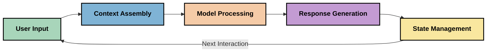
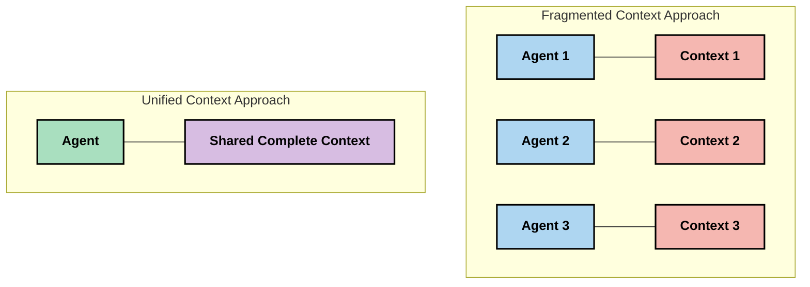
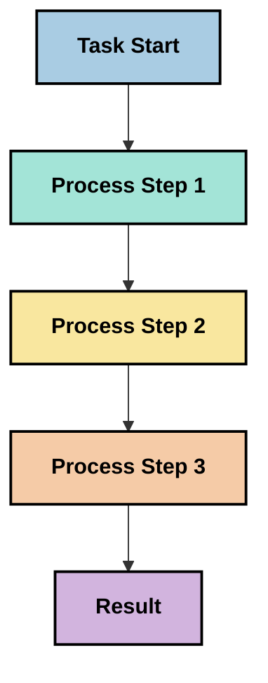
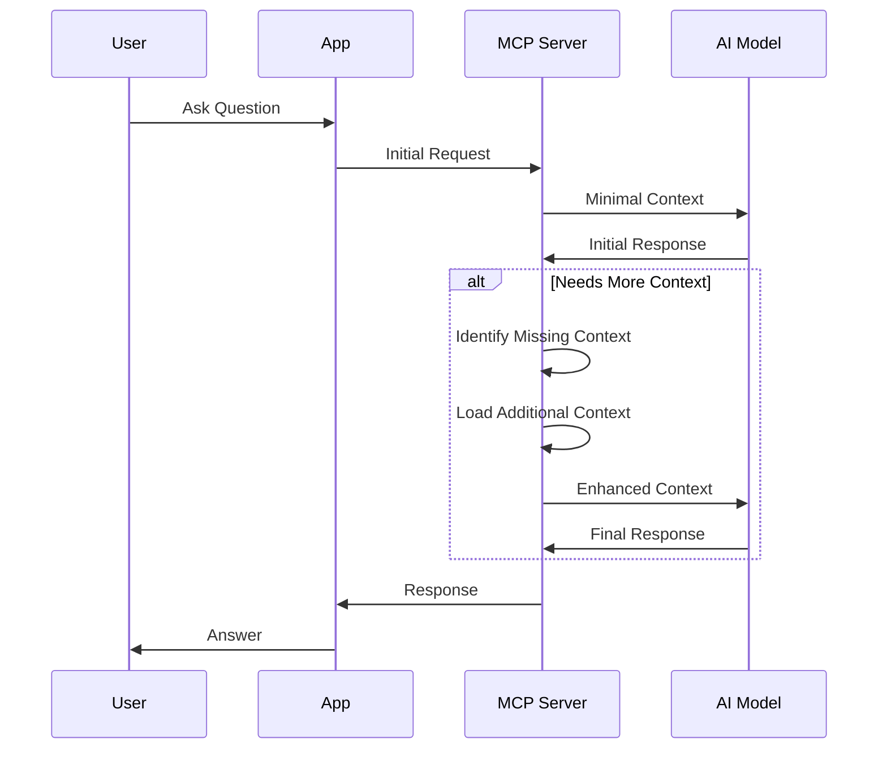
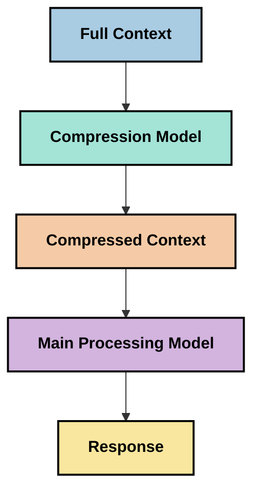

<!--
CO_OP_TRANSLATOR_METADATA:
{
  "original_hash": "fd169ca3071b81b5ee282e194bc823df",
  "translation_date": "2025-09-15T20:34:59+00:00",
  "source_file": "05-AdvancedTopics/mcp-contextengineering/README.md",
  "language_code": "da"
}
-->
# Kontekstteknik: Et Fremvoksende Koncept i MCP-Økosystemet

## Oversigt

Kontekstteknik er et nyt koncept inden for AI, der undersøger, hvordan information struktureres, leveres og vedligeholdes under interaktioner mellem klienter og AI-tjenester. Efterhånden som Model Context Protocol (MCP)-økosystemet udvikler sig, bliver forståelsen af, hvordan man effektivt håndterer kontekst, stadig vigtigere. Dette modul introducerer konceptet kontekstteknik og udforsker dets potentielle anvendelser i MCP-implementeringer.

## Læringsmål

Ved afslutningen af dette modul vil du kunne:

- Forstå det fremvoksende koncept kontekstteknik og dets potentielle rolle i MCP-applikationer
- Identificere nøgleudfordringer i konteksthåndtering, som MCP-protokoldesignet adresserer
- Udforske teknikker til at forbedre modelpræstation gennem bedre konteksthåndtering
- Overveje metoder til at måle og evaluere konteksteffektivitet
- Anvende disse nye koncepter til at forbedre AI-oplevelser gennem MCP-rammen

## Introduktion til Kontekstteknik

Kontekstteknik fokuserer på den bevidste design og styring af informationsflow mellem brugere, applikationer og AI-modeller. I modsætning til etablerede områder som promptteknik er kontekstteknik stadig under udvikling, mens praktikere arbejder på at løse de unikke udfordringer ved at give AI-modeller den rette information på det rette tidspunkt.

Efterhånden som store sprogmodeller (LLM'er) har udviklet sig, er vigtigheden af kontekst blevet stadig mere tydelig. Kvaliteten, relevansen og strukturen af den kontekst, vi leverer, påvirker direkte modellens output. Kontekstteknik undersøger dette forhold og søger at udvikle principper for effektiv konteksthåndtering.

> "I 2025 er modellerne derude ekstremt intelligente. Men selv den klogeste person vil ikke kunne udføre sit arbejde effektivt uden konteksten for, hvad de bliver bedt om at gøre... 'Kontekstteknik' er det næste niveau af promptteknik. Det handler om at gøre dette automatisk i et dynamisk system." — Walden Yan, Cognition AI

Kontekstteknik kan omfatte:

1. **Kontekstvalg**: At afgøre, hvilken information der er relevant for en given opgave
2. **Kontekststrukturering**: At organisere information for at maksimere modellens forståelse
3. **Kontekstlevering**: At optimere, hvordan og hvornår information sendes til modeller
4. **Kontekstvedligeholdelse**: At styre tilstanden og udviklingen af kontekst over tid
5. **Kontekstevaluering**: At måle og forbedre kontekstens effektivitet

Disse fokusområder er særligt relevante for MCP-økosystemet, som giver en standardiseret måde for applikationer at levere kontekst til LLM'er.

## Perspektivet om Kontekstens Rejse

En måde at visualisere kontekstteknik på er at spore den rejse, information tager gennem et MCP-system:



### Nøglestadier i Kontekstens Rejse:

1. **Brugerinput**: Rå information fra brugeren (tekst, billeder, dokumenter)
2. **Kontekstsammensætning**: Kombination af brugerinput med systemkontekst, samtalehistorik og anden hentet information
3. **Modelbehandling**: AI-modellen behandler den sammensatte kontekst
4. **Responsgenerering**: Modellen producerer output baseret på den leverede kontekst
5. **Tilstandsadministration**: Systemet opdaterer sin interne tilstand baseret på interaktionen

Dette perspektiv fremhæver den dynamiske natur af kontekst i AI-systemer og rejser vigtige spørgsmål om, hvordan man bedst håndterer information på hvert stadie.

## Fremvoksende Principper i Kontekstteknik

Efterhånden som området kontekstteknik tager form, begynder nogle tidlige principper at dukke op blandt praktikere. Disse principper kan hjælpe med at informere MCP-implementeringsvalg:

### Princip 1: Del Kontekst Fuldstændigt

Kontekst bør deles fuldstændigt mellem alle komponenter i et system frem for at være fragmenteret på tværs af flere agenter eller processer. Når kontekst er distribueret, kan beslutninger truffet i én del af systemet komme i konflikt med dem, der træffes andre steder.



I MCP-applikationer antyder dette design af systemer, hvor kontekst flyder problemfrit gennem hele pipeline frem for at være opdelt.

### Princip 2: Anerkend, at Handlinger Indebærer Implicitte Beslutninger

Hver handling, en model udfører, indeholder implicitte beslutninger om, hvordan konteksten skal tolkes. Når flere komponenter handler på forskellige kontekster, kan disse implicitte beslutninger komme i konflikt, hvilket fører til inkonsekvente resultater.

Dette princip har vigtige implikationer for MCP-applikationer:
- Foretræk lineær behandling af komplekse opgaver frem for parallel udførelse med fragmenteret kontekst
- Sørg for, at alle beslutningspunkter har adgang til den samme kontekstuelle information
- Design systemer, hvor senere trin kan se den fulde kontekst af tidligere beslutninger

### Princip 3: Balancer Kontekstdybde med Vinduesbegrænsninger

Efterhånden som samtaler og processer bliver længere, vil kontekstvinduer til sidst blive overfyldte. Effektiv kontekstteknik udforsker metoder til at håndtere denne spænding mellem omfattende kontekst og tekniske begrænsninger.

Potentielle tilgange, der udforskes, inkluderer:
- Kontekstkomprimering, der bevarer essentiel information, mens tokenforbruget reduceres
- Progressiv indlæsning af kontekst baseret på relevans for aktuelle behov
- Opsummering af tidligere interaktioner, mens vigtige beslutninger og fakta bevares

## Kontekstudfordringer og MCP-Protokoldesign

Model Context Protocol (MCP) blev designet med en bevidsthed om de unikke udfordringer ved konteksthåndtering. Forståelse af disse udfordringer hjælper med at forklare nøgleaspekter af MCP-protokoldesignet:

### Udfordring 1: Begrænsninger i Kontekstvindue
De fleste AI-modeller har faste kontekstvinduesstørrelser, hvilket begrænser, hvor meget information de kan behandle på én gang.

**MCP Designrespons:** 
- Protokollen understøtter struktureret, ressourcebaseret kontekst, der kan refereres effektivt
- Ressourcer kan pagineres og indlæses progressivt

### Udfordring 2: Relevansbestemmelse
Det er svært at afgøre, hvilken information der er mest relevant at inkludere i konteksten.

**MCP Designrespons:**
- Fleksible værktøjer muliggør dynamisk hentning af information baseret på behov
- Strukturerede prompts sikrer konsistent kontekstorganisation

### Udfordring 3: Kontekstpersistens
At administrere tilstand på tværs af interaktioner kræver omhyggelig sporing af kontekst.

**MCP Designrespons:**
- Standardiseret sessionadministration
- Tydeligt definerede interaktionsmønstre for kontekstevolution

### Udfordring 4: Multimodal Kontekst
Forskellige typer data (tekst, billeder, strukturerede data) kræver forskellig håndtering.

**MCP Designrespons:**
- Protokoldesign imødekommer forskellige indholdstyper
- Standardiseret repræsentation af multimodal information

### Udfordring 5: Sikkerhed og Privatliv
Kontekst indeholder ofte følsomme oplysninger, der skal beskyttes.

**MCP Designrespons:**
- Klare grænser mellem klient- og serveransvar
- Lokale behandlingsmuligheder for at minimere dataeksponering

Forståelse af disse udfordringer og hvordan MCP adresserer dem giver et fundament for at udforske mere avancerede kontekstteknikker.

## Fremvoksende Tilgange til Kontekstteknik

Efterhånden som området kontekstteknik udvikler sig, dukker flere lovende tilgange op. Disse repræsenterer aktuelle tanker snarere end etablerede bedste praksis og vil sandsynligvis udvikle sig, efterhånden som vi får mere erfaring med MCP-implementeringer.

### 1. Enkelttrådet Lineær Behandling

I modsætning til multi-agent arkitekturer, der distribuerer kontekst, finder nogle praktikere, at enkelttrådet lineær behandling giver mere konsistente resultater. Dette stemmer overens med princippet om at opretholde en samlet kontekst.



Selvom denne tilgang kan virke mindre effektiv end parallel behandling, producerer den ofte mere sammenhængende og pålidelige resultater, fordi hvert trin bygger på en fuld forståelse af tidligere beslutninger.

### 2. Kontekstopdeling og Prioritering

Opdeling af store kontekster i håndterbare stykker og prioritering af det vigtigste.

```python
# Conceptual Example: Context Chunking and Prioritization
def process_with_chunked_context(documents, query):
    # 1. Break documents into smaller chunks
    chunks = chunk_documents(documents)
    
    # 2. Calculate relevance scores for each chunk
    scored_chunks = [(chunk, calculate_relevance(chunk, query)) for chunk in chunks]
    
    # 3. Sort chunks by relevance score
    sorted_chunks = sorted(scored_chunks, key=lambda x: x[1], reverse=True)
    
    # 4. Use the most relevant chunks as context
    context = create_context_from_chunks([chunk for chunk, score in sorted_chunks[:5]])
    
    # 5. Process with the prioritized context
    return generate_response(context, query)
```

Konceptet ovenfor illustrerer, hvordan vi kan opdele store dokumenter i håndterbare stykker og kun vælge de mest relevante dele til kontekst. Denne tilgang kan hjælpe med at arbejde inden for kontekstvinduesbegrænsninger, mens vi stadig udnytter store vidensbaser.

### 3. Progressiv Kontekstindlæsning

Indlæsning af kontekst progressivt efter behov frem for alt på én gang.



Progressiv kontekstindlæsning starter med minimal kontekst og udvides kun, når det er nødvendigt. Dette kan betydeligt reducere tokenforbrug for simple forespørgsler, mens det stadig bevarer evnen til at håndtere komplekse spørgsmål.

### 4. Kontekstkomprimering og Opsummering

Reducering af kontekststørrelse, mens essentiel information bevares.



Kontekstkomprimering fokuserer på:
- Fjernelse af redundant information
- Opsummering af omfattende indhold
- Udtrækning af nøglefakta og detaljer
- Bevaring af kritiske kontekstelementer
- Optimering for tokeneffektivitet

Denne tilgang kan være særlig værdifuld for at opretholde lange samtaler inden for kontekstvinduer eller for effektiv behandling af store dokumenter. Nogle praktikere bruger specialiserede modeller specifikt til kontekstkomprimering og opsummering af samtalehistorik.

## Udforskende Overvejelser om Kontekstteknik

Når vi udforsker det fremvoksende område kontekstteknik, er der flere overvejelser, der er værd at huske på, når vi arbejder med MCP-implementeringer. Dette er ikke foreskrevne bedste praksis, men snarere områder til udforskning, der kan føre til forbedringer i din specifikke anvendelse.

### Overvej Dine Kontekstmål

Før du implementerer komplekse konteksthåndteringsløsninger, skal du klart formulere, hvad du forsøger at opnå:
- Hvilken specifik information har modellen brug for for at lykkes?
- Hvilken information er essentiel versus supplerende?
- Hvad er dine præstationsbegrænsninger (latens, tokenbegrænsninger, omkostninger)?

### Udforsk Lagdelte Konteksttilgange

Nogle praktikere har succes med kontekst arrangeret i konceptuelle lag:
- **Kernelag**: Essentiel information, som modellen altid har brug for
- **Situationslag**: Kontekst specifik for den aktuelle interaktion
- **Støttelag**: Yderligere information, der kan være nyttig
- **Fallback-lag**: Information, der kun tilgås, når det er nødvendigt

### Undersøg Hentningsstrategier

Effektiviteten af din kontekst afhænger ofte af, hvordan du henter information:
- Semantisk søgning og embeddings til at finde konceptuelt relevant information
- Søgning baseret på nøgleord til specifikke faktuelle detaljer
- Hybridtilgange, der kombinerer flere hentningsmetoder
- Metadatafiltrering for at indsnævre omfanget baseret på kategorier, datoer eller kilder

### Eksperimenter med Kontekstsammenhæng

Strukturen og flowet af din kontekst kan påvirke modellens forståelse:
- Gruppér relateret information sammen
- Brug konsistent formatering og organisering
- Bevar logisk eller kronologisk rækkefølge, hvor det er passende
- Undgå modstridende information

### Afvej Ulemperne ved Multi-Agent Arkitekturer

Selvom multi-agent arkitekturer er populære i mange AI-rammer, medfører de betydelige udfordringer for konteksthåndtering:
- Kontekstfragmentering kan føre til inkonsekvente beslutninger på tværs af agenter
- Parallel behandling kan introducere konflikter, der er svære at løse
- Kommunikationsomkostninger mellem agenter kan opveje præstationsgevinster
- Kompleks tilstandsadministration er nødvendig for at opretholde sammenhæng

I mange tilfælde kan en enkelt-agent tilgang med omfattende konteksthåndtering give mere pålidelige resultater end flere specialiserede agenter med fragmenteret kontekst.

### Udvikl Evalueringsmetoder

For at forbedre kontekstteknik over tid, overvej hvordan du vil måle succes:
- A/B-test af forskellige kontekststrukturer
- Overvågning af tokenforbrug og svartider
- Sporing af brugeroplevelse og opgavefuldførelsesrater
- Analyse af, hvornår og hvorfor kontekststrategier fejler

Disse overvejelser repræsenterer aktive områder for udforskning inden for kontekstteknik. Efterhånden som området modnes, vil mere definitive mønstre og praksis sandsynligvis dukke op.

## Måling af Konteksteffektivitet: En Udviklende Ramme

Efterhånden som kontekstteknik fremstår som et koncept, begynder praktikere at udforske, hvordan vi kan måle dens effektivitet. Der findes endnu ingen etableret ramme, men forskellige målinger overvejes, som kan hjælpe med at guide fremtidigt arbejde.

### Potentielle Måledimensioner

#### 1. Inputeffektivitet

- **Kontekst-til-Respons Ratio**: Hvor meget kontekst er nødvendig i forhold til responsens størrelse?
- **Tokenudnyttelse**: Hvilken procentdel af leverede konteksttokens ser ud til at påvirke responsen?
- **Kontekstreduktion**: Hvor effektivt kan vi komprimere rå information?

#### 2. Præstation

- **Latenspåvirkning**: Hvordan påvirker konteksthåndtering svartiden?
- **Tokenøkonomi**: Optimerer vi tokenforbrug effektivt?
- **Hentningspræcision**: Hvor relevant er den hentede information?
- **Ressourceudnyttelse**: Hvilke computermæssige ressourcer kræves?

#### 3. Kvalitet

- **Responsrelevans**: Hvor godt adresserer responsen forespørgslen?
- **Faktuel Nøjagtighed**: Forbedrer konteksthåndtering faktuel korrekthed?
- **Konsistens**: Er responser konsistente på tværs af lignende forespørgsler?
- **Hallucinationsrate**: Reducerer bedre kontekst modellens hallucinationer?

#### 4. Brugeroplevelse

- **Opfølgningsrate**: Hvor ofte har brugere brug for afklaring?
- **Opgavefuldførelse**: Får brugere succes med at opnå deres mål?
- **Tilfredshedsindikatorer**: Hvordan vurderer brugere deres oplevelse?

### Udforskende Tilgange til Måling

Når du eksperimenterer med kontekstteknik i MCP-implementeringer, overvej disse udforskende tilgange:

1. **Baseline-sammenligninger**: Etabler en baseline med simple konteksttilgange, før du tester mere sofistikerede metoder

2. **Trinvise Ændringer**: Ændr én aspekt af konteksthåndtering ad gangen for at isolere dens effekter

3. **Brugercentreret Evaluering**: Kombinér kvantitative målinger med kvalitativ brugerfeedback

4. **Fejlanalyse**: Undersøg tilfælde, hvor kontekststrategier fejler, for at forstå potentielle forbedringer

5. **Multidimensionel Vurdering**: Overvej afvejninger mellem effektivitet, kvalitet og brugeroplevelse

Denne eksperimentelle, multifacetterede tilgang til måling stemmer overens med det fremvoksende natur af kontekstteknik.

## Afsluttende Tanker

Kontekstteknik er et fremvoksende område for udforskning, der kan vise sig at være centralt for effektive MCP-applikationer. Ved omhyggeligt at overveje, hvordan information flyder gennem dit system, kan du potentielt skabe AI-oplevelser, der er mere effektive, præcise og værdifulde for brugerne.

De teknikker og tilgange, der er skitseret i dette modul, repræsenterer tidlige tanker inden for dette område, ikke etablerede praksis. Kontekstteknik kan udvikle sig til en mere defineret disciplin, efterhånden som AI-kapaciteter udvikler sig, og vores forståelse uddybes. For nu ser eksperimentering kombineret med omhyggelig måling ud til at være den mest produktive tilgang.

## Potentielle Fremtidige Retninger

Området konteksttekn
- [Model Context Protocol Website](https://modelcontextprotocol.io/)
- [Model Context Protocol Specification](https://github.com/modelcontextprotocol/modelcontextprotocol)
- [MCP Dokumentation](https://modelcontextprotocol.io/docs)
- [MCP C# SDK](https://github.com/modelcontextprotocol/csharp-sdk)
- [MCP Python SDK](https://github.com/modelcontextprotocol/python-sdk)
- [MCP TypeScript SDK](https://github.com/modelcontextprotocol/typescript-sdk)
- [MCP Inspector](https://github.com/modelcontextprotocol/inspector) - Visuelt testværktøj til MCP-servere

### Artikler om Context Engineering
- [Byg ikke Multi-Agents: Principper for Context Engineering](https://cognition.ai/blog/dont-build-multi-agents) - Walden Yans indsigt i principperne for context engineering
- [En praktisk guide til at bygge agenter](https://cdn.openai.com/business-guides-and-resources/a-practical-guide-to-building-agents.pdf) - OpenAIs guide til effektivt agentdesign
- [Bygning af effektive agenter](https://www.anthropic.com/engineering/building-effective-agents) - Anthropics tilgang til agentudvikling

### Relateret forskning
- [Dynamisk Retrieval Augmentation for Large Language Models](https://arxiv.org/abs/2310.01487) - Forskning om dynamiske retrieval-metoder
- [Lost in the Middle: Hvordan sprogmodeller bruger lange kontekster](https://arxiv.org/abs/2307.03172) - Vigtig forskning om mønstre i kontekstbehandling
- [Hierarkisk tekstbetinget billedgenerering med CLIP Latents](https://arxiv.org/abs/2204.06125) - DALL-E 2-papir med indsigt i kontekststrukturering
- [Udforskning af kontekstens rolle i arkitekturer for store sprogmodeller](https://aclanthology.org/2023.findings-emnlp.124/) - Ny forskning om konteksthåndtering
- [Multi-Agent Collaboration: En undersøgelse](https://arxiv.org/abs/2304.03442) - Forskning om multi-agent-systemer og deres udfordringer

### Yderligere ressourcer
- [Optimeringsteknikker for kontekstvinduer](https://learn.microsoft.com/en-us/azure/ai-services/openai/concepts/context-window)
- [Avancerede RAG-teknikker](https://www.microsoft.com/en-us/research/blog/retrieval-augmented-generation-rag-and-frontier-models/)
- [Semantic Kernel Dokumentation](https://github.com/microsoft/semantic-kernel)
- [AI Toolkit til kontekststyring](https://github.com/microsoft/aitoolkit)

## Hvad er det næste 

- [5.15 MCP Custom Transport](../mcp-transport/README.md)

---

**Ansvarsfraskrivelse**:  
Dette dokument er blevet oversat ved hjælp af AI-oversættelsestjenesten [Co-op Translator](https://github.com/Azure/co-op-translator). Selvom vi bestræber os på nøjagtighed, skal du være opmærksom på, at automatiserede oversættelser kan indeholde fejl eller unøjagtigheder. Det originale dokument på dets oprindelige sprog bør betragtes som den autoritative kilde. For kritisk information anbefales professionel menneskelig oversættelse. Vi er ikke ansvarlige for eventuelle misforståelser eller fejltolkninger, der opstår som følge af brugen af denne oversættelse.