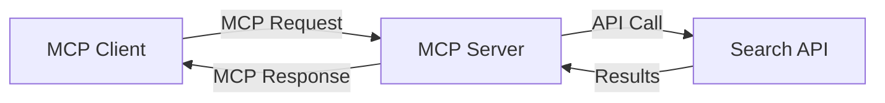
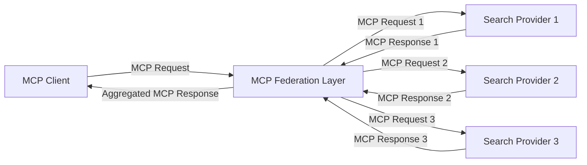
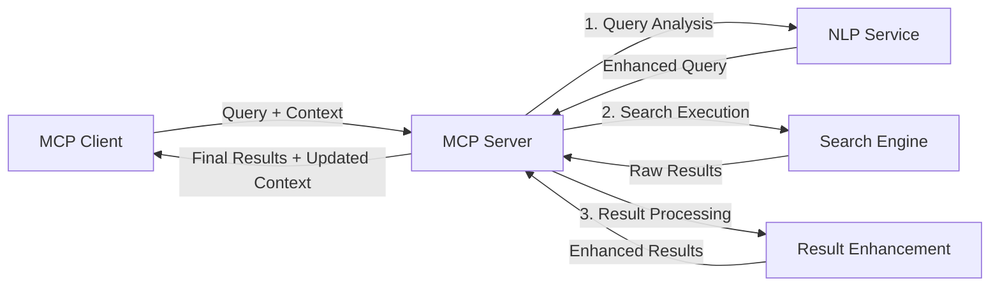

<!--
CO_OP_TRANSLATOR_METADATA:
{
  "original_hash": "333a03e51f90bdf3e6f1ba1694c73f36",
  "translation_date": "2025-07-17T06:29:06+00:00",
  "source_file": "05-AdvancedTopics/mcp-realtimesearch/README.md",
  "language_code": "da"
}
-->
## Ansvarsfraskrivelse for kodeeksempler

> **Vigtig bemærkning**: Kodeeksemplerne nedenfor viser integrationen af Model Context Protocol (MCP) med websøgningsfunktionalitet. Selvom de følger mønstrene og strukturerne i de officielle MCP SDK'er, er de forenklet til undervisningsformål.
> 
> Disse eksempler demonstrerer:
> 
> 1. **Python-implementering**: En FastMCP-server, der tilbyder et websøgningsværktøj og forbinder til en ekstern søge-API. Dette eksempel viser korrekt håndtering af levetid, kontekststyring og værktøjsimplementering efter mønstrene i [den officielle MCP Python SDK](https://github.com/modelcontextprotocol/python-sdk). Serveren bruger den anbefalede Streamable HTTP-transport, som har afløst den ældre SSE-transport til produktionsbrug.
> 
> 2. **JavaScript-implementering**: En TypeScript/JavaScript-implementering, der anvender FastMCP-mønstret fra [den officielle MCP TypeScript SDK](https://github.com/modelcontextprotocol/typescript-sdk) til at oprette en søgeserver med korrekte værktøjsdefinitioner og klientforbindelser. Den følger de nyeste anbefalede mønstre for sessionsstyring og kontekstbevarelse.
> 
> Disse eksempler kræver yderligere fejlhåndtering, autentificering og specifik API-integration for produktionsbrug. De viste søge-API-endpoints (`https://api.search-service.example/search`) er pladsholdere og skal erstattes med faktiske søgetjeneste-endpoints.
> 
> For fuldstændige implementeringsdetaljer og de mest opdaterede metoder henvises til [den officielle MCP-specifikation](https://spec.modelcontextprotocol.io/) og SDK-dokumentationen.

## Kernekoncepter

### Model Context Protocol (MCP) Framework

Grundlæggende tilbyder Model Context Protocol en standardiseret måde for AI-modeller, applikationer og tjenester til at udveksle kontekst. I realtids web-søgning er dette framework essentielt for at skabe sammenhængende, flertrins søgeoplevelser. Nøglekomponenter inkluderer:

1. **Klient-server arkitektur**: MCP etablerer en klar adskillelse mellem søgeklienter (forespørgere) og søgeservere (udbydere), hvilket muliggør fleksible implementeringsmodeller.

2. **JSON-RPC kommunikation**: Protokollen bruger JSON-RPC til beskedudveksling, hvilket gør den kompatibel med webteknologier og nem at implementere på tværs af platforme.

3. **Kontekststyring**: MCP definerer strukturerede metoder til at vedligeholde, opdatere og udnytte søgekontekst på tværs af flere interaktioner.

4. **Værktøjsdefinitioner**: Søgefunktioner eksponeres som standardiserede værktøjer med veldefinerede parametre og returværdier.

5. **Streaming-understøttelse**: Protokollen understøtter streaming af resultater, hvilket er essentielt for realtidsøgning, hvor resultater kan ankomme løbende.

### Integrationsmønstre for web-søgning

Når MCP integreres med web-søgning, opstår flere mønstre:

#### 1. Direkte integration med søgeudbyder

I dette mønster kommunikerer MCP-serveren direkte med en eller flere søge-API’er, oversætter MCP-forespørgsler til API-specifikke kald og formaterer resultaterne som MCP-svar.

#### 2. Fødereret søgning med kontekstbevarelse

Dette mønster fordeler søgeforespørgsler på flere MCP-kompatible søgeudbydere, som hver især kan specialisere sig i forskellige typer indhold eller søgefunktioner, samtidig med at en samlet kontekst bevares.

#### 3. Kontekstberiget søgekæde

Her opdeles søgeprocessen i flere trin, hvor konteksten beriges ved hvert trin, hvilket resulterer i gradvist mere relevante resultater.

### Søgekontekstkomponenter

I MCP-baseret web-søgning inkluderer konteksten typisk:

- **Forespørgselslog**: Tidligere søgeforespørgsler i sessionen
- **Brugerpræferencer**: Sprog, region, sikker søgning-indstillinger
- **Interaktionshistorik**: Hvilke resultater der blev klikket på, tid brugt på resultater
- **Søgeparametre**: Filtre, sorteringsrækkefølge og andre søgemodifikatorer
- **Domæneviden**: Emnespecifik kontekst relevant for søgningen
- **Tidsmæssig kontekst**: Relevans baseret på tid
- **Kildepræferencer**: Foretrukne eller betroede informationskilder

## Anvendelsestilfælde og applikationer

### Forskning og informationsindsamling

MCP forbedrer forskningsarbejdsprocesser ved at:

- Bevare forskningskontekst på tværs af søgesessioner
- Muliggøre mere sofistikerede og kontekstuelle forespørgsler
- Understøtte fødereret søgning på tværs af flere kilder
- Lettere udtræk af viden fra søgeresultater

### Realtidsnyheder og trendovervågning

MCP-drevet søgning giver fordele til nyhedsovervågning:

- Næsten realtidsopdagelse af nye nyhedshistorier
- Kontekstuel filtrering af relevant information
- Sporing af emner og enheder på tværs af flere kilder
- Personlige nyhedsalarmer baseret på brugerens kontekst

### AI-forstærket browsing og forskning

MCP åbner nye muligheder for AI-forstærket browsing:

- Kontekstuelle søgeforslag baseret på aktuel browseraktivitet
- Sømløs integration af web-søgning med LLM-drevne assistenter
- Flertrins søgeforfining med bevaret kontekst
- Forbedret faktatjek og informationsverifikation

## Fremtidige tendenser og innovationer

### Udvikling af MCP i web-søgning

Fremadrettet forventes MCP at udvikle sig til at håndtere:

- **Multimodal søgning**: Integration af tekst-, billede-, lyd- og videosøgning med bevaret kontekst
- **Decentraliseret søgning**: Understøttelse af distribuerede og fødererede søgeøkosystemer
- **Search Privacy**: Kontekstbevidste privatlivsbeskyttende søgemekanismer  
- **Query Understanding**: Dyb semantisk analyse af naturlige sprog søgeforespørgsler  

### Potentielle teknologiske fremskridt  

Fremvoksende teknologier, der vil forme fremtiden for MCP-søgning:  

1. **Neural Search Architectures**: Embedding-baserede søgesystemer optimeret til MCP  
2. **Personalized Search Context**: Læring af individuelle brugeres søgemønstre over tid  
3. **Knowledge Graph Integration**: Kontekstuel søgning forbedret med domænespecifikke vidensgrafer  
4. **Cross-Modal Context**: Opretholdelse af kontekst på tværs af forskellige søgemodaliteter  

## Praktiske øvelser  

### Øvelse 1: Opsætning af en grundlæggende MCP-søgepipeline  

I denne øvelse lærer du at:  
- Konfigurere et grundlæggende MCP-søgemiljø  
- Implementere kontekstbehandlere til websøgning  
- Teste og validere kontekstbevarelse på tværs af søgeiterationer  

### Øvelse 2: Byg en forskningsassistent med MCP-søgning  

Lav en komplet applikation, der:  
- Behandler naturlige sprog forskningsspørgsmål  
- Udfører kontekstbevidste websøgninger  
- Syntetiserer information fra flere kilder  
- Præsenterer organiserede forskningsresultater  

### Øvelse 3: Implementering af multi-kilde søgefederation med MCP  

Avanceret øvelse, der dækker:  
- Kontekstbevidst forespørgselsstyring til flere søgemaskiner  
- Resultatrangering og aggregering  
- Kontekstuel deduplikering af søgeresultater  
- Håndtering af kilde-specifik metadata  

## Yderligere ressourcer  

- [Model Context Protocol Specification](https://spec.modelcontextprotocol.io/) - Officiel MCP-specifikation og detaljeret protokoldokumentation  
- [Model Context Protocol Documentation](https://modelcontextprotocol.io/) - Detaljerede tutorials og implementeringsvejledninger  
- [MCP Python SDK](https://github.com/modelcontextprotocol/python-sdk) - Officiel Python-implementering af MCP-protokollen  
- [MCP TypeScript SDK](https://github.com/modelcontextprotocol/typescript-sdk) - Officiel TypeScript-implementering af MCP-protokollen  
- [MCP Reference Servers](https://github.com/modelcontextprotocol/servers) - Referenceimplementeringer af MCP-servere  
- [Bing Web Search API Documentation](https://learn.microsoft.com/en-us/bing/search-apis/bing-web-search/overview) - Microsofts websøge-API  
- [Google Custom Search JSON API](https://developers.google.com/custom-search/v1/overview) - Googles programmerbare søgemaskine  
- [SerpAPI Documentation](https://serpapi.com/search-api) - API til søgemaskinens resultatside  
- [Meilisearch Documentation](https://www.meilisearch.com/docs) - Open source søgemaskine  
- [Elasticsearch Documentation](https://www.elastic.co/guide/index.html) - Distribueret søge- og analysemotor  
- [LangChain Documentation](https://python.langchain.com/docs/get_started/introduction) - Byg applikationer med LLM’er  

## Læringsmål  

Ved at gennemføre dette modul vil du kunne:  

- Forstå grundprincipperne for realtids websøgning og dens udfordringer  
- Forklare hvordan Model Context Protocol (MCP) forbedrer realtids websøgningsmuligheder  
- Implementere MCP-baserede søgeløsninger ved hjælp af populære frameworks og API’er  
- Designe og implementere skalerbare, højtydende søgearkitekturer med MCP  
- Anvende MCP-koncepter til forskellige anvendelsestilfælde, herunder semantisk søgning, forskningsassistance og AI-forstærket browsing  
- Vurdere nye tendenser og fremtidige innovationer inden for MCP-baserede søgeteknologier  

### Overvejelser om tillid og sikkerhed  

Når du implementerer MCP-baserede websøgninger, skal du huske disse vigtige principper fra MCP-specifikationen:  

1. **User Consent and Control**: Brugere skal eksplicit give samtykke til og forstå alle dataadgange og operationer. Dette er særligt vigtigt for websøgningsimplementeringer, der kan tilgå eksterne datakilder.  

2. **Data Privacy**: Sørg for korrekt håndtering af søgeforespørgsler og resultater, især når de kan indeholde følsomme oplysninger. Implementer passende adgangskontroller for at beskytte brugerdata.  

3. **Tool Safety**: Implementer korrekt autorisation og validering for søgeværktøjer, da de kan udgøre sikkerhedsrisici gennem vilkårlig kodeudførelse. Beskrivelser af værktøjers adfærd bør betragtes som utroværdige, medmindre de stammer fra en betroet server.  

4. **Clear Documentation**: Giv klar dokumentation om kapaciteter, begrænsninger og sikkerhedsovervejelser for din MCP-baserede søgeimplementering, i overensstemmelse med implementeringsvejledningerne i MCP-specifikationen.  

5. **Robust Consent Flows**: Byg robuste samtykke- og autorisationsflows, der tydeligt forklarer, hvad hvert værktøj gør, før det autoriseres, især for værktøjer, der interagerer med eksterne webressourcer.  

For fulde detaljer om MCP-sikkerhed og tillids- og sikkerhedsovervejelser, se den [officielle dokumentation](https://modelcontextprotocol.io/specification/2025-03-26#security-and-trust-%26-safety).  

## Hvad er det næste  

- [5.12 Entra ID Authentication for Model Context Protocol Servers](../mcp-security-entra/README.md)

**Ansvarsfraskrivelse**:  
Dette dokument er blevet oversat ved hjælp af AI-oversættelsestjenesten [Co-op Translator](https://github.com/Azure/co-op-translator). Selvom vi bestræber os på nøjagtighed, bedes du være opmærksom på, at automatiserede oversættelser kan indeholde fejl eller unøjagtigheder. Det oprindelige dokument på dets oprindelige sprog bør betragtes som den autoritative kilde. For kritisk information anbefales professionel menneskelig oversættelse. Vi påtager os intet ansvar for misforståelser eller fejltolkninger, der opstår som følge af brugen af denne oversættelse.