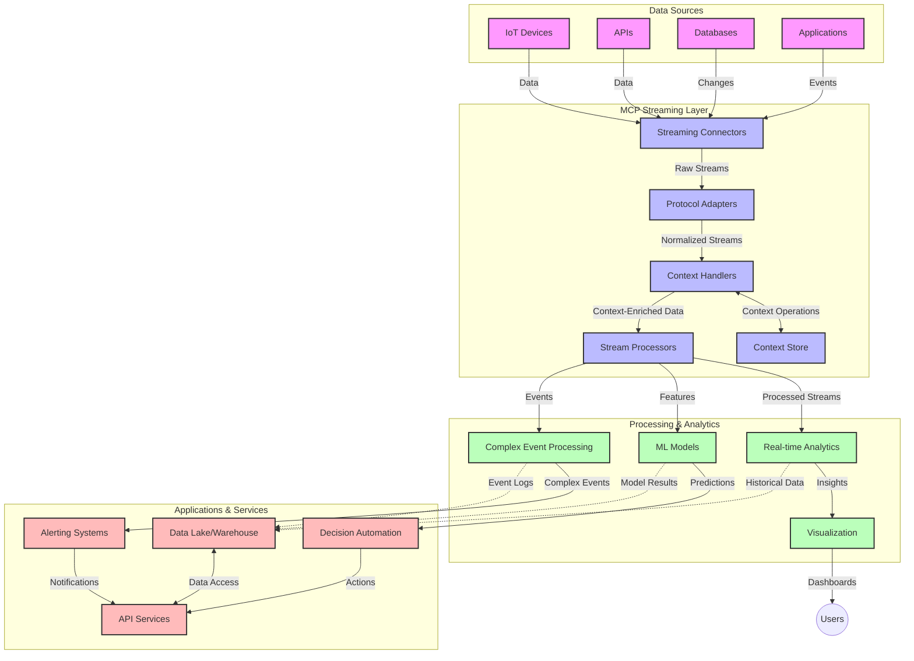

<!--
CO_OP_TRANSLATOR_METADATA:
{
  "original_hash": "195f7287638b77a549acadd96c8f981c",
  "translation_date": "2025-07-14T01:43:06+00:00",
  "source_file": "05-AdvancedTopics/mcp-realtimestreaming/README.md",
  "language_code": "da"
}
-->
# Model Context Protocol for Real-Time Data Streaming

## Oversigt

Real-time data streaming er blevet essentielt i dagens datadrevne verden, hvor virksomheder og applikationer har brug for øjeblikkelig adgang til information for at træffe rettidige beslutninger. Model Context Protocol (MCP) repræsenterer et betydeligt fremskridt i optimeringen af disse realtids-streamingprocesser, forbedrer databehandlingseffektiviteten, opretholder kontekstuel integritet og øger den samlede systemydelse.

Dette modul undersøger, hvordan MCP transformerer realtidsdata-streaming ved at tilbyde en standardiseret tilgang til kontekststyring på tværs af AI-modeller, streamingplatforme og applikationer.

## Introduktion til Real-Time Data Streaming

Real-time data streaming er et teknologisk paradigme, der muliggør kontinuerlig overførsel, behandling og analyse af data, mens de genereres, hvilket gør det muligt for systemer at reagere øjeblikkeligt på ny information. I modsætning til traditionel batchbehandling, der arbejder med statiske datasæt, behandler streaming data i bevægelse og leverer indsigt og handlinger med minimal forsinkelse.

### Kernebegreber i Real-Time Data Streaming:

- **Kontinuerlig Dataflow**: Data behandles som en kontinuerlig, uendelig strøm af begivenheder eller poster.
- **Lav Latens Behandling**: Systemer er designet til at minimere tiden mellem datagenerering og behandling.
- **Skalerbarhed**: Streamingarkitekturer skal kunne håndtere varierende datamængder og hastigheder.
- **Fejltolerance**: Systemer skal være robuste over for fejl for at sikre uafbrudt dataflow.
- **Stateful Behandling**: Opretholdelse af kontekst på tværs af begivenheder er afgørende for meningsfuld analyse.

### Model Context Protocol og Real-Time Streaming

Model Context Protocol (MCP) adresserer flere kritiske udfordringer i realtids-streamingmiljøer:

1. **Kontekstuel Kontinuitet**: MCP standardiserer, hvordan kontekst opretholdes på tværs af distribuerede streamingkomponenter, så AI-modeller og behandlingsnoder har adgang til relevant historisk og miljømæssig kontekst.

2. **Effektiv State Management**: Ved at tilbyde strukturerede mekanismer til konteksttransmission reducerer MCP overhead ved state management i streaming pipelines.

3. **Interoperabilitet**: MCP skaber et fælles sprog for kontekstdeling mellem forskellige streamingteknologier og AI-modeller, hvilket muliggør mere fleksible og udvidelige arkitekturer.

4. **Streaming-Optimeret Kontekst**: MCP-implementeringer kan prioritere, hvilke kontekstelementer der er mest relevante for realtidsbeslutninger, og dermed optimere både ydeevne og nøjagtighed.

5. **Adaptiv Behandling**: Med korrekt kontekststyring gennem MCP kan streaming-systemer dynamisk justere behandlingen baseret på skiftende betingelser og mønstre i data.

I moderne applikationer, fra IoT-sensornetværk til finansielle handelsplatforme, muliggør integrationen af MCP med streamingteknologier mere intelligent, kontekstbevidst behandling, der kan reagere passende på komplekse, udviklende situationer i realtid.

## Læringsmål

Når du er færdig med denne lektion, vil du kunne:

- Forstå grundlæggende principper for real-time data streaming og dets udfordringer
- Forklare, hvordan Model Context Protocol (MCP) forbedrer real-time data streaming
- Implementere MCP-baserede streamingløsninger ved hjælp af populære frameworks som Kafka og Pulsar
- Designe og implementere fejltolerante, højtydende streamingarkitekturer med MCP
- Anvende MCP-koncepter til IoT, finansiel handel og AI-drevne analysetilfælde
- Vurdere nye tendenser og fremtidige innovationer inden for MCP-baserede streamingteknologier

### Definition og Betydning

Real-time data streaming involverer kontinuerlig generering, behandling og levering af data med minimal forsinkelse. I modsætning til batchbehandling, hvor data indsamles og behandles i grupper, behandles streamingdata inkrementelt, efterhånden som de ankommer, hvilket muliggør øjeblikkelig indsigt og handling.

Nøglekarakteristika ved real-time data streaming inkluderer:

- **Lav Latens**: Behandling og analyse af data inden for millisekunder til sekunder
- **Kontinuerlig Flow**: Uafbrudte datastrømme fra forskellige kilder
- **Øjeblikkelig Behandling**: Analyse af data, mens de ankommer, frem for i batches
- **Event-Drevet Arkitektur**: Reagerer på begivenheder, når de opstår

### Udfordringer i Traditionel Data Streaming

Traditionelle tilgange til data streaming står over for flere begrænsninger:

1. **Kontekstab**: Vanskeligheder med at opretholde kontekst på tværs af distribuerede systemer
2. **Skalerbarhedsproblemer**: Udfordringer med at skalere til at håndtere store mængder og høj hastighed af data
3. **Integrationskompleksitet**: Problemer med interoperabilitet mellem forskellige systemer
4. **Latensstyring**: Balancering mellem gennemløb og behandlingstid
5. **Datakonsistens**: Sikring af datanøjagtighed og fuldstændighed på tværs af strømmen

## Forståelse af Model Context Protocol (MCP)

### Hvad er MCP?

Model Context Protocol (MCP) er en standardiseret kommunikationsprotokol designet til at lette effektiv interaktion mellem AI-modeller og applikationer. I forbindelse med real-time data streaming tilbyder MCP en ramme for:

- At bevare kontekst gennem hele datapipelinen
- At standardisere dataudvekslingsformater
- At optimere transmissionen af store datasæt
- At forbedre model-til-model og model-til-applikations kommunikation

### Kernekomponenter og Arkitektur

MCP-arkitekturen for real-time streaming består af flere nøglekomponenter:

1. **Context Handlers**: Håndterer og opretholder kontekstuel information gennem streamingpipelinjen
2. **Stream Processors**: Behandler indkommende datastrømme ved hjælp af kontekstbevidste teknikker
3. **Protocol Adapters**: Konverterer mellem forskellige streamingprotokoller samtidig med at konteksten bevares
4. **Context Store**: Effektiv lagring og hentning af kontekstuel information
5. **Streaming Connectors**: Forbinder til forskellige streamingplatforme (Kafka, Pulsar, Kinesis osv.)



### Hvordan MCP Forbedrer Real-Time Datahåndtering

MCP løser traditionelle streamingudfordringer gennem:

- **Kontekstuel Integritet**: Opretholder relationer mellem datapunkter gennem hele pipelinen
- **Optimeret Transmission**: Reducerer redundans i dataudveksling via intelligent kontekststyring
- **Standardiserede Interfaces**: Tilbyder konsistente API’er til streamingkomponenter
- **Reduceret Latens**: Minimerer behandlingsomkostninger gennem effektiv kontekstbehandling
- **Forbedret Skalerbarhed**: Understøtter horisontal skalering samtidig med at konteksten bevares

## Integration og Implementering

Real-time data streaming-systemer kræver omhyggeligt arkitektonisk design og implementering for at opretholde både ydeevne og kontekstuel integritet. Model Context Protocol tilbyder en standardiseret tilgang til integration af AI-modeller og streamingteknologier, hvilket muliggør mere avancerede, kontekstbevidste behandlingspipelines.

### Oversigt over MCP-Integration i Streamingarkitekturer

Implementering af MCP i real-time streamingmiljøer involverer flere nøgleovervejelser:

1. **Kontekst-Serialisering og Transport**: MCP tilbyder effektive mekanismer til kodning af kontekstuel information inden for streamingdatapakker, hvilket sikrer, at essentiel kontekst følger data gennem hele behandlingspipelinjen. Dette inkluderer standardiserede serialiseringsformater optimeret til streamingtransport.

2. **Stateful Stream Processing**: MCP muliggør mere intelligent stateful behandling ved at opretholde en konsistent kontekstrepræsentation på tværs af behandlingsnoder. Dette er særligt værdifuldt i distribuerede streamingarkitekturer, hvor state management traditionelt er udfordrende.

3. **Event-Tid vs. Behandlingstid**: MCP-implementeringer i streaming-systemer skal håndtere den almindelige udfordring med at skelne mellem, hvornår begivenheder fandt sted, og hvornår de behandles. Protokollen kan inkorporere tidsmæssig kontekst, der bevarer event-tid-semantik.

4. **Backpressure Management**: Ved at standardisere kontekststyring hjælper MCP med at håndtere backpressure i streaming-systemer, så komponenter kan kommunikere deres behandlingskapacitet og justere flowet derefter.

5. **Kontekstvinduer og Aggregation**: MCP muliggør mere avancerede vinduesoperationer ved at tilbyde strukturerede repræsentationer af tidsmæssige og relationelle kontekster, hvilket muliggør mere meningsfulde aggregationer på tværs af begivenhedsstrømme.

6. **Exactly-Once Processing**: I streaming-systemer, der kræver exactly-once-semantik, kan MCP inkorporere behandlingsmetadata for at hjælpe med at spore og verificere behandlingsstatus på tværs af distribuerede komponenter.

Implementeringen af MCP på tværs af forskellige streamingteknologier skaber en ensartet tilgang til kontekststyring, reducerer behovet for specialtilpasset integrationskode og forbedrer systemets evne til at bevare meningsfuld kontekst, mens data flyder gennem pipelinen.

### MCP i Forskellige Data Streaming Frameworks

Disse eksempler følger den nuværende MCP-specifikation, som fokuserer på en JSON-RPC-baseret protokol med forskellige transportmekanismer. Koden demonstrerer, hvordan du kan implementere brugerdefinerede transports, der integrerer streamingplatforme som Kafka og Pulsar, samtidig med at fuld kompatibilitet med MCP-protokollen bevares.

Eksemplerne er designet til at vise, hvordan streamingplatforme kan integreres med MCP for at levere realtidsdatabehandling, samtidig med at den kontekstuelle bevidsthed, som er central for MCP, bevares. Denne tilgang sikrer, at kodeeksemplerne nøjagtigt afspejler den aktuelle tilstand af MCP-specifikationen pr. juni 2025.

MCP kan integreres med populære streamingframeworks, herunder:

#### Apache Kafka Integration

```python
import asyncio
import json
from typing import Dict, Any, Optional
from confluent_kafka import Consumer, Producer, KafkaError
from mcp.client import Client, ClientCapabilities
from mcp.core.message import JsonRpcMessage
from mcp.core.transports import Transport

# Custom transport class to bridge MCP with Kafka
class KafkaMCPTransport(Transport):
    def __init__(self, bootstrap_servers: str, input_topic: str, output_topic: str):
        self.bootstrap_servers = bootstrap_servers
        self.input_topic = input_topic
        self.output_topic = output_topic
        self.producer = Producer({'bootstrap.servers': bootstrap_servers})
        self.consumer = Consumer({
            'bootstrap.servers': bootstrap_servers,
            'group.id': 'mcp-client-group',
            'auto.offset.reset': 'earliest'
        })
        self.message_queue = asyncio.Queue()
        self.running = False
        self.consumer_task = None
        
    async def connect(self):
        """Connect to Kafka and start consuming messages"""
        self.consumer.subscribe([self.input_topic])
        self.running = True
        self.consumer_task = asyncio.create_task(self._consume_messages())
        return self
        
    async def _consume_messages(self):
        """Background task to consume messages from Kafka and queue them for processing"""
        while self.running:
            try:
                msg = self.consumer.poll(1.0)
                if msg is None:
                    await asyncio.sleep(0.1)
                    continue
                
                if msg.error():
                    if msg.error().code() == KafkaError._PARTITION_EOF:
                        continue
                    print(f"Consumer error: {msg.error()}")
                    continue
                
                # Parse the message value as JSON-RPC
                try:
                    message_str = msg.value().decode('utf-8')
                    message_data = json.loads(message_str)
                    mcp_message = JsonRpcMessage.from_dict(message_data)
                    await self.message_queue.put(mcp_message)
                except Exception as e:
                    print(f"Error parsing message: {e}")
            except Exception as e:
                print(f"Error in consumer loop: {e}")
                await asyncio.sleep(1)
    
    async def read(self) -> Optional[JsonRpcMessage]:
        """Read the next message from the queue"""
        try:
            message = await self.message_queue.get()
            return message
        except Exception as e:
            print(f"Error reading message: {e}")
            return None
    
    async def write(self, message: JsonRpcMessage) -> None:
        """Write a message to the Kafka output topic"""
        try:
            message_json = json.dumps(message.to_dict())
            self.producer.produce(
                self.output_topic,
                message_json.encode('utf-8'),
                callback=self._delivery_report
            )
            self.producer.poll(0)  # Trigger callbacks
        except Exception as e:
            print(f"Error writing message: {e}")
    
    def _delivery_report(self, err, msg):
        """Kafka producer delivery callback"""
        if err is not None:
            print(f'Message delivery failed: {err}')
        else:
            print(f'Message delivered to {msg.topic()} [{msg.partition()}]')
    
    async def close(self) -> None:
        """Close the transport"""
        self.running = False
        if self.consumer_task:
            self.consumer_task.cancel()
            try:
                await self.consumer_task
            except asyncio.CancelledError:
                pass
        self.consumer.close()
        self.producer.flush()

# Example usage of the Kafka MCP transport
async def kafka_mcp_example():
    # Create MCP client with Kafka transport
    client = Client(
        {"name": "kafka-mcp-client", "version": "1.0.0"},
        ClientCapabilities({})
    )
    
    # Create and connect the Kafka transport
    transport = KafkaMCPTransport(
        bootstrap_servers="localhost:9092",
        input_topic="mcp-responses",
        output_topic="mcp-requests"
    )
    
    await client.connect(transport)
    
    try:
        # Initialize the MCP session
        await client.initialize()
        
        # Example of executing a tool via MCP
        response = await client.execute_tool(
            "process_data",
            {
                "data": "sample data",
                "metadata": {
                    "source": "sensor-1",
                    "timestamp": "2025-06-12T10:30:00Z"
                }
            }
        )
        
        print(f"Tool execution response: {response}")
        
        # Clean shutdown
        await client.shutdown()
    finally:
        await transport.close()

# Run the example
if __name__ == "__main__":
    asyncio.run(kafka_mcp_example())
```

#### Apache Pulsar Implementation

```python
import asyncio
import json
import pulsar
from typing import Dict, Any, Optional
from mcp.core.message import JsonRpcMessage
from mcp.core.transports import Transport
from mcp.server import Server, ServerOptions
from mcp.server.tools import Tool, ToolExecutionContext, ToolMetadata

# Create a custom MCP transport that uses Pulsar
class PulsarMCPTransport(Transport):
    def __init__(self, service_url: str, request_topic: str, response_topic: str):
        self.service_url = service_url
        self.request_topic = request_topic
        self.response_topic = response_topic
        self.client = pulsar.Client(service_url)
        self.producer = self.client.create_producer(response_topic)
        self.consumer = self.client.subscribe(
            request_topic,
            "mcp-server-subscription",
            consumer_type=pulsar.ConsumerType.Shared
        )
        self.message_queue = asyncio.Queue()
        self.running = False
        self.consumer_task = None
    
    async def connect(self):
        """Connect to Pulsar and start consuming messages"""
        self.running = True
        self.consumer_task = asyncio.create_task(self._consume_messages())
        return self
    
    async def _consume_messages(self):
        """Background task to consume messages from Pulsar and queue them for processing"""
        while self.running:
            try:
                # Non-blocking receive with timeout
                msg = self.consumer.receive(timeout_millis=500)
                
                # Process the message
                try:
                    message_str = msg.data().decode('utf-8')
                    message_data = json.loads(message_str)
                    mcp_message = JsonRpcMessage.from_dict(message_data)
                    await self.message_queue.put(mcp_message)
                    
                    # Acknowledge the message
                    self.consumer.acknowledge(msg)
                except Exception as e:
                    print(f"Error processing message: {e}")
                    # Negative acknowledge if there was an error
                    self.consumer.negative_acknowledge(msg)
            except Exception as e:
                # Handle timeout or other exceptions
                await asyncio.sleep(0.1)
    
    async def read(self) -> Optional[JsonRpcMessage]:
        """Read the next message from the queue"""
        try:
            message = await self.message_queue.get()
            return message
        except Exception as e:
            print(f"Error reading message: {e}")
            return None
    
    async def write(self, message: JsonRpcMessage) -> None:
        """Write a message to the Pulsar output topic"""
        try:
            message_json = json.dumps(message.to_dict())
            self.producer.send(message_json.encode('utf-8'))
        except Exception as e:
            print(f"Error writing message: {e}")
    
    async def close(self) -> None:
        """Close the transport"""
        self.running = False
        if self.consumer_task:
            self.consumer_task.cancel()
            try:
                await self.consumer_task
            except asyncio.CancelledError:
                pass
        self.consumer.close()
        self.producer.close()
        self.client.close()

# Define a sample MCP tool that processes streaming data
@Tool(
    name="process_streaming_data",
    description="Process streaming data with context preservation",
    metadata=ToolMetadata(
        required_capabilities=["streaming"]
    )
)
async def process_streaming_data(
    ctx: ToolExecutionContext,
    data: str,
    source: str,
    priority: str = "medium"
) -> Dict[str, Any]:
    """
    Process streaming data while preserving context
    
    Args:
        ctx: Tool execution context
        data: The data to process
        source: The source of the data
        priority: Priority level (low, medium, high)
        
    Returns:
        Dict containing processed results and context information
    """
    # Example processing that leverages MCP context
    print(f"Processing data from {source} with priority {priority}")
    
    # Access conversation context from MCP
    conversation_id = ctx.conversation_id if hasattr(ctx, 'conversation_id') else "unknown"
    
    # Return results with enhanced context
    return {
        "processed_data": f"Processed: {data}",
        "context": {
            "conversation_id": conversation_id,
            "source": source,
            "priority": priority,
            "processing_timestamp": ctx.get_current_time_iso()
        }
    }

# Example MCP server implementation using Pulsar transport
async def run_mcp_server_with_pulsar():
    # Create MCP server
    server = Server(
        {"name": "pulsar-mcp-server", "version": "1.0.0"},
        ServerOptions(
            capabilities={"streaming": True}
        )
    )
    
    # Register our tool
    server.register_tool(process_streaming_data)
    
    # Create and connect Pulsar transport
    transport = PulsarMCPTransport(
        service_url="pulsar://localhost:6650",
        request_topic="mcp-requests",
        response_topic="mcp-responses"
    )
    
    try:
        # Start the server with the Pulsar transport
        await server.run(transport)
    finally:
        await transport.close()

# Run the server
if __name__ == "__main__":
    asyncio.run(run_mcp_server_with_pulsar())
```

### Bedste Praksis for Implementering

Når du implementerer MCP til real-time streaming:

1. **Design for Fejltolerance**:
   - Implementer korrekt fejlhåndtering
   - Brug dead-letter queues til fejlede beskeder
   - Design idempotente processorer

2. **Optimer for Ydeevne**:
   - Konfigurer passende bufferstørrelser
   - Brug batching, hvor det er relevant
   - Implementer backpressure-mekanismer

3. **Overvåg og Observer**:
   - Følg stream-behandlingsmetrikker
   - Overvåg kontekstpropagering
   - Opsæt alarmer for anomalier

4. **Sikre Dine Streams**:
   - Implementer kryptering for følsomme data
   - Brug autentificering og autorisation
   - Anvend passende adgangskontrol

### MCP i IoT og Edge Computing

MCP forbedrer IoT-streaming ved at:

- Bevare enheds-kontekst gennem behandlingspipelinjen
- Muliggøre effektiv edge-til-cloud data streaming
- Understøtte realtidsanalyse af IoT-datastrømme
- Facilitere enhed-til-enhed kommunikation med kontekst

Eksempel: Smart City Sensor Networks  
```
Sensors → Edge Gateways → MCP Stream Processors → Real-time Analytics → Automated Responses
```

### Rolle i Finansielle Transaktioner og High-Frequency Trading

MCP giver betydelige fordele for finansiel data streaming:

- Ultra-lav latens behandling til handelsbeslutninger
- Opretholdelse af transaktionskontekst gennem hele behandlingen
- Understøttelse af kompleks eventbehandling med kontekstbevidsthed
- Sikring af datakonsistens på tværs af distribuerede handelssystemer

### Forbedring af AI-Drevne Dataanalyser

MCP åbner nye muligheder for streaminganalyse:

- Real-time modeltræning og inferens
- Kontinuerlig læring fra streamingdata
- Kontekstbevidst feature-ekstraktion
- Multi-model inferenspipelines med bevaret kontekst

## Fremtidige Tendenser og Innovationer

### Udvikling af MCP i Real-Time Miljøer

Fremadrettet forventer vi, at MCP udvikler sig til at adressere:

- **Quantum Computing Integration**: Forberedelse til kvantebaserede streaming-systemer
- **Edge-Native Behandling**: Flytning af mere kontekstbevidst behandling til edge-enheder
- **Autonom Stream Management**: Selvoptimerende streamingpipelines
- **Federated Streaming**: Distribueret behandling med bevaret privatliv

### Potentielle Teknologiske Fremskridt

Nye teknologier, der vil forme fremtiden for MCP-streaming:

1. **AI-Optimerede Streamingprotokoller**: Specialdesignede protokoller til AI-arbejdsbelastninger
2. **Neuromorphic Computing Integration**: Hjerneinspireret computing til streambehandling
3. **Serverless Streaming**: Event-drevet, skalerbar streaming uden infrastrukturstyring
4. **Distribuerede Context Stores**: Globalt distribueret, men højt konsistent kontekststyring

## Praktiske Øvelser

### Øvelse 1: Opsætning af en Grundlæggende MCP Streaming Pipeline

I denne øvelse lærer du at:  
- Konfigurere et grundlæggende MCP streamingmiljø  
- Implementere context handlers til streambehandling  
- Teste og validere kontekstbevarelse

### Øvelse 2: Bygning af et Real-Time Analytics Dashboard

Skab en komplet applikation, der:  
- Indtager streamingdata ved hjælp af MCP  
- Behandler strømmen samtidig med at konteksten bevares  
- Visualiserer resultater i realtid

### Øvelse 3: Implementering af Kompleks Eventbehandling med MCP

Avanceret øvelse, der dækker:  
- Mønstergenkendelse i streams  
- Kontekstuel korrelation på tværs af flere streams  
- Generering af komplekse begivenheder med bevaret kontekst

## Yderligere Ressourcer

- [Model Context Protocol Specification](https://github.com/modelcontextprotocol) - Officiel MCP-specifikation og dokumentation  
- [Apache Kafka Documentation](https://kafka.apache.org/documentation/) - Lær om Kafka til streambehandling  
- [Apache Pulsar](https://pulsar.apache.org/) - Unified messaging og streamingplatform  
- [Streaming Systems: The What, Where, When, and How of Large-Scale Data Processing](https://www.oreilly.com/library/view/streaming-systems/9781491983867/) - Omfattende bog om streamingarkitekturer  
- [Microsoft Azure Event Hubs](https://learn.microsoft.com/azure/event-hubs/event-hubs-about) - Administreret event streaming service  
- [MLflow Documentation](https://mlflow.org/docs/latest/index.html) - Til ML-modelsporing og implementering  
- [Real-Time Analytics with Apache Storm](https://storm.apache.org/releases/current/index.html) - Behandlingsframework til realtidsberegning  
- [Flink ML](https://nightlies.apache.org/flink/flink-ml-docs-master/) - Maskinlæringsbibliotek til Apache Flink  
- [LangChain Documentation](https://python.langchain.com/docs/get_started/introduction) - Byg applikationer med LLMs

## Læringsudbytte

Ved at gennemføre dette modul vil du kunne:

- Forstå grundlæggende principper for real-time data streaming og dets udfordringer  
- Forklare, hvordan Model Context Protocol (MCP) forbedrer real-time data streaming  
- Implementere MCP-baserede streamingløsninger ved hjælp af populære frameworks som Kafka og Pulsar  
- Designe og implementere fejltolerante, højtydende streamingarkitekturer med MCP  
- Anvende MCP-koncepter til IoT, finansiel handel og AI-drevne analysetilfælde  
- Vurdere nye tendenser og fremtidige innovationer inden for MCP-baserede streamingteknologier

## Hvad er det næste

- [5.11 Realtime Search](../mcp-realtimesearch/README.md)

**Ansvarsfraskrivelse**:  
Dette dokument er blevet oversat ved hjælp af AI-oversættelsestjenesten [Co-op Translator](https://github.com/Azure/co-op-translator). Selvom vi bestræber os på nøjagtighed, bedes du være opmærksom på, at automatiserede oversættelser kan indeholde fejl eller unøjagtigheder. Det oprindelige dokument på dets oprindelige sprog bør betragtes som den autoritative kilde. For kritisk information anbefales professionel menneskelig oversættelse. Vi påtager os intet ansvar for misforståelser eller fejltolkninger, der opstår som følge af brugen af denne oversættelse.