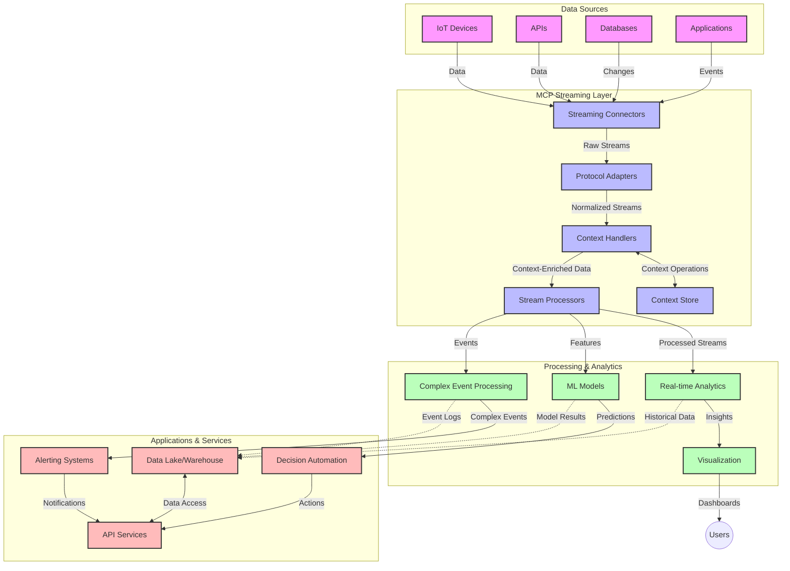

<!--
CO_OP_TRANSLATOR_METADATA:
{
  "original_hash": "68c518dbff8a3b127ed2aa934054c56c",
  "translation_date": "2025-06-11T17:19:14+00:00",
  "source_file": "05-AdvancedTopics/mcp-realtimestreaming/README.md",
  "language_code": "da"
}
-->
# Model Context Protocol for Real-Time Data Streaming

## Oversigt

Real-time data streaming er blevet essentielt i dagens datadrevne verden, hvor virksomheder og applikationer har brug for øjeblikkelig adgang til information for at træffe rettidige beslutninger. Model Context Protocol (MCP) repræsenterer et væsentligt fremskridt i optimeringen af disse realtidsstreaming-processer ved at forbedre datahåndteringens effektivitet, bevare kontekstuel integritet og øge den samlede systemydelse.

Dette modul undersøger, hvordan MCP transformerer realtidsdata-streaming ved at tilbyde en standardiseret tilgang til kontekststyring på tværs af AI-modeller, streamingplatforme og applikationer.

## Introduktion til Real-Time Data Streaming

Real-time data streaming er et teknologisk paradigme, der muliggør kontinuerlig overførsel, behandling og analyse af data, mens de genereres, hvilket gør det muligt for systemer at reagere øjeblikkeligt på ny information. I modsætning til traditionel batchbehandling, der arbejder med statiske datasæt, behandler streaming data i bevægelse og leverer indsigt og handlinger med minimal forsinkelse.

### Centrale Begreber i Real-Time Data Streaming:

- **Kontinuerlig Dataflow**: Data behandles som en uafbrudt, aldrig afsluttet strøm af hændelser eller poster.
- **Lav Latens Behandling**: Systemer er designet til at minimere tiden mellem datagenerering og behandling.
- **Skalerbarhed**: Streamingarkitekturer skal kunne håndtere variable datamængder og hastigheder.
- **Fejltolerance**: Systemer skal være robuste over for fejl for at sikre uafbrudt dataflow.
- **Stateful Behandling**: At bevare konteksten på tværs af hændelser er afgørende for meningsfuld analyse.

### Model Context Protocol og Real-Time Streaming

Model Context Protocol (MCP) adresserer flere væsentlige udfordringer i realtids-streaming-miljøer:

1. **Kontekstuelt Sammenhæng**: MCP standardiserer, hvordan kontekst bevares på tværs af distribuerede streamingkomponenter, så AI-modeller og behandlingsnoder har adgang til relevant historisk og miljømæssig kontekst.

2. **Effektiv State Management**: Ved at tilbyde strukturerede mekanismer til kontekstoverførsel reducerer MCP overhead ved state management i streaming pipelines.

3. **Interoperabilitet**: MCP skaber et fælles sprog til kontekstdeling mellem forskellige streamingteknologier og AI-modeller, hvilket muliggør mere fleksible og udvidelige arkitekturer.

4. **Streaming-Optimeret Kontekst**: MCP-implementeringer kan prioritere, hvilke kontekstelementer der er mest relevante for realtidsbeslutninger, og dermed optimere både ydeevne og nøjagtighed.

5. **Adaptiv Behandling**: Med korrekt kontekststyring via MCP kan streaming-systemer dynamisk justere behandlingen baseret på skiftende betingelser og mønstre i data.

I moderne applikationer, lige fra IoT-sensornetværk til finansielle handelsplatforme, muliggør integrationen af MCP med streamingteknologier mere intelligent, kontekstbevidst behandling, der kan reagere passende på komplekse, udviklende situationer i realtid.

## Læringsmål

Ved slutningen af denne lektion vil du kunne:

- Forstå grundlæggende principper for real-time data streaming og dets udfordringer
- Forklare, hvordan Model Context Protocol (MCP) forbedrer real-time data streaming
- Implementere MCP-baserede streamingløsninger ved hjælp af populære frameworks som Kafka og Pulsar
- Designe og implementere fejltolerante, højtydende streamingarkitekturer med MCP
- Anvende MCP-koncepter på IoT, finansiel handel og AI-drevne analysetilfælde
- Vurdere nye tendenser og fremtidige innovationer inden for MCP-baserede streamingteknologier

### Definition og Betydning

Real-time data streaming involverer kontinuerlig generering, behandling og levering af data med minimal forsinkelse. I modsætning til batchbehandling, hvor data indsamles og behandles i grupper, behandles streamingdata inkrementelt, efterhånden som de ankommer, hvilket muliggør øjeblikkelig indsigt og handling.

Vigtige karakteristika ved real-time data streaming inkluderer:

- **Lav Latens**: Behandling og analyse af data inden for millisekunder til sekunder
- **Kontinuerlig Flow**: Uafbrudte datastrømme fra forskellige kilder
- **Øjeblikkelig Behandling**: Analyse af data, efterhånden som de ankommer, i stedet for i batches
- **Event-Drevet Arkitektur**: Reagerer på hændelser, når de sker

### Udfordringer i Traditionel Data Streaming

Traditionelle streamingmetoder står over for flere begrænsninger:

1. **Kontekstab**: Vanskeligheder med at bevare kontekst på tværs af distribuerede systemer
2. **Skaleringsproblemer**: Udfordringer med at håndtere store mængder og høje hastigheder af data
3. **Integrationskompleksitet**: Problemer med interoperabilitet mellem forskellige systemer
4. **Latensstyring**: Balancering mellem gennemløb og behandlingstid
5. **Datakonsistens**: Sikring af datanøjagtighed og fuldstændighed på tværs af strømmen

## Forståelse af Model Context Protocol (MCP)

### Hvad er MCP?

Model Context Protocol (MCP) er en standardiseret kommunikationsprotokol designet til at lette effektiv interaktion mellem AI-modeller og applikationer. I forbindelse med real-time data streaming tilbyder MCP en ramme for:

- At bevare kontekst gennem hele datapipelinen
- At standardisere dataudvekslingsformater
- At optimere overførsel af store datasæt
- At forbedre kommunikation model-til-model og model-til-applikation

### Kernekomponenter og Arkitektur

MCP-arkitektur til real-time streaming består af flere nøglekomponenter:

1. **Context Handlers**: Håndterer og vedligeholder kontekstuel information gennem streamingpipelinens forløb
2. **Stream Processors**: Behandler indkommende datastrømme ved hjælp af kontekstbevidste teknikker
3. **Protocol Adapters**: Konverterer mellem forskellige streamingprotokoller, mens konteksten bevares
4. **Context Store**: Effektivt lager til lagring og hentning af kontekstuel information
5. **Streaming Connectors**: Forbinder til forskellige streamingplatforme (Kafka, Pulsar, Kinesis osv.)



### Hvordan MCP Forbedrer Real-Time Datahåndtering

MCP adresserer traditionelle streamingudfordringer gennem:

- **Kontekstuel Integritet**: Bevarer relationer mellem datapunkter gennem hele pipelinen
- **Optimeret Overførsel**: Reducerer redundans i dataudveksling via intelligent kontekststyring
- **Standardiserede Interfaces**: Tilbyder konsistente API’er til streamingkomponenter
- **Reduceret Latens**: Minimerer behandlingsomkostninger via effektiv kontekststyring
- **Forbedret Skalerbarhed**: Understøtter horisontal skalering uden tab af kontekst

## Integration og Implementering

Real-time data streaming-systemer kræver omhyggeligt arkitektonisk design og implementering for at bevare både ydeevne og kontekstuel integritet. Model Context Protocol tilbyder en standardiseret tilgang til integration af AI-modeller og streamingteknologier, hvilket muliggør mere sofistikerede, kontekstbevidste behandlingspipelines.

### Oversigt over MCP Integration i Streamingarkitekturer

Implementering af MCP i real-time streamingmiljøer involverer flere centrale overvejelser:

1. **Kontekst-Serialisering og Transport**: MCP tilbyder effektive mekanismer til kodning af kontekstuel information i streamingdatapakker, så væsentlig kontekst følger data gennem hele behandlingspipelinens forløb. Dette inkluderer standardiserede serialiseringsformater optimeret til streamingtransport.

2. **Stateful Stream Processing**: MCP muliggør mere intelligent stateful behandling ved at bevare konsistent kontekstrepræsentation på tværs af behandlingsnoder. Dette er særligt værdifuldt i distribuerede streamingarkitekturer, hvor state management traditionelt er udfordrende.

3. **Event-Time vs. Processing-Time**: MCP-implementeringer i streaming-systemer skal håndtere den almindelige udfordring med at skelne mellem, hvornår hændelser fandt sted, og hvornår de behandles. Protokollen kan indarbejde tidsmæssig kontekst, der bevarer event-time-semantik.

4. **Backpressure Management**: Ved at standardisere kontekststyring hjælper MCP med at håndtere backpressure i streaming-systemer, så komponenter kan kommunikere deres behandlingskapacitet og justere flowet efter behov.

5. **Kontekstvinduer og Aggregation**: MCP muliggør mere avancerede vinduesoperationer ved at tilbyde strukturerede repræsentationer af tidsmæssige og relationelle kontekster, hvilket giver mere meningsfulde aggregationer på tværs af hændelsesstrømme.

6. **Exactly-Once Behandling**: I streaming-systemer, der kræver exactly-once-semantik, kan MCP indarbejde behandlingsmetadata for at hjælpe med at spore og verificere behandlingsstatus på tværs af distribuerede komponenter.

Implementeringen af MCP på tværs af forskellige streamingteknologier skaber en ensartet tilgang til kontekststyring, reducerer behovet for specialtilpasset integrationskode og forbedrer systemets evne til at bevare meningsfuld kontekst, mens data strømmer gennem pipelinen.

### MCP i Forskellige Data Streaming Frameworks

MCP kan integreres med populære streamingframeworks, herunder:

#### Apache Kafka Integration

```python
from mcp_streaming import MCPKafkaConnector

# Initialize MCP Kafka connector
connector = MCPKafkaConnector(
    bootstrap_servers='localhost:9092',
    context_preservation=True
)

# Create a context-aware consumer
consumer = connector.create_consumer('input-topic')

# Process streaming data with context
for message in consumer:
    context = message.get_context()
    data = message.get_value()
    
    # Process with context awareness
    result = process_with_context(data, context)
    
    # Produce output with preserved context
    connector.produce('output-topic', result, context=context)
```

#### Apache Pulsar Implementering

```python
from mcp_streaming import MCPPulsarClient

# Initialize MCP Pulsar client
client = MCPPulsarClient('pulsar://localhost:6650')

# Subscribe with context awareness
consumer = client.subscribe('input-topic', 'subscription-name', 
                           context_enabled=True)

# Process messages with context preservation
while True:
    message = consumer.receive()
    context = message.get_context()
    
    # Process with context
    result = process_with_context(message.data(), context)
    
    # Acknowledge the message
    consumer.acknowledge(message)
    
    # Send result with preserved context
    producer = client.create_producer('output-topic')
    producer.send(result, context=context)
```

### Bedste Praksis for Udrulning

Når MCP implementeres til real-time streaming:

1. **Design for Fejltolerance**:
   - Implementer korrekt fejlhåndtering
   - Brug dead-letter køer til fejlede beskeder
   - Design idempotente processorer

2. **Optimer for Ydeevne**:
   - Konfigurer passende bufferstørrelser
   - Brug batching, hvor det er relevant
   - Implementer backpressure-mekanismer

3. **Overvåg og Observer**:
   - Spor streamingprocesseringsmetrikker
   - Overvåg kontekstpropagering
   - Opsæt alarmer for afvigelser

4. **Sikre Dine Streams**:
   - Implementer kryptering for følsomme data
   - Brug autentificering og autorisation
   - Anvend passende adgangskontrol

### MCP i IoT og Edge Computing

MCP forbedrer IoT-streaming ved at:

- Bevare enheds-kontekst gennem behandlingspipelinens forløb
- Muliggøre effektiv edge-til-cloud data streaming
- Understøtte realtidsanalyse af IoT-datastrømme
- Faciliterer enhed-til-enhed kommunikation med kontekst

Eksempel: Smart City Sensor Networks  
```
Sensors → Edge Gateways → MCP Stream Processors → Real-time Analytics → Automated Responses
```

### Rolle i Finansielle Transaktioner og High-Frequency Trading

MCP giver betydelige fordele for finansiel data streaming:

- Ultra-lav latens behandling til handelsbeslutninger
- Bevarelse af transaktionskontekst gennem hele behandlingen
- Understøtte kompleks hændelsesbehandling med kontekstbevidsthed
- Sikre datakonsistens på tværs af distribuerede handelssystemer

### Forbedring af AI-Drevet Dataanalyse

MCP åbner nye muligheder for streaminganalyse:

- Realtidstræning og inferens af modeller
- Kontinuerlig læring fra streamingdata
- Kontekstbevidst feature-ekstraktion
- Multi-model inferenspipelines med bevaret kontekst

## Fremtidige Tendenser og Innovationer

### Udvikling af MCP i Real-Time Miljøer

Fremadrettet forventes MCP at udvikle sig til at adressere:

- **Quantum Computing Integration**: Forberedelse til kvantebaserede streamingsystemer
- **Edge-Native Behandling**: Flytte mere kontekstbevidst behandling til edge-enheder
- **Autonom Stream Management**: Selvoptimerende streamingpipelines
- **Federated Streaming**: Distribueret behandling med bevarelse af privatliv

### Potentielle Teknologiske Fremskridt

Nye teknologier, der vil forme fremtiden for MCP-streaming:

1. **AI-Optimerede Streamingprotokoller**: Specialdesignede protokoller til AI-arbejdsmængder
2. **Neuromorf Computing Integration**: Hjerneinspireret computing til streambehandling
3. **Serverless Streaming**: Event-drevet, skalerbar streaming uden infrastrukturadministration
4. **Distribuerede Context Stores**: Globalt distribueret, men stærkt konsistent kontekststyring

## Praktiske Øvelser

### Øvelse 1: Opsætning af en Grundlæggende MCP Streaming Pipeline

I denne øvelse lærer du at:  
- Konfigurere et grundlæggende MCP streamingmiljø  
- Implementere context handlers til streambehandling  
- Teste og validere kontekstbevarelse  

### Øvelse 2: Bygning af et Real-Time Analytics Dashboard

Skab en komplet applikation, der:  
- Indtager streamingdata ved hjælp af MCP  
- Behandler strømmen mens konteksten bevares  
- Visualiserer resultater i realtid  

### Øvelse 3: Implementering af Kompleks Hændelsesbehandling med MCP

Avanceret øvelse der omfatter:  
- Mønstergenkendelse i streams  
- Kontekstuel korrelation på tværs af flere streams  
- Generering af komplekse hændelser med bevaret kontekst  

## Yderligere Ressourcer

- [Model Context Protocol Specification](https://github.com/microsoft/model-context-protocol) - Officiel MCP-specifikation og dokumentation  
- [Apache Kafka Documentation](https://kafka.apache.org/documentation/) - Lær om Kafka til streambehandling  
- [Apache Pulsar](https://pulsar.apache.org/) - Unified messaging- og streamingplatform  
- [Streaming Systems: The What, Where, When, and How of Large-Scale Data Processing](https://www.oreilly.com/library/view/streaming-systems/9781491983867/) - Omfattende bog om streamingarkitekturer  
- [Microsoft Azure Event Hubs](https://learn.microsoft.com/en-us/azure/event-hubs/event-hubs-about) - Administreret event streaming service  
- [MLflow Documentation](https://mlflow.org/docs/latest/index.html) - Til ML-modelsporing og udrulning  
- [Real-Time Analytics with Apache Storm](https://storm.apache.org/releases/current/index.html) - Behandlingsframework til realtidsberegning  
- [Flink ML](https://nightlies.apache.org/flink/flink-ml-docs-master/) - Maskinlæringsbibliotek til Apache Flink  
- [LangChain Documentation](https://python.langchain.com/docs/get_started/introduction) - Byg applikationer med LLMs  

## Læringsudbytte

Ved at gennemføre dette modul vil du kunne:

- Forstå grundlæggende principper for real-time data streaming og dets udfordringer  
- Forklare, hvordan Model Context Protocol (MCP) forbedrer real-time data streaming  
- Implementere MCP-baserede streamingløsninger med populære frameworks som Kafka og Pulsar  
- Designe og implementere fejltolerante, højtydende streamingarkitekturer med MCP  
- Anvende MCP-koncepter på IoT, finansiel handel og AI-drevne analysetilfælde  
- Vurdere nye tendenser og fremtidige innovationer inden for MCP-baserede streamingteknologier  

## Hvad er det næste

- [6. Community Contributions](../../06-CommunityContributions/README.md)

**Ansvarsfraskrivelse**:  
Dette dokument er oversat ved hjælp af AI-oversættelsestjenesten [Co-op Translator](https://github.com/Azure/co-op-translator). Selvom vi bestræber os på nøjagtighed, bedes du være opmærksom på, at automatiserede oversættelser kan indeholde fejl eller unøjagtigheder. Det oprindelige dokument på dets oprindelige sprog bør betragtes som den autoritative kilde. For kritisk information anbefales professionel menneskelig oversættelse. Vi påtager os intet ansvar for misforståelser eller fejltolkninger, der måtte opstå som følge af brugen af denne oversættelse.