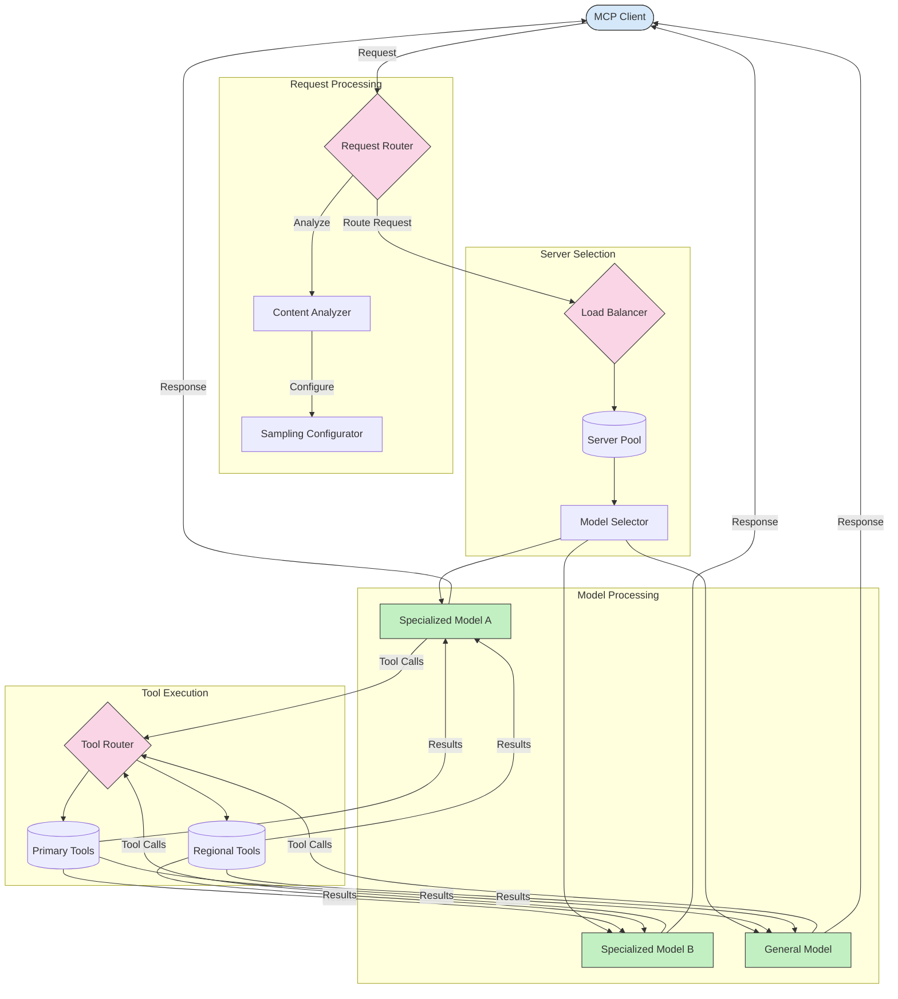

<!--
CO_OP_TRANSLATOR_METADATA:
{
  "original_hash": "2f1b473818b5a6cc9a9bbf777fffa6d4",
  "translation_date": "2025-07-14T21:48:24+00:00",
  "source_file": "05-AdvancedTopics/mcp-routing/README.md",
  "language_code": "da"
}
-->
## Sampling og Routing Arkitektur i MCP

Sampling er en vigtig komponent i Model Context Protocol (MCP), som muliggør effektiv behandling og routing af forespørgsler. Det indebærer en analyse af indkommende forespørgsler for at bestemme den mest passende model eller service til at håndtere dem, baseret på forskellige kriterier som indholdstype, brugerens kontekst og systembelastning.

Sampling og routing kan kombineres for at skabe en robust arkitektur, der optimerer ressourceudnyttelsen og sikrer høj tilgængelighed. Sampling-processen kan bruges til at klassificere forespørgsler, mens routing dirigerer dem til de relevante modeller eller services.

Diagrammet nedenfor illustrerer, hvordan sampling og routing arbejder sammen i en omfattende MCP-arkitektur:

## Hvad er det næste

- [5.6 Sampling](../mcp-sampling/README.md)

**Ansvarsfraskrivelse**:  
Dette dokument er blevet oversat ved hjælp af AI-oversættelsestjenesten [Co-op Translator](https://github.com/Azure/co-op-translator). Selvom vi bestræber os på nøjagtighed, bedes du være opmærksom på, at automatiserede oversættelser kan indeholde fejl eller unøjagtigheder. Det oprindelige dokument på dets oprindelige sprog bør betragtes som den autoritative kilde. For kritisk information anbefales professionel menneskelig oversættelse. Vi påtager os intet ansvar for misforståelser eller fejltolkninger, der opstår som følge af brugen af denne oversættelse.