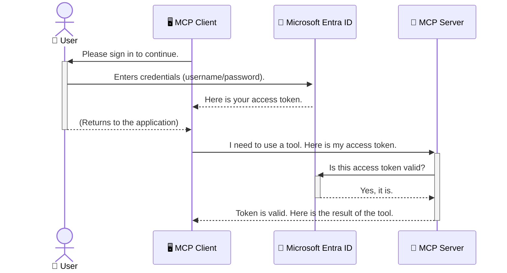

<!--
CO_OP_TRANSLATOR_METADATA:
{
  "original_hash": "6e562d7e5a77c8982da4aa8f762ad1d8",
  "translation_date": "2025-07-14T03:06:27+00:00",
  "source_file": "05-AdvancedTopics/mcp-security-entra/README.md",
  "language_code": "da"
}
-->
# Sikring af AI-workflows: Entra ID-godkendelse til Model Context Protocol-servere

## Introduktion  
At sikre din Model Context Protocol (MCP) server er lige så vigtigt som at låse hoveddøren til dit hus. Hvis du lader din MCP-server stå åben, udsætter du dine værktøjer og data for uautoriseret adgang, hvilket kan føre til sikkerhedsbrud. Microsoft Entra ID tilbyder en robust cloud-baseret identitets- og adgangsstyringsløsning, der hjælper med at sikre, at kun autoriserede brugere og applikationer kan interagere med din MCP-server. I dette afsnit lærer du, hvordan du beskytter dine AI-workflows ved hjælp af Entra ID-godkendelse.

## Læringsmål  
Når du er færdig med dette afsnit, vil du kunne:

- Forstå vigtigheden af at sikre MCP-servere.  
- Forklare grundlæggende om Microsoft Entra ID og OAuth 2.0-godkendelse.  
- Skelne mellem offentlige og fortrolige klienter.  
- Implementere Entra ID-godkendelse i både lokale (offentlige klienter) og fjernbetjente (fortrolige klienter) MCP-server-scenarier.  
- Anvende sikkerhedspraksis ved udvikling af AI-workflows.

## Sikkerhed og MCP  

Ligesom du ikke ville lade hoveddøren til dit hus stå ulåst, bør du heller ikke lade din MCP-server være åben for alle. At sikre dine AI-workflows er afgørende for at bygge robuste, pålidelige og sikre applikationer. Dette kapitel introducerer dig til brugen af Microsoft Entra ID til at sikre dine MCP-servere, så kun autoriserede brugere og applikationer kan interagere med dine værktøjer og data.

## Hvorfor sikkerhed er vigtigt for MCP-servere  

Forestil dig, at din MCP-server har et værktøj, der kan sende e-mails eller få adgang til en kundedatabase. En usikret server betyder, at alle potentielt kan bruge det værktøj, hvilket kan føre til uautoriseret dataadgang, spam eller andre skadelige handlinger.

Ved at implementere godkendelse sikrer du, at hver anmodning til din server bliver verificeret, så identiteten af den bruger eller applikation, der foretager anmodningen, bekræftes. Dette er det første og mest afgørende skridt i at sikre dine AI-workflows.

## Introduktion til Microsoft Entra ID  

[**Microsoft Entra ID**](https://adoption.microsoft.com/microsoft-security/entra/) er en cloud-baseret identitets- og adgangsstyringstjeneste. Tænk på det som en universel sikkerhedsvagt for dine applikationer. Den håndterer den komplekse proces med at verificere brugeridentiteter (godkendelse) og afgøre, hvad de har tilladelse til at gøre (autorisation).

Ved at bruge Entra ID kan du:

- Muliggøre sikker login for brugere.  
- Beskytte API’er og tjenester.  
- Administrere adgangspolitikker fra et centralt sted.

For MCP-servere tilbyder Entra ID en robust og bredt anerkendt løsning til at styre, hvem der kan få adgang til serverens funktioner.

---

## Forstå magien: Sådan fungerer Entra ID-godkendelse  

Entra ID bruger åbne standarder som **OAuth 2.0** til at håndtere godkendelse. Selvom detaljerne kan være komplekse, er kernen i konceptet enkel og kan forklares med en analogi.

### En blid introduktion til OAuth 2.0: Valet-nøglen  

Tænk på OAuth 2.0 som en valet-service til din bil. Når du ankommer til en restaurant, giver du ikke valeten din hovednøgle. I stedet giver du en **valet-nøgle**, som har begrænsede rettigheder – den kan starte bilen og låse dørene, men kan ikke åbne bagagerummet eller handskerummet.

I denne analogi:

- **Du** er **Brugeren**.  
- **Din bil** er **MCP-serveren** med dens værdifulde værktøjer og data.  
- **Valeten** er **Microsoft Entra ID**.  
- **Parkeringsvagten** er **MCP-klienten** (applikationen, der prøver at få adgang til serveren).  
- **Valet-nøglen** er **Access Token**.

Access token er en sikker tekststreng, som MCP-klienten modtager fra Entra ID, efter du har logget ind. Klienten præsenterer derefter denne token for MCP-serveren ved hver anmodning. Serveren kan verificere token for at sikre, at anmodningen er legitim, og at klienten har de nødvendige tilladelser – alt sammen uden nogensinde at skulle håndtere dine faktiske loginoplysninger (som dit kodeord).

### Godkendelsesflowet  

Sådan fungerer processen i praksis:



### Introduktion til Microsoft Authentication Library (MSAL)  

Før vi dykker ned i koden, er det vigtigt at introducere en nøglekomponent, du vil se i eksemplerne: **Microsoft Authentication Library (MSAL)**.

MSAL er et bibliotek udviklet af Microsoft, som gør det meget nemmere for udviklere at håndtere godkendelse. I stedet for at du selv skal skrive al den komplekse kode til at håndtere sikkerhedstokens, login og sessionfornyelse, tager MSAL sig af det tunge arbejde.

Det anbefales stærkt at bruge et bibliotek som MSAL, fordi:

- **Det er sikkert:** Det implementerer industristandardprotokoller og sikkerhedspraksis, hvilket reducerer risikoen for sårbarheder i din kode.  
- **Det forenkler udviklingen:** Det skjuler kompleksiteten i OAuth 2.0 og OpenID Connect-protokollerne, så du kan tilføje robust godkendelse til din applikation med blot få linjer kode.  
- **Det vedligeholdes:** Microsoft opdaterer og vedligeholder aktivt MSAL for at imødekomme nye sikkerhedstrusler og platformændringer.

MSAL understøtter mange forskellige sprog og applikationsrammer, herunder .NET, JavaScript/TypeScript, Python, Java, Go og mobile platforme som iOS og Android. Det betyder, at du kan bruge de samme konsistente godkendelsesmønstre på tværs af hele din teknologistak.

For at lære mere om MSAL kan du se den officielle [MSAL oversigtsdokumentation](https://learn.microsoft.com/entra/identity-platform/msal-overview).

---

## Sikring af din MCP-server med Entra ID: En trin-for-trin guide  

Lad os nu gennemgå, hvordan du sikrer en lokal MCP-server (en der kommunikerer over `stdio`) ved hjælp af Entra ID. Dette eksempel bruger en **offentlig klient**, som er velegnet til applikationer, der kører på en brugers maskine, som en desktop-app eller en lokal udviklingsserver.

### Scenario 1: Sikring af en lokal MCP-server (med en offentlig klient)  

I dette scenarie ser vi på en MCP-server, der kører lokalt, kommunikerer over `stdio` og bruger Entra ID til at godkende brugeren, før adgang til værktøjerne tillades. Serveren har et enkelt værktøj, der henter brugerens profiloplysninger fra Microsoft Graph API.

#### 1. Opsætning af applikationen i Entra ID  

Før du skriver kode, skal du registrere din applikation i Microsoft Entra ID. Det fortæller Entra ID om din applikation og giver den tilladelse til at bruge godkendelsestjenesten.

1. Gå til **[Microsoft Entra-portalen](https://entra.microsoft.com/)**.  
2. Gå til **App registrations** og klik på **New registration**.  
3. Giv din applikation et navn (f.eks. "My Local MCP Server").  
4. Under **Supported account types** vælg **Accounts in this organizational directory only**.  
5. Du kan lade **Redirect URI** stå tom i dette eksempel.  
6. Klik på **Register**.

Når applikationen er registreret, skal du notere dig **Application (client) ID** og **Directory (tenant) ID**. Du får brug for dem i din kode.

#### 2. Koden: En gennemgang  

Lad os se på de vigtigste dele af koden, der håndterer godkendelsen. Den fulde kode til dette eksempel findes i mappen [Entra ID - Local - WAM](https://github.com/Azure-Samples/mcp-auth-servers/tree/main/src/entra-id-local-wam) i [mcp-auth-servers GitHub-repositoriet](https://github.com/Azure-Samples/mcp-auth-servers).

**`AuthenticationService.cs`**

Denne klasse håndterer interaktionen med Entra ID.

- **`CreateAsync`**: Initialiserer `PublicClientApplication` fra MSAL. Den konfigureres med din applikations `clientId` og `tenantId`.  
- **`WithBroker`**: Aktiverer brugen af en broker (som Windows Web Account Manager), hvilket giver en mere sikker og problemfri single sign-on oplevelse.  
- **`AcquireTokenAsync`**: Kerne-metoden. Den forsøger først at hente en token stille (så brugeren ikke behøver at logge ind igen, hvis der allerede findes en gyldig session). Hvis det ikke lykkes, vil den bede brugeren om at logge ind interaktivt.

```csharp
// Simplified for clarity
public static async Task<AuthenticationService> CreateAsync(ILogger<AuthenticationService> logger)
{
    var msalClient = PublicClientApplicationBuilder
        .Create(_clientId) // Your Application (client) ID
        .WithAuthority(AadAuthorityAudience.AzureAdMyOrg)
        .WithTenantId(_tenantId) // Your Directory (tenant) ID
        .WithBroker(new BrokerOptions(BrokerOptions.OperatingSystems.Windows))
        .Build();

    // ... cache registration ...

    return new AuthenticationService(logger, msalClient);
}

public async Task<string> AcquireTokenAsync()
{
    try
    {
        // Try silent authentication first
        var accounts = await _msalClient.GetAccountsAsync();
        var account = accounts.FirstOrDefault();

        AuthenticationResult? result = null;

        if (account != null)
        {
            result = await _msalClient.AcquireTokenSilent(_scopes, account).ExecuteAsync();
        }
        else
        {
            // If no account, or silent fails, go interactive
            result = await _msalClient.AcquireTokenInteractive(_scopes).ExecuteAsync();
        }

        return result.AccessToken;
    }
    catch (Exception ex)
    {
        _logger.LogError(ex, "An error occurred while acquiring the token.");
        throw; // Optionally rethrow the exception for higher-level handling
    }
}
```

**`Program.cs`**

Her sættes MCP-serveren op, og godkendelsestjenesten integreres.

- **`AddSingleton<AuthenticationService>`**: Registrerer `AuthenticationService` i dependency injection-containeren, så den kan bruges af andre dele af applikationen (som vores værktøj).  
- **`GetUserDetailsFromGraph`-værktøjet**: Dette værktøj kræver en instans af `AuthenticationService`. Før det gør noget, kalder det `authService.AcquireTokenAsync()` for at få en gyldig access token. Hvis godkendelsen lykkes, bruger det token til at kalde Microsoft Graph API og hente brugerens oplysninger.

```csharp
// Simplified for clarity
[McpServerTool(Name = "GetUserDetailsFromGraph")]
public static async Task<string> GetUserDetailsFromGraph(
    AuthenticationService authService)
{
    try
    {
        // This will trigger the authentication flow
        var accessToken = await authService.AcquireTokenAsync();

        // Use the token to create a GraphServiceClient
        var graphClient = new GraphServiceClient(
            new BaseBearerTokenAuthenticationProvider(new TokenProvider(authService)));

        var user = await graphClient.Me.GetAsync();

        return System.Text.Json.JsonSerializer.Serialize(user);
    }
    catch (Exception ex)
    {
        return $"Error: {ex.Message}";
    }
}
```

#### 3. Sådan fungerer det hele sammen  

1. Når MCP-klienten prøver at bruge `GetUserDetailsFromGraph`-værktøjet, kalder værktøjet først `AcquireTokenAsync`.  
2. `AcquireTokenAsync` får MSAL-biblioteket til at tjekke for en gyldig token.  
3. Hvis der ikke findes en token, vil MSAL via brokeren bede brugeren om at logge ind med deres Entra ID-konto.  
4. Når brugeren logger ind, udsteder Entra ID en access token.  
5. Værktøjet modtager token og bruger den til at foretage et sikkert kald til Microsoft Graph API.  
6. Brugerens oplysninger returneres til MCP-klienten.

Denne proces sikrer, at kun godkendte brugere kan bruge værktøjet, og dermed sikres din lokale MCP-server effektivt.

### Scenario 2: Sikring af en fjern-MCP-server (med en fortrolig klient)  

Når din MCP-server kører på en fjernmaskine (som en cloud-server) og kommunikerer over en protokol som HTTP Streaming, er sikkerhedskravene anderledes. Her bør du bruge en **fortrolig klient** og **Authorization Code Flow**. Dette er en mere sikker metode, fordi applikationens hemmeligheder aldrig udsættes for browseren.

Dette eksempel bruger en TypeScript-baseret MCP-server, der anvender Express.js til at håndtere HTTP-anmodninger.

#### 1. Opsætning af applikationen i Entra ID  

Opsætningen i Entra ID ligner den for den offentlige klient, men med en vigtig forskel: du skal oprette en **client secret**.

1. Gå til **[Microsoft Entra-portalen](https://entra.microsoft.com/)**.  
2. I din app-registrering, gå til fanen **Certificates & secrets**.  
3. Klik på **New client secret**, giv den en beskrivelse, og klik på **Add**.  
4. **Vigtigt:** Kopiér straks værdien af client secret. Du vil ikke kunne se den igen.  
5. Du skal også konfigurere en **Redirect URI**. Gå til fanen **Authentication**, klik på **Add a platform**, vælg **Web**, og indtast redirect URI for din applikation (f.eks. `http://localhost:3001/auth/callback`).

> **⚠️ Vigtig sikkerhedsnote:** Til produktionsapplikationer anbefaler Microsoft kraftigt at bruge **secretless authentication**-metoder som **Managed Identity** eller **Workload Identity Federation** i stedet for client secrets. Client secrets udgør en sikkerhedsrisiko, da de kan blive eksponeret eller kompromitteret. Managed identities giver en mere sikker tilgang ved at eliminere behovet for at gemme legitimationsoplysninger i din kode eller konfiguration.  
>  
> For mere information om managed identities og hvordan du implementerer dem, se [Managed identities for Azure resources overview](https://learn.microsoft.com/entra/identity/managed-identities-azure-resources/overview).

#### 2. Koden: En gennemgang  

Dette eksempel bruger en session-baseret tilgang. Når brugeren godkendes, gemmer serveren access token og refresh token i en session og giver brugeren en session token. Denne session token bruges derefter til efterfølgende anmodninger. Den fulde kode til dette eksempel findes i mappen [Entra ID - Confidential client](https://github.com/Azure-Samples/mcp-auth-servers/tree/main/src/entra-id-cca-session) i [mcp-auth-servers GitHub-repositoriet](https://github.com/Azure-Samples/mcp-auth-servers).

**`Server.ts`**

Denne fil sætter Express-serveren og MCP-transportlaget op.

- **`requireBearerAuth`**: Middleware, der beskytter `/sse` og `/message` endpoints. Den tjekker for en gyldig bearer token i `Authorization`-headeren på anmodningen.  
- **`EntraIdServerAuthProvider`**: En brugerdefineret klasse, der implementerer `McpServerAuthorizationProvider`-interfacet. Den håndterer OAuth 2.0-flowet.  
- **`/auth/callback`**: Endpoint, der håndterer redirect fra Entra ID, efter brugeren har godkendt sig. Den bytter autorisationskoden til en access token og en refresh token.

```typescript
// Simplified for clarity
const app = express();
const { server } = createServer();
const provider = new EntraIdServerAuthProvider();

// Protect the SSE endpoint
app.get("/sse", requireBearerAuth({
  provider,
  requiredScopes: ["User.Read"]
}), async (req, res) => {
  // ... connect to the transport ...
});

// Protect the message endpoint
app.post("/message", requireBearerAuth({
  provider,
  requiredScopes: ["User.Read"]
}), async (req, res) => {
  // ... handle the message ...
});

// Handle the OAuth 2.0 callback
app.get("/auth/callback", (req, res) => {
  provider.handleCallback(req.query.code, req.query.state)
    .then(result => {
      // ... handle success or failure ...
    });
});
```

**`Tools.ts`**

Denne fil definerer de værktøjer, som MCP-serveren tilbyder. `getUserDetails`-værktøjet ligner det i det tidligere eksempel, men henter access token fra sessionen.

```typescript
// Simplified for clarity
server.setRequestHandler(CallToolRequestSchema, async (request) => {
  const { name } = request.params;
  const context = request.params?.context as { token?: string } | undefined;
  const sessionToken = context?.token;

  if (name === ToolName.GET_USER_DETAILS) {
    if (!sessionToken) {
      throw new AuthenticationError("Authentication token is missing or invalid. Ensure the token is provided in the request context.");
    }

    // Get the Entra ID token from the session store
    const tokenData = tokenStore.getToken(sessionToken);
    const entraIdToken = tokenData.accessToken;

    const graphClient = Client.init({
      authProvider: (done) => {
        done(null, entraIdToken);
      }
    });

    const user = await graphClient.api('/me').get();

    // ... return user details ...
  }
});
```

**`auth/EntraIdServerAuthProvider.ts`**

Denne klasse håndterer logikken for:

- At omdirigere brugeren til Entra ID’s login-side.  
- At bytte autorisationskoden til en access token.  
- At gemme tokens i `tokenStore`.  
- At forny access token, når den udløber.

#### 3. Sådan fungerer det hele sammen  

1. Når en bruger først prøver at oprette forbindelse til MCP-serveren, vil `requireBearerAuth`-middleware opdage, at de ikke har en gyldig session og omdirigere dem til Entra ID’s login-side.  
2. Brugeren logger ind med deres Entra ID-konto.  
3. Entra ID omdirigerer brugeren tilbage til `/auth/callback`-endpointet med en autorisationskode.
4. Serveren bytter koden til et access token og et refresh token, gemmer dem og opretter et sessionstoken, som sendes til klienten.  
5. Klienten kan nu bruge dette sessionstoken i `Authorization`-headeren for alle fremtidige forespørgsler til MCP-serveren.  
6. Når `getUserDetails`-værktøjet kaldes, bruger det sessionstoken til at slå Entra ID access token op og bruger derefter dette til at kalde Microsoft Graph API.

Denne proces er mere kompleks end flowet for public clients, men er nødvendig for internetvendte endpoints. Da fjern-MCP-servere er tilgængelige over det offentlige internet, kræver de stærkere sikkerhedsforanstaltninger for at beskytte mod uautoriseret adgang og potentielle angreb.


## Security Best Practices

- **Brug altid HTTPS**: Krypter kommunikationen mellem klient og server for at beskytte tokens mod at blive opsnappet.  
- **Implementer Role-Based Access Control (RBAC)**: Tjek ikke kun *om* en bruger er autentificeret; tjek *hvad* de har tilladelse til at gøre. Du kan definere roller i Entra ID og kontrollere dem i din MCP-server.  
- **Overvåg og auditér**: Log alle autentificeringshændelser, så du kan opdage og reagere på mistænkelig aktivitet.  
- **Håndter rate limiting og throttling**: Microsoft Graph og andre API’er implementerer rate limiting for at forhindre misbrug. Implementer eksponentiel backoff og retry-logik i din MCP-server for elegant at håndtere HTTP 429 (Too Many Requests) svar. Overvej caching af ofte tilgåede data for at reducere API-kald.  
- **Sikker tokenlagring**: Gem access tokens og refresh tokens sikkert. For lokale applikationer, brug systemets sikre lagringsmekanismer. For serverapplikationer, overvej krypteret lagring eller sikre nøglehåndteringstjenester som Azure Key Vault.  
- **Håndtering af token-udløb**: Access tokens har en begrænset levetid. Implementer automatisk tokenfornyelse ved hjælp af refresh tokens for at opretholde en problemfri brugeroplevelse uden behov for genautentificering.  
- **Overvej at bruge Azure API Management**: Selvom implementering af sikkerhed direkte i din MCP-server giver dig detaljeret kontrol, kan API-gateways som Azure API Management håndtere mange af disse sikkerhedsaspekter automatisk, herunder autentificering, autorisation, rate limiting og overvågning. De tilbyder et centralt sikkerhedslag, der ligger mellem dine klienter og dine MCP-servere. For flere detaljer om brug af API-gateways med MCP, se vores [Azure API Management Your Auth Gateway For MCP Servers](https://techcommunity.microsoft.com/blog/integrationsonazureblog/azure-api-management-your-auth-gateway-for-mcp-servers/4402690).


## Key Takeaways

- At sikre din MCP-server er afgørende for at beskytte dine data og værktøjer.  
- Microsoft Entra ID tilbyder en robust og skalerbar løsning til autentificering og autorisation.  
- Brug en **public client** til lokale applikationer og en **confidential client** til fjernservere.  
- **Authorization Code Flow** er den mest sikre mulighed for webapplikationer.


## Exercise

1. Tænk over en MCP-server, du kunne bygge. Ville det være en lokal server eller en fjernserver?  
2. Baseret på dit svar, ville du bruge en public eller confidential client?  
3. Hvilke tilladelser ville din MCP-server anmode om for at udføre handlinger mod Microsoft Graph?


## Hands-on Exercises

### Exercise 1: Register an Application in Entra ID  
Gå til Microsoft Entra-portalen.  
Registrer en ny applikation til din MCP-server.  
Notér Application (client) ID og Directory (tenant) ID.

### Exercise 2: Secure a Local MCP Server (Public Client)  
- Følg kodeeksemplet for at integrere MSAL (Microsoft Authentication Library) til brugerautentificering.  
- Test autentificeringsflowet ved at kalde MCP-værktøjet, der henter brugeroplysninger fra Microsoft Graph.

### Exercise 3: Secure a Remote MCP Server (Confidential Client)  
- Registrer en confidential client i Entra ID og opret en client secret.  
- Konfigurer din Express.js MCP-server til at bruge Authorization Code Flow.  
- Test de beskyttede endpoints og bekræft token-baseret adgang.

### Exercise 4: Apply Security Best Practices  
- Aktivér HTTPS for din lokale eller fjernserver.  
- Implementer role-based access control (RBAC) i din serverlogik.  
- Tilføj håndtering af token-udløb og sikker tokenlagring.

## Resources

1. **MSAL Overview Documentation**  
   Lær hvordan Microsoft Authentication Library (MSAL) muliggør sikker tokenindhentning på tværs af platforme:  
   [MSAL Overview on Microsoft Learn](https://learn.microsoft.com/en-gb/entra/msal/overview)

2. **Azure-Samples/mcp-auth-servers GitHub Repository**  
   Referenceimplementeringer af MCP-servere, der demonstrerer autentificeringsflows:  
   [Azure-Samples/mcp-auth-servers on GitHub](https://github.com/Azure-Samples/mcp-auth-servers)

3. **Managed Identities for Azure Resources Overview**  
   Forstå hvordan man eliminerer secrets ved at bruge system- eller bruger-tildelte managed identities:  
   [Managed Identities Overview on Microsoft Learn](https://learn.microsoft.com/en-us/entra/identity/managed-identities-azure-resources/)

4. **Azure API Management: Your Auth Gateway for MCP Servers**  
   En dybdegående gennemgang af brugen af APIM som en sikker OAuth2-gateway for MCP-servere:  
   [Azure API Management Your Auth Gateway For MCP Servers](https://techcommunity.microsoft.com/blog/integrationsonazureblog/azure-api-management-your-auth-gateway-for-mcp-servers/4402690)

5. **Microsoft Graph Permissions Reference**  
   Omfattende liste over delegerede og applikationstilladelser til Microsoft Graph:  
   [Microsoft Graph Permissions Reference](https://learn.microsoft.com/zh-tw/graph/permissions-reference)


## Learning Outcomes  
Efter at have gennemført denne sektion vil du kunne:

- Forklare hvorfor autentificering er kritisk for MCP-servere og AI-workflows.  
- Opsætte og konfigurere Entra ID-autentificering for både lokale og fjern-MCP-server scenarier.  
- Vælge den rette klienttype (public eller confidential) baseret på din servers implementering.  
- Implementere sikre kodningspraksisser, herunder tokenlagring og rollebaseret autorisation.  
- Trygt beskytte din MCP-server og dens værktøjer mod uautoriseret adgang.

## What's next 

- [5.13 Model Context Protocol (MCP) Integration with Azure AI Foundry](../mcp-foundry-agent-integration/README.md)

**Ansvarsfraskrivelse**:  
Dette dokument er blevet oversat ved hjælp af AI-oversættelsestjenesten [Co-op Translator](https://github.com/Azure/co-op-translator). Selvom vi bestræber os på nøjagtighed, bedes du være opmærksom på, at automatiserede oversættelser kan indeholde fejl eller unøjagtigheder. Det oprindelige dokument på dets oprindelige sprog bør betragtes som den autoritative kilde. For kritisk information anbefales professionel menneskelig oversættelse. Vi påtager os intet ansvar for misforståelser eller fejltolkninger, der opstår som følge af brugen af denne oversættelse.