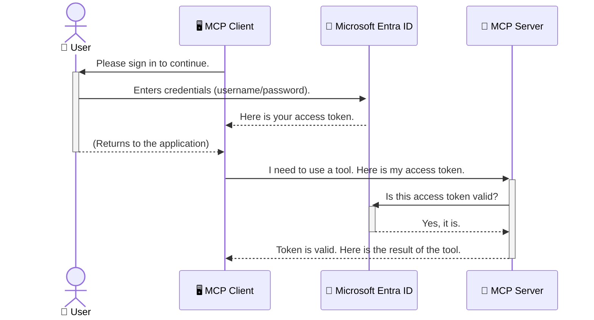

<!--
CO_OP_TRANSLATOR_METADATA:
{
  "original_hash": "0abf26a6c4dbe905d5d49ccdc0ccfe92",
  "translation_date": "2025-06-26T16:32:42+00:00",
  "source_file": "05-AdvancedTopics/mcp-security-entra/README.md",
  "language_code": "da"
}
-->
# Sikring af AI-workflows: Entra ID-autentificering for Model Context Protocol-servere

## Introduktion  
At sikre din Model Context Protocol (MCP) server er lige så vigtigt som at låse døren til dit hus. Hvis du lader din MCP-server stå åben, udsætter du dine værktøjer og data for uautoriseret adgang, hvilket kan føre til sikkerhedsbrud. Microsoft Entra ID tilbyder en robust skybaseret identitets- og adgangsstyringsløsning, som sikrer, at kun autoriserede brugere og applikationer kan interagere med din MCP-server. I dette afsnit lærer du, hvordan du beskytter dine AI-workflows ved hjælp af Entra ID-autentificering.

## Læringsmål  
Når du er færdig med dette afsnit, vil du kunne:

- Forstå vigtigheden af at sikre MCP-servere.  
- Forklare det grundlæggende i Microsoft Entra ID og OAuth 2.0-autentificering.  
- Skelne mellem offentlige og fortrolige klienter.  
- Implementere Entra ID-autentificering i både lokale (offentlige klienter) og fjernbetjente (fortrolige klienter) MCP-server-scenarier.  
- Anvende sikkerhedspraksis ved udvikling af AI-workflows.

## Sikkerhed og MCP  

Ligesom du ikke ville lade hoveddøren til dit hus stå ulåst, bør du heller ikke lade din MCP-server være åben for alle. At sikre dine AI-workflows er afgørende for at bygge robuste, pålidelige og sikre applikationer. Dette kapitel introducerer dig til, hvordan du bruger Microsoft Entra ID til at sikre dine MCP-servere, så kun autoriserede brugere og applikationer kan interagere med dine værktøjer og data.

## Hvorfor sikkerhed er vigtigt for MCP-servere  

Forestil dig, at din MCP-server har et værktøj, der kan sende e-mails eller få adgang til en kundedatabase. En usikret server betyder, at alle potentielt kan bruge dette værktøj, hvilket kan føre til uautoriseret adgang til data, spam eller andre skadelige handlinger.

Ved at implementere autentificering sikrer du, at hver anmodning til din server bliver verificeret, og at identiteten af den bruger eller applikation, der laver anmodningen, bekræftes. Dette er det første og mest afgørende skridt i at sikre dine AI-workflows.

## Introduktion til Microsoft Entra ID  

[**Microsoft Entra ID**](https://adoption.microsoft.com/microsoft-security/entra/) er en skybaseret tjeneste til identitets- og adgangsstyring. Tænk på det som en universel sikkerhedsvagt for dine applikationer. Den håndterer den komplekse proces med at bekræfte brugeridentiteter (autentificering) og afgøre, hvad de har tilladelse til at gøre (autorisation).

Ved at bruge Entra ID kan du:

- Muliggøre sikker login for brugere.  
- Beskytte API’er og tjenester.  
- Administrere adgangspolitikker centralt.

For MCP-servere giver Entra ID en robust og bredt anerkendt løsning til at styre, hvem der kan få adgang til serverens funktioner.

---

## Forstå magien: Hvordan Entra ID-autentificering fungerer  

Entra ID bruger åbne standarder som **OAuth 2.0** til at håndtere autentificering. Selvom detaljerne kan være komplekse, er kernen i konceptet enkel og kan forstås via en analogi.

### En blid introduktion til OAuth 2.0: Valetnøglen  

Tænk på OAuth 2.0 som en valetservice til din bil. Når du ankommer til en restaurant, giver du ikke valetmanden din hovednøgle. I stedet giver du en **valetnøgle**, som har begrænsede rettigheder – den kan starte bilen og låse dørene, men den kan ikke åbne bagagerummet eller handskerummet.

I denne analogi:

- **Du** er **brugeren**.  
- **Din bil** er **MCP-serveren** med dens værdifulde værktøjer og data.  
- **Valetmanden** er **Microsoft Entra ID**.  
- **Parkeringsvagten** er **MCP-klienten** (applikationen, der prøver at få adgang til serveren).  
- **Valetnøglen** er **Access Token**.

Access token er en sikker tekststreng, som MCP-klienten modtager fra Entra ID, efter du har logget ind. Klienten præsenterer derefter denne token til MCP-serveren ved hver anmodning. Serveren kan verificere token for at sikre, at anmodningen er legitim, og at klienten har de nødvendige rettigheder – alt sammen uden nogensinde at skulle håndtere dine faktiske loginoplysninger (som dit kodeord).

### Autentificeringsflowet  

Sådan fungerer processen i praksis:



### Introduktion til Microsoft Authentication Library (MSAL)  

Før vi dykker ned i koden, er det vigtigt at introducere en vigtig komponent, du vil møde i eksemplerne: **Microsoft Authentication Library (MSAL)**.

MSAL er et bibliotek udviklet af Microsoft, som gør det meget lettere for udviklere at håndtere autentificering. I stedet for at skulle skrive al den komplekse kode til at håndtere sikkerhedstokens, logins og sessionfornyelse, tager MSAL sig af det tunge arbejde.

Det anbefales kraftigt at bruge et bibliotek som MSAL, fordi:

- **Det er sikkert:** Det implementerer industristandardprotokoller og sikkerhedspraksis, hvilket mindsker risikoen for sårbarheder i din kode.  
- **Det forenkler udviklingen:** Det skjuler kompleksiteten i OAuth 2.0 og OpenID Connect, så du kan tilføje robust autentificering til din applikation med få kodelinjer.  
- **Det vedligeholdes:** Microsoft opdaterer aktivt MSAL for at håndtere nye sikkerhedstrusler og platformændringer.

MSAL understøtter mange sprog og applikationsrammer, herunder .NET, JavaScript/TypeScript, Python, Java, Go samt mobile platforme som iOS og Android. Det betyder, at du kan bruge de samme autentificeringsmønstre på tværs af hele din teknologistak.

For at lære mere om MSAL, kan du se den officielle [MSAL oversigtsdokumentation](https://learn.microsoft.com/entra/identity-platform/msal-overview).

---

## Sikring af din MCP-server med Entra ID: En trin-for-trin guide  

Lad os nu gennemgå, hvordan du sikrer en lokal MCP-server (en der kommunikerer over `stdio`) using Entra ID. This example uses a **public client**, which is suitable for applications running on a user's machine, like a desktop app or a local development server.

### Scenario 1: Securing a Local MCP Server (with a Public Client)

In this scenario, we'll look at an MCP server that runs locally, communicates over `stdio`, and uses Entra ID to authenticate the user before allowing access to its tools. The server will have a single tool that fetches the user's profile information from the Microsoft Graph API.

#### 1. Setting Up the Application in Entra ID

Before writing any code, you need to register your application in Microsoft Entra ID. This tells Entra ID about your application and grants it permission to use the authentication service.

1. Navigate to the **[Microsoft Entra portal](https://entra.microsoft.com/)**.
2. Go to **App registrations** and click **New registration**.
3. Give your application a name (e.g., "My Local MCP Server").
4. For **Supported account types**, select **Accounts in this organizational directory only**.
5. You can leave the **Redirect URI** blank for this example.
6. Click **Register**.

Once registered, take note of the **Application (client) ID** and **Directory (tenant) ID**. You'll need these in your code.

#### 2. The Code: A Breakdown

Let's look at the key parts of the code that handle authentication. The full code for this example is available in the [Entra ID - Local - WAM](https://github.com/Azure-Samples/mcp-auth-servers/tree/main/src/entra-id-local-wam) folder of the [mcp-auth-servers GitHub repository](https://github.com/Azure-Samples/mcp-auth-servers).

**`AuthenticationService.cs`**

This class is responsible for handling the interaction with Entra ID.

- **`CreateAsync`**: This method initializes the `PublicClientApplication` from the MSAL (Microsoft Authentication Library). It's configured with your application's `clientId` and `tenantId`.
- **`WithBroker`**: This enables the use of a broker (like the Windows Web Account Manager), which provides a more secure and seamless single sign-on experience.
- **`AcquireTokenAsync`**: Dette er den centrale metode. Den forsøger først at hente en token stille og roligt (så brugeren ikke behøver at logge ind igen, hvis der allerede er en gyldig session). Hvis en stille token ikke kan opnås, vil den bede brugeren om at logge ind interaktivt.

```csharp
// Simplified for clarity
public static async Task<AuthenticationService> CreateAsync(ILogger<AuthenticationService> logger)
{
    var msalClient = PublicClientApplicationBuilder
        .Create(_clientId) // Your Application (client) ID
        .WithAuthority(AadAuthorityAudience.AzureAdMyOrg)
        .WithTenantId(_tenantId) // Your Directory (tenant) ID
        .WithBroker(new BrokerOptions(BrokerOptions.OperatingSystems.Windows))
        .Build();

    // ... cache registration ...

    return new AuthenticationService(logger, msalClient);
}

public async Task<string> AcquireTokenAsync()
{
    try
    {
        // Try silent authentication first
        var accounts = await _msalClient.GetAccountsAsync();
        var account = accounts.FirstOrDefault();

        AuthenticationResult? result = null;

        if (account != null)
        {
            result = await _msalClient.AcquireTokenSilent(_scopes, account).ExecuteAsync();
        }
        else
        {
            // If no account, or silent fails, go interactive
            result = await _msalClient.AcquireTokenInteractive(_scopes).ExecuteAsync();
        }

        return result.AccessToken;
    }
    catch (Exception ex)
    {
        _logger.LogError(ex, "An error occurred while acquiring the token.");
        throw; // Optionally rethrow the exception for higher-level handling
    }
}
```

**`Program.cs`**

This is where the MCP server is set up and the authentication service is integrated.

- **`AddSingleton<AuthenticationService>`**: This registers the `AuthenticationService` with the dependency injection container, so it can be used by other parts of the application (like our tool).
- **`GetUserDetailsFromGraph` tool**: This tool requires an instance of `AuthenticationService`. Before it does anything, it calls `authService.AcquireTokenAsync()` for at få en gyldig adgangstoken. Hvis autentificeringen lykkes, bruger den token til at kalde Microsoft Graph API og hente brugerens oplysninger.

```csharp
// Simplified for clarity
[McpServerTool(Name = "GetUserDetailsFromGraph")]
public static async Task<string> GetUserDetailsFromGraph(
    AuthenticationService authService)
{
    try
    {
        // This will trigger the authentication flow
        var accessToken = await authService.AcquireTokenAsync();

        // Use the token to create a GraphServiceClient
        var graphClient = new GraphServiceClient(
            new BaseBearerTokenAuthenticationProvider(new TokenProvider(authService)));

        var user = await graphClient.Me.GetAsync();

        return System.Text.Json.JsonSerializer.Serialize(user);
    }
    catch (Exception ex)
    {
        return $"Error: {ex.Message}";
    }
}
```

#### 3. Hvordan det hele hænger sammen  

1. Når MCP-klienten forsøger at bruge `GetUserDetailsFromGraph` tool, the tool first calls `AcquireTokenAsync`.
2. `AcquireTokenAsync` triggers the MSAL library to check for a valid token.
3. If no token is found, MSAL, through the broker, will prompt the user to sign in with their Entra ID account.
4. Once the user signs in, Entra ID issues an access token.
5. The tool receives the token and uses it to make a secure call to the Microsoft Graph API.
6. The user's details are returned to the MCP client.

This process ensures that only authenticated users can use the tool, effectively securing your local MCP server.

### Scenario 2: Securing a Remote MCP Server (with a Confidential Client)

When your MCP server is running on a remote machine (like a cloud server) and communicates over a protocol like HTTP Streaming, the security requirements are different. In this case, you should use a **confidential client** and the **Authorization Code Flow**. This is a more secure method because the application's secrets are never exposed to the browser.

This example uses a TypeScript-based MCP server that uses Express.js to handle HTTP requests.

#### 1. Setting Up the Application in Entra ID

The setup in Entra ID is similar to the public client, but with one key difference: you need to create a **client secret**.

1. Navigate to the **[Microsoft Entra portal](https://entra.microsoft.com/)**.
2. In your app registration, go to the **Certificates & secrets** tab.
3. Click **New client secret**, give it a description, and click **Add**.
4. **Important:** Copy the secret value immediately. You will not be able to see it again.
5. You also need to configure a **Redirect URI**. Go to the **Authentication** tab, click **Add a platform**, select **Web**, and enter the redirect URI for your application (e.g., `http://localhost:3001/auth/callback`).

> **⚠️ Important Security Note:** For production applications, Microsoft strongly recommends using **secretless authentication** methods such as **Managed Identity** or **Workload Identity Federation** instead of client secrets. Client secrets pose security risks as they can be exposed or compromised. Managed identities provide a more secure approach by eliminating the need to store credentials in your code or configuration.
>
> For more information about managed identities and how to implement them, see the [Managed identities for Azure resources overview](https://learn.microsoft.com/entra/identity/managed-identities-azure-resources/overview).

#### 2. The Code: A Breakdown

This example uses a session-based approach. When the user authenticates, the server stores the access token and refresh token in a session and gives the user a session token. This session token is then used for subsequent requests. The full code for this example is available in the [Entra ID - Confidential client](https://github.com/Azure-Samples/mcp-auth-servers/tree/main/src/entra-id-cca-session) folder of the [mcp-auth-servers GitHub repository](https://github.com/Azure-Samples/mcp-auth-servers).

**`Server.ts`**

This file sets up the Express server and the MCP transport layer.

- **`requireBearerAuth`**: This is middleware that protects the `/sse` and `/message` endpoints. It checks for a valid bearer token in the `Authorization` header of the request.
- **`EntraIdServerAuthProvider`**: This is a custom class that implements the `McpServerAuthorizationProvider` interface. It's responsible for handling the OAuth 2.0 flow.
- **`/auth/callback`**: Denne endpoint håndterer redirectet fra Entra ID efter, at brugeren har autentificeret sig. Den bytter autorisationskoden til en adgangstoken og en refresh token.

```typescript
// Simplified for clarity
const app = express();
const { server } = createServer();
const provider = new EntraIdServerAuthProvider();

// Protect the SSE endpoint
app.get("/sse", requireBearerAuth({
  provider,
  requiredScopes: ["User.Read"]
}), async (req, res) => {
  // ... connect to the transport ...
});

// Protect the message endpoint
app.post("/message", requireBearerAuth({
  provider,
  requiredScopes: ["User.Read"]
}), async (req, res) => {
  // ... handle the message ...
});

// Handle the OAuth 2.0 callback
app.get("/auth/callback", (req, res) => {
  provider.handleCallback(req.query.code, req.query.state)
    .then(result => {
      // ... handle success or failure ...
    });
});
```

**`Tools.ts`**

This file defines the tools that the MCP server provides. The `getUserDetails` værktøjet ligner det fra det foregående eksempel, men henter adgangstoken fra sessionen.

```typescript
// Simplified for clarity
server.setRequestHandler(CallToolRequestSchema, async (request) => {
  const { name } = request.params;
  const context = request.params?.context as { token?: string } | undefined;
  const sessionToken = context?.token;

  if (name === ToolName.GET_USER_DETAILS) {
    if (!sessionToken) {
      throw new AuthenticationError("Authentication token is missing or invalid. Ensure the token is provided in the request context.");
    }

    // Get the Entra ID token from the session store
    const tokenData = tokenStore.getToken(sessionToken);
    const entraIdToken = tokenData.accessToken;

    const graphClient = Client.init({
      authProvider: (done) => {
        done(null, entraIdToken);
      }
    });

    const user = await graphClient.api('/me').get();

    // ... return user details ...
  }
});
```

**`auth/EntraIdServerAuthProvider.ts`**

This class handles the logic for:

- Redirecting the user to the Entra ID sign-in page.
- Exchanging the authorization code for an access token.
- Storing the tokens in the `tokenStore`.
- Refreshing the access token when it expires.

#### 3. How It All Works Together

1. When a user first tries to connect to the MCP server, the `requireBearerAuth` middleware will see that they don't have a valid session and will redirect them to the Entra ID sign-in page.
2. The user signs in with their Entra ID account.
3. Entra ID redirects the user back to the `/auth/callback` endpoint with an authorization code.
4. The server exchanges the code for an access token and a refresh token, stores them, and creates a session token which is sent to the client.
5. The client can now use this session token in the `Authorization` header for all future requests to the MCP server.
6. When the `getUserDetails` værktøjet kaldes, og det bruger sessionstoken til at slå Entra ID adgangstoken op, som derefter bruges til at kalde Microsoft Graph API.

Dette flow er mere komplekst end flowet for offentlige klienter, men det er nødvendigt for internet-tilgængelige endpoints. Da fjern-MCP-servere er tilgængelige via det offentlige internet, kræver de stærkere sikkerhedsforanstaltninger for at beskytte mod uautoriseret adgang og potentielle angreb.

## Sikkerhedspraksis  

- **Brug altid HTTPS**: Krypter kommunikationen mellem klient og server for at beskytte tokens mod at blive opsnappet.  
- **Implementer rollebaseret adgangskontrol (RBAC)**: Tjek ikke kun *om* en bruger er autentificeret, men også *hvad* de har tilladelse til. Du kan definere roller i Entra ID og tjekke disse i din MCP-server.  
- **Overvåg og auditér**: Log alle autentificeringshændelser, så du kan opdage og reagere på mistænkelig aktivitet.  
- **Håndter ratebegrænsning og throttling**: Microsoft Graph og andre API’er anvender ratebegrænsning for at forhindre misbrug. Implementer eksponentiel backoff og genforsøg i din MCP-server for at håndtere HTTP 429 (For mange anmodninger) pænt. Overvej at cache ofte brugte data for at reducere API-kald.  
- **Sikker tokenopbevaring**: Opbevar adgangs- og refresh tokens sikkert. For lokale applikationer brug systemets sikre lagringsmekanismer. For serverapplikationer overvej krypteret lagring eller sikre nøglehåndteringstjenester som Azure Key Vault.  
- **Håndtering af token-udløb**: Access tokens har en begrænset levetid. Implementer automatisk tokenfornyelse med refresh tokens for at sikre en problemfri brugeroplevelse uden behov for gentagen login.  
- **Overvej at bruge Azure API Management**: Selvom implementering af sikkerhed direkte i din MCP-server giver dig detaljeret kontrol, kan API-gateways som Azure API Management håndtere mange af disse sikkerhedsaspekter automatisk, inklusive autentificering, autorisation, ratebegrænsning og overvågning. De tilbyder et centralt sikkerhedslag mellem dine klienter og MCP-servere. For flere detaljer om brug af API-gateways med MCP, se vores [Azure API Management Your Auth Gateway For MCP Servers](https://techcommunity.microsoft.com/blog/integrationsonazureblog/azure-api-management-your-auth-gateway-for-mcp-servers/4402690).

## Vigtige pointer  

- Det er afgørende at sikre din MCP-server for at beskytte dine data og værktøjer.  
- Microsoft Entra ID tilbyder en robust og skalerbar løsning til autentificering og autorisation.  
- Brug en **offentlig klient** til lokale applikationer og en **fortrolig klient** til fjernservere.  
- **Authorization Code Flow** er den mest sikre løsning til webapplikationer.

## Øvelse  

1. Tænk på en MCP-server, du kunne bygge. Ville det være en lokal eller en fjernserver?  
2. Baseret på dit svar, ville du så bruge en offentlig eller fortrolig klient?  
3. Hvilke tilladelser ville din MCP-server anmode om for at udføre handlinger mod Microsoft Graph?

## Praktiske øvelser  

### Øvelse 1: Registrer en applikation i Entra ID  
Gå til Microsoft Entra-portalen.  
Registrer en ny applikation til din MCP-server.  
Notér Application (client) ID og Directory (tenant) ID.

### Øvelse 2: Sikr en lokal MCP-server (offentlig klient)  
- Følg kodeeksemplet for at integrere MSAL (Microsoft Authentication Library) til brugerautentificering.  
- Test autentificeringsflowet ved at kalde MCP-værktøjet, der henter brugeroplysninger fra Microsoft Graph.

### Øvelse 3: Sikr en fjern-MCP-server (fortrolig klient)  
- Registrer en fortrolig klient i Entra ID og opret en klienthemmelighed.  
- Konfigurer din Express.js MCP-server til at bruge Authorization Code Flow.  
- Test de beskyttede endpoints og bekræft tokenbaseret adgang.

### Øvelse 4: Anvend sikkerhedspraksis  
- Aktivér HTTPS for din lokale eller fjernserver.  
- Implementer rollebaseret adgangskontrol (RBAC) i serverlogikken.  
- Tilføj håndtering af tokenudløb og sikker tokenopbevaring.

## Ressourcer  

1. **MSAL Oversigtsdokumentation**  
   Lær hvordan Microsoft Authentication Library (MSAL) muliggør sikker tokenhåndtering på tværs af platforme:  
   [MSAL Overview on Microsoft Learn](https://learn.microsoft.com/en-gb/entra/msal/overview)

2. **Azure-Samples/mcp-auth-servers GitHub Repository**  
   Referenceimplementeringer af MCP-servere, der demonstrerer autentificeringsflows:  
   [Azure-Samples/mcp-auth-servers on GitHub](https://github.com/Azure-Samples/mcp-auth-servers)

3. **Managed Identities for Azure Resources Oversigt**  
   Forstå, hvordan du eliminerer hemmeligheder ved at bruge system- eller bruger-tilknyttede managed identities:  
   [Managed Identities Overview on Microsoft Learn](https://learn.microsoft.com/en-us/entra/identity/managed-identities-azure-resources/)

4. **Azure API Management: Your Auth Gateway for MCP Servers**  
   En dybdegående gennemgang af brugen af APIM som en sikker OAuth2-gateway for MCP-servere:  
   [Azure API Management Your Auth Gateway For MCP Servers](https://techcommunity.microsoft.com/blog/integrationsonazureblog/azure-api-management-your-auth-gateway-for-mcp-servers/4402690)

5. **Microsoft Graph Permissions Reference**  
   Omfattende liste over delegerede og applikationstilladelser for Microsoft Graph:  
   [Microsoft Graph Permissions Reference](https://learn.microsoft.com/zh-tw/graph/permissions-reference)

## Læringsudbytte  
Efter at have gennemført dette afsnit vil du kunne:

- Forklare, hvorfor autentificering er afgørende for MCP-servere og AI-workflows.  
- Opsætte og konfigurere Entra ID-autentificering for både lokale og fjern-MCP-server-scenarier.  
- Vælge den rette klienttype (offentlig eller fortrolig) baseret på din servers implementering.  
- Implementere sikre kodningspraksisser, herunder tokenopbevaring og rollebaseret autorisation.  
- Trygt beskytte din MCP-server og dens værktøjer mod uautoriseret adgang.

## Hvad er det næste  

- [6. Community Contributions](../../06-CommunityContributions/README.md)

**Ansvarsfraskrivelse**:  
Dette dokument er blevet oversat ved hjælp af AI-oversættelsestjenesten [Co-op Translator](https://github.com/Azure/co-op-translator). Selvom vi bestræber os på nøjagtighed, skal du være opmærksom på, at automatiserede oversættelser kan indeholde fejl eller unøjagtigheder. Det oprindelige dokument på dets oprindelige sprog bør betragtes som den autoritative kilde. For kritisk information anbefales professionel menneskelig oversættelse. Vi påtager os intet ansvar for misforståelser eller fejltolkninger, der opstår som følge af brugen af denne oversættelse.