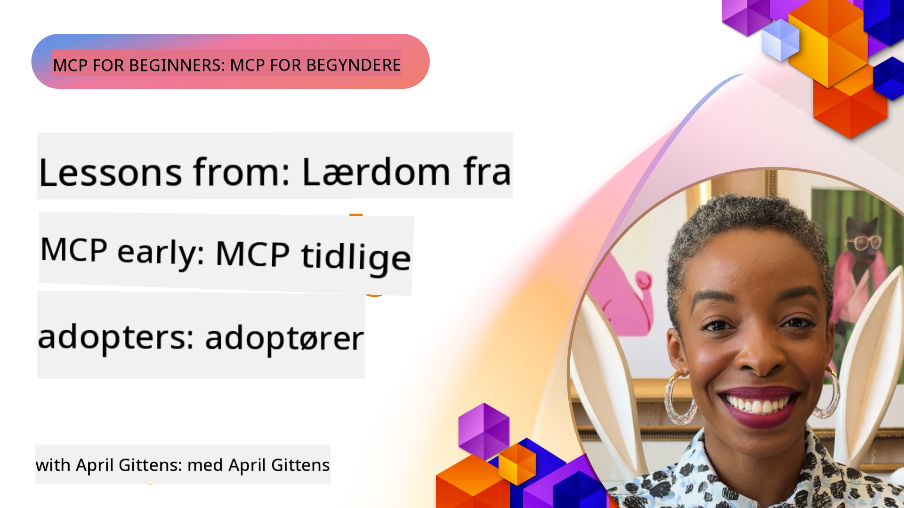

<!--
CO_OP_TRANSLATOR_METADATA:
{
  "original_hash": "41f16dac486d2086a53bc644a01cbe42",
  "translation_date": "2025-08-18T15:08:11+00:00",
  "source_file": "07-LessonsfromEarlyAdoption/README.md",
  "language_code": "da"
}
-->
# 🌟 Lærdom fra Tidlige Brugere

[](https://youtu.be/jds7dSmNptE)

_(Klik på billedet ovenfor for at se videoen til denne lektion)_

## 🎯 Hvad Dækker Dette Modul

Dette modul undersøger, hvordan virkelige organisationer og udviklere udnytter Model Context Protocol (MCP) til at løse faktiske udfordringer og fremme innovation. Gennem detaljerede casestudier og praktiske eksempler vil du opdage, hvordan MCP muliggør sikker og skalerbar AI-integration, der forbinder sprogmodeller, værktøjer og virksomhedsdata.

### 📚 Se MCP i Aktion

Vil du se disse principper anvendt i produktionsklare værktøjer? Tjek vores [**10 Microsoft MCP Servers, der Transformerer Udviklerproduktivitet**](microsoft-mcp-servers.md), som fremhæver virkelige Microsoft MCP-servere, du kan bruge i dag.

## Oversigt

Denne lektion udforsker, hvordan tidlige brugere har udnyttet Model Context Protocol (MCP) til at løse virkelige udfordringer og fremme innovation på tværs af industrier. Gennem detaljerede casestudier og praktiske projekter vil du se, hvordan MCP muliggør standardiseret, sikker og skalerbar AI-integration—der forbinder store sprogmodeller, værktøjer og virksomhedsdata i en samlet ramme. Du vil få praktisk erfaring med at designe og bygge MCP-baserede løsninger, lære af velafprøvede implementeringsmønstre og opdage bedste praksis for at implementere MCP i produktionsmiljøer. Lektionen fremhæver også nye tendenser, fremtidige retninger og open source-ressourcer for at hjælpe dig med at holde dig på forkant med MCP-teknologi og dens udviklende økosystem.

## Læringsmål

- Analysere virkelige MCP-implementeringer på tværs af forskellige industrier
- Designe og bygge komplette MCP-baserede applikationer
- Udforske nye tendenser og fremtidige retninger inden for MCP-teknologi
- Anvende bedste praksis i faktiske udviklingsscenarier

## Virkelige MCP-Implementeringer

### Casestudie 1: Automatisering af Kundesupport i Virksomheder

En multinational virksomhed implementerede en MCP-baseret løsning for at standardisere AI-interaktioner på tværs af deres kundesupportsystemer. Dette gjorde det muligt for dem at:

- Skabe en samlet grænseflade for flere LLM-leverandører
- Opretholde konsistent promptstyring på tværs af afdelinger
- Implementere robuste sikkerheds- og overholdelseskontroller
- Nem overgang mellem forskellige AI-modeller baseret på specifikke behov

**Teknisk Implementering:**

```python
# Python MCP server implementation for customer support
import logging
import asyncio
from modelcontextprotocol import create_server, ServerConfig
from modelcontextprotocol.server import MCPServer
from modelcontextprotocol.transports import create_http_transport
from modelcontextprotocol.resources import ResourceDefinition
from modelcontextprotocol.prompts import PromptDefinition
from modelcontextprotocol.tool import ToolDefinition

# Configure logging
logging.basicConfig(level=logging.INFO)

async def main():
    # Create server configuration
    config = ServerConfig(
        name="Enterprise Customer Support Server",
        version="1.0.0",
        description="MCP server for handling customer support inquiries"
    )
    
    # Initialize MCP server
    server = create_server(config)
    
    # Register knowledge base resources
    server.resources.register(
        ResourceDefinition(
            name="customer_kb",
            description="Customer knowledge base documentation"
        ),
        lambda params: get_customer_documentation(params)
    )
    
    # Register prompt templates
    server.prompts.register(
        PromptDefinition(
            name="support_template",
            description="Templates for customer support responses"
        ),
        lambda params: get_support_templates(params)
    )
    
    # Register support tools
    server.tools.register(
        ToolDefinition(
            name="ticketing",
            description="Create and update support tickets"
        ),
        handle_ticketing_operations
    )
    
    # Start server with HTTP transport
    transport = create_http_transport(port=8080)
    await server.run(transport)

if __name__ == "__main__":
    asyncio.run(main())
```

**Resultater:** 30% reduktion i modelomkostninger, 45% forbedring i svarkonsistens og forbedret overholdelse på tværs af globale operationer.

### Casestudie 2: Diagnostisk Assistent i Sundhedssektoren

En sundhedsudbyder udviklede en MCP-infrastruktur til at integrere flere specialiserede medicinske AI-modeller, samtidig med at følsomme patientdata blev beskyttet:

- Problemfri overgang mellem generalist- og specialistmedicinske modeller
- Strenge privatlivskontroller og revisionsspor
- Integration med eksisterende Elektroniske Patientjournaler (EHR)
- Konsistent promptudvikling for medicinsk terminologi

**Teknisk Implementering:**

```csharp
// C# MCP host application implementation in healthcare application
using Microsoft.Extensions.DependencyInjection;
using ModelContextProtocol.SDK.Client;
using ModelContextProtocol.SDK.Security;
using ModelContextProtocol.SDK.Resources;

public class DiagnosticAssistant
{
    private readonly MCPHostClient _mcpClient;
    private readonly PatientContext _patientContext;
    
    public DiagnosticAssistant(PatientContext patientContext)
    {
        _patientContext = patientContext;
        
        // Configure MCP client with healthcare-specific settings
        var clientOptions = new ClientOptions
        {
            Name = "Healthcare Diagnostic Assistant",
            Version = "1.0.0",
            Security = new SecurityOptions
            {
                Encryption = EncryptionLevel.Medical,
                AuditEnabled = true
            }
        };
        
        _mcpClient = new MCPHostClientBuilder()
            .WithOptions(clientOptions)
            .WithTransport(new HttpTransport("https://healthcare-mcp.example.org"))
            .WithAuthentication(new HIPAACompliantAuthProvider())
            .Build();
    }
    
    public async Task<DiagnosticSuggestion> GetDiagnosticAssistance(
        string symptoms, string patientHistory)
    {
        // Create request with appropriate resources and tool access
        var resourceRequest = new ResourceRequest
        {
            Name = "patient_records",
            Parameters = new Dictionary<string, object>
            {
                ["patientId"] = _patientContext.PatientId,
                ["requestingProvider"] = _patientContext.ProviderId
            }
        };
        
        // Request diagnostic assistance using appropriate prompt
        var response = await _mcpClient.SendPromptRequestAsync(
            promptName: "diagnostic_assistance",
            parameters: new Dictionary<string, object>
            {
                ["symptoms"] = symptoms,
                patientHistory = patientHistory,
                relevantGuidelines = _patientContext.GetRelevantGuidelines()
            });
            
        return DiagnosticSuggestion.FromMCPResponse(response);
    }
}
```

**Resultater:** Forbedrede diagnostiske forslag til læger, samtidig med fuld HIPAA-overholdelse og betydelig reduktion i kontekstskift mellem systemer.

### Casestudie 3: Risikoberegning i Finanssektoren

En finansiel institution implementerede MCP for at standardisere deres risikoberegningsprocesser på tværs af forskellige afdelinger:

- Skabte en samlet grænseflade for kreditrisiko, svindelopdagelse og investeringsrisikomodeller
- Implementerede strenge adgangskontroller og modelversionering
- Sikrede revisionsmuligheder for alle AI-anbefalinger
- Opretholdt konsistent dataformatering på tværs af forskellige systemer

**Teknisk Implementering:**

```java
// Java MCP server for financial risk assessment
import org.mcp.server.*;
import org.mcp.security.*;

public class FinancialRiskMCPServer {
    public static void main(String[] args) {
        // Create MCP server with financial compliance features
        MCPServer server = new MCPServerBuilder()
            .withModelProviders(
                new ModelProvider("risk-assessment-primary", new AzureOpenAIProvider()),
                new ModelProvider("risk-assessment-audit", new LocalLlamaProvider())
            )
            .withPromptTemplateDirectory("./compliance/templates")
            .withAccessControls(new SOCCompliantAccessControl())
            .withDataEncryption(EncryptionStandard.FINANCIAL_GRADE)
            .withVersionControl(true)
            .withAuditLogging(new DatabaseAuditLogger())
            .build();
            
        server.addRequestValidator(new FinancialDataValidator());
        server.addResponseFilter(new PII_RedactionFilter());
        
        server.start(9000);
        
        System.out.println("Financial Risk MCP Server running on port 9000");
    }
}
```

**Resultater:** Forbedret overholdelse af regler, 40% hurtigere modelimplementeringscyklusser og forbedret risikovurderingskonsistens på tværs af afdelinger.

### Casestudie 4: Microsoft Playwright MCP Server til Browserautomatisering

Microsoft udviklede [Playwright MCP-serveren](https://github.com/microsoft/playwright-mcp) for at muliggøre sikker, standardiseret browserautomatisering gennem Model Context Protocol. Denne produktionsklare server gør det muligt for AI-agenter og LLM'er at interagere med webbrowsere på en kontrolleret, reviderbar og udvidelig måde—muliggør brugsscenarier som automatiseret webtestning, dataudtrækning og end-to-end arbejdsprocesser.

> **🎯 Produktionsklart Værktøj**
> 
> Dette casestudie fremhæver en virkelig MCP-server, du kan bruge i dag! Læs mere om Playwright MCP Server og 9 andre produktionsklare Microsoft MCP-servere i vores [**Microsoft MCP Servers Guide**](microsoft-mcp-servers.md#8--playwright-mcp-server).

**Nøglefunktioner:**
- Eksponerer browserautomatiseringsfunktioner (navigation, formularudfyldning, skærmbilleder osv.) som MCP-værktøjer
- Implementerer strenge adgangskontroller og sandboxing for at forhindre uautoriserede handlinger
- Tilbyder detaljerede revisionslogfiler for alle browserinteraktioner
- Understøtter integration med Azure OpenAI og andre LLM-leverandører for agentdrevet automatisering
- Driver GitHub Copilots Coding Agent med webbrowserfunktioner

**Teknisk Implementering:**

```typescript
// TypeScript: Registering Playwright browser automation tools in an MCP server
import { createServer, ToolDefinition } from 'modelcontextprotocol';
import { launch } from 'playwright';

const server = createServer({
  name: 'Playwright MCP Server',
  version: '1.0.0',
  description: 'MCP server for browser automation using Playwright'
});

// Register a tool for navigating to a URL and capturing a screenshot
server.tools.register(
  new ToolDefinition({
    name: 'navigate_and_screenshot',
    description: 'Navigate to a URL and capture a screenshot',
    parameters: {
      url: { type: 'string', description: 'The URL to visit' }
    }
  }),
  async ({ url }) => {
    const browser = await launch();
    const page = await browser.newPage();
    await page.goto(url);
    const screenshot = await page.screenshot();
    await browser.close();
    return { screenshot };
  }
);

// Start the MCP server
server.listen(8080);
```

**Resultater:**

- Muliggjorde sikker, programmatisk browserautomatisering for AI-agenter og LLM'er
- Reducerede manuel testindsats og forbedrede testdækning for webapplikationer
- Tilvejebragte en genanvendelig, udvidelig ramme for browserbaseret værktøjsintegration i virksomhedsindstillinger
- Driver GitHub Copilots webbrowserfunktioner

**Referencer:**

- [Playwright MCP Server GitHub Repository](https://github.com/microsoft/playwright-mcp)
- [Microsoft AI og Automatiseringsløsninger](https://azure.microsoft.com/en-us/products/ai-services/)

### Casestudie 5: Azure MCP – Enterprise-Grade Model Context Protocol som en Tjeneste

Azure MCP Server ([https://aka.ms/azmcp](https://aka.ms/azmcp)) er Microsofts administrerede, enterprise-grade implementering af Model Context Protocol, designet til at levere skalerbare, sikre og overholdelsesvenlige MCP-serverkapaciteter som en cloud-tjeneste. Azure MCP gør det muligt for organisationer hurtigt at implementere, administrere og integrere MCP-servere med Azure AI, data og sikkerhedstjenester, hvilket reducerer operationelle omkostninger og fremskynder AI-adoption.

> **🎯 Produktionsklart Værktøj**
> 
> Dette er en virkelig MCP-server, du kan bruge i dag! Læs mere om Azure AI Foundry MCP Server i vores [**Microsoft MCP Servers Guide**](microsoft-mcp-servers.md).

- Fuldt administreret MCP-serverhosting med indbygget skalering, overvågning og sikkerhed
- Naturlig integration med Azure OpenAI, Azure AI Search og andre Azure-tjenester
- Virksomhedsgodkendelse og autorisation via Microsoft Entra ID
- Understøttelse af brugerdefinerede værktøjer, promptskabeloner og ressourceforbindelser
- Overholdelse af virksomhedssikkerhed og lovgivningsmæssige krav

**Teknisk Implementering:**

```yaml
# Example: Azure MCP server deployment configuration (YAML)
apiVersion: mcp.microsoft.com/v1
kind: McpServer
metadata:
  name: enterprise-mcp-server
spec:
  modelProviders:
    - name: azure-openai
      type: AzureOpenAI
      endpoint: https://<your-openai-resource>.openai.azure.com/
      apiKeySecret: <your-azure-keyvault-secret>
  tools:
    - name: document_search
      type: AzureAISearch
      endpoint: https://<your-search-resource>.search.windows.net/
      apiKeySecret: <your-azure-keyvault-secret>
  authentication:
    type: EntraID
    tenantId: <your-tenant-id>
  monitoring:
    enabled: true
    logAnalyticsWorkspace: <your-log-analytics-id>
```

**Resultater:**  
- Reduceret tid-til-værdi for enterprise AI-projekter ved at levere en klar-til-brug, overholdelsesvenlig MCP-serverplatform
- Forenklet integration af LLM'er, værktøjer og virksomhedsdatakilder
- Forbedret sikkerhed, synlighed og operationel effektivitet for MCP-arbejdsbelastninger
- Forbedret kodekvalitet med Azure SDK bedste praksis og aktuelle godkendelsesmønstre

**Referencer:**  
- [Azure MCP Dokumentation](https://aka.ms/azmcp)
- [Azure MCP Server GitHub Repository](https://github.com/Azure/azure-mcp)
- [Azure AI Services](https://azure.microsoft.com/en-us/products/ai-services/)
- [Microsoft MCP Center](https://mcp.azure.com)

### Casestudie 6: NLWeb

MCP (Model Context Protocol) er en fremvoksende protokol for chatbots og AI-assistenter til at interagere med værktøjer. Hver NLWeb-instans er også en MCP-server, som understøtter én kernefunktion, ask, der bruges til at stille et website spørgsmål i naturligt sprog. Det returnerede svar udnytter schema.org, et bredt anvendt ordforråd til at beskrive webdata. Groft sagt er MCP til NLWeb, hvad Http er til HTML. NLWeb kombinerer protokoller, Schema.org-formater og eksempelkode for at hjælpe websites med hurtigt at oprette disse endpoints, hvilket gavner både mennesker gennem samtalegrænseflader og maskiner gennem naturlig agent-til-agent interaktion.

Der er to forskellige komponenter i NLWeb:
- En protokol, meget enkel at begynde med, til at interagere med et website i naturligt sprog og et format, der udnytter json og schema.org til det returnerede svar. Se dokumentationen om REST API for flere detaljer.
- En ligetil implementering af (1), der udnytter eksisterende markup, for websites der kan abstraheres som lister over elementer (produkter, opskrifter, attraktioner, anmeldelser osv.). Sammen med et sæt brugergrænseflade-widgets kan websites nemt tilbyde samtalegrænseflader til deres indhold. Se dokumentationen om Livet for en chatforespørgsel for flere detaljer om, hvordan dette fungerer.

**Referencer:**  
- [Azure MCP Dokumentation](https://aka.ms/azmcp)  
- [NLWeb](https://github.com/microsoft/NlWeb)

### Casestudie 7: Azure AI Foundry MCP Server – Integration af Enterprise AI-agenter

Azure AI Foundry MCP-servere demonstrerer, hvordan MCP kan bruges til at orkestrere og administrere AI-agenter og arbejdsprocesser i virksomhedsindstillinger. Ved at integrere MCP med Azure AI Foundry kan organisationer standardisere agentinteraktioner, udnytte Foundrys arbejdsprocesstyring og sikre sikre, skalerbare implementeringer.

> **🎯 Produktionsklart Værktøj**
> 
> Dette er en virkelig MCP-server, du kan bruge i dag! Læs mere om Azure AI Foundry MCP Server i vores [**Microsoft MCP Servers Guide**](microsoft-mcp-servers.md#9--azure-ai-foundry-mcp-server).

**Nøglefunktioner:**
- Omfattende adgang til Azures AI-økosystem, inklusive modelkataloger og implementeringsstyring
- Vidensindeksering med Azure AI Search til RAG-applikationer
- Evalueringsværktøjer til AI-modelpræstation og kvalitetssikring
- Integration med Azure AI Foundry Catalog og Labs til banebrydende forskningsmodeller
- Agentstyring og evalueringsfunktioner til produktionsscenarier

**Resultater:**
- Hurtig prototyping og robust overvågning af AI-agent arbejdsprocesser
- Problemfri integration med Azure AI-tjenester til avancerede scenarier
- En samlet grænseflade til opbygning, implementering og overvågning af agent pipelines
- Forbedret sikkerhed, overholdelse og operationel effektivitet for virksomheder
- Fremskyndet AI-adoption, samtidig med kontrol over komplekse agentdrevne processer

**Referencer:**
- [Azure AI Foundry MCP Server GitHub Repository](https://github.com/azure-ai-foundry/mcp-foundry)
- [Integration af Azure AI-agenter med MCP (Microsoft Foundry Blog)](https://devblogs.microsoft.com/foundry/integrating-azure-ai-agents-mcp/)

### Casestudie 8: Foundry MCP Playground – Eksperimentering og Prototyping

Foundry MCP Playground tilbyder et klar-til-brug miljø til eksperimentering med MCP-servere og Azure AI Foundry-integrationer. Udviklere kan hurtigt prototype, teste og evaluere AI-modeller og agent arbejdsprocesser ved hjælp af ressourcer fra Azure AI Foundry Catalog og Labs. Playground forenkler opsætning, tilbyder prøveprojekter og understøtter samarbejdende udvikling, hvilket gør det nemt at udforske bedste praksis og nye scenarier med minimal indsats. Det er især nyttigt for teams, der ønsker at validere ideer, dele eksperimenter og fremskynde læring uden behov for kompleks infrastruktur. Ved at sænke adgangsbarrieren hjælper playground med at fremme innovation og bidrag fra fællesskabet i MCP- og Azure AI Foundry-økosystemet.

**Referencer:**

- [Foundry MCP Playground GitHub Repository](https://github.com/azure-ai-foundry/foundry-mcp-playground)

### Casestudie 9: Microsoft Learn Docs MCP Server – AI-drevet Dokumentationsadgang

Microsoft Learn Docs MCP Server er en cloud-hostet tjeneste, der giver AI-assistenter realtidsadgang til officiel Microsoft-dokumentation gennem Model Context Protocol. Denne produktionsklare server forbinder til det omfattende Microsoft Learn-økosystem og muliggør semantisk søgning på tværs af alle officielle Microsoft-kilder.
> **🎯 Produktionsklar værktøj**  
>  
> Dette er en ægte MCP-server, som du kan bruge i dag! Læs mere om Microsoft Learn Docs MCP Server i vores [**Microsoft MCP Servers Guide**](microsoft-mcp-servers.md#1--microsoft-learn-docs-mcp-server).
**Nøglefunktioner:**
- Adgang i realtid til officiel Microsoft-dokumentation, Azure-dokumentation og Microsoft 365-dokumentation
- Avancerede semantiske søgefunktioner, der forstår kontekst og hensigt
- Altid opdateret information, når Microsoft Learn-indhold offentliggøres
- Omfattende dækning af Microsoft Learn, Azure-dokumentation og Microsoft 365-kilder
- Returnerer op til 10 indholdsstykker af høj kvalitet med artikeltitler og URL'er

**Hvorfor det er vigtigt:**
- Løser problemet med "forældet AI-viden" for Microsoft-teknologier
- Sikrer, at AI-assistenter har adgang til de nyeste .NET-, C#-, Azure- og Microsoft 365-funktioner
- Leverer autoritativ, førstepartsinformation til præcis kodegenerering
- Uundværlig for udviklere, der arbejder med hurtigt udviklende Microsoft-teknologier

**Resultater:**
- Markant forbedret nøjagtighed af AI-genereret kode for Microsoft-teknologier
- Reduceret tid brugt på at søge efter opdateret dokumentation og bedste praksis
- Øget udviklerproduktivitet med kontekstbevidst dokumentationssøgning
- Problemfri integration i udviklingsarbejdsgange uden at forlade IDE'en

**Referencer:**
- [Microsoft Learn Docs MCP Server GitHub Repository](https://github.com/MicrosoftDocs/mcp)
- [Microsoft Learn Documentation](https://learn.microsoft.com/)

## Praktiske projekter

### Projekt 1: Byg en Multi-Provider MCP Server

**Formål:** Opret en MCP-server, der kan dirigere forespørgsler til flere AI-modeludbydere baseret på specifikke kriterier.

**Krav:**

- Understøt mindst tre forskellige modeludbydere (f.eks. OpenAI, Anthropic, lokale modeller)
- Implementer en routeringsmekanisme baseret på forespørgselsmetadata
- Opret et konfigurationssystem til håndtering af udbyderoplysninger
- Tilføj caching for at optimere ydeevne og omkostninger
- Byg et simpelt dashboard til overvågning af brug

**Implementeringstrin:**

1. Opsæt den grundlæggende MCP-serverinfrastruktur
2. Implementer udbyderadaptere for hver AI-modeltjeneste
3. Opret routeringslogik baseret på forespørgselsattributter
4. Tilføj caching-mekanismer til hyppige forespørgsler
5. Udvikl overvågningsdashboardet
6. Test med forskellige forespørgselsmønstre

**Teknologier:** Vælg mellem Python (.NET/Java/Python afhængigt af din præference), Redis til caching og et simpelt webframework til dashboardet.

### Projekt 2: Enterprise Prompt Management System

**Formål:** Udvikl et MCP-baseret system til styring, versionering og udrulning af promptskabeloner på tværs af en organisation.

**Krav:**

- Opret et centralt lager til promptskabeloner
- Implementer versionerings- og godkendelsesarbejdsgange
- Byg testfunktioner for skabeloner med prøveinput
- Udvikl rollebaserede adgangskontroller
- Opret en API til hentning og udrulning af skabeloner

**Implementeringstrin:**

1. Design databaseskemaet til skabelonlagring
2. Opret kerne-API'en til CRUD-operationer for skabeloner
3. Implementer versioneringssystemet
4. Byg godkendelsesarbejdsgangen
5. Udvikl testframeworket
6. Opret en simpel webgrænseflade til styring
7. Integrer med en MCP-server

**Teknologier:** Dit valg af backend-framework, SQL eller NoSQL-database og et frontend-framework til administrationsgrænsefladen.

### Projekt 3: MCP-baseret indholdsgenereringsplatform

**Formål:** Byg en indholdsgenereringsplatform, der udnytter MCP til at levere konsistente resultater på tværs af forskellige indholdstyper.

**Krav:**

- Understøt flere indholdsformater (blogindlæg, sociale medier, marketingtekster)
- Implementer skabelonbaseret generering med tilpasningsmuligheder
- Opret et system til indholdsrevision og feedback
- Spor præstationsmålinger for indhold
- Understøt versionering og iteration af indhold

**Implementeringstrin:**

1. Opsæt MCP-klientinfrastrukturen
2. Opret skabeloner til forskellige indholdstyper
3. Byg indholdsgenereringspipeline
4. Implementer revisionssystemet
5. Udvikl systemet til sporing af målinger
6. Opret en brugergrænseflade til skabelonstyring og indholdsgenerering

**Teknologier:** Dit foretrukne programmeringssprog, webframework og databasesystem.

## Fremtidige retninger for MCP-teknologi

### Nye tendenser

1. **Multi-Modal MCP**
   - Udvidelse af MCP til at standardisere interaktioner med billed-, lyd- og videomodeller
   - Udvikling af tværmodal ræsonnement
   - Standardiserede promptformater til forskellige modaliteter

2. **Fødereret MCP-infrastruktur**
   - Distribuerede MCP-netværk, der kan dele ressourcer på tværs af organisationer
   - Standardiserede protokoller til sikker deling af modeller
   - Privatlivsbevarende beregningsteknikker

3. **MCP-markedspladser**
   - Økosystemer til deling og kommercialisering af MCP-skabeloner og plugins
   - Kvalitetssikring og certificeringsprocesser
   - Integration med modelmarkedspladser

4. **MCP til Edge Computing**
   - Tilpasning af MCP-standarder til ressourcebegrænsede edge-enheder
   - Optimerede protokoller til lavbåndsforbindelser
   - Specialiserede MCP-implementeringer til IoT-økosystemer

5. **Regulatoriske rammer**
   - Udvikling af MCP-udvidelser til overholdelse af lovgivning
   - Standardiserede revisionsspor og forklaringsgrænseflader
   - Integration med fremvoksende AI-styringsrammer

### MCP-løsninger fra Microsoft

Microsoft og Azure har udviklet flere open source-repositorier for at hjælpe udviklere med at implementere MCP i forskellige scenarier:

#### Microsoft-organisation

1. [playwright-mcp](https://github.com/microsoft/playwright-mcp) - En Playwright MCP-server til browserautomatisering og test
2. [files-mcp-server](https://github.com/microsoft/files-mcp-server) - En OneDrive MCP-serverimplementering til lokal test og bidrag fra fællesskabet
3. [NLWeb](https://github.com/microsoft/NlWeb) - NLWeb er en samling af åbne protokoller og tilhørende open source-værktøjer. Fokus er på at etablere et fundamentalt lag for AI-webben

#### Azure-Samples-organisation

1. [mcp](https://github.com/Azure-Samples/mcp) - Links til eksempler, værktøjer og ressourcer til at bygge og integrere MCP-servere på Azure med flere sprog
2. [mcp-auth-servers](https://github.com/Azure-Samples/mcp-auth-servers) - Reference-MCP-servere, der demonstrerer autentificering med den aktuelle Model Context Protocol-specifikation
3. [remote-mcp-functions](https://github.com/Azure-Samples/remote-mcp-functions) - Landingsside for Remote MCP Server-implementeringer i Azure Functions med links til sprog-specifikke repositorier
4. [remote-mcp-functions-python](https://github.com/Azure-Samples/remote-mcp-functions-python) - Quickstart-skabelon til at bygge og udrulle brugerdefinerede Remote MCP-servere med Azure Functions og Python
5. [remote-mcp-functions-dotnet](https://github.com/Azure-Samples/remote-mcp-functions-dotnet) - Quickstart-skabelon til at bygge og udrulle brugerdefinerede Remote MCP-servere med Azure Functions og .NET/C#
6. [remote-mcp-functions-typescript](https://github.com/Azure-Samples/remote-mcp-functions-typescript) - Quickstart-skabelon til at bygge og udrulle brugerdefinerede Remote MCP-servere med Azure Functions og TypeScript
7. [remote-mcp-apim-functions-python](https://github.com/Azure-Samples/remote-mcp-apim-functions-python) - Azure API Management som AI Gateway til Remote MCP-servere med Python
8. [AI-Gateway](https://github.com/Azure-Samples/AI-Gateway) - APIM ❤️ AI-eksperimenter, herunder MCP-funktioner, integration med Azure OpenAI og AI Foundry

Disse repositorier tilbyder forskellige implementeringer, skabeloner og ressourcer til at arbejde med Model Context Protocol på tværs af forskellige programmeringssprog og Azure-tjenester. De dækker en række anvendelsesscenarier fra grundlæggende serverimplementeringer til autentificering, cloud-udrulning og virksomhedsintegration.

#### MCP Resources Directory

[MCP Resources Directory](https://github.com/microsoft/mcp/tree/main/Resources) i det officielle Microsoft MCP-repository tilbyder en kurateret samling af eksempler, promptskabeloner og værktøjsdefinitioner til brug med Model Context Protocol-servere. Dette bibliotek er designet til at hjælpe udviklere med hurtigt at komme i gang med MCP ved at tilbyde genanvendelige byggesten og eksempler på bedste praksis til:

- **Promptskabeloner:** Klar-til-brug-promptskabeloner til almindelige AI-opgaver og scenarier, som kan tilpasses til dine egne MCP-serverimplementeringer.
- **Værktøjsdefinitioner:** Eksempelværktøjsskemaer og metadata til at standardisere værktøjsintegration og -kald på tværs af forskellige MCP-servere.
- **Ressourceeksempler:** Eksempelressourcedefinitioner til at forbinde til datakilder, API'er og eksterne tjenester inden for MCP-rammen.
- **Referenceimplementeringer:** Praktiske eksempler, der viser, hvordan man strukturerer og organiserer ressourcer, prompts og værktøjer i virkelige MCP-projekter.

Disse ressourcer fremskynder udvikling, fremmer standardisering og hjælper med at sikre bedste praksis, når man bygger og udruller MCP-baserede løsninger.

#### MCP Resources Directory

- [MCP Resources (Sample Prompts, Tools, and Resource Definitions)](https://github.com/microsoft/mcp/tree/main/Resources)

### Forskningsmuligheder

- Effektive teknikker til promptoptimering inden for MCP-rammer
- Sikkerhedsmodeller for multi-tenant MCP-udrulninger
- Ydelsesmåling på tværs af forskellige MCP-implementeringer
- Formelle verifikationsmetoder for MCP-servere

## Konklusion

Model Context Protocol (MCP) former hurtigt fremtiden for standardiseret, sikker og interoperabel AI-integration på tværs af industrier. Gennem casestudier og praktiske projekter i denne lektion har du set, hvordan tidlige brugere – herunder Microsoft og Azure – udnytter MCP til at løse virkelige udfordringer, fremskynde AI-adoption og sikre overholdelse, sikkerhed og skalerbarhed. MCP's modulære tilgang gør det muligt for organisationer at forbinde store sprogmodeller, værktøjer og virksomhedsdata i en samlet, reviderbar ramme. Efterhånden som MCP fortsætter med at udvikle sig, vil det være afgørende at holde sig engageret i fællesskabet, udforske open source-ressourcer og anvende bedste praksis for at bygge robuste, fremtidssikrede AI-løsninger.

## Yderligere ressourcer

- [MCP Foundry GitHub Repository](https://github.com/azure-ai-foundry/mcp-foundry)
- [Foundry MCP Playground](https://github.com/azure-ai-foundry/foundry-mcp-playground)
- [Integrating Azure AI Agents with MCP (Microsoft Foundry Blog)](https://devblogs.microsoft.com/foundry/integrating-azure-ai-agents-mcp/)
- [MCP GitHub Repository (Microsoft)](https://github.com/microsoft/mcp)
- [MCP Resources Directory (Sample Prompts, Tools, and Resource Definitions)](https://github.com/microsoft/mcp/tree/main/Resources)
- [MCP Community & Documentation](https://modelcontextprotocol.io/introduction)
- [Azure MCP Documentation](https://aka.ms/azmcp)
- [Playwright MCP Server GitHub Repository](https://github.com/microsoft/playwright-mcp)
- [Files MCP Server (OneDrive)](https://github.com/microsoft/files-mcp-server)
- [Azure-Samples MCP](https://github.com/Azure-Samples/mcp)
- [MCP Auth Servers (Azure-Samples)](https://github.com/Azure-Samples/mcp-auth-servers)
- [Remote MCP Functions (Azure-Samples)](https://github.com/Azure-Samples/remote-mcp-functions)
- [Remote MCP Functions Python (Azure-Samples)](https://github.com/Azure-Samples/remote-mcp-functions-python)
- [Remote MCP Functions .NET (Azure-Samples)](https://github.com/Azure-Samples/remote-mcp-functions-dotnet)
- [Remote MCP Functions TypeScript (Azure-Samples)](https://github.com/Azure-Samples/remote-mcp-functions-typescript)
- [Remote MCP APIM Functions Python (Azure-Samples)](https://github.com/Azure-Samples/remote-mcp-apim-functions-python)
- [AI-Gateway (Azure-Samples)](https://github.com/Azure-Samples/AI-Gateway)
- [Microsoft AI and Automation Solutions](https://azure.microsoft.com/en-us/products/ai-services/)

## Øvelser

1. Analyser en af casestudierne og foreslå en alternativ implementeringsmetode.
2. Vælg en af projektidéerne og udarbejd en detaljeret teknisk specifikation.
3. Undersøg en branche, der ikke er dækket i casestudierne, og skitser, hvordan MCP kunne løse dens specifikke udfordringer.
4. Udforsk en af de fremtidige retninger og skab et koncept for en ny MCP-udvidelse, der understøtter den.

Næste: [Microsoft MCP Server](../07-LessonsfromEarlyAdoption/microsoft-mcp-servers.md)

**Ansvarsfraskrivelse**:  
Dette dokument er blevet oversat ved hjælp af AI-oversættelsestjenesten [Co-op Translator](https://github.com/Azure/co-op-translator). Selvom vi bestræber os på nøjagtighed, skal du være opmærksom på, at automatiserede oversættelser kan indeholde fejl eller unøjagtigheder. Det originale dokument på dets oprindelige sprog bør betragtes som den autoritative kilde. For kritisk information anbefales professionel menneskelig oversættelse. Vi er ikke ansvarlige for eventuelle misforståelser eller fejltolkninger, der måtte opstå som følge af brugen af denne oversættelse.