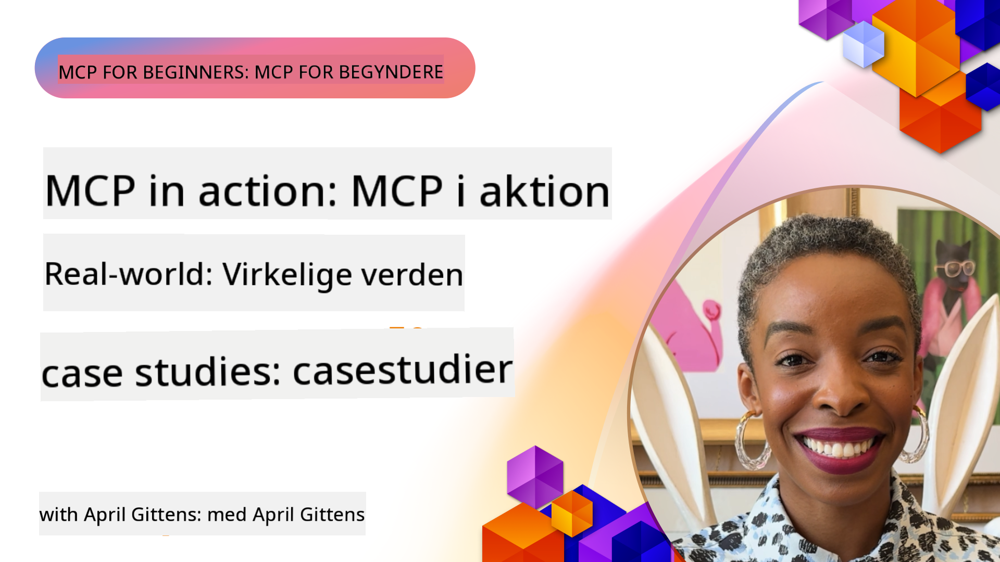

<!--
CO_OP_TRANSLATOR_METADATA:
{
  "original_hash": "1611dc5f6a2a35a789fc4c95fc5bfbe8",
  "translation_date": "2025-09-26T18:33:48+00:00",
  "source_file": "09-CaseStudy/README.md",
  "language_code": "da"
}
-->
# MCP i Aktion: Virkelige Eksempler

_(Klik på billedet ovenfor for at se videoen til denne lektion)_

Model Context Protocol (MCP) revolutionerer, hvordan AI-applikationer interagerer med data, værktøjer og tjenester. Denne sektion præsenterer virkelige eksempler, der viser praktiske anvendelser af MCP i forskellige virksomhedsscenarier.

## Oversigt

Denne sektion fremhæver konkrete eksempler på MCP-implementeringer og viser, hvordan organisationer udnytter protokollen til at løse komplekse forretningsudfordringer. Ved at undersøge disse eksempler får du indsigt i MCP's alsidighed, skalerbarhed og praktiske fordele i virkelige situationer.

## Centrale Læringsmål

Ved at udforske disse eksempler vil du:

- Forstå, hvordan MCP kan anvendes til at løse specifikke forretningsproblemer
- Lære om forskellige integrationsmønstre og arkitektoniske tilgange
- Genkende bedste praksis for implementering af MCP i virksomhedsmiljøer
- Få indsigt i de udfordringer og løsninger, der opstår i virkelige implementeringer
- Identificere muligheder for at anvende lignende mønstre i dine egne projekter

## Udvalgte Eksempler

### 1. [Azure AI Rejseagenter – Referenceimplementering](./travelagentsample.md)

Dette eksempel undersøger Microsofts omfattende referenceløsning, der demonstrerer, hvordan man bygger en multi-agent, AI-drevet rejseplanlægningsapplikation ved hjælp af MCP, Azure OpenAI og Azure AI Search. Projektet fremhæver:

- Multi-agent orkestrering via MCP
- Integration af virksomhedsdata med Azure AI Search
- Sikker, skalerbar arkitektur ved hjælp af Azure-tjenester
- Udvidelige værktøjer med genanvendelige MCP-komponenter
- Konversationsbaseret brugeroplevelse drevet af Azure OpenAI

Arkitekturen og implementeringsdetaljerne giver værdifuld indsigt i opbygning af komplekse, multi-agent systemer med MCP som koordineringslag.

### 2. [Opdatering af Azure DevOps-elementer fra YouTube-data](./UpdateADOItemsFromYT.md)

Dette eksempel viser en praktisk anvendelse af MCP til automatisering af arbejdsprocesser. Det demonstrerer, hvordan MCP-værktøjer kan bruges til at:

- Udtrække data fra onlineplatforme (YouTube)
- Opdatere arbejdselementer i Azure DevOps-systemer
- Skabe gentagelige automatiseringsarbejdsprocesser
- Integrere data på tværs af forskellige systemer

Dette eksempel illustrerer, hvordan selv relativt simple MCP-implementeringer kan give betydelige effektivitetsgevinster ved at automatisere rutineopgaver og forbedre datakonsistens på tværs af systemer.

### 3. [Dokumentationshentning i realtid med MCP](./docs-mcp/README.md)

Dette eksempel guider dig gennem, hvordan du forbinder en Python-konsolklient til en Model Context Protocol (MCP)-server for at hente og logge kontekstafhængig Microsoft-dokumentation i realtid. Du lærer at:

- Forbinde til en MCP-server ved hjælp af en Python-klient og den officielle MCP SDK
- Bruge streaming HTTP-klienter til effektiv datahentning i realtid
- Kalde dokumentationsværktøjer på serveren og logge svar direkte til konsollen
- Integrere opdateret Microsoft-dokumentation i din arbejdsproces uden at forlade terminalen

Kapitlet inkluderer en praktisk opgave, en minimal fungerende kodeeksempel og links til yderligere ressourcer for dybere læring. Se den fulde gennemgang og kode i det linkede kapitel for at forstå, hvordan MCP kan transformere dokumentationsadgang og udviklerproduktivitet i konsolbaserede miljøer.

### 4. [Interaktiv Studieplan Generator Web App med MCP](./docs-mcp/README.md)

Dette eksempel viser, hvordan man bygger en interaktiv webapplikation ved hjælp af Chainlit og Model Context Protocol (MCP) til at generere personlige studieplaner for ethvert emne. Brugere kan angive et emne (såsom "AI-900 certificering") og en studielængde (f.eks. 8 uger), og appen vil give en uge-for-uge oversigt over anbefalet indhold. Chainlit muliggør en konversationsbaseret chatgrænseflade, der gør oplevelsen engagerende og tilpasselig.

- Konversationsbaseret webapp drevet af Chainlit
- Brugerstyrede prompts for emne og varighed
- Uge-for-uge indholdsanbefalinger ved hjælp af MCP
- Realtids, adaptive svar i en chatgrænseflade

Projektet illustrerer, hvordan konversationsbaseret AI og MCP kan kombineres for at skabe dynamiske, brugerdrevne uddannelsesværktøjer i et moderne webmiljø.

### 5. [Dokumentation i Editor med MCP Server i VS Code](./docs-mcp/README.md)

Dette eksempel viser, hvordan du kan bringe Microsoft Learn Docs direkte ind i dit VS Code-miljø ved hjælp af MCP-serveren—ingen grund til at skifte browserfaner! Du vil se, hvordan du:

- Søger og læser dokumentation direkte i VS Code ved hjælp af MCP-panelet eller kommandopaletten
- Refererer dokumentation og indsætter links direkte i dine README- eller kursus-markdownfiler
- Bruger GitHub Copilot og MCP sammen for sømløse, AI-drevne dokumentations- og kodearbejdsprocesser
- Validerer og forbedrer din dokumentation med realtidsfeedback og Microsoft-sourced nøjagtighed
- Integrerer MCP med GitHub workflows for kontinuerlig dokumentationsvalidering

Implementeringen inkluderer:

- Eksempel på `.vscode/mcp.json` konfiguration for nem opsætning
- Gennemgange baseret på skærmbilleder af editoroplevelsen
- Tips til at kombinere Copilot og MCP for maksimal produktivitet

Dette scenarie er ideelt for kursusforfattere, dokumentationsskrivere og udviklere, der ønsker at forblive fokuserede i deres editor, mens de arbejder med dokumentation, Copilot og valideringsværktøjer—alt sammen drevet af MCP.

### 6. [APIM MCP Server Oprettelse](./apimsample.md)

Dette eksempel giver en trin-for-trin guide til, hvordan man opretter en MCP-server ved hjælp af Azure API Management (APIM). Det dækker:

- Opsætning af en MCP-server i Azure API Management
- Eksponering af API-operationer som MCP-værktøjer
- Konfiguration af politikker for hastighedsbegrænsning og sikkerhed
- Test af MCP-serveren ved hjælp af Visual Studio Code og GitHub Copilot

Dette eksempel illustrerer, hvordan man udnytter Azures kapaciteter til at skabe en robust MCP-server, der kan bruges i forskellige applikationer og forbedre integrationen af AI-systemer med virksomhedens API'er.

### 7. [GitHub MCP Registry — Accelerering af Agentisk Integration](https://github.com/mcp)

Dette eksempel undersøger, hvordan GitHubs MCP Registry, lanceret i september 2025, adresserer en kritisk udfordring i AI-økosystemet: den fragmenterede opdagelse og implementering af Model Context Protocol (MCP)-servere.

#### Oversigt
**MCP Registry** løser problemet med spredte MCP-servere på tværs af repositories og registre, hvilket tidligere gjorde integration langsom og fejlbehæftet. Disse servere gør det muligt for AI-agenter at interagere med eksterne systemer som API'er, databaser og dokumentationskilder.

#### Problemstilling
Udviklere, der bygger agentiske arbejdsprocesser, stod over for flere udfordringer:
- **Dårlig opdagelighed** af MCP-servere på tværs af forskellige platforme
- **Redundante opsætningsspørgsmål** spredt på fora og dokumentation
- **Sikkerhedsrisici** fra uverificerede og utroværdige kilder
- **Manglende standardisering** i serverkvalitet og kompatibilitet

#### Løsningsarkitektur
GitHubs MCP Registry centraliserer betroede MCP-servere med nøglefunktioner:
- **Én-klik installation** integration via VS Code for strømlinet opsætning
- **Signal-over-støj sortering** baseret på stjerner, aktivitet og fællesskabsvalidering
- **Direkte integration** med GitHub Copilot og andre MCP-kompatible værktøjer
- **Åben bidragsmodel** der giver både fællesskabet og virksomhedspartnere mulighed for at bidrage

#### Forretningsmæssig Effekt
Registret har leveret målbare forbedringer:
- **Hurtigere onboarding** for udviklere, der bruger værktøjer som Microsoft Learn MCP Server, der streamer officiel dokumentation direkte til agenter
- **Forbedret produktivitet** via specialiserede servere som `github-mcp-server`, der muliggør naturlig sprog GitHub-automatisering (PR-oprettelse, CI-genkørsler, kode-scanning)
- **Stærkere økosystemtillid** gennem kuraterede lister og gennemsigtige konfigurationsstandarder

#### Strategisk Værdi
For praktikere, der specialiserer sig i agentlivscyklusstyring og reproducerbare arbejdsprocesser, tilbyder MCP Registry:
- **Modulær agentimplementering** med standardiserede komponenter
- **Registry-understøttede evalueringspipelines** for konsistent test og validering
- **Tværværktøjs interoperabilitet** der muliggør sømløs integration på tværs af forskellige AI-platforme

Dette eksempel viser, at MCP Registry er mere end blot et katalog—det er en grundlæggende platform for skalerbar, virkelighedsnær modelintegration og agentisk systemimplementering.

## Konklusion

Disse syv omfattende eksempler demonstrerer den bemærkelsesværdige alsidighed og praktiske anvendelser af Model Context Protocol på tværs af forskellige virkelige scenarier. Fra komplekse multi-agent rejseplanlægningssystemer og virksomhedens API-styring til strømlinede dokumentationsarbejdsprocesser og det revolutionerende GitHub MCP Registry, viser disse eksempler, hvordan MCP giver en standardiseret, skalerbar måde at forbinde AI-systemer med de værktøjer, data og tjenester, de har brug for for at levere enestående værdi.

Eksemplerne spænder over flere dimensioner af MCP-implementering:
- **Virksomhedsintegration**: Azure API Management og Azure DevOps-automatisering
- **Multi-agent orkestrering**: Rejseplanlægning med koordinerede AI-agenter
- **Udviklerproduktivitet**: VS Code-integration og dokumentationsadgang i realtid
- **Økosystemudvikling**: GitHubs MCP Registry som en grundlæggende platform
- **Uddannelsesapplikationer**: Interaktive studieplan generatorer og konversationsgrænseflader

Ved at studere disse implementeringer får du kritisk indsigt i:
- **Arkitektoniske mønstre** for forskellige skalaer og anvendelser
- **Implementeringsstrategier** der balancerer funktionalitet med vedligeholdelse
- **Sikkerheds- og skalerbarhedsovervejelser** for produktionsimplementeringer
- **Bedste praksis** for MCP-serverudvikling og klientintegration
- **Økosystemtænkning** for opbygning af sammenkoblede AI-drevne løsninger

Disse eksempler viser samlet, at MCP ikke blot er en teoretisk ramme, men en moden, produktionsklar protokol, der muliggør praktiske løsninger på komplekse forretningsudfordringer. Uanset om du bygger simple automatiseringsværktøjer eller sofistikerede multi-agent systemer, giver de mønstre og tilgange, der er illustreret her, et solidt fundament for dine egne MCP-projekter.

## Yderligere Ressourcer

- [Azure AI Travel Agents GitHub Repository](https://github.com/Azure-Samples/azure-ai-travel-agents)
- [Azure DevOps MCP Tool](https://github.com/microsoft/azure-devops-mcp)
- [Playwright MCP Tool](https://github.com/microsoft/playwright-mcp)
- [Microsoft Docs MCP Server](https://github.com/MicrosoftDocs/mcp)
- [GitHub MCP Registry — Accelerering af Agentisk Integration](https://github.com/mcp)
- [MCP Community Examples](https://github.com/microsoft/mcp)

Næste: Hands on Lab [Strømlining af AI-arbejdsprocesser: Opbygning af en MCP-server med AI Toolkit](../10-StreamliningAIWorkflowsBuildingAnMCPServerWithAIToolkit/README.md)

---

