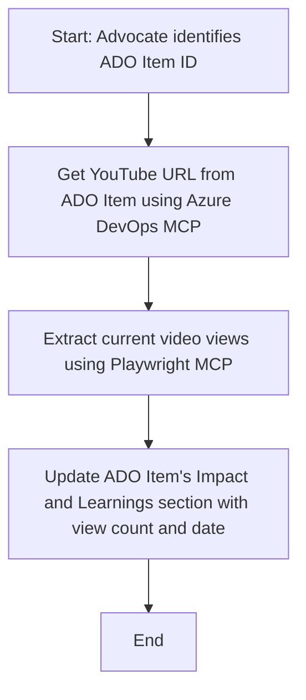

<!--
CO_OP_TRANSLATOR_METADATA:
{
  "original_hash": "14a2dfbea55ef735660a06bd6bdfe5f3",
  "translation_date": "2025-06-13T21:35:57+00:00",
  "source_file": "09-CaseStudy/UpdateADOItemsFromYT.md",
  "language_code": "da"
}
-->
# Case Study: Opdatering af Azure DevOps-elementer med data fra YouTube ved hjælp af MCP

> **Disclaimer:** Der findes allerede online værktøjer og rapporter, som kan automatisere processen med at opdatere Azure DevOps-elementer med data fra platforme som YouTube. Følgende scenarie er udelukkende et eksempel, der viser, hvordan MCP-værktøjer kan anvendes til automatisering og integration.

## Oversigt

Denne case study viser et eksempel på, hvordan Model Context Protocol (MCP) og dets værktøjer kan bruges til at automatisere opdateringen af Azure DevOps (ADO) arbejdsopgaver med information hentet fra online platforme som YouTube. Det beskrevne scenarie er blot en illustration af de bredere muligheder med disse værktøjer, som kan tilpasses mange lignende automatiseringsbehov.

I dette eksempel følger en Advocate online sessioner ved hjælp af ADO-elementer, hvor hvert element indeholder en YouTube-video-URL. Ved at bruge MCP-værktøjer kan Advocaten holde ADO-elementerne opdaterede med de nyeste videometre, såsom visningstal, på en gentagelig og automatiseret måde. Denne tilgang kan generaliseres til andre situationer, hvor information fra online kilder skal integreres i ADO eller andre systemer.

## Scenarie

En Advocate er ansvarlig for at følge op på effekten af online sessioner og community-engagement. Hver session registreres som en ADO arbejdsopgave i 'DevRel'-projektet, og arbejdsopgaven indeholder et felt til YouTube-videoens URL. For at kunne rapportere præcist om sessionens rækkevidde, skal Advocaten opdatere ADO-elementet med det aktuelle antal videoafspilninger og datoen for, hvornår denne information blev hentet.

## Brugte værktøjer

- [Azure DevOps MCP](https://github.com/microsoft/azure-devops-mcp): Muliggør programmatisk adgang og opdatering af ADO-arbejdsopgaver via MCP.
- [Playwright MCP](https://github.com/microsoft/playwright-mcp): Automatiserer browserhandlinger for at hente live data fra websider, såsom YouTube-videostatistik.

## Trin-for-trin workflow

1. **Identificer ADO-elementet**: Start med ADO-arbejdsopgavens ID (fx 1234) i 'DevRel'-projektet.
2. **Hent YouTube-URL'en**: Brug Azure DevOps MCP-værktøjet til at få YouTube-URL'en fra arbejdsopgaven.
3. **Udtræk videoafspilninger**: Brug Playwright MCP til at navigere til YouTube-URL'en og hente det aktuelle antal visninger.
4. **Opdater ADO-elementet**: Skriv det seneste visningstal og datoen for hentningen ind i 'Impact and Learnings'-sektionen af ADO-arbejdsopgaven med Azure DevOps MCP.

## Eksempel på prompt

```bash
- Work with the ADO Item ID: 1234
- The project is '2025-Awesome'
- Get the YouTube URL for the ADO item
- Use Playwright to get the current views from the YouTube video
- Update the ADO item with the current video views and the updated date of the information
```

## Mermaid flowchart



## Teknisk implementering

- **MCP Orkestrering**: Workflowet styres af en MCP-server, som koordinerer brugen af både Azure DevOps MCP og Playwright MCP-værktøjerne.
- **Automatisering**: Processen kan startes manuelt eller planlægges til at køre med faste intervaller for at holde ADO-elementerne opdaterede.
- **Udvidelsesmuligheder**: Samme mønster kan bruges til at opdatere ADO-elementer med andre online metrikker (fx likes, kommentarer) eller data fra andre platforme.

## Resultater og effekt

- **Effektivitet**: Mindsker manuelt arbejde for Advocates ved at automatisere hentning og opdatering af videometre.
- **Præcision**: Sikrer, at ADO-elementer altid afspejler de mest opdaterede data fra online kilder.
- **Gentagelighed**: Tilbyder en genanvendelig workflow til lignende scenarier med andre datakilder eller metrikker.

## Referencer

- [Azure DevOps MCP](https://github.com/microsoft/azure-devops-mcp)
- [Playwright MCP](https://github.com/microsoft/playwright-mcp)
- [Model Context Protocol (MCP)](https://modelcontextprotocol.io/)

**Ansvarsfraskrivelse**:  
Dette dokument er blevet oversat ved hjælp af AI-oversættelsestjenesten [Co-op Translator](https://github.com/Azure/co-op-translator). Selvom vi bestræber os på nøjagtighed, bedes du være opmærksom på, at automatiserede oversættelser kan indeholde fejl eller unøjagtigheder. Det oprindelige dokument på dets modersmål bør betragtes som den autoritative kilde. For kritisk information anbefales professionel menneskelig oversættelse. Vi påtager os intet ansvar for misforståelser eller fejltolkninger, der opstår som følge af brugen af denne oversættelse.