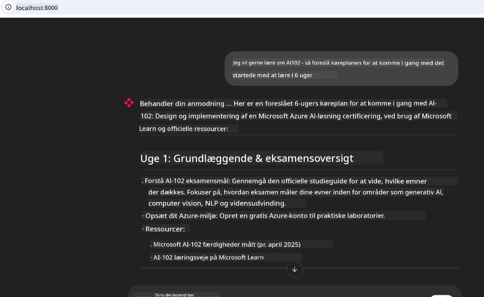
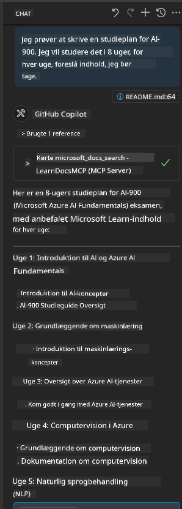

<!--
CO_OP_TRANSLATOR_METADATA:
{
  "original_hash": "4319d291c9d124ecafea52b3d04bfa0e",
  "translation_date": "2025-07-14T06:25:23+00:00",
  "source_file": "09-CaseStudy/docs-mcp/README.md",
  "language_code": "da"
}
-->
# Case Study: Forbindelse til Microsoft Learn Docs MCP-serveren fra en klient

Har du nogensinde oplevet at jonglere mellem dokumentationssider, Stack Overflow og utallige søgemaskinefaner, mens du prøver at løse et problem i din kode? Måske har du en ekstra skærm kun til dokumentation, eller du skifter konstant mellem din IDE og en browser. Ville det ikke være bedre, hvis du kunne bringe dokumentationen direkte ind i din arbejdsproces—integreret i dine apps, din IDE eller endda dine egne brugerdefinerede værktøjer? I denne case study vil vi undersøge, hvordan du præcis gør det ved at forbinde direkte til Microsoft Learn Docs MCP-serveren fra din egen klientapplikation.

## Oversigt

Moderne udvikling handler om mere end bare at skrive kode—det handler om at finde den rette information på det rette tidspunkt. Dokumentation findes overalt, men sjældent hvor du har mest brug for den: inde i dine værktøjer og arbejdsprocesser. Ved at integrere dokumentationshentning direkte i dine applikationer kan du spare tid, mindske kontekstskift og øge produktiviteten. I dette afsnit viser vi dig, hvordan du forbinder en klient til Microsoft Learn Docs MCP-serveren, så du kan få adgang til realtids- og kontekstbevidst dokumentation uden nogensinde at forlade din app.

Vi gennemgår processen med at etablere en forbindelse, sende en forespørgsel og håndtere streaming-svar effektivt. Denne tilgang strømliner ikke kun din arbejdsproces, men åbner også døren for at bygge smartere og mere hjælpsomme udviklerværktøjer.

## Læringsmål

Hvorfor gør vi dette? Fordi de bedste udvikleroplevelser er dem, der fjerner friktion. Forestil dig en verden, hvor din kodeeditor, chatbot eller webapp kan besvare dine dokumentationsspørgsmål øjeblikkeligt ved hjælp af det nyeste indhold fra Microsoft Learn. Når du er færdig med dette kapitel, vil du kunne:

- Forstå grundlæggende MCP server-klient kommunikation for dokumentation
- Implementere en konsol- eller webapplikation, der forbinder til Microsoft Learn Docs MCP-serveren
- Bruge streaming HTTP-klienter til realtidsdokumentationshentning
- Logge og fortolke dokumentationssvar i din applikation

Du vil se, hvordan disse færdigheder kan hjælpe dig med at bygge værktøjer, der ikke bare er reaktive, men virkelig interaktive og kontekstbevidste.

## Scenario 1 - Realtidsdokumentationshentning med MCP

I dette scenario viser vi dig, hvordan du forbinder en klient til Microsoft Learn Docs MCP-serveren, så du kan få adgang til realtids- og kontekstbevidst dokumentation uden nogensinde at forlade din app.

Lad os prøve det i praksis. Din opgave er at skrive en app, der forbinder til Microsoft Learn Docs MCP-serveren, kalder `microsoft_docs_search` værktøjet og logger det streamede svar til konsollen.

### Hvorfor denne tilgang?
Fordi det er fundamentet for at bygge mere avancerede integrationer—uanset om du vil drive en chatbot, en IDE-udvidelse eller et webdashboard.

Du finder koden og instruktionerne til dette scenario i [`solution`](./solution/README.md) mappen i denne case study. Trinnene guider dig gennem opsætningen af forbindelsen:
- Brug den officielle MCP SDK og en streambar HTTP-klient til forbindelsen
- Kald `microsoft_docs_search` værktøjet med en forespørgselsparameter for at hente dokumentation
- Implementer korrekt logning og fejlhåndtering
- Opret en interaktiv konsolgrænseflade, så brugere kan indtaste flere søgeforespørgsler

Dette scenario demonstrerer, hvordan man:
- Forbinder til Docs MCP-serveren
- Sender en forespørgsel
- Parser og udskriver resultaterne

Sådan kan det se ud, når løsningen kører:

```
Prompt> What is Azure Key Vault?
Answer> Azure Key Vault is a cloud service for securely storing and accessing secrets. ...
```

Nedenfor er et minimalt eksempel på en løsning. Den fulde kode og detaljer findes i solution-mappen.

<details>
<summary>Python</summary>

```python
import asyncio
from mcp.client.streamable_http import streamablehttp_client
from mcp import ClientSession

async def main():
    async with streamablehttp_client("https://learn.microsoft.com/api/mcp") as (read_stream, write_stream, _):
        async with ClientSession(read_stream, write_stream) as session:
            await session.initialize()
            result = await session.call_tool("microsoft_docs_search", {"query": "Azure Functions best practices"})
            print(result.content)

if __name__ == "__main__":
    asyncio.run(main())
```

- For den komplette implementering og logning, se [`scenario1.py`](../../../../09-CaseStudy/docs-mcp/solution/python/scenario1.py).
- For installations- og brugsvejledning, se [`README.md`](./solution/python/README.md) filen i samme mappe.
</details>

## Scenario 2 - Interaktiv studieplan-generator webapp med MCP

I dette scenario lærer du, hvordan du integrerer Docs MCP i et webudviklingsprojekt. Målet er at give brugerne mulighed for at søge i Microsoft Learn dokumentationen direkte fra en webgrænseflade, så dokumentationen bliver øjeblikkeligt tilgængelig i din app eller på dit site.

Du vil se, hvordan du:
- Opsætter en webapp
- Forbinder til Docs MCP-serveren
- Håndterer brugerinput og viser resultater

Sådan kan det se ud, når løsningen kører:

```
User> I want to learn about AI102 - so suggest the roadmap to get it started from learn for 6 weeks

Assistant> Here’s a detailed 6-week roadmap to start your preparation for the AI-102: Designing and Implementing a Microsoft Azure AI Solution certification, using official Microsoft resources and focusing on exam skills areas:

---
## Week 1: Introduction & Fundamentals
- **Understand the Exam**: Review the [AI-102 exam skills outline](https://learn.microsoft.com/en-us/credentials/certifications/exams/ai-102/).
- **Set up Azure**: Sign up for a free Azure account if you don't have one.
- **Learning Path**: [Introduction to Azure AI services](https://learn.microsoft.com/en-us/training/modules/intro-to-azure-ai/)
- **Focus**: Get familiar with Azure portal, AI capabilities, and necessary tools.

....more weeks of the roadmap...

Let me know if you want module-specific recommendations or need more customized weekly tasks!
```

Nedenfor er et minimalt eksempel på en løsning. Den fulde kode og detaljer findes i solution-mappen.



<details>
<summary>Python (Chainlit)</summary>

Chainlit er et framework til at bygge konverserende AI-webapps. Det gør det nemt at skabe interaktive chatbots og assistenter, der kan kalde MCP-værktøjer og vise resultater i realtid. Det er ideelt til hurtig prototyping og brugervenlige grænseflader.

```python
import chainlit as cl
import requests

MCP_URL = "https://learn.microsoft.com/api/mcp"

@cl.on_message
def handle_message(message):
    query = {"question": message}
    response = requests.post(MCP_URL, json=query)
    if response.ok:
        result = response.json()
        cl.Message(content=result.get("answer", "No answer found.")).send()
    else:
        cl.Message(content="Error: " + response.text).send()
```

- For den komplette implementering, se [`scenario2.py`](../../../../09-CaseStudy/docs-mcp/solution/python/scenario2.py).
- For opsætning og kørsel, se [`README.md`](./solution/python/README.md).
</details>

## Scenario 3: In-Editor Docs med MCP-server i VS Code

Hvis du vil have Microsoft Learn Docs direkte ind i din VS Code (i stedet for at skifte browserfaner), kan du bruge MCP-serveren i din editor. Det giver dig mulighed for at:
- Søge og læse dokumentation i VS Code uden at forlade dit kode-miljø.
- Referere dokumentation og indsætte links direkte i dine README- eller kursusfiler.
- Udnytte GitHub Copilot og MCP sammen for en problemfri, AI-drevet dokumentationsarbejdsgang.

**Du vil lære at:**
- Tilføje en gyldig `.vscode/mcp.json` fil til din workspace root (se eksempel nedenfor).
- Åbne MCP-panelet eller bruge kommandopaletten i VS Code til at søge og indsætte dokumentation.
- Referere dokumentation direkte i dine markdown-filer, mens du arbejder.
- Kombinere denne arbejdsgang med GitHub Copilot for endnu større produktivitet.

Her er et eksempel på, hvordan du opsætter MCP-serveren i VS Code:

```json
{
  "servers": {
    "LearnDocsMCP": {
      "url": "https://learn.microsoft.com/api/mcp"
    }
  }
}
```

</details>

> For en detaljeret gennemgang med screenshots og trin-for-trin guide, se [`README.md`](./solution/scenario3/README.md).



Denne tilgang er ideel for alle, der bygger tekniske kurser, skriver dokumentation eller udvikler kode med hyppige referencebehov.

## Vigtige pointer

At integrere dokumentation direkte i dine værktøjer er ikke bare en bekvemmelighed—det er en game changer for produktiviteten. Ved at forbinde til Microsoft Learn Docs MCP-serveren fra din klient kan du:

- Eliminere kontekstskift mellem din kode og dokumentation
- Hente opdateret, kontekstbevidst dokumentation i realtid
- Bygge smartere, mere interaktive udviklerværktøjer

Disse færdigheder hjælper dig med at skabe løsninger, der ikke kun er effektive, men også behagelige at bruge.

## Yderligere ressourcer

For at uddybe din forståelse, udforsk disse officielle ressourcer:

- [Microsoft Learn Docs MCP Server (GitHub)](https://github.com/MicrosoftDocs/mcp)
- [Kom godt i gang med Azure MCP Server (mcp-python)](https://learn.microsoft.com/en-us/azure/developer/azure-mcp-server/get-started#create-the-python-app)
- [Hvad er Azure MCP Server?](https://learn.microsoft.com/en-us/azure/developer/azure-mcp-server/)
- [Model Context Protocol (MCP) Introduktion](https://modelcontextprotocol.io/introduction)
- [Tilføj plugins fra en MCP Server (Python)](https://learn.microsoft.com/en-us/semantic-kernel/concepts/plugins/adding-mcp-plugins)

**Ansvarsfraskrivelse**:  
Dette dokument er blevet oversat ved hjælp af AI-oversættelsestjenesten [Co-op Translator](https://github.com/Azure/co-op-translator). Selvom vi bestræber os på nøjagtighed, bedes du være opmærksom på, at automatiserede oversættelser kan indeholde fejl eller unøjagtigheder. Det oprindelige dokument på dets oprindelige sprog bør betragtes som den autoritative kilde. For kritisk information anbefales professionel menneskelig oversættelse. Vi påtager os intet ansvar for misforståelser eller fejltolkninger, der opstår som følge af brugen af denne oversættelse.