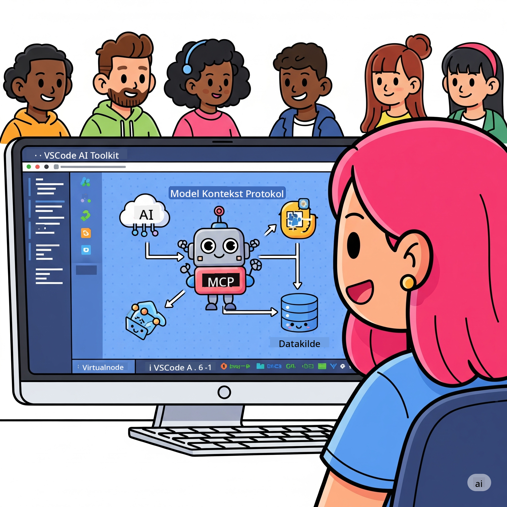

<!--
CO_OP_TRANSLATOR_METADATA:
{
  "original_hash": "787440926586cd064b0899fd1c514f52",
  "translation_date": "2025-07-14T07:08:33+00:00",
  "source_file": "10-StreamliningAIWorkflowsBuildingAnMCPServerWithAIToolkit/README.md",
  "language_code": "da"
}
-->
# Effektivisering af AI-workflows: Byg en MCP-server med AI Toolkit

## 🎯 Oversigt

Velkommen til **Model Context Protocol (MCP) Workshoppen**! Denne omfattende hands-on workshop kombinerer to banebrydende teknologier, der vil revolutionere udviklingen af AI-applikationer:

- **🔗 Model Context Protocol (MCP)**: En åben standard for problemfri integration af AI-værktøjer
- **🛠️ AI Toolkit til Visual Studio Code (AITK)**: Microsofts kraftfulde AI-udviklingsudvidelse

### 🎓 Hvad du vil lære

Når du er færdig med workshoppen, vil du mestre kunsten at bygge intelligente applikationer, der forbinder AI-modeller med virkelige værktøjer og tjenester. Fra automatiseret test til tilpassede API-integrationer får du praktiske færdigheder til at løse komplekse forretningsudfordringer.

## 🏗️ Teknologistak

### 🔌 Model Context Protocol (MCP)

MCP er **"USB-C for AI"** – en universel standard, der forbinder AI-modeller med eksterne værktøjer og datakilder.

**✨ Nøglefunktioner:**
- 🔄 **Standardiseret integration**: Universelt interface til AI-værktøjsforbindelser
- 🏛️ **Fleksibel arkitektur**: Lokale og fjernservere via stdio/SSE transport
- 🧰 **Rigt økosystem**: Værktøjer, prompts og ressourcer samlet i ét protokol
- 🔒 **Klar til erhverv**: Indbygget sikkerhed og pålidelighed

**🎯 Hvorfor MCP er vigtigt:**
Ligesom USB-C fjernede kabelkaos, fjerner MCP kompleksiteten ved AI-integrationer. Én protokol, uendelige muligheder.

### 🤖 AI Toolkit til Visual Studio Code (AITK)

Microsofts flagskibsudvidelse til AI-udvikling, der forvandler VS Code til en AI-kraftstation.

**🚀 Kernefunktioner:**
- 📦 **Modelkatalog**: Adgang til modeller fra Azure AI, GitHub, Hugging Face, Ollama
- ⚡ **Lokal inferens**: ONNX-optimeret CPU/GPU/NPU-udførelse
- 🏗️ **Agent Builder**: Visuel AI-agentudvikling med MCP-integration
- 🎭 **Multi-modal**: Understøttelse af tekst, vision og struktureret output

**💡 Fordele ved udvikling:**
- Nul-konfigurations modeludrulning
- Visuel prompt-engineering
- Real-time testmiljø
- Problemfri MCP-serverintegration

## 📚 Læringsrejse

### [🚀 Modul 1: AI Toolkit Grundlæggende](./lab1/README.md)
**Varighed**: 15 minutter
- 🛠️ Installer og konfigurer AI Toolkit til VS Code
- 🗂️ Udforsk Modelkataloget (100+ modeller fra GitHub, ONNX, OpenAI, Anthropic, Google)
- 🎮 Bliv fortrolig med det interaktive testmiljø til real-time modelafprøvning
- 🤖 Byg din første AI-agent med Agent Builder
- 📊 Evaluer modelpræstation med indbyggede metrikker (F1, relevans, lighed, sammenhæng)
- ⚡ Lær om batch-behandling og multi-modal understøttelse

**🎯 Læringsmål**: Skab en funktionel AI-agent med en grundig forståelse af AITK’s muligheder

### [🌐 Modul 2: MCP med AI Toolkit Grundlæggende](./lab2/README.md)
**Varighed**: 20 minutter
- 🧠 Bliv ekspert i Model Context Protocol (MCP) arkitektur og koncepter
- 🌐 Udforsk Microsofts MCP-serverøkosystem
- 🤖 Byg en browserautomatiseringsagent med Playwright MCP-server
- 🔧 Integrer MCP-servere med AI Toolkit Agent Builder
- 📊 Konfigurer og test MCP-værktøjer i dine agenter
- 🚀 Eksportér og deployér MCP-drevne agenter til produktion

**🎯 Læringsmål**: Udrul en AI-agent med ekstern værktøjsintegration via MCP

### [🔧 Modul 3: Avanceret MCP-udvikling med AI Toolkit](./lab3/README.md)
**Varighed**: 20 minutter
- 💻 Skab tilpassede MCP-servere med AI Toolkit
- 🐍 Konfigurer og brug den nyeste MCP Python SDK (v1.9.3)
- 🔍 Opsæt og brug MCP Inspector til fejlfinding
- 🛠️ Byg en Weather MCP Server med professionelle debugging-workflows
- 🧪 Debug MCP-servere i både Agent Builder og Inspector miljøer

**🎯 Læringsmål**: Udvikl og fejlret tilpassede MCP-servere med moderne værktøjer

### [🐙 Modul 4: Praktisk MCP-udvikling – Tilpasset GitHub Clone Server](./lab4/README.md)
**Varighed**: 30 minutter
- 🏗️ Byg en reel GitHub Clone MCP Server til udviklingsworkflows
- 🔄 Implementer smart repository-kloning med validering og fejlhåndtering
- 📁 Skab intelligent mappehåndtering og VS Code-integration
- 🤖 Brug GitHub Copilot Agent Mode med tilpassede MCP-værktøjer
- 🛡️ Anvend produktionsklar pålidelighed og tværplatformskompatibilitet

**🎯 Læringsmål**: Udrul en produktionsklar MCP-server, der effektiviserer reelle udviklingsprocesser

## 💡 Anvendelser i praksis & effekt

### 🏢 Erhvervsbrug

#### 🔄 DevOps-automatisering
Forvandl din udviklingsproces med intelligent automatisering:
- **Smart repository management**: AI-drevet kodegennemgang og merge-beslutninger
- **Intelligent CI/CD**: Automatiseret pipelineoptimering baseret på kodeændringer
- **Issue triage**: Automatisk klassificering og tildeling af fejl

#### 🧪 Kvalitetssikringsrevolution
Forbedr testning med AI-drevet automatisering:
- **Intelligent testgenerering**: Automatisk oprettelse af omfattende testsuiter
- **Visuel regressions-test**: AI-drevet UI-ændringsdetektion
- **Performanceovervågning**: Proaktiv identifikation og løsning af problemer

#### 📊 Data pipeline-intelligens
Byg smartere databehandlingsworkflows:
- **Adaptive ETL-processer**: Selvoptimerende datatransformationer
- **Anomalidetektion**: Real-time overvågning af datakvalitet
- **Intelligent routing**: Smart styring af dataflow

#### 🎧 Forbedring af kundeoplevelsen
Skab enestående kundekontakter:
- **Kontekstbevidst support**: AI-agenter med adgang til kundehistorik
- **Proaktiv problemløsning**: Forudsigende kundeservice
- **Multi-kanal integration**: En samlet AI-oplevelse på tværs af platforme

## 🛠️ Forudsætninger & opsætning

### 💻 Systemkrav

| Komponent           | Krav                  | Noter                  |
|---------------------|-----------------------|------------------------|
| **Operativsystem**   | Windows 10+, macOS 10.15+, Linux | Ethvert moderne OS      |
| **Visual Studio Code** | Seneste stabile version | Påkrævet til AITK      |
| **Node.js**          | v18.0+ og npm         | Til MCP-serverudvikling |
| **Python**           | 3.10+                 | Valgfrit til Python MCP-servere |
| **Hukommelse**       | Minimum 8GB RAM       | 16GB anbefales til lokale modeller |

### 🔧 Udviklingsmiljø

#### Anbefalede VS Code-udvidelser
- **AI Toolkit** (ms-windows-ai-studio.windows-ai-studio)
- **Python** (ms-python.python)
- **Python Debugger** (ms-python.debugpy)
- **GitHub Copilot** (GitHub.copilot) – Valgfri, men nyttig

#### Valgfrie værktøjer
- **uv**: Moderne Python-pakkestyring
- **MCP Inspector**: Visuelt debugging-værktøj til MCP-servere
- **Playwright**: Til webautomatiseringseksempler

## 🎖️ Læringsmål & certificeringsvej

### 🏆 Kompetencetjekliste

Ved at gennemføre denne workshop opnår du ekspertise inden for:

#### 🎯 Kernekompetencer
- [ ] **MCP Protokol Ekspertise**: Dyb forståelse af arkitektur og implementeringsmønstre
- [ ] **AITK Færdigheder**: Ekspertbrug af AI Toolkit til hurtig udvikling
- [ ] **Tilpasset serverudvikling**: Byg, deployér og vedligehold produktions-MCP-servere
- [ ] **Værktøjsintegration**: Problemfri sammenkobling af AI med eksisterende udviklingsworkflows
- [ ] **Problemløsning**: Anvend lærte færdigheder på reelle forretningsudfordringer

#### 🔧 Tekniske færdigheder
- [ ] Opsæt og konfigurer AI Toolkit i VS Code
- [ ] Design og implementer tilpassede MCP-servere
- [ ] Integrer GitHub-modeller med MCP-arkitektur
- [ ] Byg automatiserede testworkflows med Playwright
- [ ] Deployér AI-agenter til produktion
- [ ] Debug og optimer MCP-serveres ydeevne

#### 🚀 Avancerede evner
- [ ] Arkitekturer AI-integrationer i virksomhedsskala
- [ ] Implementer sikkerhedspraksis for AI-applikationer
- [ ] Design skalerbare MCP-serverarkitekturer
- [ ] Skab tilpassede værktøjskæder til specifikke domæner
- [ ] Vejled andre i AI-native udvikling

## 📖 Yderligere ressourcer
- [MCP Specification](https://modelcontextprotocol.io/docs)
- [AI Toolkit GitHub Repository](https://github.com/microsoft/vscode-ai-toolkit)
- [Sample MCP Servers Collection](https://github.com/modelcontextprotocol/servers)
- [Best Practices Guide](https://modelcontextprotocol.io/docs/best-practices)

---

**🚀 Klar til at revolutionere din AI-udviklingsworkflow?**

Lad os sammen bygge fremtidens intelligente applikationer med MCP og AI Toolkit!

**Ansvarsfraskrivelse**:  
Dette dokument er blevet oversat ved hjælp af AI-oversættelsestjenesten [Co-op Translator](https://github.com/Azure/co-op-translator). Selvom vi bestræber os på nøjagtighed, bedes du være opmærksom på, at automatiserede oversættelser kan indeholde fejl eller unøjagtigheder. Det oprindelige dokument på dets oprindelige sprog bør betragtes som den autoritative kilde. For kritisk information anbefales professionel menneskelig oversættelse. Vi påtager os intet ansvar for misforståelser eller fejltolkninger, der opstår som følge af brugen af denne oversættelse.