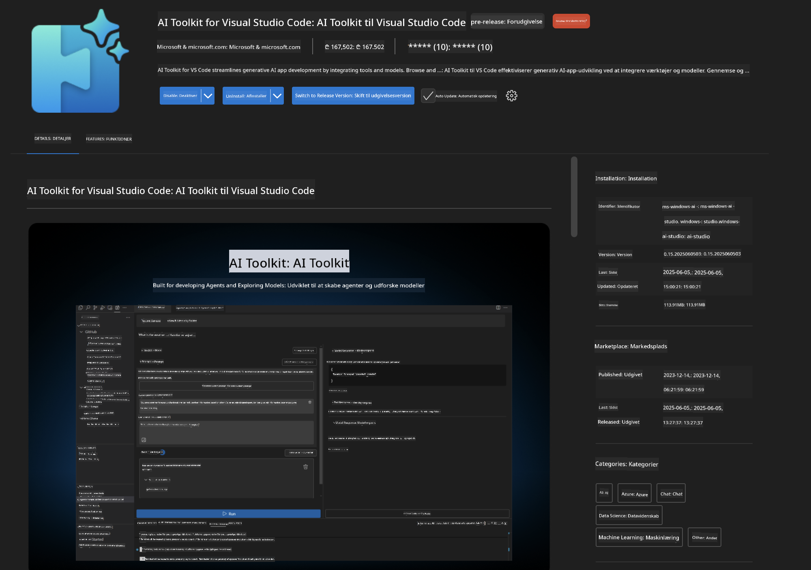
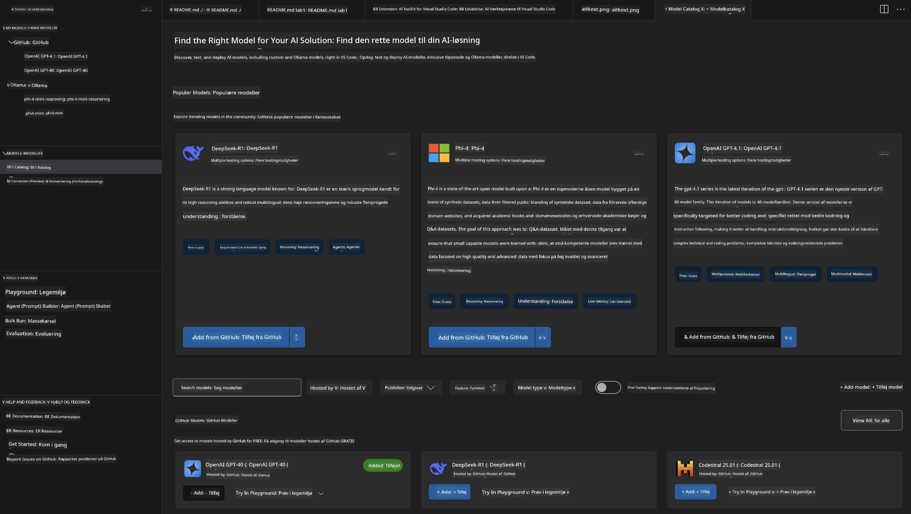
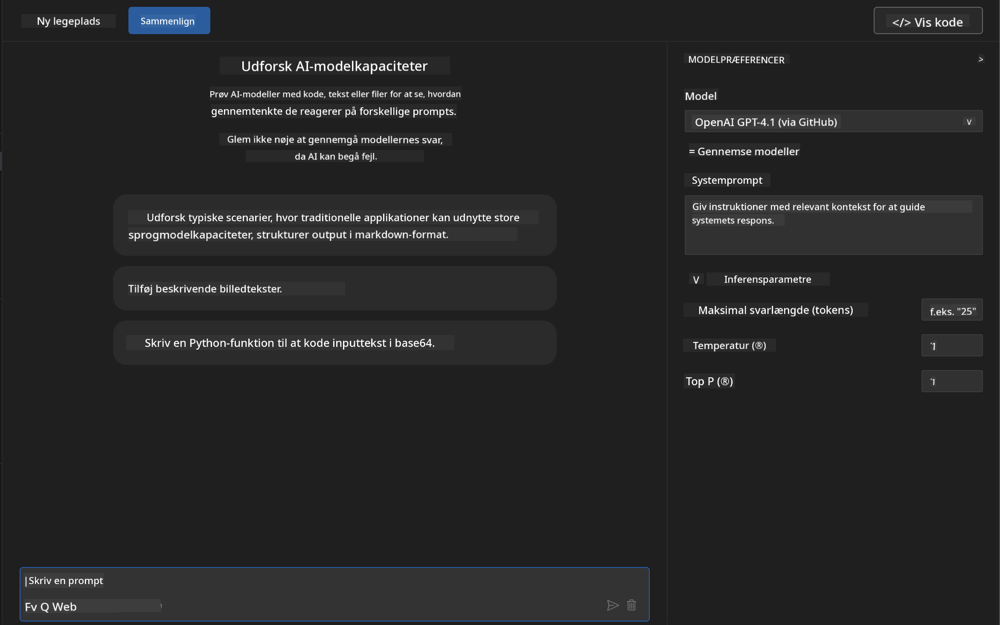
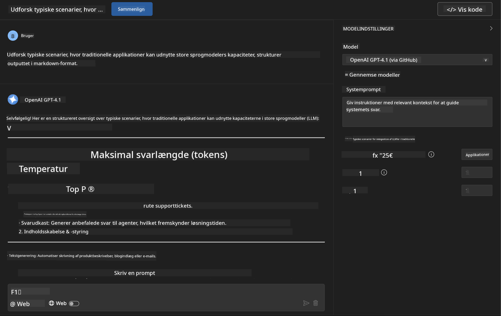
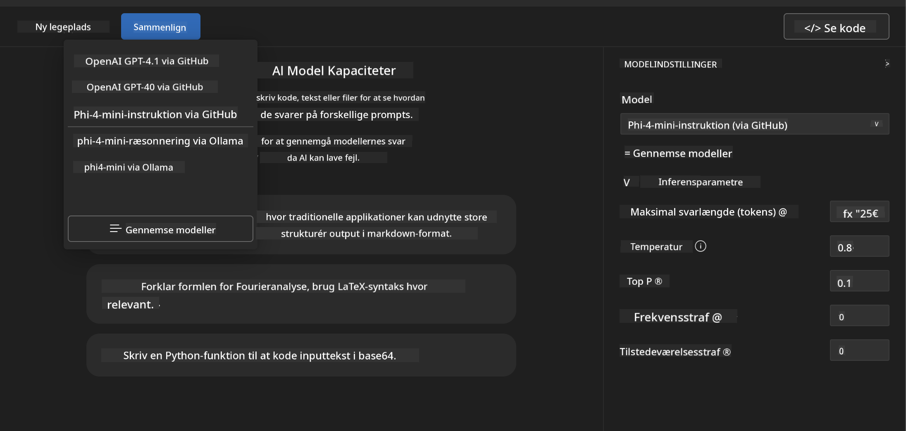
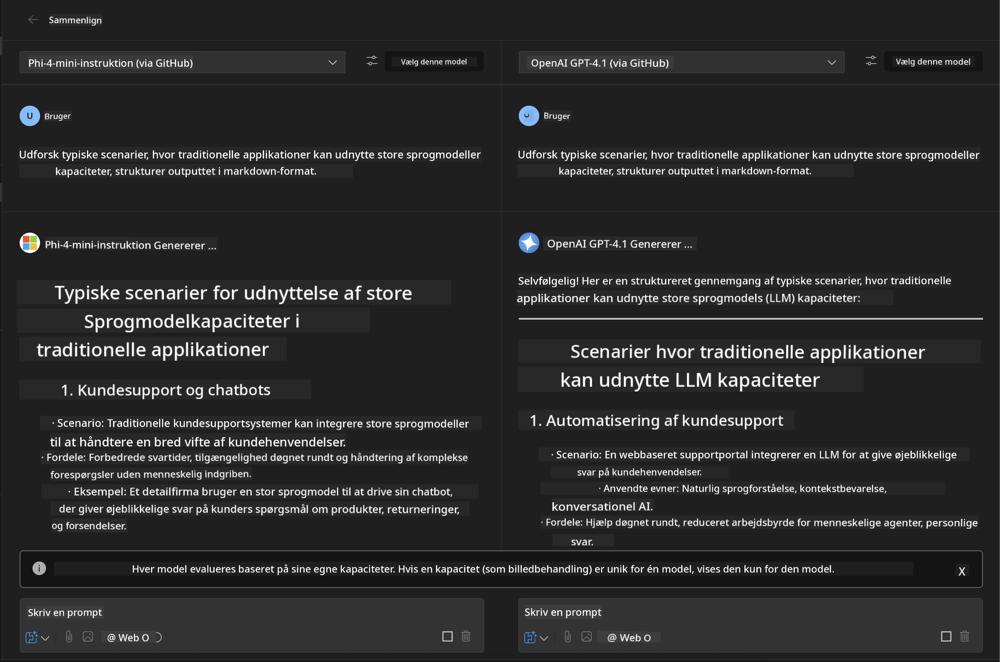
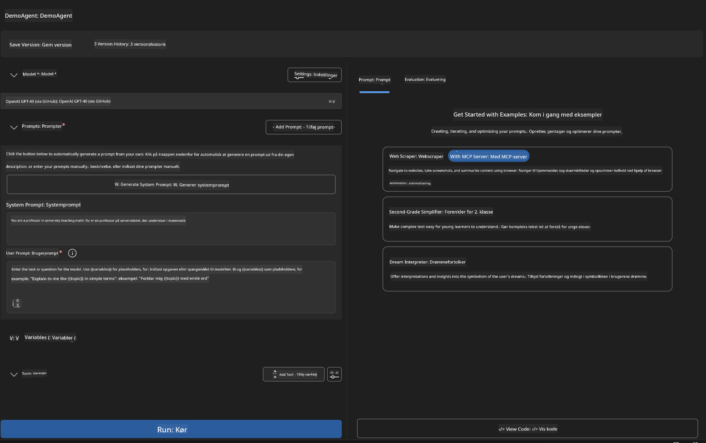
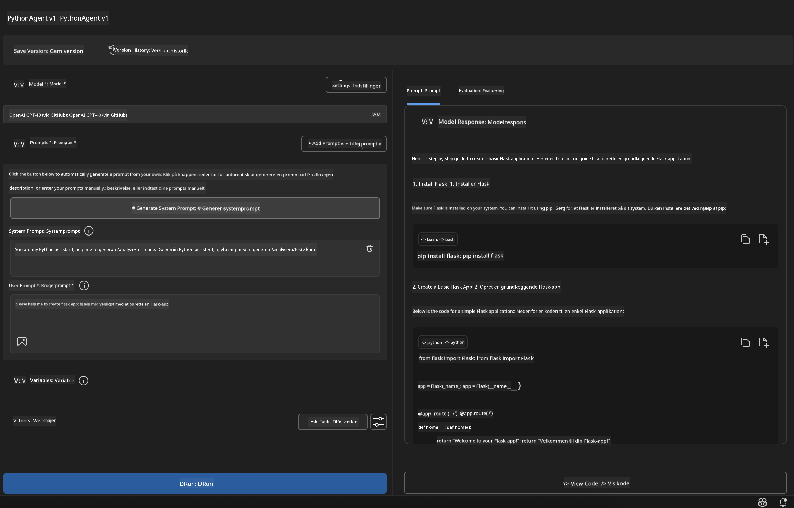

<!--
CO_OP_TRANSLATOR_METADATA:
{
  "original_hash": "2aa9dbc165e104764fa57e8a0d3f1c73",
  "translation_date": "2025-07-14T07:28:41+00:00",
  "source_file": "10-StreamliningAIWorkflowsBuildingAnMCPServerWithAIToolkit/lab1/README.md",
  "language_code": "da"
}
-->
# 🚀 Modul 1: Grundlæggende om AI Toolkit

[]()
[]()
[]()

## 📋 Læringsmål

Når du er færdig med dette modul, vil du kunne:
- ✅ Installere og konfigurere AI Toolkit til Visual Studio Code
- ✅ Navigere i Modelkataloget og forstå forskellige modelkilder
- ✅ Bruge Playground til modeltest og eksperimenter
- ✅ Oprette tilpassede AI-agenter med Agent Builder
- ✅ Sammenligne modelpræstationer på tværs af forskellige udbydere
- ✅ Anvende bedste praksis inden for prompt engineering

## 🧠 Introduktion til AI Toolkit (AITK)

**AI Toolkit til Visual Studio Code** er Microsofts flagskibsudvidelse, der forvandler VS Code til et komplet AI-udviklingsmiljø. Den bygger bro mellem AI-forskning og praktisk applikationsudvikling og gør generativ AI tilgængelig for udviklere på alle niveauer.

### 🌟 Nøglefunktioner

| Funktion | Beskrivelse | Anvendelsestilfælde |
|---------|-------------|---------------------|
| **🗂️ Modelkatalog** | Adgang til 100+ modeller fra GitHub, ONNX, OpenAI, Anthropic, Google | Modelopdagelse og valg |
| **🔌 BYOM Support** | Integrer dine egne modeller (lokale/fjern) | Tilpasset modeludrulning |
| **🎮 Interaktiv Playground** | Realtidstest af modeller med chat-interface | Hurtig prototyping og test |
| **📎 Multimodal Support** | Håndter tekst, billeder og vedhæftninger | Komplekse AI-applikationer |
| **⚡ Batchbehandling** | Kør flere prompts samtidigt | Effektive testarbejdsgange |
| **📊 Modellevaluering** | Indbyggede metrikker (F1, relevans, lighed, sammenhæng) | Præstationsvurdering |

### 🎯 Hvorfor AI Toolkit er vigtigt

- **🚀 Hurtigere udvikling**: Fra idé til prototype på få minutter
- **🔄 Samlet arbejdsgang**: Én grænseflade til flere AI-udbydere
- **🧪 Nem eksperimentering**: Sammenlign modeller uden kompliceret opsætning
- **📈 Klar til produktion**: Problemfri overgang fra prototype til implementering

## 🛠️ Forudsætninger & Opsætning

### 📦 Installer AI Toolkit-udvidelsen

**Trin 1: Åbn Extensions Marketplace**
1. Åbn Visual Studio Code
2. Gå til Extensions-visningen (`Ctrl+Shift+X` eller `Cmd+Shift+X`)
3. Søg efter "AI Toolkit"

**Trin 2: Vælg din version**
- **🟢 Release**: Anbefalet til produktionsbrug
- **🔶 Pre-release**: Tidlig adgang til nye funktioner

**Trin 3: Installer og aktiver**



### ✅ Tjekliste for verifikation
- [ ] AI Toolkit-ikon vises i VS Code’s sidebjælke
- [ ] Udvidelsen er aktiveret og i brug
- [ ] Ingen installationsfejl i output-panelet

## 🧪 Praktisk øvelse 1: Udforsk GitHub-modeller

**🎯 Mål**: Bliv fortrolig med Modelkataloget og test din første AI-model

### 📊 Trin 1: Naviger i Modelkataloget

Modelkataloget er din indgang til AI-økosystemet. Det samler modeller fra flere udbydere, så det er nemt at finde og sammenligne muligheder.

**🔍 Navigationsvejledning:**

Klik på **MODELS - Catalog** i AI Toolkit’s sidebjælke



**💡 Pro tip**: Kig efter modeller med specifikke egenskaber, der matcher dit brugsscenarie (f.eks. kodegenerering, kreativ skrivning, analyse).

**⚠️ Bemærk**: GitHub-hostede modeller (dvs. GitHub Models) er gratis at bruge, men er underlagt begrænsninger på antal forespørgsler og tokens. Hvis du vil tilgå ikke-GitHub-modeller (eksterne modeller hostet via Azure AI eller andre endpoints), skal du angive den relevante API-nøgle eller autentificering.

### 🚀 Trin 2: Tilføj og konfigurer din første model

**Modelvalgstrategi:**
- **GPT-4.1**: Bedst til komplekse ræsonnementer og analyser
- **Phi-4-mini**: Letvægtsmodel, hurtige svar til simple opgaver

**🔧 Konfigurationsproces:**
1. Vælg **OpenAI GPT-4.1** i kataloget
2. Klik på **Add to My Models** – dette registrerer modellen til brug
3. Vælg **Try in Playground** for at åbne testmiljøet
4. Vent på modelinitialisering (første gang kan tage lidt tid)



**⚙️ Forståelse af modelparametre:**
- **Temperature**: Styrer kreativitet (0 = deterministisk, 1 = kreativ)
- **Max Tokens**: Maksimal svarlængde
- **Top-p**: Nucleus sampling for svarvariation

### 🎯 Trin 3: Bliv mester i Playground-interface

Playground er dit AI-eksperimentlaboratorium. Sådan får du mest ud af det:

**🎨 Bedste praksis for prompt engineering:**
1. **Vær specifik**: Klare, detaljerede instruktioner giver bedre resultater
2. **Giv kontekst**: Inkluder relevant baggrundsinformation
3. **Brug eksempler**: Vis modellen, hvad du ønsker med eksempler
4. **Iterer**: Forfin prompts baseret på de første resultater

**🧪 Testscenarier:**
```markdown
# Example 1: Code Generation
"Write a Python function that calculates the factorial of a number using recursion. Include error handling and docstrings."

# Example 2: Creative Writing
"Write a professional email to a client explaining a project delay, maintaining a positive tone while being transparent about challenges."

# Example 3: Data Analysis
"Analyze this sales data and provide insights: [paste your data]. Focus on trends, anomalies, and actionable recommendations."
```



### 🏆 Udfordringsøvelse: Sammenligning af modelpræstationer

**🎯 Mål**: Sammenlign forskellige modeller med identiske prompts for at forstå deres styrker

**📋 Instruktioner:**
1. Tilføj **Phi-4-mini** til dit workspace
2. Brug samme prompt til både GPT-4.1 og Phi-4-mini



3. Sammenlign svarenes kvalitet, hastighed og nøjagtighed
4. Dokumenter dine resultater i resultatsektionen



**💡 Vigtige indsigter at opdage:**
- Hvornår man skal bruge LLM vs. SLM
- Omkostninger vs. præstationsafvejninger
- Specialiserede egenskaber ved forskellige modeller

## 🤖 Praktisk øvelse 2: Byg tilpassede agenter med Agent Builder

**🎯 Mål**: Skab specialiserede AI-agenter tilpasset specifikke opgaver og arbejdsgange

### 🏗️ Trin 1: Forstå Agent Builder

Agent Builder er, hvor AI Toolkit virkelig skinner. Det giver dig mulighed for at skabe formålsbyggede AI-assistenter, der kombinerer kraften fra store sprogmodeller med tilpassede instruktioner, specifikke parametre og specialiseret viden.

**🧠 Agentarkitekturens komponenter:**
- **Core Model**: Grundlæggende LLM (GPT-4, Groks, Phi osv.)
- **System Prompt**: Definerer agentens personlighed og adfærd
- **Parametre**: Finjusterede indstillinger for optimal ydeevne
- **Værktøjsintegration**: Forbind til eksterne API’er og MCP-tjenester
- **Hukommelse**: Samtale-kontekst og sessionspersistens



### ⚙️ Trin 2: Dybdegående agentkonfiguration

**🎨 Skab effektive systemprompts:**
```markdown
# Template Structure:
## Role Definition
You are a [specific role] with expertise in [domain].

## Capabilities
- List specific abilities
- Define scope of knowledge
- Clarify limitations

## Behavior Guidelines
- Response style (formal, casual, technical)
- Output format preferences
- Error handling approach

## Examples
Provide 2-3 examples of ideal interactions
```

*Du kan selvfølgelig også bruge Generate System Prompt til at lade AI hjælpe dig med at generere og optimere prompts*

**🔧 Parameteroptimering:**
| Parameter | Anbefalet interval | Anvendelsestilfælde |
|-----------|--------------------|---------------------|
| **Temperature** | 0.1-0.3 | Tekniske/faktuelle svar |
| **Temperature** | 0.7-0.9 | Kreative/brainstorming-opgaver |
| **Max Tokens** | 500-1000 | Kortfattede svar |
| **Max Tokens** | 2000-4000 | Detaljerede forklaringer |

### 🐍 Trin 3: Praktisk øvelse – Python-programmeringsagent

**🎯 Mission**: Skab en specialiseret Python-kodeassistent

**📋 Konfigurationstrin:**

1. **Modelvalg**: Vælg **Claude 3.5 Sonnet** (fremragende til kode)

2. **System Prompt-design**:
```markdown
# Python Programming Expert Agent

## Role
You are a senior Python developer with 10+ years of experience. You excel at writing clean, efficient, and well-documented Python code.

## Capabilities
- Write production-ready Python code
- Debug complex issues
- Explain code concepts clearly
- Suggest best practices and optimizations
- Provide complete working examples

## Response Format
- Always include docstrings
- Add inline comments for complex logic
- Suggest testing approaches
- Mention relevant libraries when applicable

## Code Quality Standards
- Follow PEP 8 style guidelines
- Use type hints where appropriate
- Handle exceptions gracefully
- Write readable, maintainable code
```

3. **Parameterkonfiguration**:
   - Temperature: 0.2 (for konsistent, pålidelig kode)
   - Max Tokens: 2000 (detaljerede forklaringer)
   - Top-p: 0.9 (balanceret kreativitet)



### 🧪 Trin 4: Test din Python-agent

**Testscenarier:**
1. **Grundlæggende funktion**: "Lav en funktion til at finde primtal"
2. **Kompleks algoritme**: "Implementer et binært søgetræ med indsæt, slet og søg metoder"
3. **Virkelighedsnært problem**: "Byg en web scraper, der håndterer rate limiting og genforsøg"
4. **Fejlfinding**: "Ret denne kode [indsæt buggy kode]"

**🏆 Succes kriterier:**
- ✅ Koden kører uden fejl
- ✅ Indeholder korrekt dokumentation
- ✅ Følger Python bedste praksis
- ✅ Giver klare forklaringer
- ✅ Foreslår forbedringer

## 🎓 Modul 1 Opsummering & Næste skridt

### 📊 Videnstest

Test din forståelse:
- [ ] Kan du forklare forskellen mellem modellerne i kataloget?
- [ ] Har du med succes oprettet og testet en tilpasset agent?
- [ ] Forstår du, hvordan man optimerer parametre til forskellige brugsscenarier?
- [ ] Kan du designe effektive systemprompts?

### 📚 Yderligere ressourcer

- **AI Toolkit Dokumentation**: [Official Microsoft Docs](https://github.com/microsoft/vscode-ai-toolkit)
- **Prompt Engineering Guide**: [Best Practices](https://platform.openai.com/docs/guides/prompt-engineering)
- **Modeller i AI Toolkit**: [Models in Develpment](https://github.com/microsoft/vscode-ai-toolkit/blob/main/doc/models.md)

**🎉 Tillykke!** Du har mestret grundlæggende AI Toolkit og er klar til at bygge mere avancerede AI-applikationer!

### 🔜 Fortsæt til næste modul

Klar til mere avancerede funktioner? Fortsæt til **[Modul 2: MCP med AI Toolkit Fundamentals](../lab2/README.md)**, hvor du lærer at:
- Forbinde dine agenter til eksterne værktøjer via Model Context Protocol (MCP)
- Bygge browserautomatiseringsagenter med Playwright
- Integrere MCP-servere med dine AI Toolkit-agenter
- Forstærke dine agenter med eksterne data og funktioner

**Ansvarsfraskrivelse**:  
Dette dokument er blevet oversat ved hjælp af AI-oversættelsestjenesten [Co-op Translator](https://github.com/Azure/co-op-translator). Selvom vi bestræber os på nøjagtighed, bedes du være opmærksom på, at automatiserede oversættelser kan indeholde fejl eller unøjagtigheder. Det oprindelige dokument på dets oprindelige sprog bør betragtes som den autoritative kilde. For kritisk information anbefales professionel menneskelig oversættelse. Vi påtager os intet ansvar for misforståelser eller fejltolkninger, der opstår som følge af brugen af denne oversættelse.