<!--
CO_OP_TRANSLATOR_METADATA:
{
  "original_hash": "a22b7dd11cd7690f99f9195877cafdc3",
  "translation_date": "2025-06-10T05:50:29+00:00",
  "source_file": "10-StreamliningAIWorkflowsBuildingAnMCPServerWithAIToolkit/lab2/README.md",
  "language_code": "da"
}
-->
# 🌐 Modul 2: MCP med AI Toolkit Grundlæggende

[]()
[]()
[]()

## 📋 Læringsmål

Ved slutningen af dette modul vil du kunne:
- ✅ Forstå Model Context Protocol (MCP) arkitektur og fordele
- ✅ Udforske Microsofts MCP server-økosystem
- ✅ Integrere MCP servere med AI Toolkit Agent Builder
- ✅ Bygge en funktionel browser-automationsagent med Playwright MCP
- ✅ Konfigurere og teste MCP værktøjer i dine agenter
- ✅ Eksportere og implementere MCP-drevne agenter til produktion

## 🎯 Byg videre på Modul 1

I Modul 1 mestrede vi AI Toolkit grundlæggende og oprettede vores første Python Agent. Nu vil vi **supercharge** dine agenter ved at forbinde dem til eksterne værktøjer og tjenester gennem den banebrydende **Model Context Protocol (MCP)**.

Tænk på det som at opgradere fra en simpel lommeregner til en fuld computer – dine AI agenter får evnen til at:
- 🌐 Gennemse og interagere med hjemmesider
- 📁 Tilgå og manipulere filer
- 🔧 Integrere med virksomheds systemer
- 📊 Behandle realtidsdata fra API’er

## 🧠 Forstå Model Context Protocol (MCP)

### 🔍 Hvad er MCP?

Model Context Protocol (MCP) er **"USB-C for AI applikationer"** – en revolutionerende åben standard, der forbinder store sprogmodeller (LLMs) til eksterne værktøjer, datakilder og tjenester. Ligesom USB-C fjernede kabelrod ved at samle alt i ét stik, fjerner MCP kompleksiteten ved AI-integration med én standardiseret protokol.

### 🎯 Problemet MCP løser

**Før MCP:**
- 🔧 Skræddersyede integrationer for hvert værktøj
- 🔄 Leverandørlås med proprietære løsninger  
- 🔒 Sikkerhedsrisici ved ad hoc-forbindelser
- ⏱️ Måneder til udvikling af grundlæggende integrationer

**Med MCP:**
- ⚡ Plug-and-play værktøjsintegration
- 🔄 Leverandøruafhængig arkitektur
- 🛡️ Indbyggede sikkerhedsbest practices
- 🚀 Minutter til at tilføje nye funktioner

### 🏗️ MCP Arkitektur i dybden

MCP følger en **client-server arkitektur**, der skaber et sikkert, skalerbart økosystem:

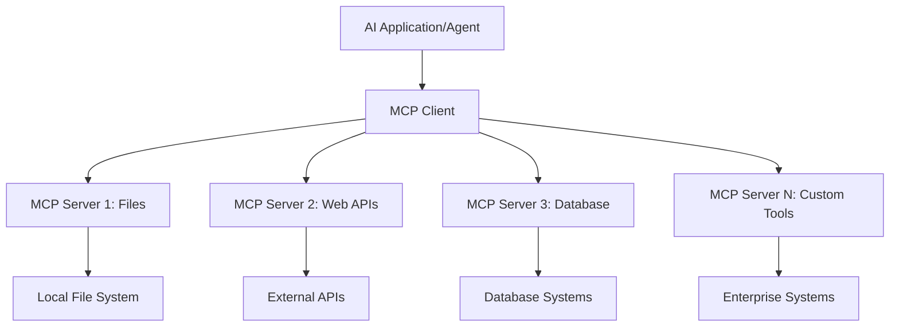

**🔧 Kernekomponenter:**

| Komponent | Rolle | Eksempler |
|-----------|-------|-----------|
| **MCP Hosts** | Applikationer, der bruger MCP services | Claude Desktop, VS Code, AI Toolkit |
| **MCP Clients** | Protokol-håndterere (1:1 med servere) | Indbygget i host applikationer |
| **MCP Servers** | Eksponerer funktioner via standardprotokol | Playwright, Files, Azure, GitHub |
| **Transport Layer** | Kommunikationsmetoder | stdio, HTTP, WebSockets |

## 🏢 Microsofts MCP Server-Økosystem

Microsoft leder MCP økosystemet med en omfattende suite af enterprise-servere, der dækker reelle forretningsbehov.

### 🌟 Fremhævede Microsoft MCP Servere

#### 1. ☁️ Azure MCP Server
**🔗 Repository**: [azure/azure-mcp](https://github.com/azure/azure-mcp)  
**🎯 Formål**: Omfattende Azure ressourcehåndtering med AI-integration

**✨ Nøglefunktioner:**
- Deklarativ infrastrukturprovisionering
- Realtids overvågning af ressourcer
- Anbefalinger til omkostningsoptimering
- Sikkerhedsoverholdelse

**🚀 Anvendelsestilfælde:**
- Infrastructure-as-Code med AI assistance
- Automatisk skalering af ressourcer
- Optimering af cloud-omkostninger
- Automatisering af DevOps workflows

#### 2. 📊 Microsoft Dataverse MCP
**📚 Dokumentation**: [Microsoft Dataverse Integration](https://go.microsoft.com/fwlink/?linkid=2320176)  
**🎯 Formål**: Naturligt sprog-interface til forretningsdata

**✨ Nøglefunktioner:**
- Naturlige sprogforespørgsler til databaser
- Forståelse af forretningskontekst
- Tilpassede prompt-skabeloner
- Enterprise data governance

**🚀 Anvendelsestilfælde:**
- Business intelligence rapportering
- Analyse af kundedata
- Indsigt i salgsprocesser
- Overholdelse af dataforespørgsler

#### 3. 🌐 Playwright MCP Server
**🔗 Repository**: [microsoft/playwright-mcp](https://github.com/microsoft/playwright-mcp)  
**🎯 Formål**: Browser-automatisering og webinteraktion

**✨ Nøglefunktioner:**
- Tværbrowser-automatisering (Chrome, Firefox, Safari)
- Intelligent elementdetektion
- Skærmbilleder og PDF generering
- Netværkstrafikovervågning

**🚀 Anvendelsestilfælde:**
- Automatiserede test-workflows
- Web scraping og dataudtræk
- UI/UX overvågning
- Automatiseret konkurrentanalyse

#### 4. 📁 Files MCP Server
**🔗 Repository**: [microsoft/files-mcp-server](https://github.com/microsoft/files-mcp-server)  
**🎯 Formål**: Intelligent filsystemhåndtering

**✨ Nøglefunktioner:**
- Deklarativ filhåndtering
- Indholdssynkronisering
- Versionskontrolintegration
- Metadataudtræk

**🚀 Anvendelsestilfælde:**
- Dokumentationsstyring
- Organisering af kode-repositorier
- Workflow til indholdspublicering
- Data pipeline filhåndtering

#### 5. 📝 MarkItDown MCP Server
**🔗 Repository**: [microsoft/markitdown](https://github.com/microsoft/markitdown)  
**🎯 Formål**: Avanceret Markdown behandling og manipulation

**✨ Nøglefunktioner:**
- Omfattende Markdown parsing
- Formatkonvertering (MD ↔ HTML ↔ PDF)
- Analyse af indholdsstruktur
- Skabelonbehandling

**🚀 Anvendelsestilfælde:**
- Tekniske dokumentations-workflows
- Indholdsstyringssystemer
- Rapportgenerering
- Vidensbaseautomatisering

#### 6. 📈 Clarity MCP Server
**📦 Pakke**: [@microsoft/clarity-mcp-server](https://www.npmjs.com/package/@microsoft/clarity-mcp-server)  
**🎯 Formål**: Webanalyse og brugeradfærdsindsigt

**✨ Nøglefunktioner:**
- Heatmap dataanalyse
- Optagelser af brugersessioner
- Performance-målinger
- Analyse af konverteringsflow

**🚀 Anvendelsestilfælde:**
- Optimering af hjemmesider
- Brugeroplevelsesforskning
- A/B test analyse
- Business intelligence dashboards

### 🌍 Community Økosystem

Udover Microsofts servere omfatter MCP økosystemet:  
- **🐙 GitHub MCP**: Repositoriehåndtering og kodeanalyse  
- **🗄️ Database MCP’er**: PostgreSQL, MySQL, MongoDB integrationer  
- **☁️ Cloud Provider MCP’er**: AWS, GCP, Digital Ocean værktøjer  
- **📧 Kommunikations MCP’er**: Slack, Teams, Email integrationer

## 🛠️ Hands-On Lab: Byg en Browser Automationsagent

**🎯 Projektmål**: Skab en intelligent browser-automationsagent med Playwright MCP server, som kan navigere på hjemmesider, udtrække information og udføre komplekse webinteraktioner.

### 🚀 Fase 1: Agent Grundopsætning

#### Trin 1: Initialiser din Agent
1. **Åbn AI Toolkit Agent Builder**  
2. **Opret Ny Agent** med følgende konfiguration:  
   - **Navn**: `BrowserAgent`
   - **Model**: Choose GPT-4o 

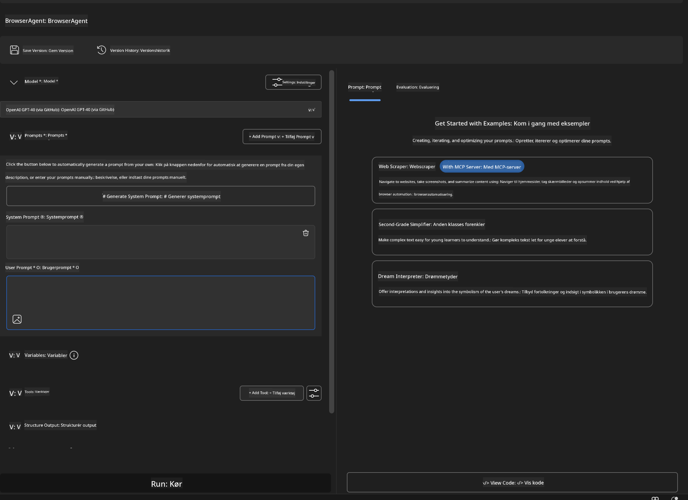


### 🔧 Phase 2: MCP Integration Workflow

#### Step 3: Add MCP Server Integration
1. **Navigate to Tools Section** in Agent Builder
2. **Click "Add Tool"** to open the integration menu
3. **Select "MCP Server"** from available options

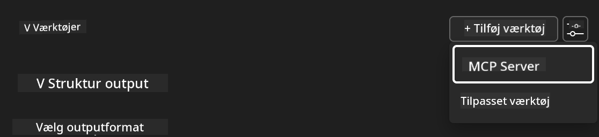

**🔍 Understanding Tool Types:**
- **Built-in Tools**: Pre-configured AI Toolkit functions
- **MCP Servers**: External service integrations
- **Custom APIs**: Your own service endpoints
- **Function Calling**: Direct model function access

#### Step 4: MCP Server Selection
1. **Choose "MCP Server"** option to proceed
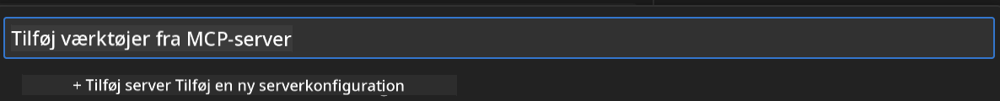

2. **Browse MCP Catalog** to explore available integrations
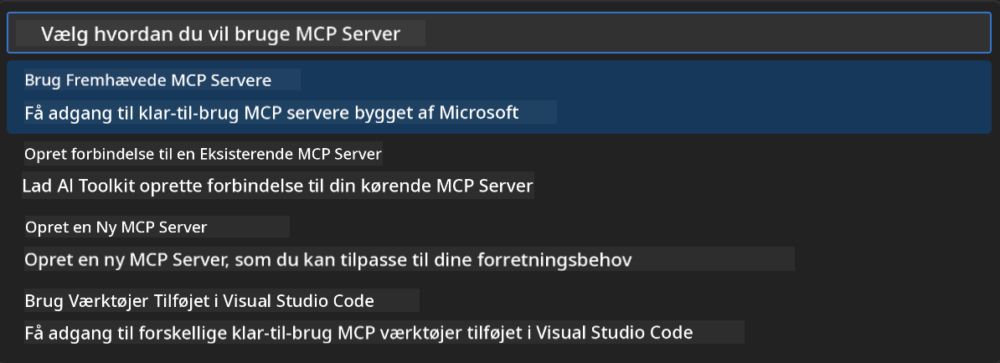


### 🎮 Phase 3: Playwright MCP Configuration

#### Step 5: Select and Configure Playwright
1. **Click "Use Featured MCP Servers"** to access Microsoft's verified servers
2. **Select "Playwright"** from the featured list
3. **Accept Default MCP ID** or customize for your environment

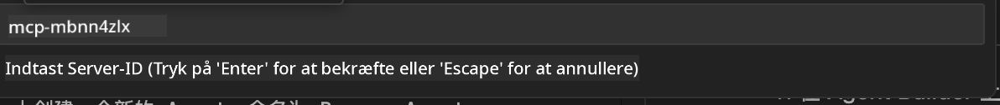

#### Step 6: Enable Playwright Capabilities
**🔑 Critical Step**: Select **ALL** available Playwright methods for maximum functionality

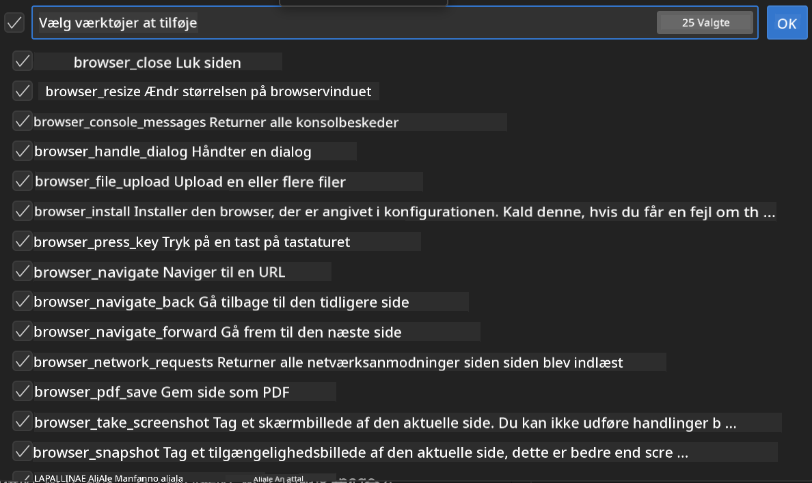

**🛠️ Essential Playwright Tools:**
- **Navigation**: `goto`, `goBack`, `goForward`, `reload`
- **Interaction**: `click`, `fill`, `press`, `hover`, `drag`
- **Extraction**: `textContent`, `innerHTML`, `getAttribute`
- **Validation**: `isVisible`, `isEnabled`, `waitForSelector`
- **Capture**: `screenshot`, `pdf`, `video`
- **Network**: `setExtraHTTPHeaders`, `route`, `waitForResponse`

#### Trin 7: Bekræft Integrationens Succes
**✅ Succesindikatorer:**
- Alle værktøjer vises i Agent Builder interfacet  
- Ingen fejlmeddelelser i integrationspanelet  
- Playwright serverstatus viser "Connected"

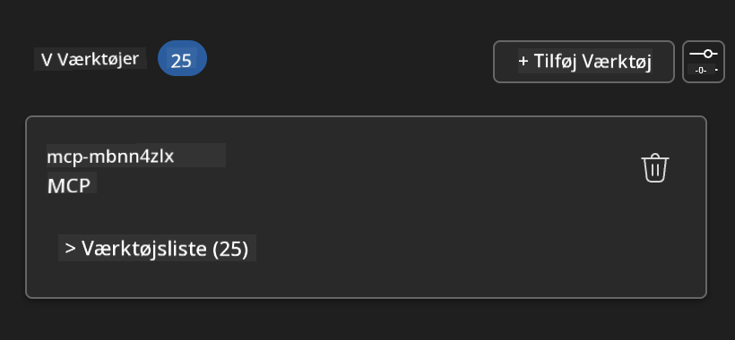

**🔧 Fejlfinding af Almindelige Problemer:**
- **Forbindelse Mislykkedes**: Tjek internetforbindelse og firewall-indstillinger  
- **Manglende Værktøjer**: Sørg for at alle kapabiliteter var valgt under opsætningen  
- **Tilladelsesfejl**: Bekræft at VS Code har nødvendige systemtilladelser

### 🎯 Fase 4: Avanceret Prompt Engineering

#### Trin 8: Design Intelligente System Prompts  
Skab avancerede prompts, der udnytter Playwrights fulde kapabiliteter:

```markdown
# Web Automation Expert System Prompt

## Core Identity
You are an advanced web automation specialist with deep expertise in browser automation, web scraping, and user experience analysis. You have access to Playwright tools for comprehensive browser control.

## Capabilities & Approach
### Navigation Strategy
- Always start with screenshots to understand page layout
- Use semantic selectors (text content, labels) when possible
- Implement wait strategies for dynamic content
- Handle single-page applications (SPAs) effectively

### Error Handling
- Retry failed operations with exponential backoff
- Provide clear error descriptions and solutions
- Suggest alternative approaches when primary methods fail
- Always capture diagnostic screenshots on errors

### Data Extraction
- Extract structured data in JSON format when possible
- Provide confidence scores for extracted information
- Validate data completeness and accuracy
- Handle pagination and infinite scroll scenarios

### Reporting
- Include step-by-step execution logs
- Provide before/after screenshots for verification
- Suggest optimizations and alternative approaches
- Document any limitations or edge cases encountered

## Ethical Guidelines
- Respect robots.txt and rate limiting
- Avoid overloading target servers
- Only extract publicly available information
- Follow website terms of service
```

#### Trin 9: Opret Dynamiske Bruger Prompts  
Design prompts, der demonstrerer forskellige funktioner:

**🌐 Webanalyse Eksempel:**  
```markdown
Navigate to github.com/kinfey and provide a comprehensive analysis including:
1. Repository structure and organization
2. Recent activity and contribution patterns  
3. Documentation quality assessment
4. Technology stack identification
5. Community engagement metrics
6. Notable projects and their purposes

Include screenshots at key steps and provide actionable insights.
```

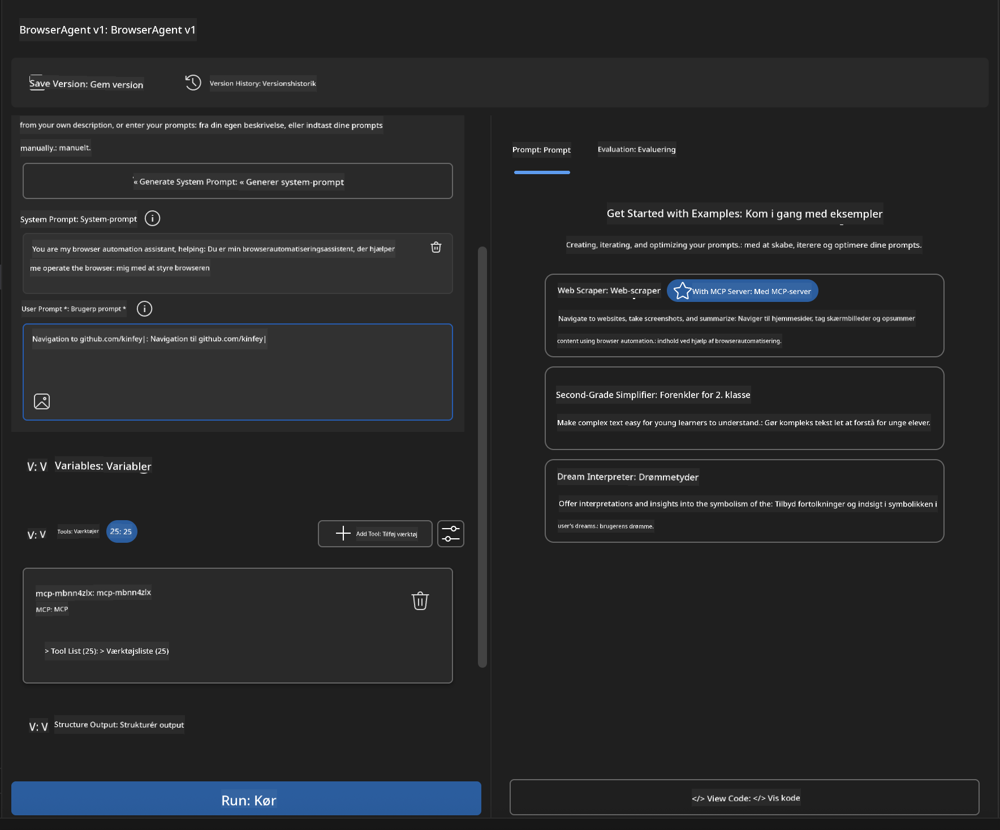

### 🚀 Fase 5: Udførelse og Test

#### Trin 10: Kør Din Første Automation
1. **Klik på "Run"** for at starte automationssekvensen  
2. **Overvåg Udførelsen i Real-time**:  
   - Chrome browser åbnes automatisk  
   - Agent navigerer til målwebsted  
   - Skærmbilleder tages ved hvert væsentligt trin  
   - Analyse resultater streames live

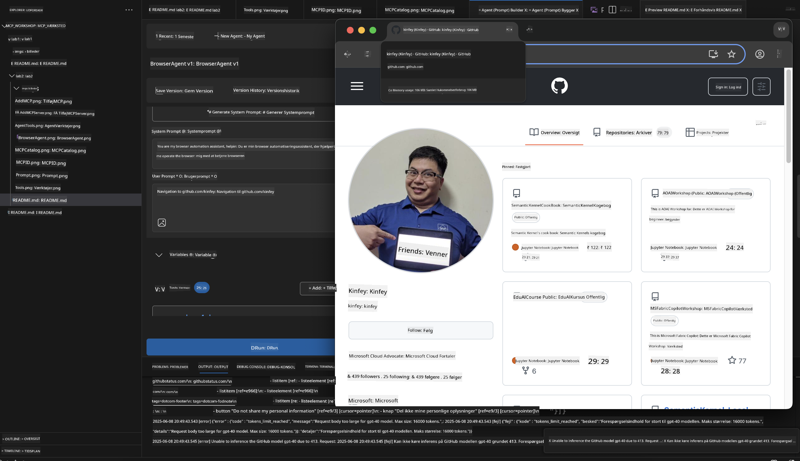

#### Trin 11: Analyser Resultater og Indsigter  
Gennemgå den omfattende analyse i Agent Builder interfacet:

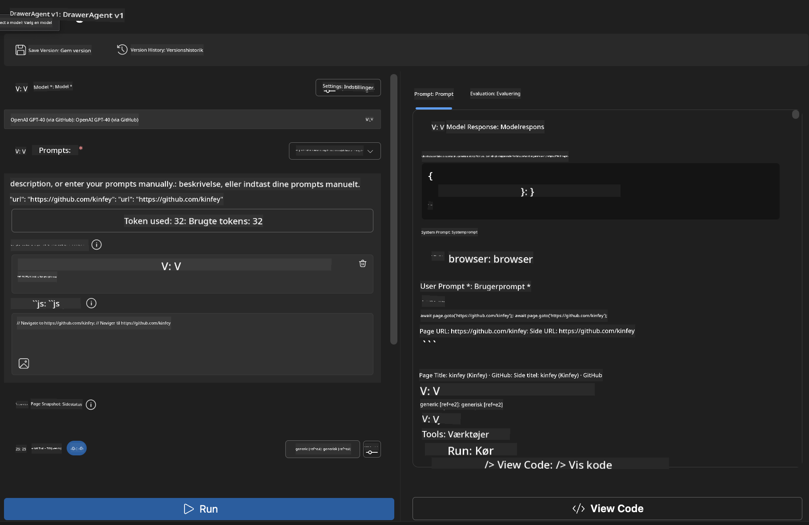

### 🌟 Fase 6: Avancerede Funktioner og Implementering

#### Trin 12: Eksport og Produktion Implementering  
Agent Builder understøtter flere implementeringsmuligheder:

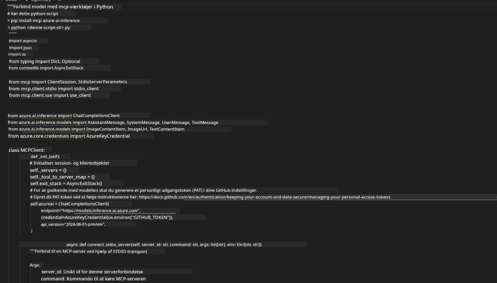

## 🎓 Modul 2 Opsummering & Næste Skridt

### 🏆 Opnåelse Låst Op: MCP Integrationsmester

**✅ Færdigheder Mestret:**
- [ ] Forståelse af MCP arkitektur og fordele  
- [ ] Navigering i Microsofts MCP server-økosystem  
- [ ] Integration af Playwright MCP med AI Toolkit  
- [ ] Opbygning af avancerede browserautomationsagenter  
- [ ] Avanceret prompt engineering til webautomation

### 📚 Yderligere Ressourcer

- **🔗 MCP Specifikation**: [Official Protocol Documentation](https://modelcontextprotocol.io/)  
- **🛠️ Playwright API**: [Complete Method Reference](https://playwright.dev/docs/api/class-playwright)  
- **🏢 Microsoft MCP Servere**: [Enterprise Integration Guide](https://github.com/microsoft/mcp-servers)  
- **🌍 Community Eksempler**: [MCP Server Gallery](https://github.com/modelcontextprotocol/servers)

**🎉 Tillykke!** Du har nu mestret MCP integration og kan bygge AI agenter til produktion med eksterne værktøjsfunktioner!

### 🔜 Fortsæt til Næste Modul

Klar til at tage dine MCP færdigheder til næste niveau? Fortsæt til **[Module 3: Advanced MCP Development with AI Toolkit](../lab3/README.md)** hvor du lærer at:
- Oprette dine egne tilpassede MCP servere  
- Konfigurere og bruge den nyeste MCP Python SDK  
- Sætte MCP Inspector op til fejlfinding  
- Mestre avancerede MCP server udviklings-workflows  
- Bygge en Weather MCP Server fra bunden

**Ansvarsfraskrivelse**:  
Dette dokument er oversat ved hjælp af AI-oversættelsestjenesten [Co-op Translator](https://github.com/Azure/co-op-translator). Selvom vi bestræber os på nøjagtighed, bedes du være opmærksom på, at automatiserede oversættelser kan indeholde fejl eller unøjagtigheder. Det originale dokument på dets oprindelige sprog bør betragtes som den autoritative kilde. For kritisk information anbefales professionel menneskelig oversættelse. Vi påtager os intet ansvar for misforståelser eller fejltolkninger, der måtte opstå som følge af brugen af denne oversættelse.