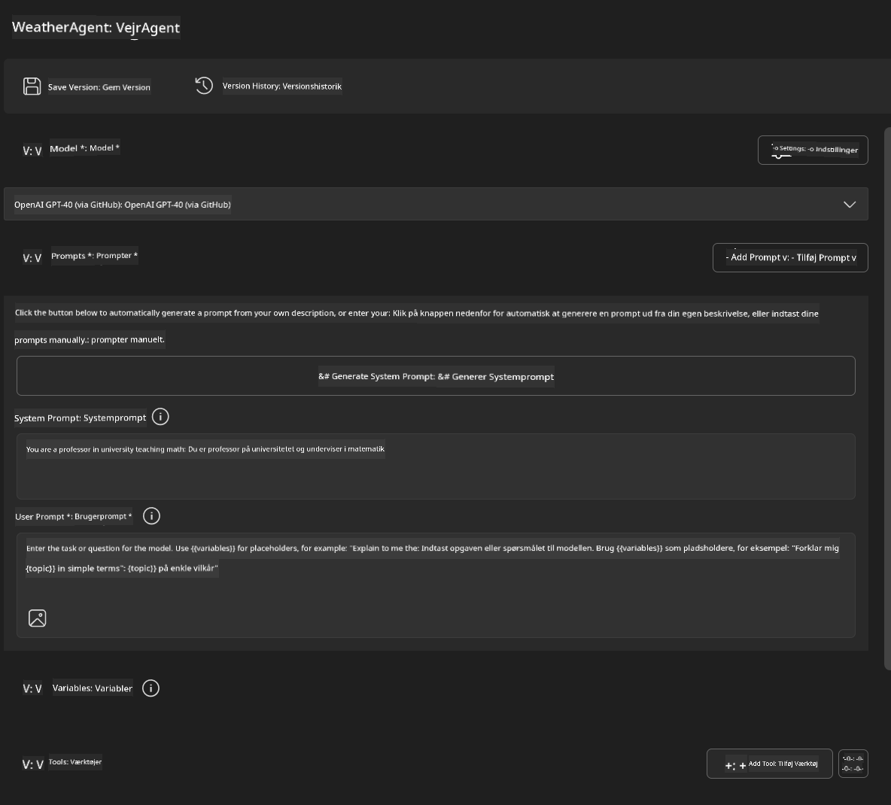
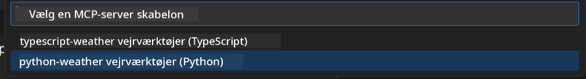
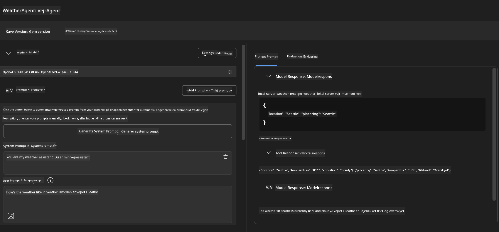
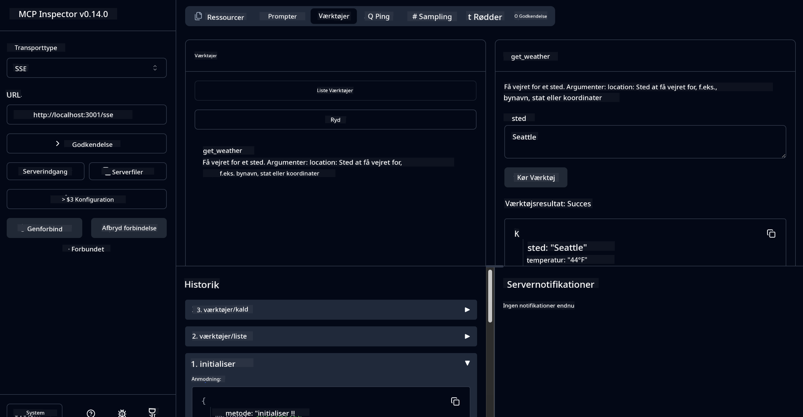

<!--
CO_OP_TRANSLATOR_METADATA:
{
  "original_hash": "dd8da3f75addcef453fe11f02a270217",
  "translation_date": "2025-07-14T08:14:58+00:00",
  "source_file": "10-StreamliningAIWorkflowsBuildingAnMCPServerWithAIToolkit/lab3/README.md",
  "language_code": "da"
}
-->
# 🔧 Modul 3: Avanceret MCP-udvikling med AI Toolkit


## 🎯 Læringsmål

Når du er færdig med dette laboratorium, vil du kunne:

- ✅ Oprette tilpassede MCP-servere ved hjælp af AI Toolkit
- ✅ Konfigurere og bruge den nyeste MCP Python SDK (v1.9.3)
- ✅ Sætte MCP Inspector op og bruge den til fejlfinding
- ✅ Fejlsøge MCP-servere i både Agent Builder og Inspector-miljøer
- ✅ Forstå avancerede arbejdsgange for MCP-serverudvikling

## 📋 Forudsætninger

- Gennemført Lab 2 (MCP Fundamentals)
- VS Code med AI Toolkit-udvidelsen installeret
- Python 3.10+ miljø
- Node.js og npm til opsætning af Inspector

## 🏗️ Hvad du skal bygge

I dette laboratorium opretter du en **Weather MCP Server**, som demonstrerer:
- Implementering af en tilpasset MCP-server
- Integration med AI Toolkit Agent Builder
- Professionelle fejlfinding-arbejdsgange
- Moderne MCP SDK-brugsmønstre

---

## 🔧 Oversigt over kernekomponenter

### 🐍 MCP Python SDK  
Model Context Protocol Python SDK udgør fundamentet for at bygge tilpassede MCP-servere. Du vil bruge version 1.9.3 med forbedrede fejlfindingsegenskaber.

### 🔍 MCP Inspector  
Et kraftfuldt fejlfindingværktøj, der tilbyder:  
- Overvågning af server i realtid  
- Visualisering af værktøjsudførelse  
- Inspektion af netværksanmodninger/-svar  
- Interaktivt testmiljø

---

## 📖 Trin-for-trin implementering

### Trin 1: Opret en WeatherAgent i Agent Builder

1. **Start Agent Builder** i VS Code via AI Toolkit-udvidelsen  
2. **Opret en ny agent** med følgende konfiguration:  
   - Agentnavn: `WeatherAgent`



### Trin 2: Initialiser MCP Server-projekt

1. **Gå til Tools** → **Add Tool** i Agent Builder  
2. **Vælg "MCP Server"** blandt mulighederne  
3. **Vælg "Create A new MCP Server"**  
4. **Vælg `python-weather` skabelonen**  
5. **Navngiv din server:** `weather_mcp`



### Trin 3: Åbn og gennemgå projektet

1. **Åbn det genererede projekt** i VS Code  
2. **Gennemgå projektstrukturen:**  
   ```
   weather_mcp/
   ├── src/
   │   ├── __init__.py
   │   └── server.py
   ├── inspector/
   │   ├── package.json
   │   └── package-lock.json
   ├── .vscode/
   │   ├── launch.json
   │   └── tasks.json
   ├── pyproject.toml
   └── README.md
   ```

### Trin 4: Opgrader til nyeste MCP SDK

> **🔍 Hvorfor opgradere?** Vi ønsker at bruge den nyeste MCP SDK (v1.9.3) og Inspector service (0.14.0) for forbedrede funktioner og bedre fejlfinding.

#### 4a. Opdater Python-afhængigheder

**Rediger `pyproject.toml`:** opdater [./code/weather_mcp/pyproject.toml](../../../../10-StreamliningAIWorkflowsBuildingAnMCPServerWithAIToolkit/lab3/code/weather_mcp/pyproject.toml)

#### 4b. Opdater Inspector-konfiguration

**Rediger `inspector/package.json`:** opdater [./code/weather_mcp/inspector/package.json](../../../../10-StreamliningAIWorkflowsBuildingAnMCPServerWithAIToolkit/lab3/code/weather_mcp/inspector/package.json)

#### 4c. Opdater Inspector-afhængigheder

**Rediger `inspector/package-lock.json`:** opdater [./code/weather_mcp/inspector/package-lock.json](../../../../10-StreamliningAIWorkflowsBuildingAnMCPServerWithAIToolkit/lab3/code/weather_mcp/inspector/package-lock.json)

> **📝 Bemærk:** Denne fil indeholder omfattende afhængighedsdefinitioner. Nedenfor ses den væsentlige struktur – den fulde fil sikrer korrekt afhængighedsløsning.

> **⚡ Fuld Package Lock:** Den komplette package-lock.json indeholder ca. 3000 linjer afhængighedsdefinitioner. Ovenstående viser nøglestrukturen – brug den medfølgende fil for fuld afhængighedsløsning.

### Trin 5: Konfigurer VS Code fejlfinding

*Bemærk: Kopiér venligst filen i den angivne sti for at erstatte den tilsvarende lokale fil*

#### 5a. Opdater launch-konfiguration

**Rediger `.vscode/launch.json`:**

```json
{
  "version": "0.2.0",
  "configurations": [
    {
      "name": "Attach to Local MCP",
      "type": "debugpy",
      "request": "attach",
      "connect": {
        "host": "localhost",
        "port": 5678
      },
      "presentation": {
        "hidden": true
      },
      "internalConsoleOptions": "neverOpen",
      "postDebugTask": "Terminate All Tasks"
    },
    {
      "name": "Launch Inspector (Edge)",
      "type": "msedge",
      "request": "launch",
      "url": "http://localhost:6274?timeout=60000&serverUrl=http://localhost:3001/sse#tools",
      "cascadeTerminateToConfigurations": [
        "Attach to Local MCP"
      ],
      "presentation": {
        "hidden": true
      },
      "internalConsoleOptions": "neverOpen"
    },
    {
      "name": "Launch Inspector (Chrome)",
      "type": "chrome",
      "request": "launch",
      "url": "http://localhost:6274?timeout=60000&serverUrl=http://localhost:3001/sse#tools",
      "cascadeTerminateToConfigurations": [
        "Attach to Local MCP"
      ],
      "presentation": {
        "hidden": true
      },
      "internalConsoleOptions": "neverOpen"
    }
  ],
  "compounds": [
    {
      "name": "Debug in Agent Builder",
      "configurations": [
        "Attach to Local MCP"
      ],
      "preLaunchTask": "Open Agent Builder",
    },
    {
      "name": "Debug in Inspector (Edge)",
      "configurations": [
        "Launch Inspector (Edge)",
        "Attach to Local MCP"
      ],
      "preLaunchTask": "Start MCP Inspector",
      "stopAll": true
    },
    {
      "name": "Debug in Inspector (Chrome)",
      "configurations": [
        "Launch Inspector (Chrome)",
        "Attach to Local MCP"
      ],
      "preLaunchTask": "Start MCP Inspector",
      "stopAll": true
    }
  ]
}
```

**Rediger `.vscode/tasks.json`:**

```
{
  "version": "2.0.0",
  "tasks": [
    {
      "label": "Start MCP Server",
      "type": "shell",
      "command": "python -m debugpy --listen 127.0.0.1:5678 src/__init__.py sse",
      "isBackground": true,
      "options": {
        "cwd": "${workspaceFolder}",
        "env": {
          "PORT": "3001"
        }
      },
      "problemMatcher": {
        "pattern": [
          {
            "regexp": "^.*$",
            "file": 0,
            "location": 1,
            "message": 2
          }
        ],
        "background": {
          "activeOnStart": true,
          "beginsPattern": ".*",
          "endsPattern": "Application startup complete|running"
        }
      }
    },
    {
      "label": "Start MCP Inspector",
      "type": "shell",
      "command": "npm run dev:inspector",
      "isBackground": true,
      "options": {
        "cwd": "${workspaceFolder}/inspector",
        "env": {
          "CLIENT_PORT": "6274",
          "SERVER_PORT": "6277",
        }
      },
      "problemMatcher": {
        "pattern": [
          {
            "regexp": "^.*$",
            "file": 0,
            "location": 1,
            "message": 2
          }
        ],
        "background": {
          "activeOnStart": true,
          "beginsPattern": "Starting MCP inspector",
          "endsPattern": "Proxy server listening on port"
        }
      },
      "dependsOn": [
        "Start MCP Server"
      ]
    },
    {
      "label": "Open Agent Builder",
      "type": "shell",
      "command": "echo ${input:openAgentBuilder}",
      "presentation": {
        "reveal": "never"
      },
      "dependsOn": [
        "Start MCP Server"
      ],
    },
    {
      "label": "Terminate All Tasks",
      "command": "echo ${input:terminate}",
      "type": "shell",
      "problemMatcher": []
    }
  ],
  "inputs": [
    {
      "id": "openAgentBuilder",
      "type": "command",
      "command": "ai-mlstudio.agentBuilder",
      "args": {
        "initialMCPs": [ "local-server-weather_mcp" ],
        "triggeredFrom": "vsc-tasks"
      }
    },
    {
      "id": "terminate",
      "type": "command",
      "command": "workbench.action.tasks.terminate",
      "args": "terminateAll"
    }
  ]
}
```

---

## 🚀 Kørsel og test af din MCP-server

### Trin 6: Installer afhængigheder

Efter konfigurationsændringerne, kør følgende kommandoer:

**Installer Python-afhængigheder:**  
```bash
uv sync
```

**Installer Inspector-afhængigheder:**  
```bash
cd inspector
npm install
```

### Trin 7: Fejlfinding med Agent Builder

1. **Tryk på F5** eller brug konfigurationen **"Debug in Agent Builder"**  
2. **Vælg den sammensatte konfiguration** i debug-panelet  
3. **Vent på at serveren starter** og Agent Builder åbner  
4. **Test din weather MCP-server** med naturlige sprogforespørgsler

Indtast prompt som denne

SYSTEM_PROMPT

```
You are my weather assistant
```

USER_PROMPT

```
How's the weather like in Seattle
```



### Trin 8: Fejlfinding med MCP Inspector

1. **Brug konfigurationen "Debug in Inspector"** (Edge eller Chrome)  
2. **Åbn Inspector-grænsefladen** på `http://localhost:6274`  
3. **Udforsk det interaktive testmiljø:**  
   - Se tilgængelige værktøjer  
   - Test værktøjsudførelse  
   - Overvåg netværksanmodninger  
   - Fejlsøg serverrespons



---

## 🎯 Centrale læringsresultater

Ved at gennemføre dette laboratorium har du:

- [x] **Oprettet en tilpasset MCP-server** ved hjælp af AI Toolkit-skabeloner  
- [x] **Opgraderet til den nyeste MCP SDK** (v1.9.3) for forbedret funktionalitet  
- [x] **Konfigureret professionelle fejlfinding-arbejdsgange** for både Agent Builder og Inspector  
- [x] **Sat MCP Inspector op** til interaktiv servertest  
- [x] **Behersket VS Code fejlfinding-konfigurationer** til MCP-udvikling

## 🔧 Avancerede funktioner udforsket

| Funktion | Beskrivelse | Anvendelsestilfælde |
|---------|-------------|---------------------|
| **MCP Python SDK v1.9.3** | Nyeste protokolimplementering | Moderne serverudvikling |
| **MCP Inspector 0.14.0** | Interaktivt fejlfindingværktøj | Servertest i realtid |
| **VS Code Debugging** | Integreret udviklingsmiljø | Professionel fejlfinding |
| **Agent Builder Integration** | Direkte AI Toolkit-forbindelse | End-to-end agenttest |

## 📚 Yderligere ressourcer

- [MCP Python SDK Dokumentation](https://modelcontextprotocol.io/docs/sdk/python)  
- [AI Toolkit Udvidelsesguide](https://code.visualstudio.com/docs/ai/ai-toolkit)  
- [VS Code Fejlfinding Dokumentation](https://code.visualstudio.com/docs/editor/debugging)  
- [Model Context Protocol Specifikation](https://modelcontextprotocol.io/docs/concepts/architecture)

---

**🎉 Tillykke!** Du har nu gennemført Lab 3 og kan oprette, fejlsøge og implementere tilpassede MCP-servere ved hjælp af professionelle udviklingsarbejdsgange.

### 🔜 Fortsæt til næste modul

Klar til at anvende dine MCP-færdigheder i en reel udviklingsarbejdsgang? Fortsæt til **[Modul 4: Praktisk MCP-udvikling - Tilpasset GitHub Clone Server](../lab4/README.md)**, hvor du vil:  
- Bygge en produktionsklar MCP-server, der automatiserer GitHub repository-operationer  
- Implementere GitHub repository-kloning via MCP  
- Integrere tilpassede MCP-servere med VS Code og GitHub Copilot Agent Mode  
- Teste og implementere tilpassede MCP-servere i produktionsmiljøer  
- Lære praktisk workflow-automatisering for udviklere

**Ansvarsfraskrivelse**:  
Dette dokument er blevet oversat ved hjælp af AI-oversættelsestjenesten [Co-op Translator](https://github.com/Azure/co-op-translator). Selvom vi bestræber os på nøjagtighed, bedes du være opmærksom på, at automatiserede oversættelser kan indeholde fejl eller unøjagtigheder. Det oprindelige dokument på dets oprindelige sprog bør betragtes som den autoritative kilde. For kritisk information anbefales professionel menneskelig oversættelse. Vi påtager os intet ansvar for misforståelser eller fejltolkninger, der opstår som følge af brugen af denne oversættelse.