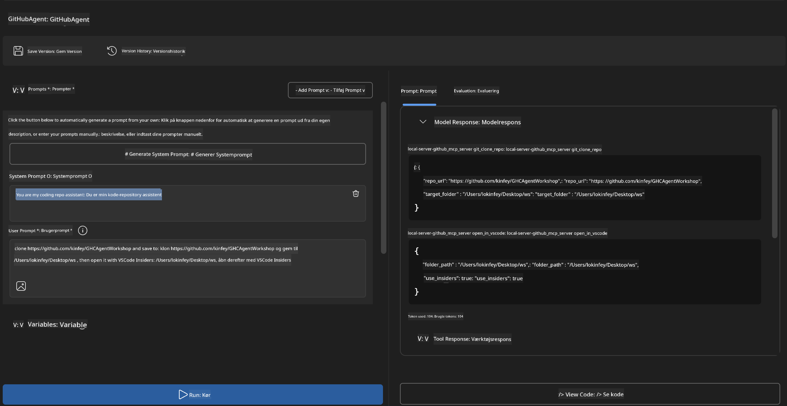
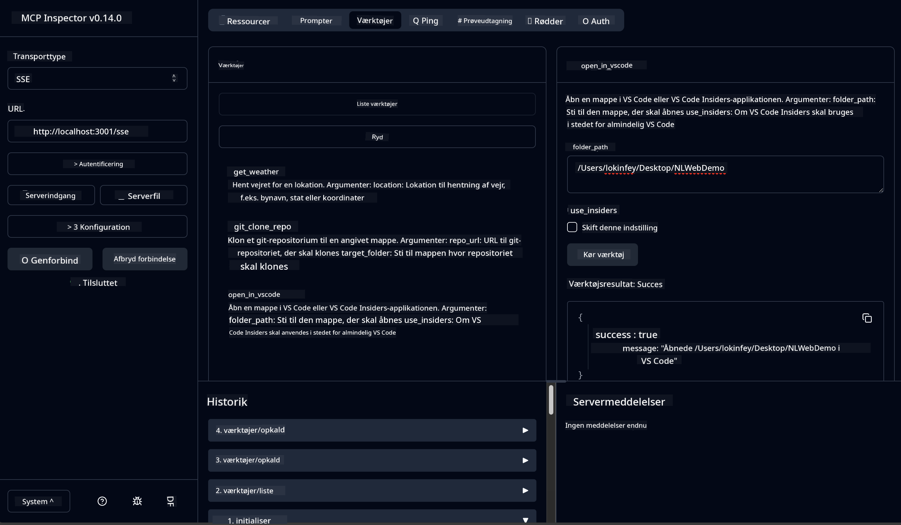

<!--
CO_OP_TRANSLATOR_METADATA:
{
  "original_hash": "f83bc722dc758efffd68667d6a1db470",
  "translation_date": "2025-06-10T06:51:19+00:00",
  "source_file": "10-StreamliningAIWorkflowsBuildingAnMCPServerWithAIToolkit/lab4/README.md",
  "language_code": "da"
}
-->
# 🐙 Modul 4: Praktisk MCP-udvikling - Custom GitHub Clone Server


> **⚡ Hurtigstart:** Byg en produktionsklar MCP-server, der automatiserer GitHub-repository-kloning og VS Code-integration på bare 30 minutter!

## 🎯 Læringsmål

Når du har gennemført denne øvelse, vil du kunne:

- ✅ Oprette en custom MCP-server til virkelige udviklingsarbejdsgange  
- ✅ Implementere GitHub repository-kloning via MCP  
- ✅ Integrere custom MCP-servere med VS Code og Agent Builder  
- ✅ Bruge GitHub Copilot Agent Mode med custom MCP-værktøjer  
- ✅ Teste og deployere custom MCP-servere i produktionsmiljøer  

## 📋 Forudsætninger

- Gennemført Labs 1-3 (MCP grundlæggende og avanceret udvikling)  
- GitHub Copilot abonnement ([gratis tilmelding tilgængelig](https://github.com/github-copilot/signup))  
- VS Code med AI Toolkit og GitHub Copilot extensions  
- Git CLI installeret og konfigureret  

## 🏗️ Projektoversigt

### **Virkelighedsnær udviklingsudfordring**  
Som udviklere bruger vi ofte GitHub til at klone repositories og åbne dem i VS Code eller VS Code Insiders. Denne manuelle proces indebærer:  
1. Åbne terminal/kommandoprompt  
2. Navigere til den ønskede mappe  
3. Køre `git clone` kommandoen  
4. Åbne VS Code i den klonede mappe  

**Vores MCP-løsning samler det hele i én intelligent kommando!**

### **Det du skal bygge**  
En **GitHub Clone MCP Server** (`git_mcp_server`), der tilbyder:

| Funktion | Beskrivelse | Fordel |
|---------|-------------|---------|
| 🔄 **Smart Repository Kloning** | Klon GitHub repos med validering | Automatisk fejlkontrol |
| 📁 **Intelligent Mappehåndtering** | Tjekker og opretter mapper sikkert | Forhindrer overskrivning |
| 🚀 **Platformuafhængig VS Code Integration** | Åbner projekter i VS Code/Insiders | Glidende arbejdsgang |
| 🛡️ **Robust Fejlhåndtering** | Håndterer netværk, tilladelser og sti-problemer | Produktionsklar stabilitet |

---

## 📖 Trin-for-trin Implementering

### Trin 1: Opret GitHub Agent i Agent Builder

1. **Start Agent Builder** via AI Toolkit-udvidelsen  
2. **Opret en ny agent** med følgende konfiguration:  
   ```
   Agent Name: GitHubAgent
   ```

3. **Initialiser custom MCP-server:**  
   - Gå til **Tools** → **Add Tool** → **MCP Server**  
   - Vælg **"Create A new MCP Server"**  
   - Vælg **Python template** for maksimal fleksibilitet  
   - **Servernavn:** `git_mcp_server`

### Trin 2: Konfigurer GitHub Copilot Agent Mode

1. **Åbn GitHub Copilot** i VS Code (Ctrl/Cmd + Shift + P → "GitHub Copilot: Open")  
2. **Vælg Agent Model** i Copilot interfacet  
3. **Vælg Claude 3.7 modellen** for forbedret ræsonnering  
4. **Aktivér MCP integration** for værktøjsadgang  

> **💡 Pro Tip:** Claude 3.7 giver bedre forståelse af udviklingsarbejdsgange og fejlhåndteringsmønstre.

### Trin 3: Implementer Kernefunktionalitet i MCP Serveren

**Brug følgende detaljerede prompt med GitHub Copilot Agent Mode:**  

```
Create two MCP tools with the following comprehensive requirements:

🔧 TOOL A: clone_repository
Requirements:
- Clone any GitHub repository to a specified local folder
- Return the absolute path of the successfully cloned project
- Implement comprehensive validation:
  ✓ Check if target directory already exists (return error if exists)
  ✓ Validate GitHub URL format (https://github.com/user/repo)
  ✓ Verify git command availability (prompt installation if missing)
  ✓ Handle network connectivity issues
  ✓ Provide clear error messages for all failure scenarios

🚀 TOOL B: open_in_vscode
Requirements:
- Open specified folder in VS Code or VS Code Insiders
- Cross-platform compatibility (Windows/Linux/macOS)
- Use direct application launch (not terminal commands)
- Auto-detect available VS Code installations
- Handle cases where VS Code is not installed
- Provide user-friendly error messages

Additional Requirements:
- Follow MCP 1.9.3 best practices
- Include proper type hints and documentation
- Implement logging for debugging purposes
- Add input validation for all parameters
- Include comprehensive error handling
```

### Trin 4: Test din MCP Server

#### 4a. Test i Agent Builder

1. **Start debug-konfigurationen** i Agent Builder  
2. **Konfigurer din agent med denne systemprompt:**  

```
SYSTEM_PROMPT:
You are my intelligent coding repository assistant. You help developers efficiently clone GitHub repositories and set up their development environment. Always provide clear feedback about operations and handle errors gracefully.
```

3. **Test med realistiske brugerscenarier:**  

```
USER_PROMPT EXAMPLES:

Scenario : Basic Clone and Open
"Clone {Your GitHub Repo link such as https://github.com/kinfey/GHCAgentWorkshop
 } and save to {The global path you specify}, then open it with VS Code Insiders"
```



**Forventede resultater:**  
- ✅ Vellykket kloning med sti-bekræftelse  
- ✅ Automatisk opstart af VS Code  
- ✅ Klare fejlmeddelelser ved ugyldige scenarier  
- ✅ Korrekt håndtering af kanttilfælde  

#### 4b. Test i MCP Inspector



---

**🎉 Tillykke!** Du har nu med succes oprettet en praktisk, produktionsklar MCP-server, der løser reelle udviklingsworkflow-udfordringer. Din custom GitHub clone server viser styrken ved MCP til at automatisere og forbedre udviklerproduktiviteten.

### 🏆 Opnåede resultater:  
- ✅ **MCP Developer** - Oprettet custom MCP-server  
- ✅ **Workflow Automator** - Effektiviseret udviklingsprocesser  
- ✅ **Integration Expert** - Forbundet flere udviklingsværktøjer  
- ✅ **Produktionsklar** - Bygget deploybare løsninger  

---

## 🎓 Workshop Afslutning: Din rejse med Model Context Protocol

**Kære workshopdeltager,**

Tillykke med at have gennemført alle fire moduler i Model Context Protocol-workshoppet! Du er kommet langt fra at forstå grundlæggende AI Toolkit-koncepter til at bygge produktionsklare MCP-servere, der løser virkelige udviklingsudfordringer.

### 🚀 Opsummering af din læringsrejse:

**[Modul 1](../lab1/README.md)**: Du startede med at udforske AI Toolkit grundlæggende, testede modeller og oprettede din første AI-agent.

**[Modul 2](../lab2/README.md)**: Du lærte MCP-arkitektur, integrerede Playwright MCP og byggede din første browserautomatiseringsagent.

**[Modul 3](../lab3/README.md)**: Du avancerede til custom MCP-serverudvikling med Weather MCP-serveren og mestre debugging-værktøjer.

**[Modul 4](../lab4/README.md)**: Nu har du brugt alt til at skabe et praktisk værktøj til automatisering af GitHub repository workflows.

### 🌟 Det du har mestret:

- ✅ **AI Toolkit Økosystem**: Modeller, agenter og integrationsmønstre  
- ✅ **MCP Arkitektur**: Client-server design, transportprotokoller og sikkerhed  
- ✅ **Udviklingsværktøjer**: Fra Playground til Inspector til produktion  
- ✅ **Custom Udvikling**: Byg, test og deploy dine egne MCP-servere  
- ✅ **Praktiske Anvendelser**: Løs virkelige workflow-udfordringer med AI  

### 🔮 Dine næste skridt:

1. **Byg din egen MCP-server**: Brug disse færdigheder til at automatisere dine unikke workflows  
2. **Deltag i MCP-fællesskabet**: Del dine projekter og lær af andre  
3. **Udforsk avanceret integration**: Forbind MCP-servere med enterprise-systemer  
4. **Bidrag til Open Source**: Hjælp med at forbedre MCP-værktøjer og dokumentation  

Husk, denne workshop er kun begyndelsen. Model Context Protocol-økosystemet udvikler sig hurtigt, og du er nu rustet til at være i front med AI-drevne udviklingsværktøjer.

**Tak for din deltagelse og engagement i læringen!**

Vi håber, at denne workshop har givet dig idéer, der vil forvandle måden, du bygger og interagerer med AI-værktøjer på i din udviklingsrejse.

**God kodning!**

---

**Ansvarsfraskrivelse**:  
Dette dokument er blevet oversat ved hjælp af AI-oversættelsestjenesten [Co-op Translator](https://github.com/Azure/co-op-translator). Selvom vi bestræber os på nøjagtighed, bedes du være opmærksom på, at automatiserede oversættelser kan indeholde fejl eller unøjagtigheder. Det oprindelige dokument på dets oprindelige sprog bør betragtes som den autoritative kilde. For kritisk information anbefales professionel menneskelig oversættelse. Vi påtager os intet ansvar for eventuelle misforståelser eller fejltolkninger, der opstår som følge af brugen af denne oversættelse.