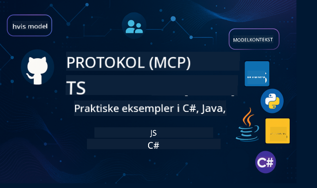

<!--
CO_OP_TRANSLATOR_METADATA:
{
  "original_hash": "866c8877136cb03e1efb9ad633a2f0a6",
  "translation_date": "2025-08-26T17:51:01+00:00",
  "source_file": "README.md",
  "language_code": "da"
}
-->
 

Følg disse trin for at komme i gang med at bruge disse ressourcer:
1. **Fork repositoryet**: Klik 
2. **Klon repositoryet**:   `git clone https://github.com/microsoft/mcp-for-beginners.git`
3. [**Deltag i Azure AI Foundry Discord og mød eksperter og andre udviklere**](https://discord.com/invite/ByRwuEEgH4)

### 🌐 Understøttelse af flere sprog

#### Understøttet via GitHub Action (Automatisk & Altid Opdateret)

 [Arabisk](../ar/README.md) | [Bengali](../bn/README.md) | [Bulgarsk](../bg/README.md) | [Burmesisk (Myanmar)](../my/README.md) | [Kinesisk (Forenklet)](../zh/README.md) | [Kinesisk (Traditionelt, Hong Kong)](../hk/README.md) | [Kinesisk (Traditionelt, Macau)](../mo/README.md) | [Kinesisk (Traditionelt, Taiwan)](../tw/README.md) | [Kroatisk](../hr/README.md) | [Tjekkisk](../cs/README.md) | [Dansk](./README.md) | [Hollandsk](../nl/README.md) | [Finsk](../fi/README.md) | [Fransk](../fr/README.md) | [Tysk](../de/README.md) | [Græsk](../el/README.md) | [Hebraisk](../he/README.md) | [Hindi](../hi/README.md) | [Ungarsk](../hu/README.md) | [Indonesisk](../id/README.md) | [Italiensk](../it/README.md) | [Japansk](../ja/README.md) | [Koreansk](../ko/README.md) | [Malayisk](../ms/README.md) | [Marathi](../mr/README.md) | [Nepalesisk](../ne/README.md) | [Norsk](../no/README.md) | [Persisk (Farsi)](../fa/README.md) | [Polsk](../pl/README.md) | [Portugisisk (Brasilien)](../br/README.md) | [Portugisisk (Portugal)](../pt/README.md) | [Punjabi (Gurmukhi)](../pa/README.md) | [Rumænsk](../ro/README.md) | [Russisk](../ru/README.md) | [Serbisk (Kyrillisk)](../sr/README.md) | [Slovakisk](../sk/README.md) | [Slovensk](../sl/README.md) | [Spansk](../es/README.md) | [Swahili](../sw/README.md) | [Svensk](../sv/README.md) | [Tagalog (Filippinsk)](../tl/README.md) | [Thai](../th/README.md) | [Tyrkisk](../tr/README.md) | [Ukrainsk](../uk/README.md) | [Urdu](../ur/README.md) | [Vietnamesisk](../vi/README.md)

# 🚀 Model Context Protocol (MCP) Læseplan for Begyndere

## **Lær MCP med praktiske kodeeksempler i C#, Java, JavaScript, Rust, Python og TypeScript**

## 🧠 Oversigt over Model Context Protocol Læseplanen

**Model Context Protocol (MCP)** er en banebrydende ramme designet til at standardisere interaktioner mellem AI-modeller og klientapplikationer. Denne open-source læseplan tilbyder en struktureret læringssti med praktiske kodeeksempler og virkelige anvendelser på tværs af populære programmeringssprog som C#, Java, JavaScript, TypeScript og Python.

Uanset om du er AI-udvikler, systemarkitekt eller softwareingeniør, er denne guide din omfattende ressource til at mestre MCP's grundlæggende principper og implementeringsstrategier.

## 🔗 Officielle MCP Ressourcer

- 📘 [MCP Dokumentation](https://modelcontextprotocol.io/) – Detaljerede vejledninger og brugermanualer  
- 📜 [MCP Specifikation](https://modelcontextprotocol.io/docs/) – Protokolarkitektur og tekniske referencer  
- 📜 [Original MCP Specifikation](https://spec.modelcontextprotocol.io/) – Ældre tekniske referencer (kan indeholde yderligere detaljer)  
- 🧑‍💻 [MCP GitHub Repository](https://github.com/modelcontextprotocol) – Open-source SDK'er, værktøjer og kodeeksempler
- 🌐 [MCP Community](https://github.com/orgs/modelcontextprotocol/discussions) – Deltag i diskussioner og bidrag til fællesskabet

## 🧭 MCP Læseplan Oversigt

### 📚 Komplet Læseplansstruktur

| Modul | Emne | Beskrivelse | Link |
|-------|------|-------------|------|
| **Modul 1-3: Grundlæggende** | | | |
| 00 | Introduktion til MCP | Oversigt over Model Context Protocol og dens betydning i AI-pipelines | [Læs mere](./00-Introduction/README.md) |
| 01 | Forklaring af Kernekoncepter | Dybtgående udforskning af MCP's kernekoncepter | [Læs mere](./01-CoreConcepts/README.md) |
| 02 | Sikkerhed i MCP | Sikkerhedstrusler og bedste praksis | [Læs mere](./02-Security/README.md) |
| 03 | Kom godt i gang med MCP | Opsætning af miljø, grundlæggende servere/klienter, integration | [Læs mere](./03-GettingStarted/README.md) |
| **Modul 3: Byg Din Første Server & Klient** | | | |
| 3.1 | Første Server | Opret din første MCP-server | [Vejledning](./03-GettingStarted/01-first-server/README.md) |
| 3.2 | Første Klient | Udvikl en grundlæggende MCP-klient | [Vejledning](./03-GettingStarted/02-client/README.md) |
| 3.3 | Klient med LLM | Integrer store sprogmodeller | [Vejledning](./03-GettingStarted/03-llm-client/README.md) |
| 3.4 | VS Code Integration | Brug MCP-servere i VS Code | [Vejledning](./03-GettingStarted/04-vscode/README.md) |
| 3.5 | stdio Server | Opret servere ved hjælp af stdio transport | [Vejledning](./03-GettingStarted/05-stdio-server/README.md) |
| 3.6 | HTTP Streaming | Implementer HTTP streaming i MCP | [Vejledning](./03-GettingStarted/06-http-streaming/README.md) |
| 3.7 | AI Toolkit | Brug AI Toolkit med MCP | [Vejledning](./03-GettingStarted/07-aitk/README.md) |
| 3.8 | Testning | Test din MCP-serverimplementering | [Vejledning](./03-GettingStarted/08-testing/README.md) |
| 3.9 | Udrulning | Udrul MCP-servere til produktion | [Vejledning](./03-GettingStarted/09-deployment/README.md) |
| **Modul 4-5: Praktisk & Avanceret** | | | |
| 04 | Praktisk Implementering | SDK'er, fejlfinding, testning, genanvendelige promptskabeloner | [Læs mere](./04-PracticalImplementation/README.md) |
| 05 | Avancerede Emner i MCP | Multi-modal AI, skalering, virksomhedsanvendelse | [Læs mere](./05-AdvancedTopics/README.md) |
| 5.1 | Azure Integration | MCP Integration med Azure | [Vejledning](./05-AdvancedTopics/mcp-integration/README.md) |
| 5.2 | Multi-modalitet | Arbejde med flere modaliteter | [Vejledning](./05-AdvancedTopics/mcp-multi-modality/README.md) |
| 5.3 | OAuth2 Demo | Implementer OAuth2-autentifikation | [Vejledning](./05-AdvancedTopics/mcp-oauth2-demo/README.md) |
| 5.4 | Root Contexts | Forstå og implementer root contexts | [Vejledning](./05-AdvancedTopics/mcp-root-contexts/README.md) |
| 5.5 | Routing | MCP routing-strategier | [Vejledning](./05-AdvancedTopics/mcp-routing/README.md) |
| 5.6 | Sampling | Sampling-teknikker i MCP | [Vejledning](./05-AdvancedTopics/mcp-sampling/README.md) |
| 5.7 | Skalering | Skalér MCP-implementeringer | [Vejledning](./05-AdvancedTopics/mcp-scaling/README.md) |
| 5.8 | Sikkerhed | Avancerede sikkerhedsovervejelser | [Vejledning](./05-AdvancedTopics/mcp-security/README.md) |
| 5.9 | Websøgning | Implementer websøgningsevner | [Vejledning](./05-AdvancedTopics/web-search-mcp/README.md) |
| 5.10 | Realtidsstreaming | Byg funktionalitet til realtidsstreaming | [Vejledning](./05-AdvancedTopics/mcp-realtimestreaming/README.md) |
| 5.11 | Realtidssøgning | Implementer realtidssøgning | [Vejledning](./05-AdvancedTopics/mcp-realtimesearch/README.md) |
| 5.12 | Entra ID Auth | Autentifikation med Microsoft Entra ID | [Vejledning](./05-AdvancedTopics/mcp-security-entra/README.md) |
| 5.13 | Foundry Integration | Integrer med Azure AI Foundry | [Vejledning](./05-AdvancedTopics/mcp-foundry-agent-integration/README.md) |
| 5.14 | Context Engineering | Teknikker til effektiv context engineering | [Vejledning](./05-AdvancedTopics/mcp-contextengineering/README.md) |
| **Modul 6-10: Fællesskab & Bedste Praksis** | | | |
| 06 | Fællesskabsbidrag | Hvordan man bidrager til MCP-økosystemet | [Vejledning](./06-CommunityContributions/README.md) |
| 07 | Indsigter fra Tidlig Adoptering | Virkelige implementeringshistorier | [Vejledning](./07-LessonsFromEarlyAdoption/README.md) |
| 08 | Bedste Praksis for MCP | Ydeevne, fejltolerance, robusthed | [Vejledning](./08-BestPractices/README.md) |
| 09 | MCP Case Studies | Praktiske implementeringseksempler | [Vejledning](./09-CaseStudy/README.md) |
| 10 | Praktisk Workshop | Byg en MCP-server med AI Toolkit | [Lab](./10-StreamliningAIWorkflowsBuildingAnMCPServerWithAIToolkit/README.md) |

### 💻 Eksempelprojekter med Kode

#### Grundlæggende MCP Calculator Eksempler

| Sprog | Beskrivelse | Link |
|-------|-------------|------|
| C# | MCP Server Eksempel | [Se Kode](./03-GettingStarted/samples/csharp/README.md) |
| Java | MCP Calculator | [Se Kode](./03-GettingStarted/samples/java/calculator/README.md) |
| JavaScript | MCP Demo | [Se Kode](./03-GettingStarted/samples/javascript/README.md) |
| Python | MCP Server | [Se Kode](../../03-GettingStarted/samples/python/mcp_calculator_server.py) |
| TypeScript | MCP Eksempel | [Se Kode](./03-GettingStarted/samples/typescript/README.md) |
| Rust | MCP Eksempel | [Se Kode](./03-GettingStarted/samples/rust/README.md) |

#### Avancerede MCP Implementeringer

| Sprog | Beskrivelse | Link |
|-------|-------------|------|
| C# | Avanceret Eksempel | [View Code](./04-PracticalImplementation/samples/csharp/README.md) |
| Java med Spring | Container App Eksempel | [View Code](./04-PracticalImplementation/samples/java/containerapp/README.md) |
| JavaScript | Avanceret Eksempel | [View Code](./04-PracticalImplementation/samples/javascript/README.md) |
| Python | Kompleks Implementering | [View Code](../../04-PracticalImplementation/samples/python/READMEmd) |
| TypeScript | Container Eksempel | [View Code](./04-PracticalImplementation/samples/typescript/README.md) |

## 🎯 Forudsætninger for at Lære MCP

For at få mest muligt ud af dette pensum bør du have:

- Grundlæggende kendskab til programmering i mindst én af følgende sprog: C#, Java, JavaScript, Python eller TypeScript
- Forståelse af klient-server-modellen og API'er
- Kendskab til REST og HTTP-konceptet
- (Valgfrit) Baggrund i AI/ML-konceptet

- Deltagelse i vores fællesskabsdiskussioner for støtte

## 📚 Studievejledning & Ressourcer

Dette repository indeholder flere ressourcer, der hjælper dig med at navigere og lære effektivt:

### Studievejledning

En omfattende [Studievejledning](./study_guide.md) er tilgængelig for at hjælpe dig med at navigere effektivt i dette repository. Vejledningen inkluderer:

- Et visuelt pensumkort, der viser alle dækkede emner
- Detaljeret opdeling af hver sektion i repositoryet
- Vejledning i, hvordan man bruger prøveprojekter
- Anbefalede læringsveje for forskellige færdighedsniveauer
- Yderligere ressourcer til at supplere din læringsrejse

### Ændringslog

Vi opretholder en detaljeret [Ændringslog](./changelog.md), der sporer alle væsentlige opdateringer til pensummaterialerne, herunder:

- Nye indholdsadditioner
- Strukturelle ændringer
- Funktionsforbedringer
- Dokumentationsopdateringer

## 🛠️ Sådan Bruger Du Dette Pensum Effektivt

Hver lektion i denne vejledning inkluderer:

1. Klare forklaringer af MCP-konceptet  
2. Live kodeeksempler i flere sprog  
3. Øvelser til at bygge rigtige MCP-applikationer  
4. Ekstra ressourcer til avancerede elever

## Events 

### [MCP Dev Days Juli 2025](https://developer.microsoft.com/en-us/reactor/series/S-1563/)
#### [➡️Se On Demand - MCP Dev Days](https://developer.microsoft.com/en-us/reactor/series/S-1563/)
Gør dig klar til to dage med dyb teknisk indsigt, fællesskabskonnektion og praktisk læring ved MCP Dev Days, en virtuel begivenhed dedikeret til Model Context Protocol (MCP) — den nye standard, der forbinder AI-modeller og de værktøjer, de er afhængige af.
Du kan se MCP Dev Days ved at registrere dig på vores begivenhedsside: https://aka.ms/mcpdevdays. 

#### [Dag 1: MCP Produktivitet, DevTools & Fællesskab:](https://developer.microsoft.com/en-us/reactor/series/S-1563/)

Handler om at give udviklere mulighed for at bruge MCP i deres udviklerarbejdsgang og fejre det fantastiske MCP-fællesskab. Vi vil blive ledsaget af fællesskabsmedlemmer og partnere som Arcade, Block, Okta og Neon for at se, hvordan de samarbejder med Microsoft om at forme et åbent, udvideligt MCP-økosystem.  
Reelle demoer på tværs af VS Code, Visual Studio, GitHub Copilot og populære fællesskabsværktøjer  
Praktiske, kontekstbaserede udviklerarbejdsgange  
Fællesskabsledede sessioner og indsigter  
Uanset om du lige er begyndt med MCP eller allerede bygger med det, vil Dag 1 sætte scenen med inspiration og handlingsrettede takeaways.

#### [Dag 2: Byg MCP Servere med Selvtillid](https://developer.microsoft.com/en-us/reactor/series/S-1563/)

Er for MCP-byggere. Vi vil gå i dybden med implementeringsstrategier og bedste praksis for at skabe MCP-servere og integrere MCP i dine AI-arbejdsgange.

#### Emner inkluderer:

- Bygning af MCP-servere og integration af dem i agentoplevelser
- Prompt-drevet udvikling
- Sikkerhedsbedste praksis
- Brug af byggesten som Functions, ACA og API Management
- Registry-tilpasning og værktøjer (1P + 3P)

Hvis du er udvikler, værktøjsbygger eller AI-produktstrateg, er denne dag fyldt med de indsigter, du har brug for til at bygge skalerbare, sikre og fremtidsklare MCP-løsninger.

### MCP Boot Camp August 2025
Lær i intensive videosessioner, hvordan du opretter MCP-servere, integrerer med VS Code og professionelt implementerer på Azure baseret på indhold fra MCP for Beginners-pensum. Gå derfra med praktiske færdigheder i en teknologi, som store virksomheder allerede bruger.

#### [➡️Se On Demand MCP Bootcamp | Engelsk](https://developer.microsoft.com/en-us/reactor/series/s-1568/)
#### [➡️Se On Demand MCP Bootcamp | Brasil](https://developer.microsoft.com/en-us/reactor/series/S-1566/)
#### [➡️Se On Demand MCP Bootcamp | Spansk](https://developer.microsoft.com/en-us/reactor/series/S-1567/)

## 🌟 Tak til Fællesskabet

Tak til Microsoft Valued Professional [Shivam Goyal](https://www.linkedin.com/in/shivam2003/) for at bidrage med vigtige kodeeksempler.

## 📜 Licensinformation

Dette indhold er licenseret under **MIT-licensen**. For vilkår og betingelser, se [LICENSE](../../LICENSE).

## 🤝 Retningslinjer for Bidrag

Dette projekt byder bidrag og forslag velkommen. De fleste bidrag kræver, at du accepterer en
Contributor License Agreement (CLA), der erklærer, at du har ret til, og faktisk gør, at give os
rettighederne til at bruge dit bidrag. For detaljer, besøg 
<https://cla.opensource.microsoft.com>.

Når du indsender en pull request, vil en CLA-bot automatisk afgøre, om du skal give
en CLA og dekorere PR'en passende (f.eks. statuscheck, kommentar). Følg blot instruktionerne
givet af botten. Du skal kun gøre dette én gang på tværs af alle repos, der bruger vores CLA.

Dette projekt har vedtaget [Microsoft Open Source Code of Conduct](https://opensource.microsoft.com/codeofconduct/).
For mere information, se [Code of Conduct FAQ](https://opensource.microsoft.com/codeofconduct/faq/) eller
kontakt [opencode@microsoft.com](mailto:opencode@microsoft.com) med eventuelle yderligere spørgsmål eller kommentarer.

## 📂 Repository Struktur

Repositoryet er organiseret som følger:

- **Core Curriculum (00-10)**: Hovedindholdet organiseret i ti sekventielle moduler
- **images/**: Diagrammer og illustrationer brugt gennem pensum
- **translations/**: Flersproget support med automatiserede oversættelser
- **translated_images/**: Lokaliserede versioner af diagrammer og illustrationer
- **study_guide.md**: Omfattende vejledning til at navigere i repositoryet
- **changelog.md**: Registrering af alle væsentlige ændringer i pensummaterialerne
- **mcp.json**: Konfigurationsfil for MCP-specifikation
- **CODE_OF_CONDUCT.md, LICENSE, SECURITY.md, SUPPORT.md**: Dokumenter for projektstyring

## 🎒 Andre Kurser
Vores team producerer andre kurser! Tjek:

- [AI Agents For Beginners](https://github.com/microsoft/ai-agents-for-beginners?WT.mc_id=academic-105485-koreyst)
- [Generative AI for Beginners using .NET](https://github.com/microsoft/Generative-AI-for-beginners-dotnet?WT.mc_id=academic-105485-koreyst)
- [Generative AI for Beginners using JavaScript](https://github.com/microsoft/generative-ai-with-javascript?WT.mc_id=academic-105485-koreyst)
- [Generative AI for Beginners](https://github.com/microsoft/generative-ai-for-beginners?WT.mc_id=academic-105485-koreyst)
- [Generative AI for Beginners using Java](https://github.com/microsoft/generative-ai-for-beginners-java?WT.mc_id=academic-105485-koreyst)
- [ML for Beginners](https://aka.ms/ml-beginners?WT.mc_id=academic-105485-koreyst)
- [Data Science for Beginners](https://aka.ms/datascience-beginners?WT.mc_id=academic-105485-koreyst)
- [AI for Beginners](https://aka.ms/ai-beginners?WT.mc_id=academic-105485-koreyst)
- [Cybersecurity for Beginners](https://github.com/microsoft/Security-101?WT.mc_id=academic-96948-sayoung)
- [Web Dev for Beginners](https://aka.ms/webdev-beginners?WT.mc_id=academic-105485-koreyst)
- [IoT for Beginners](https://aka.ms/iot-beginners?WT.mc_id=academic-105485-koreyst)
- [XR Development for Beginners](https://github.com/microsoft/xr-development-for-beginners?WT.mc_id=academic-105485-koreyst)
- [Mastering GitHub Copilot for AI Paired Programming](https://aka.ms/GitHubCopilotAI?WT.mc_id=academic-105485-koreyst)
- [Mastering GitHub Copilot for C#/.NET Developers](https://github.com/microsoft/mastering-github-copilot-for-dotnet-csharp-developers?WT.mc_id=academic-105485-koreyst)
- [Choose Your Own Copilot Adventure](https://github.com/microsoft/CopilotAdventures?WT.mc_id=academic-105485-koreyst)

## ™️ Varemærke Bemærkning

Dette projekt kan indeholde varemærker eller logoer for projekter, produkter eller tjenester. Autoriseret brug af Microsoft
varemærker eller logoer er underlagt og skal følge
[Microsoft's Trademark & Brand Guidelines](https://www.microsoft.com/legal/intellectualproperty/trademarks/usage/general).
Brug af Microsoft varemærker eller logoer i modificerede versioner af dette projekt må ikke skabe forvirring eller antyde Microsoft-sponsorering.
Enhver brug af tredjeparts varemærker eller logoer er underlagt disse tredjeparts politikker.

---

**Ansvarsfraskrivelse**:  
Dette dokument er blevet oversat ved hjælp af AI-oversættelsestjenesten [Co-op Translator](https://github.com/Azure/co-op-translator). Selvom vi bestræber os på at opnå nøjagtighed, skal du være opmærksom på, at automatiserede oversættelser kan indeholde fejl eller unøjagtigheder. Det originale dokument på dets oprindelige sprog bør betragtes som den autoritative kilde. For kritisk information anbefales professionel menneskelig oversættelse. Vi er ikke ansvarlige for eventuelle misforståelser eller fejltolkninger, der måtte opstå som følge af brugen af denne oversættelse.