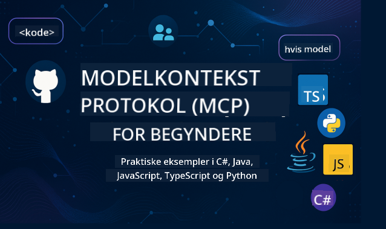

<!--
CO_OP_TRANSLATOR_METADATA:
{
  "original_hash": "2a21391378c12ecfef50f866329dfde0",
  "translation_date": "2025-05-17T05:27:28+00:00",
  "source_file": "README.md",
  "language_code": "da"
}
-->

Følg disse trin for at komme i gang med at bruge disse ressourcer:
1. **Fork Repositoriet**: Klik 
2. **Klon Repositoriet**: `git clone https://github.com/microsoft/mcp-for-beginners.git`
3. [**Deltag i Microsoft Azure AI Foundry Discord og mød eksperter og andre udviklere**](https://discord.com/invite/ByRwuEEgH4)

### 🌐 Multi-sprog Support

#### Understøttet via GitHub Action (Automatiseret & Altid Opdateret)
[Fransk](../fr/README.md) | [Spansk](../es/README.md) | [Tysk](../de/README.md) | [Russisk](../ru/README.md) | [Arabisk](../ar/README.md) | [Persisk (Farsi)](../fa/README.md) | [Urdu](../ur/README.md) | [Kinesisk (forenklet)](../zh/README.md) | [Kinesisk (traditionel, Macau)](../mo/README.md) | [Kinesisk (traditionel, Hong Kong)](../hk/README.md) | [Kinesisk (traditionel, Taiwan)](../tw/README.md) | [Japansk](../ja/README.md) | [Koreansk](../ko/README.md) | [Hindi](../hi/README.md) | [Bengali](../bn/README.md) | [Marathi](../mr/README.md) | [Nepali](../ne/README.md) | [Punjabi (Gurmukhi)](../pa/README.md) | [Portugisisk (Portugal)](../pt/README.md) | [Portugisisk (Brasilien)](../br/README.md) | [Italiensk](../it/README.md) | [Polsk](../pl/README.md) | [Tyrkisk](../tr/README.md) | [Græsk](../el/README.md) | [Thai](../th/README.md) | [Svensk](../sv/README.md) | [Dansk](./README.md) | [Norsk](../no/README.md) | [Finsk](../fi/README.md) | [Hollandsk](../nl/README.md) | [Hebraisk](../he/README.md) | [Vietnamesisk](../vi/README.md) | [Indonesisk](../id/README.md) | [Malaysisk](../ms/README.md) | [Tagalog (Filippinsk)](../tl/README.md) | [Swahili](../sw/README.md) | [Ungarsk](../hu/README.md) | [Tjekkisk](../cs/README.md) | [Slovakisk](../sk/README.md) | [Rumænsk](../ro/README.md) | [Bulgarsk](../bg/README.md) | [Serbisk (kyrillisk)](../sr/README.md) | [Kroatisk](../hr/README.md) | [Slovensk](../sl/README.md)
# 🚀 Ultimativ guide til Model Context Protocol (MCP) læseplanen for begyndere

## **Lær MCP med praktiske kodeeksempler i C#, Java, JavaScript, Python og TypeScript**

## 🧠 Oversigt over Model Context Protocol læseplanen

**Model Context Protocol (MCP)** er en avanceret ramme designet til at standardisere interaktioner mellem AI-modeller og klientapplikationer. Denne open-source læseplan tilbyder en struktureret læringsvej, komplet med praktiske kodeeksempler og virkelige brugssager, på populære programmeringssprog som C#, Java, JavaScript, TypeScript og Python.

Uanset om du er AI-udvikler, systemarkitekt eller softwareingeniør, er denne guide din omfattende ressource til at mestre MCP fundamentale og implementeringsstrategier.

## 🔗 Officielle MCP ressourcer

- 📘 [MCP Dokumentation](https://modelcontextprotocol.io/) – Detaljerede tutorials og brugervejledninger  
- 📜 [MCP Specifikation](https://spec.modelcontextprotocol.io/) – Protokolarkitektur og tekniske referencer  
- 🧑‍💻 [MCP GitHub Repository](https://github.com/modelcontextprotocol) – Open-source SDK'er, værktøjer og kodeeksempler  

## 🧭 Komplet MCP læseplan struktur

### 📌 [Introduktion til MCP](./00-Introduction/README.md)

- Hvad er Model Context Protocol?
- Hvorfor standardisering er vigtigt i AI-pipelines
- Praktiske brugssager og fordele ved MCP

### 🧩 [Kernekoncepter forklaret](./01-CoreConcepts/README.md)

- Forstå klient-server arkitektur i MCP
- Nøgleprotokolkomponenter: forespørgsler, svar og skemaer
- MCP besked- og dataudvekslingsmønstre

### 🔐 [Sikkerhed i MCP](./02-Security/readme.md)

- Identificere sikkerhedstrusler inden for MCP-baserede systemer
- Teknikker og bedste praksis for at sikre implementeringer

### 🚀 [Kom godt i gang med MCP](./03-GettingStarted/README.md)

- Miljøopsætning og konfiguration
- Oprette grundlæggende MCP servere og klienter
- Integrere MCP med eksisterende applikationer

#### 🧮 MCP Calculator eksempler:

  
<strong>Udforsk kodeimplementeringer efter sprog</strong>

  - [C# MCP Server Eksempel](./03-GettingStarted/samples/csharp/README.md)
  - [Java MCP Calculator](./03-GettingStarted/samples/java/calculator/README.md)
  - [JavaScript MCP Demo](./03-GettingStarted/samples/javascript/README.md)
  - [Python MCP Server](../../03-GettingStarted/samples/python/mcp_calculator_server.py)
  - [TypeScript MCP Eksempel](./03-GettingStarted/samples/typescript/README.md)

### 🛠️ [Praktisk implementering](./04-PracticalImplementation/README.md)

- Brug af SDK'er på tværs af forskellige sprog
- Debugging, testning og validering
- Udforme genanvendelige promptskabeloner og arbejdsprocesser

#### 💡 MCP Avancerede Calculator projekter:

  
<strong>Udforsk avancerede eksempler</strong>

  - [Avanceret C# Eksempel](./04-PracticalImplementation/samples/csharp/README.md)
  - [Java Container App Eksempel](./04-PracticalImplementation/samples/java/containerapp/README.md)
  - [JavaScript Avanceret Eksempel](./04-PracticalImplementation/samples/javascript/README.md)
  - [Python Kompleks Implementering](../../04-PracticalImplementation/samples/python/mcp_sample.py)
  - [TypeScript Container Eksempel](./04-PracticalImplementation/samples/typescript/README.md)

### 🎓 [Avancerede emner i MCP](./05-AdvancedTopics/README.md)

- Multi-modal AI arbejdsprocesser og udvidelsesmuligheder
- Sikker skaleringstrategier
- MCP i virksomhedsøkosystemer

### 🌍 [Fællesskabsbidrag](./06-CommunityContributions/README.md)

- Hvordan man bidrager med kode og dokumenter
- Samarbejde via GitHub
- Fællesskabsdrevne forbedringer og feedback

### 📈 [Indsigter fra tidlig adoption](./07-CaseStudies/README.md)

- Virkelige implementeringer og hvad der virkede
- Bygge og implementere MCP-baserede løsninger
- Tendenser og fremtidig køreplan

### 📏 [Bedste praksis for MCP](./08-BestPractices/README.md)

- Ydelsestuning og optimering
- Design af fejl-tolerante MCP systemer
- Test- og modstandsstrategier

### 📊 [MCP Case Studies](./09-CaseStudy/Readme.md)

- Dybdegående analyser af MCP løsningsarkitekturer
- Implementeringsplaner og integrationstips
- Annoterede diagrammer og projektgennemgange

## 🎯 Forudsætninger for at lære MCP

For at få mest ud af denne læseplan, bør du have:

- Grundlæggende kendskab til C#, Java eller Python
- Forståelse af klient-server modellen og API'er
- (Valgfrit) Kendskab til maskinlæringskoncepter

## 🛠️ Hvordan man bruger denne læseplan effektivt

Hver lektion i denne guide inkluderer:

1. Klare forklaringer af MCP koncepter  
2. Live kodeeksempler i flere sprog  
3. Øvelser til at bygge rigtige MCP applikationer  
4. Ekstra ressourcer til avancerede elever  

## 📜 Licensinformation

Dette indhold er licenseret under **MIT Licensen**. For vilkår og betingelser, se [LICENSE](../../LICENSE).

## 🤝 Retningslinjer for bidrag

Dette projekt byder bidrag og forslag velkommen. De fleste bidrag kræver, at du indgår en
Contributor License Agreement (CLA), der erklærer, at du har retten til, og faktisk gør, give os
rettighederne til at bruge dit bidrag. For detaljer, besøg <https://cla.opensource.microsoft.com>.

Når du indsender en pull request, vil en CLA bot automatisk afgøre, om du skal levere
en CLA og dekorere PR'en passende (f.eks. statuskontrol, kommentar). Følg blot de instruktioner
givet af botten. Du skal kun gøre dette én gang på tværs af alle repos, der bruger vores CLA.

Dette projekt har vedtaget [Microsoft Open Source Code of Conduct](https://opensource.microsoft.com/codeofconduct/).
For mere information se [Code of Conduct FAQ](https://opensource.microsoft.com/codeofconduct/faq/) eller
kontakt [opencode@microsoft.com](mailto:opencode@microsoft.com) med eventuelle yderligere spørgsmål eller kommentarer.

## ™️ Varemærke meddelelse

Dette projekt kan indeholde varemærker eller logoer for projekter, produkter eller tjenester. Autoriseret brug af Microsoft
varemærker eller logoer er underlagt og skal følge
[Microsoft's Trademark & Brand Guidelines](https://www.microsoft.com/legal/intellectualproperty/trademarks/usage/general).
Brug af Microsoft varemærker eller logoer i modificerede versioner af dette projekt må ikke forårsage forvirring eller antyde Microsoft sponsorat.
Enhver brug af tredjeparts varemærker eller logoer er underlagt disse tredjeparts politikker.

**Ansvarsfraskrivelse**:  
Dette dokument er blevet oversat ved hjælp af AI-oversættelsestjenesten [Co-op Translator](https://github.com/Azure/co-op-translator). Selvom vi bestræber os på nøjagtighed, skal du være opmærksom på, at automatiserede oversættelser kan indeholde fejl eller unøjagtigheder. Det originale dokument på dets oprindelige sprog bør betragtes som den autoritative kilde. For kritisk information anbefales professionel menneskelig oversættelse. Vi er ikke ansvarlige for eventuelle misforståelser eller fejltolkninger som følge af brugen af denne oversættelse.