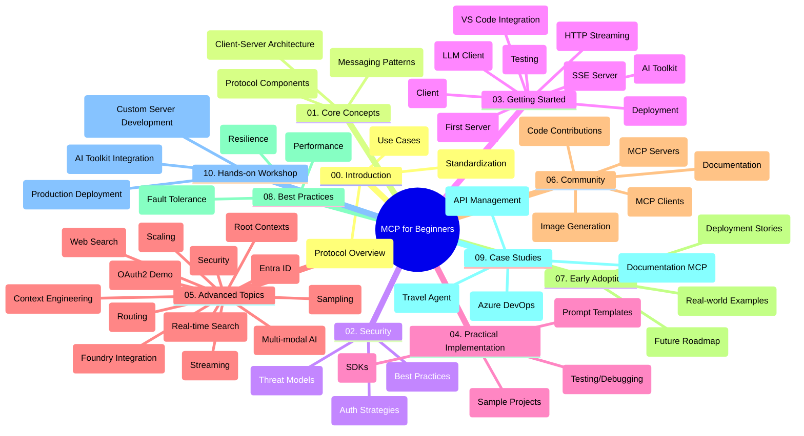

<!--
CO_OP_TRANSLATOR_METADATA:
{
  "original_hash": "5f321ea583cf087a94e47ee74c62b504",
  "translation_date": "2025-07-17T06:21:32+00:00",
  "source_file": "study_guide.md",
  "language_code": "da"
}
-->
# Model Context Protocol (MCP) for Begyndere - Studieguide

Denne studieguide giver en oversigt over repository-strukturen og indholdet for "Model Context Protocol (MCP) for Beginners"-pensum. Brug denne guide til effektivt at navigere i repository’et og få mest muligt ud af de tilgængelige ressourcer.

## Oversigt over Repository

Model Context Protocol (MCP) er en standardiseret ramme for interaktioner mellem AI-modeller og klientapplikationer. Oprindeligt skabt af Anthropic, vedligeholdes MCP nu af det bredere MCP-fællesskab gennem den officielle GitHub-organisation. Dette repository indeholder et omfattende pensum med praktiske kodeeksempler i C#, Java, JavaScript, Python og TypeScript, designet til AI-udviklere, systemarkitekter og softwareingeniører.

## Visuelt Pensumkort

## Repository-struktur

Repository’et er organiseret i ti hovedsektioner, der hver især fokuserer på forskellige aspekter af MCP:

1. **Introduction (00-Introduction/)**
   - Oversigt over Model Context Protocol
   - Hvorfor standardisering er vigtigt i AI-pipelines
   - Praktiske anvendelsestilfælde og fordele

2. **Core Concepts (01-CoreConcepts/)**
   - Client-server arkitektur
   - Centrale protokolkomponenter
   - Messaging-mønstre i MCP

3. **Security (02-Security/)**
   - Sikkerhedstrusler i MCP-baserede systemer
   - Bedste praksis for sikring af implementeringer
   - Autentificerings- og autorisationsstrategier

4. **Getting Started (03-GettingStarted/)**
   - Opsætning og konfiguration af miljø
   - Oprettelse af grundlæggende MCP-servere og klienter
   - Integration med eksisterende applikationer
   - Indeholder sektioner for:
     - Første serverimplementering
     - Klientudvikling
     - LLM-klientintegration
     - VS Code-integration
     - Server-Sent Events (SSE) server
     - HTTP streaming
     - AI Toolkit-integration
     - Teststrategier
     - Udrulningsvejledninger

5. **Practical Implementation (04-PracticalImplementation/)**
   - Brug af SDK’er på tværs af forskellige programmeringssprog
   - Debugging, test og valideringsteknikker
   - Udformning af genanvendelige promptskabeloner og workflows
   - Eksempler på projekter med implementeringer

6. **Advanced Topics (05-AdvancedTopics/)**
   - Context engineering-teknikker
   - Foundry agent-integration
   - Multi-modale AI-workflows
   - OAuth2 autentificeringsdemoer
   - Realtidssøgning
   - Realtidsstreaming
   - Implementering af root contexts
   - Routing-strategier
   - Sampling-teknikker
   - Skaleringsmetoder
   - Sikkerhedsovervejelser
   - Entra ID sikkerhedsintegration
   - Websøgning-integration

7. **Community Contributions (06-CommunityContributions/)**
   - Hvordan man bidrager med kode og dokumentation
   - Samarbejde via GitHub
   - Fællesskabsdrevne forbedringer og feedback
   - Brug af forskellige MCP-klienter (Claude Desktop, Cline, VSCode)
   - Arbejde med populære MCP-servere inklusive billedgenerering

8. **Lessons from Early Adoption (07-LessonsfromEarlyAdoption/)**
   - Virkelige implementeringer og succeshistorier
   - Opbygning og udrulning af MCP-baserede løsninger
   - Tendenser og fremtidig roadmap

9. **Best Practices (08-BestPractices/)**
   - Performance-tuning og optimering
   - Design af fejltolerante MCP-systemer
   - Test- og robusthedsstrategier

10. **Case Studies (09-CaseStudy/)**
    - Case study: Azure API Management-integration
    - Case study: Rejsebureau-implementering
    - Case study: Azure DevOps-integration med YouTube
    - Implementeringseksempler med detaljeret dokumentation

11. **Hands-on Workshop (10-StreamliningAIWorkflowsBuildingAnMCPServerWithAIToolkit/)**
    - Omfattende hands-on workshop, der kombinerer MCP med AI Toolkit
    - Opbygning af intelligente applikationer, der forbinder AI-modeller med virkelige værktøjer
    - Praktiske moduler, der dækker grundlæggende, tilpasset serverudvikling og produktionsudrulningsstrategier
    - Lab-baseret læring med trin-for-trin instruktioner

## Yderligere Ressourcer

Repository’et indeholder understøttende ressourcer:

- **Images folder**: Indeholder diagrammer og illustrationer brugt gennem pensum
- **Translations**: Flersproget support med automatiserede oversættelser af dokumentation
- **Officielle MCP-ressourcer**:
  - [MCP Documentation](https://modelcontextprotocol.io/)
  - [MCP Specification](https://spec.modelcontextprotocol.io/)
  - [MCP GitHub Repository](https://github.com/modelcontextprotocol)

## Sådan bruger du dette repository

1. **Sekventiel læring**: Følg kapitlerne i rækkefølge (00 til 10) for en struktureret læringsoplevelse.
2. **Sprog-specifik fokus**: Hvis du er interesseret i et bestemt programmeringssprog, kan du udforske samples-mapperne for implementeringer i dit foretrukne sprog.
3. **Praktisk implementering**: Start med sektionen "Getting Started" for at sætte dit miljø op og oprette din første MCP-server og klient.
4. **Avanceret udforskning**: Når du er fortrolig med det grundlæggende, kan du dykke ned i de avancerede emner for at udvide din viden.
5. **Fællesskabsengagement**: Deltag i MCP-fællesskabet via GitHub-diskussioner og Discord-kanaler for at forbinde med eksperter og andre udviklere.

## MCP-klienter og værktøjer

Pensum dækker forskellige MCP-klienter og værktøjer:

1. **Officielle klienter**:
   - Visual Studio Code
   - MCP i Visual Studio Code
   - Claude Desktop
   - Claude i VSCode
   - Claude API

2. **Fællesskabsklienter**:
   - Cline (terminal-baseret)
   - Cursor (kodeeditor)
   - ChatMCP
   - Windsurf

3. **MCP-administrationsværktøjer**:
   - MCP CLI
   - MCP Manager
   - MCP Linker
   - MCP Router

## Populære MCP-servere

Repository’et introducerer forskellige MCP-servere, herunder:

1. **Officielle reference-servere**:
   - Filesystem
   - Fetch
   - Memory
   - Sequential Thinking

2. **Billedgenerering**:
   - Azure OpenAI DALL-E 3
   - Stable Diffusion WebUI
   - Replicate

3. **Udviklingsværktøjer**:
   - Git MCP
   - Terminal Control
   - Code Assistant

4. **Specialiserede servere**:
   - Salesforce
   - Microsoft Teams
   - Jira & Confluence

## Bidrag

Dette repository byder velkommen til bidrag fra fællesskabet. Se sektionen Community Contributions for vejledning i, hvordan du effektivt kan bidrage til MCP-økosystemet.

## Changelog

| Dato | Ændringer |
|-------|-----------|
| 16. juli 2025 | - Opdateret repository-struktur for at afspejle aktuelt indhold - Tilføjet sektion om MCP-klienter og værktøjer - Tilføjet sektion om populære MCP-servere - Opdateret Visuelt Pensumkort med alle aktuelle emner - Udvidet Avancerede Emner med alle specialiserede områder - Opdateret Case Studies med faktiske eksempler - Præciseret MCP’s oprindelse som skabt af Anthropic |
| 11. juni 2025 | - Oprettelse af studieguide - Tilføjet Visuelt Pensumkort - Skitseret repository-struktur - Inkluderet prøveprojekter og yderligere ressourcer |

---

*Denne studieguide blev opdateret den 16. juli 2025 og giver en oversigt over repository’et pr. denne dato. Repository-indhold kan blive opdateret efter denne dato.*

**Ansvarsfraskrivelse**:  
Dette dokument er blevet oversat ved hjælp af AI-oversættelsestjenesten [Co-op Translator](https://github.com/Azure/co-op-translator). Selvom vi bestræber os på nøjagtighed, bedes du være opmærksom på, at automatiserede oversættelser kan indeholde fejl eller unøjagtigheder. Det oprindelige dokument på dets oprindelige sprog bør betragtes som den autoritative kilde. For kritisk information anbefales professionel menneskelig oversættelse. Vi påtager os intet ansvar for misforståelser eller fejltolkninger, der opstår som følge af brugen af denne oversættelse.