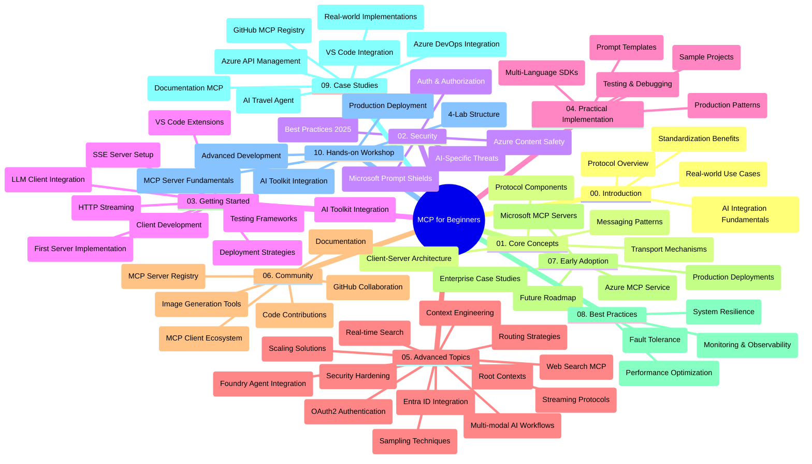

<!--
CO_OP_TRANSLATOR_METADATA:
{
  "original_hash": "719117a0a5f34ade7b5dfb61ee06fb13",
  "translation_date": "2025-09-26T18:33:20+00:00",
  "source_file": "study_guide.md",
  "language_code": "da"
}
-->
# Model Context Protocol (MCP) for Begyndere - Studievejledning

Denne studievejledning giver et overblik over strukturen og indholdet i "Model Context Protocol (MCP) for Begyndere"-curriculum. Brug vejledningen til at navigere i repositoryet effektivt og få mest muligt ud af de tilgængelige ressourcer.

## Repository Oversigt

Model Context Protocol (MCP) er en standardiseret ramme for interaktioner mellem AI-modeller og klientapplikationer. Oprindeligt skabt af Anthropic, vedligeholdes MCP nu af det bredere MCP-fællesskab gennem den officielle GitHub-organisation. Dette repository tilbyder et omfattende curriculum med praktiske kodeeksempler i C#, Java, JavaScript, Python og TypeScript, designet til AI-udviklere, systemarkitekter og softwareingeniører.

## Visuel Curriculum Kort

## Repository Struktur

Repositoryet er organiseret i ti hovedsektioner, der hver fokuserer på forskellige aspekter af MCP:

1. **Introduktion (00-Introduction/)**
   - Overblik over Model Context Protocol
   - Hvorfor standardisering er vigtig i AI-pipelines
   - Praktiske anvendelser og fordele

2. **Kernebegreber (01-CoreConcepts/)**
   - Klient-server arkitektur
   - Centrale protokolelementer
   - Messaging-mønstre i MCP

3. **Sikkerhed (02-Security/)**
   - Sikkerhedstrusler i MCP-baserede systemer
   - Bedste praksis for sikring af implementeringer
   - Strategier for autentifikation og autorisation
   - **Omfattende Sikkerhedsdokumentation**:
     - MCP Sikkerhedsbedste Praksis 2025
     - Azure Content Safety Implementeringsguide
     - MCP Sikkerhedskontroller og Teknikker
     - MCP Hurtig Reference for Bedste Praksis
   - **Vigtige Sikkerhedsemner**:
     - Prompt injection og værktøjsforgiftning
     - Session hijacking og confused deputy problemer
     - Token passthrough sårbarheder
     - Overdrevne tilladelser og adgangskontrol
     - Forsyningskædesikkerhed for AI-komponenter
     - Microsoft Prompt Shields integration

4. **Kom godt i gang (03-GettingStarted/)**
   - Opsætning og konfiguration af miljø
   - Oprettelse af grundlæggende MCP-servere og -klienter
   - Integration med eksisterende applikationer
   - Indeholder sektioner om:
     - Første serverimplementering
     - Klientudvikling
     - LLM-klientintegration
     - VS Code integration
     - Server-Sent Events (SSE) server
     - HTTP streaming
     - AI Toolkit integration
     - Teststrategier
     - Udrulningsvejledninger

5. **Praktisk Implementering (04-PracticalImplementation/)**
   - Brug af SDK'er på tværs af forskellige programmeringssprog
   - Debugging, test og valideringsteknikker
   - Udformning af genanvendelige promptskabeloner og workflows
   - Eksempelprojekter med implementeringsdetaljer

6. **Avancerede Emner (05-AdvancedTopics/)**
   - Teknikker til kontekstengineering
   - Foundry agent integration
   - Multi-modal AI workflows
   - OAuth2 autentifikationsdemoer
   - Realtidssøgning
   - Realtidsstreaming
   - Implementering af root contexts
   - Routingstrategier
   - Samplingteknikker
   - Skaleringstilgange
   - Sikkerhedsovervejelser
   - Entra ID sikkerhedsintegration
   - Websøgning integration

7. **Fællesskabsbidrag (06-CommunityContributions/)**
   - Hvordan man bidrager med kode og dokumentation
   - Samarbejde via GitHub
   - Fællesskabsdrevne forbedringer og feedback
   - Brug af forskellige MCP-klienter (Claude Desktop, Cline, VSCode)
   - Arbejde med populære MCP-servere, herunder billedgenerering

8. **Lærdomme fra Tidlig Adoptering (07-LessonsfromEarlyAdoption/)**
   - Implementeringer og succeshistorier fra den virkelige verden
   - Opbygning og udrulning af MCP-baserede løsninger
   - Tendenser og fremtidig roadmap
   - **Microsoft MCP Servers Guide**: Omfattende guide til 10 produktionsklare Microsoft MCP-servere, herunder:
     - Microsoft Learn Docs MCP Server
     - Azure MCP Server (15+ specialiserede connectors)
     - GitHub MCP Server
     - Azure DevOps MCP Server
     - MarkItDown MCP Server
     - SQL Server MCP Server
     - Playwright MCP Server
     - Dev Box MCP Server
     - Azure AI Foundry MCP Server
     - Microsoft 365 Agents Toolkit MCP Server

9. **Bedste Praksis (08-BestPractices/)**
   - Performance tuning og optimering
   - Design af fejl-tolerante MCP-systemer
   - Test- og robusthedsstrategier

10. **Case Studier (09-CaseStudy/)**
    - **Syv omfattende case studier** der demonstrerer MCP's alsidighed på tværs af forskellige scenarier:
    - **Azure AI Travel Agents**: Multi-agent orkestrering med Azure OpenAI og AI Search
    - **Azure DevOps Integration**: Automatisering af workflow-processer med YouTube dataopdateringer
    - **Realtidsdokumentationshentning**: Python konsolklient med streaming HTTP
    - **Interaktiv Studieplan Generator**: Chainlit webapp med samtale-AI
    - **In-Editor Dokumentation**: VS Code integration med GitHub Copilot workflows
    - **Azure API Management**: Enterprise API integration med MCP serveroprettelse
    - **GitHub MCP Registry**: Økosystemudvikling og agentisk integrationsplatform
    - Implementeringseksempler, der spænder over enterprise integration, udviklerproduktivitet og økosystemudvikling

11. **Hands-on Workshop (10-StreamliningAIWorkflowsBuildingAnMCPServerWithAIToolkit/)**
    - Omfattende hands-on workshop, der kombinerer MCP med AI Toolkit
    - Opbygning af intelligente applikationer, der forbinder AI-modeller med virkelige værktøjer
    - Praktiske moduler, der dækker grundlæggende, udvikling af tilpassede servere og produktionsudrulningsstrategier
    - **Lab Struktur**:
      - Lab 1: MCP Server Grundlæggende
      - Lab 2: Avanceret MCP Server Udvikling
      - Lab 3: AI Toolkit Integration
      - Lab 4: Produktionsudrulning og Skalering
    - Lab-baseret læringsmetode med trin-for-trin instruktioner

## Yderligere Ressourcer

Repositoryet inkluderer understøttende ressourcer:

- **Billedmappe**: Indeholder diagrammer og illustrationer brugt gennem curriculum
- **Oversættelser**: Flersproget support med automatiserede oversættelser af dokumentation
- **Officielle MCP Ressourcer**:
  - [MCP Dokumentation](https://modelcontextprotocol.io/)
  - [MCP Specifikation](https://spec.modelcontextprotocol.io/)
  - [MCP GitHub Repository](https://github.com/modelcontextprotocol)

## Sådan Bruger Du Dette Repository

1. **Sekventiel Læring**: Følg kapitlerne i rækkefølge (00 til 10) for en struktureret læringsoplevelse.
2. **Sprog-Specifik Fokus**: Hvis du er interesseret i et bestemt programmeringssprog, kan du udforske sample-mapperne for implementeringer i dit foretrukne sprog.
3. **Praktisk Implementering**: Start med sektionen "Kom godt i gang" for at opsætte dit miljø og oprette din første MCP-server og -klient.
4. **Avanceret Udforskning**: Når du er komfortabel med det grundlæggende, kan du dykke ned i de avancerede emner for at udvide din viden.
5. **Fællesskabsengagement**: Deltag i MCP-fællesskabet via GitHub-diskussioner og Discord-kanaler for at komme i kontakt med eksperter og andre udviklere.

## MCP Klienter og Værktøjer

Curriculum dækker forskellige MCP-klienter og værktøjer:

1. **Officielle Klienter**:
   - Visual Studio Code 
   - MCP i Visual Studio Code
   - Claude Desktop
   - Claude i VSCode 
   - Claude API

2. **Fællesskabsklienter**:
   - Cline (terminalbaseret)
   - Cursor (kodeeditor)
   - ChatMCP
   - Windsurf

3. **MCP Administrationsværktøjer**:
   - MCP CLI
   - MCP Manager
   - MCP Linker
   - MCP Router

## Populære MCP Servere

Repositoryet introducerer forskellige MCP-servere, herunder:

1. **Officielle Microsoft MCP Servere**:
   - Microsoft Learn Docs MCP Server
   - Azure MCP Server (15+ specialiserede connectors)
   - GitHub MCP Server
   - Azure DevOps MCP Server
   - MarkItDown MCP Server
   - SQL Server MCP Server
   - Playwright MCP Server
   - Dev Box MCP Server
   - Azure AI Foundry MCP Server
   - Microsoft 365 Agents Toolkit MCP Server

2. **Officielle Reference Servere**:
   - Filesystem
   - Fetch
   - Memory
   - Sequential Thinking

3. **Billedgenerering**:
   - Azure OpenAI DALL-E 3
   - Stable Diffusion WebUI
   - Replicate

4. **Udviklingsværktøjer**:
   - Git MCP
   - Terminal Control
   - Code Assistant

5. **Specialiserede Servere**:
   - Salesforce
   - Microsoft Teams
   - Jira & Confluence

## Bidrag

Dette repository byder velkommen til bidrag fra fællesskabet. Se sektionen Fællesskabsbidrag for vejledning i, hvordan du effektivt kan bidrage til MCP-økosystemet.

## Ændringslog

| Dato | Ændringer |
|------|-----------|
| 26. september 2025 | - Tilføjet GitHub MCP Registry case study til sektionen 09-CaseStudy - Opdateret Case Studier til at afspejle syv omfattende case studier - Forbedret case study beskrivelser med specifikke implementeringsdetaljer - Opdateret Visuel Curriculum Kort til at inkludere GitHub MCP Registry - Revideret studievejledningsstruktur for at afspejle fokus på økosystemudvikling |
| 18. juli 2025 | - Opdateret repository struktur til at inkludere Microsoft MCP Servers Guide - Tilføjet omfattende liste over 10 produktionsklare Microsoft MCP servere - Forbedret sektionen Populære MCP Servere med Officielle Microsoft MCP Servere - Opdateret Case Studier sektion med faktiske fil-eksempler - Tilføjet Lab Struktur detaljer for Hands-on Workshop |
| 16. juli 2025 | - Opdateret repository struktur for at afspejle aktuelt indhold - Tilføjet MCP Klienter og Værktøjer sektion - Tilføjet Populære MCP Servere sektion - Opdateret Visuel Curriculum Kort med alle aktuelle emner - Forbedret Avancerede Emner sektion med alle specialiserede områder - Opdateret Case Studier til at afspejle faktiske eksempler - Klargjort MCP's oprindelse som skabt af Anthropic |
| 11. juni 2025 | - Oprettet studievejledningen - Tilføjet Visuel Curriculum Kort - Skitseret repository struktur - Inkluderet eksempelprojekter og yderligere ressourcer |

---

*Denne studievejledning blev opdateret den 26. september 2025 og giver et overblik over repositoryet pr. denne dato. Repository-indhold kan blive opdateret efter denne dato.*

---

