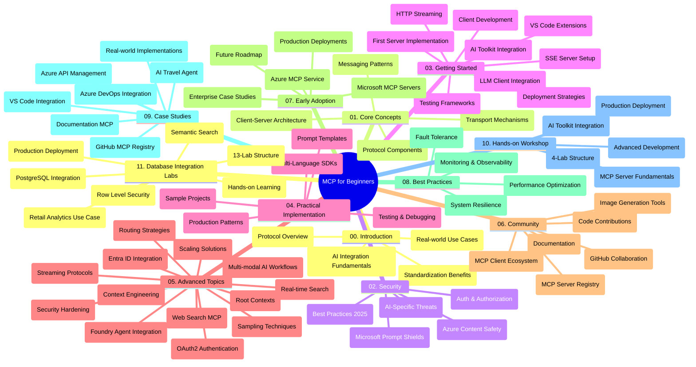

<!--
CO_OP_TRANSLATOR_METADATA:
{
  "original_hash": "aa1ce97bc694b08faf3018bab6d275b9",
  "translation_date": "2025-09-30T17:49:33+00:00",
  "source_file": "study_guide.md",
  "language_code": "da"
}
-->
# Model Context Protocol (MCP) for Begyndere - Studieguide

Denne studieguide giver et overblik over strukturen og indholdet i "Model Context Protocol (MCP) for Begyndere"-curriculum. Brug denne guide til at navigere i repositoryen effektivt og få mest muligt ud af de tilgængelige ressourcer.

## Repository Oversigt

Model Context Protocol (MCP) er en standardiseret ramme for interaktioner mellem AI-modeller og klientapplikationer. Oprindeligt skabt af Anthropic, vedligeholdes MCP nu af det bredere MCP-fællesskab gennem den officielle GitHub-organisation. Dette repository tilbyder et omfattende curriculum med praktiske kodeeksempler i C#, Java, JavaScript, Python og TypeScript, designet til AI-udviklere, systemarkitekter og softwareingeniører.

## Visuel Curriculum Kort

## Repository Struktur

Repositoryen er organiseret i elleve hovedsektioner, der hver fokuserer på forskellige aspekter af MCP:

1. **Introduktion (00-Introduction/)**
   - Oversigt over Model Context Protocol
   - Hvorfor standardisering er vigtig i AI-pipelines
   - Praktiske anvendelser og fordele

2. **Kernebegreber (01-CoreConcepts/)**
   - Klient-server arkitektur
   - Centrale protokolelementer
   - Messaging-mønstre i MCP

3. **Sikkerhed (02-Security/)**
   - Sikkerhedstrusler i MCP-baserede systemer
   - Bedste praksis for sikre implementeringer
   - Strategier for autentifikation og autorisation
   - **Omfattende sikkerhedsdokumentation**:
     - MCP Security Best Practices 2025
     - Azure Content Safety Implementation Guide
     - MCP Security Controls and Techniques
     - MCP Best Practices Quick Reference
   - **Vigtige sikkerhedsemner**:
     - Prompt injection og værktøjsforgiftning
     - Session hijacking og confused deputy problemer
     - Token passthrough sårbarheder
     - Overdrevne tilladelser og adgangskontrol
     - Forsyningskædesikkerhed for AI-komponenter
     - Microsoft Prompt Shields integration

4. **Kom godt i gang (03-GettingStarted/)**
   - Opsætning af miljø og konfiguration
   - Oprettelse af grundlæggende MCP-servere og -klienter
   - Integration med eksisterende applikationer
   - Indeholder sektioner om:
     - Første serverimplementering
     - Klientudvikling
     - LLM-klientintegration
     - VS Code integration
     - Server-Sent Events (SSE) server
     - HTTP streaming
     - AI Toolkit integration
     - Teststrategier
     - Udrulningsvejledninger

5. **Praktisk Implementering (04-PracticalImplementation/)**
   - Brug af SDK'er på tværs af forskellige programmeringssprog
   - Debugging, test og valideringsteknikker
   - Udformning af genanvendelige promptskabeloner og workflows
   - Eksempelprojekter med implementeringsdetaljer

6. **Avancerede Emner (05-AdvancedTopics/)**
   - Teknikker til kontekstengineering
   - Foundry agent integration
   - Multi-modal AI workflows
   - OAuth2 autentifikationsdemoer
   - Realtidssøgning
   - Realtidsstreaming
   - Implementering af root contexts
   - Routingstrategier
   - Samplingteknikker
   - Skaleringstilgange
   - Sikkerhedsovervejelser
   - Entra ID sikkerhedsintegration
   - Websøgning integration

7. **Fællesskabsbidrag (06-CommunityContributions/)**
   - Hvordan man bidrager med kode og dokumentation
   - Samarbejde via GitHub
   - Fællesskabsdrevne forbedringer og feedback
   - Brug af forskellige MCP-klienter (Claude Desktop, Cline, VSCode)
   - Arbejde med populære MCP-servere, herunder billedgenerering

8. **Lærdom fra Tidlig Adoptering (07-LessonsfromEarlyAdoption/)**
   - Implementeringer og succeshistorier fra den virkelige verden
   - Opbygning og udrulning af MCP-baserede løsninger
   - Tendenser og fremtidig roadmap
   - **Microsoft MCP Servers Guide**: Omfattende guide til 10 produktionsklare Microsoft MCP-servere, herunder:
     - Microsoft Learn Docs MCP Server
     - Azure MCP Server (15+ specialiserede connectors)
     - GitHub MCP Server
     - Azure DevOps MCP Server
     - MarkItDown MCP Server
     - SQL Server MCP Server
     - Playwright MCP Server
     - Dev Box MCP Server
     - Azure AI Foundry MCP Server
     - Microsoft 365 Agents Toolkit MCP Server

9. **Bedste Praksis (08-BestPractices/)**
   - Performance tuning og optimering
   - Design af fejl-tolerante MCP-systemer
   - Test- og robusthedsstrategier

10. **Case Studier (09-CaseStudy/)**
    - **Syv omfattende case studier** der demonstrerer MCP's alsidighed på tværs af forskellige scenarier:
    - **Azure AI Travel Agents**: Multi-agent orkestrering med Azure OpenAI og AI Search
    - **Azure DevOps Integration**: Automatisering af workflow-processer med YouTube dataopdateringer
    - **Realtidsdokumentationshentning**: Python konsolklient med streaming HTTP
    - **Interaktiv Studieplan Generator**: Chainlit webapp med samtale-AI
    - **In-Editor Dokumentation**: VS Code integration med GitHub Copilot workflows
    - **Azure API Management**: Enterprise API integration med MCP serveroprettelse
    - **GitHub MCP Registry**: Økosystemudvikling og agentisk integrationsplatform
    - Implementeringseksempler, der spænder over enterprise integration, udviklerproduktivitet og økosystemudvikling

11. **Hands-on Workshop (10-StreamliningAIWorkflowsBuildingAnMCPServerWithAIToolkit/)**
    - Omfattende hands-on workshop, der kombinerer MCP med AI Toolkit
    - Opbygning af intelligente applikationer, der forbinder AI-modeller med virkelige værktøjer
    - Praktiske moduler, der dækker grundlæggende, udvikling af tilpassede servere og produktionsudrulningsstrategier
    - **Lab Struktur**:
      - Lab 1: MCP Server Grundlæggende
      - Lab 2: Avanceret MCP Server Udvikling
      - Lab 3: AI Toolkit Integration
      - Lab 4: Produktionsudrulning og Skalering
    - Lab-baseret læringsmetode med trin-for-trin instruktioner

12. **MCP Server Database Integration Labs (11-MCPServerHandsOnLabs/)**
    - **Omfattende 13-labs læringssti** til opbygning af produktionsklare MCP-servere med PostgreSQL integration
    - **Virkelighedsnær detailanalyse implementering** baseret på Zava Retail use case
    - **Enterprise-grade mønstre** inklusive Row Level Security (RLS), semantisk søgning og multi-tenant dataadgang
    - **Komplet Lab Struktur**:
      - **Labs 00-03: Grundlag** - Introduktion, Arkitektur, Sikkerhed, Miljøopsætning
      - **Labs 04-06: Opbygning af MCP Server** - Database Design, MCP Server Implementering, Værktøjsudvikling
      - **Labs 07-09: Avancerede Funktioner** - Semantisk Søgningsfunktioner, Test & Debugging, VS Code Integration
      - **Labs 10-12: Produktion & Bedste Praksis** - Udrulning, Overvågning, Optimering
    - **Teknologier Dækket**: FastMCP framework, PostgreSQL, Azure OpenAI, Azure Container Apps, Application Insights
    - **Læringsresultater**: Produktionsklare MCP-servere, databaseintegrationsmønstre, AI-drevet analyse, enterprise-sikkerhed

## Yderligere Ressourcer

Repositoryen inkluderer understøttende ressourcer:

- **Billedmappe**: Indeholder diagrammer og illustrationer brugt gennem curriculum
- **Oversættelser**: Flersproget support med automatiserede oversættelser af dokumentation
- **Officielle MCP Ressourcer**:
  - [MCP Dokumentation](https://modelcontextprotocol.io/)
  - [MCP Specifikation](https://spec.modelcontextprotocol.io/)
  - [MCP GitHub Repository](https://github.com/modelcontextprotocol)

## Sådan Bruger Du Denne Repository

1. **Sekventiel Læring**: Følg kapitlerne i rækkefølge (00 til 11) for en struktureret læringsoplevelse.
2. **Sprog-Specifik Fokus**: Hvis du er interesseret i et bestemt programmeringssprog, udforsk samples-mapperne for implementeringer i dit foretrukne sprog.
3. **Praktisk Implementering**: Start med sektionen "Kom godt i gang" for at opsætte dit miljø og oprette din første MCP-server og -klient.
4. **Avanceret Udforskning**: Når du er komfortabel med det grundlæggende, dyk ned i de avancerede emner for at udvide din viden.
5. **Fællesskabsengagement**: Deltag i MCP-fællesskabet via GitHub-diskussioner og Discord-kanaler for at komme i kontakt med eksperter og andre udviklere.

## MCP Klienter og Værktøjer

Curriculum dækker forskellige MCP-klienter og værktøjer:

1. **Officielle Klienter**:
   - Visual Studio Code 
   - MCP i Visual Studio Code
   - Claude Desktop
   - Claude i VSCode 
   - Claude API

2. **Fællesskabsklienter**:
   - Cline (terminalbaseret)
   - Cursor (kodeeditor)
   - ChatMCP
   - Windsurf

3. **MCP Administrationsværktøjer**:
   - MCP CLI
   - MCP Manager
   - MCP Linker
   - MCP Router

## Populære MCP Servere

Repositoryen introducerer forskellige MCP-servere, herunder:

1. **Officielle Microsoft MCP Servere**:
   - Microsoft Learn Docs MCP Server
   - Azure MCP Server (15+ specialiserede connectors)
   - GitHub MCP Server
   - Azure DevOps MCP Server
   - MarkItDown MCP Server
   - SQL Server MCP Server
   - Playwright MCP Server
   - Dev Box MCP Server
   - Azure AI Foundry MCP Server
   - Microsoft 365 Agents Toolkit MCP Server

2. **Officielle Reference Servere**:
   - Filesystem
   - Fetch
   - Memory
   - Sequential Thinking

3. **Billedgenerering**:
   - Azure OpenAI DALL-E 3
   - Stable Diffusion WebUI
   - Replicate

4. **Udviklingsværktøjer**:
   - Git MCP
   - Terminal Control
   - Code Assistant

5. **Specialiserede Servere**:
   - Salesforce
   - Microsoft Teams
   - Jira & Confluence

## Bidrag

Dette repository byder velkommen til bidrag fra fællesskabet. Se sektionen Fællesskabsbidrag for vejledning i, hvordan du effektivt kan bidrage til MCP-økosystemet.

## Ændringslog

| Dato | Ændringer |
|------|---------||
| 29. september 2025 | - Tilføjet 11-MCPServerHandsOnLabs sektion med omfattende 13-labs databaseintegrationslæringssti - Opdateret Visuel Curriculum Kort til at inkludere Database Integration Labs - Forbedret repositorystruktur til at afspejle elleve hovedsektioner - Tilføjet detaljeret beskrivelse af PostgreSQL integration, detailanalyse use case og enterprise mønstre - Opdateret navigationsvejledning til at inkludere sektioner 00-11 |
| 26. september 2025 | - Tilføjet GitHub MCP Registry case study til 09-CaseStudy sektion - Opdateret Case Studier til at afspejle syv omfattende case studier - Forbedret case study beskrivelser med specifikke implementeringsdetaljer - Opdateret Visuel Curriculum Kort til at inkludere GitHub MCP Registry - Revideret studieguide struktur til at afspejle økosystemudviklingsfokus |
| 18. juli 2025 | - Opdateret repositorystruktur til at inkludere Microsoft MCP Servers Guide - Tilføjet omfattende liste over 10 produktionsklare Microsoft MCP-servere - Forbedret Populære MCP Servere sektion med Officielle Microsoft MCP Servere - Opdateret Case Studier sektion med faktiske fil-eksempler - Tilføjet Lab Struktur detaljer for Hands-on Workshop |
| 16. juli 2025 | - Opdateret repositorystruktur til at afspejle aktuelt indhold - Tilføjet MCP Klienter og Værktøjer sektion - Tilføjet Populære MCP Servere sektion - Opdateret Visuel Curriculum Kort med alle aktuelle emner - Forbedret Avancerede Emner sektion med alle specialiserede områder - Opdateret Case Studier til at afspejle faktiske eksempler - Klargjort MCP oprindelse som skabt af Anthropic |
| 11. juni 2025 | - Oprettelse af studieguide - Tilføjet Visuel Curriculum Kort - Skitseret repositorystruktur - Inkluderet eksempelprojekter og yderligere ressourcer |

---

*Denne studieguide blev opdateret den 29. september 2025 og giver et overblik over repositoryen pr. denne dato. Repositoryindhold kan blive opdateret efter denne dato.*

---

**Ansvarsfraskrivelse**:  
Dette dokument er blevet oversat ved hjælp af AI-oversættelsestjenesten [Co-op Translator](https://github.com/Azure/co-op-translator). Selvom vi bestræber os på nøjagtighed, skal det bemærkes, at automatiserede oversættelser kan indeholde fejl eller unøjagtigheder. Det originale dokument på dets oprindelige sprog bør betragtes som den autoritative kilde. For kritisk information anbefales professionel menneskelig oversættelse. Vi påtager os ikke ansvar for misforståelser eller fejltolkninger, der måtte opstå som følge af brugen af denne oversættelse.