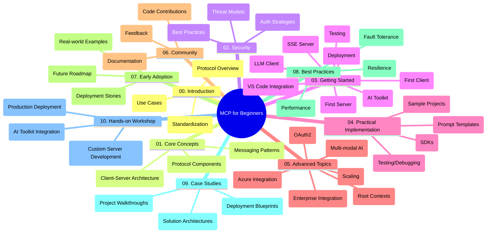

<!--
CO_OP_TRANSLATOR_METADATA:
{
  "original_hash": "a607d4febc94caee9a12b77795f7fc9a",
  "translation_date": "2025-06-11T16:45:25+00:00",
  "source_file": "study_guide.md",
  "language_code": "da"
}
-->
# Model Context Protocol (MCP) for Beginners - Studieguide

Denne studieguide giver et overblik over repository-strukturen og indholdet for "Model Context Protocol (MCP) for Beginners"-pensum. Brug denne guide til effektivt at navigere i repository og få mest muligt ud af de tilgængelige ressourcer.

## Repository Oversigt

Model Context Protocol (MCP) er en standardiseret ramme for interaktioner mellem AI-modeller og klientapplikationer. Dette repository tilbyder et omfattende pensum med praktiske kodeeksempler i C#, Java, JavaScript, Python og TypeScript, designet til AI-udviklere, systemarkitekter og softwareingeniører.

## Visuelt Pensumkort

## Repository Struktur

Repository er opdelt i ti hovedsektioner, der hver især fokuserer på forskellige aspekter af MCP:

1. **Introduction (00-Introduction/)**
   - Overblik over Model Context Protocol
   - Hvorfor standardisering er vigtigt i AI-pipelines
   - Praktiske anvendelsestilfælde og fordele

2. **Core Concepts (01-CoreConcepts/)**
   - Client-server arkitektur
   - Nøglekomponenter i protokollen
   - Messaging-mønstre i MCP

3. **Security (02-Security/)**
   - Sikkerhedstrusler i MCP-baserede systemer
   - Bedste praksis for sikring af implementeringer
   - Autentificerings- og autorisationsstrategier

4. **Getting Started (03-GettingStarted/)**
   - Opsætning og konfiguration af miljø
   - Oprettelse af grundlæggende MCP-servere og klienter
   - Integration med eksisterende applikationer
   - Underafsnit for første server, første klient, LLM-klient, VS Code-integration, SSE-server, AI Toolkit, test og deployment

5. **Practical Implementation (04-PracticalImplementation/)**
   - Brug af SDK’er på tværs af forskellige programmeringssprog
   - Debugging, test og valideringsteknikker
   - Udarbejdelse af genanvendelige promptskabeloner og workflows
   - Eksempelsprojekter med implementeringer

6. **Advanced Topics (05-AdvancedTopics/)**
   - Multi-modale AI-workflows og udvidelsesmuligheder
   - Sikker skalering
   - MCP i virksomhedsekosystemer
   - Specialiserede emner inklusiv Azure-integration, multi-modalitet, OAuth2, root contexts, routing, sampling, skalering, sikkerhed, websøgningsintegration og streaming.

7. **Community Contributions (06-CommunityContributions/)**
   - Hvordan man bidrager med kode og dokumentation
   - Samarbejde via GitHub
   - Fællesskabsdrevne forbedringer og feedback

8. **Lessons from Early Adoption (07-LessonsfromEarlyAdoption/)**
   - Virkelige implementeringer og succeshistorier
   - Opbygning og udrulning af MCP-baserede løsninger
   - Trends og fremtidig roadmap

9. **Best Practices (08-BestPractices/)**
   - Performance tuning og optimering
   - Design af fejltolerante MCP-systemer
   - Test- og robusthedsstrategier

10. **Case Studies (09-CaseStudy/)**
    - Dybdegående analyser af MCP-løsningsarkitekturer
    - Udrulningsplaner og integrationstips
    - Annoterede diagrammer og projektgennemgange

11. **Hands-on Workshop (10-StreamliningAIWorkflowsBuildingAnMCPServerWithAIToolkit/)**
    - Omfattende hands-on workshop, der kombinerer MCP med Microsofts AI Toolkit til VS Code
    - Opbygning af intelligente applikationer, der forbinder AI-modeller med virkelige værktøjer
    - Praktiske moduler, der dækker grundlæggende, tilpasset serverudvikling og produktionsudrulningsstrategier

## Eksempelsprojekter

Repository indeholder flere eksempelsprojekter, der demonstrerer MCP-implementering på tværs af forskellige programmeringssprog:

### Grundlæggende MCP Calculator Eksempler
- C# MCP Server Eksempel
- Java MCP Calculator
- JavaScript MCP Demo
- Python MCP Server
- TypeScript MCP Eksempel

### Avancerede MCP Calculator Projekter
- Avanceret C# Eksempel
- Java Container App Eksempel
- JavaScript Avanceret Eksempel
- Python Kompleks Implementering
- TypeScript Container Eksempel

## Yderligere Ressourcer

Repository indeholder understøttende ressourcer:

- **Images folder**: Indeholder diagrammer og illustrationer brugt gennem pensum
- **Translations**: Fleresproget support med automatiserede oversættelser af dokumentationen
- **Official MCP Resources**:
  - [MCP Documentation](https://modelcontextprotocol.io/)
  - [MCP Specification](https://spec.modelcontextprotocol.io/)
  - [MCP GitHub Repository](https://github.com/modelcontextprotocol)

## Sådan Bruger Du Dette Repository

1. **Sekventiel Læring**: Følg kapitlerne i rækkefølge (00 til 10) for en struktureret læringsoplevelse.
2. **Sprog-specifik Fokus**: Hvis du er interesseret i et bestemt programmeringssprog, udforsk samples-mapperne for implementeringer i dit foretrukne sprog.
3. **Praktisk Implementering**: Start med sektionen "Getting Started" for at sætte dit miljø op og oprette din første MCP-server og klient.
4. **Avanceret Udforskning**: Når du er fortrolig med det grundlæggende, kan du dykke ned i de avancerede emner for at udvide din viden.
5. **Fællesskabsengagement**: Deltag i [Azure AI Foundry Discord](https://discord.com/invite/ByRwuEEgH4) for at komme i kontakt med eksperter og andre udviklere.

## Bidrag

Dette repository byder velkommen til bidrag fra fællesskabet. Se sektionen Community Contributions for vejledning om, hvordan du bidrager.

---

*Denne studieguide blev oprettet den 11. juni 2025 og giver et overblik over repository på dette tidspunkt. Repository-indhold kan være opdateret siden da.*

**Ansvarsfraskrivelse**:  
Dette dokument er oversat ved hjælp af AI-oversættelsestjenesten [Co-op Translator](https://github.com/Azure/co-op-translator). Selvom vi bestræber os på nøjagtighed, skal du være opmærksom på, at automatiserede oversættelser kan indeholde fejl eller unøjagtigheder. Det oprindelige dokument på dets modersmål bør betragtes som den autoritative kilde. For kritisk information anbefales professionel menneskelig oversættelse. Vi påtager os intet ansvar for misforståelser eller fejltolkninger, der måtte opstå som følge af brugen af denne oversættelse.