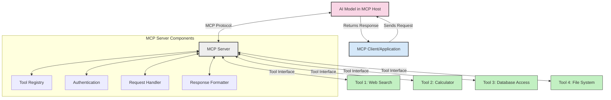
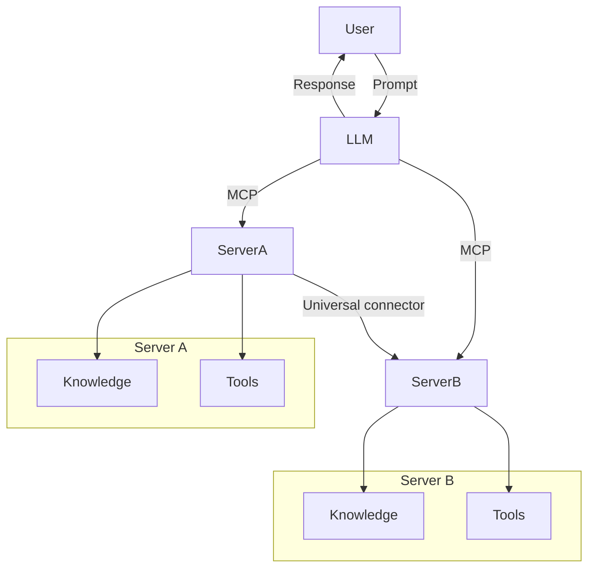

<!--
CO_OP_TRANSLATOR_METADATA:
{
  "original_hash": "02301140adbd807ecf0f17720fa307bc",
  "translation_date": "2025-05-16T14:32:05+00:00",
  "source_file": "00-Introduction/README.md",
  "language_code": "de"
}
-->
# Einführung in das Model Context Protocol (MCP): Warum es für skalierbare KI-Anwendungen wichtig ist

Generative KI-Anwendungen sind ein großer Fortschritt, da sie es dem Nutzer oft ermöglichen, mit der App über natürliche Spracheingaben zu interagieren. Doch je mehr Zeit und Ressourcen in solche Apps investiert werden, desto wichtiger ist es, Funktionen und Ressourcen so zu integrieren, dass sie leicht erweiterbar sind, mehrere Modelle unterstützt werden können und die Komplexität beherrschbar bleibt. Kurz gesagt: Gen KI-Apps zu starten ist einfach, aber mit zunehmender Komplexität braucht man eine klare Architektur und idealerweise einen Standard, um sicherzustellen, dass die Apps konsistent aufgebaut sind. Genau hier kommt MCP ins Spiel, um Ordnung zu schaffen und einen Standard bereitzustellen.

---

## **🔍 Was ist das Model Context Protocol (MCP)?**

Das **Model Context Protocol (MCP)** ist eine **offene, standardisierte Schnittstelle**, die es großen Sprachmodellen (LLMs) ermöglicht, nahtlos mit externen Werkzeugen, APIs und Datenquellen zu interagieren. Es bietet eine einheitliche Architektur, um die Funktionalität von KI-Modellen über deren Trainingsdaten hinaus zu erweitern und so intelligentere, skalierbare und reaktionsfähigere KI-Systeme zu ermöglichen.

---

## **🎯 Warum Standardisierung in der KI wichtig ist**

Da generative KI-Anwendungen immer komplexer werden, ist es entscheidend, Standards einzuführen, die **Skalierbarkeit, Erweiterbarkeit** und **Wartbarkeit** gewährleisten. MCP adressiert diese Anforderungen durch:

- Vereinheitlichung der Integration von Modellen und Werkzeugen
- Reduzierung von fragilen, einmaligen Sonderlösungen
- Ermöglichung der Koexistenz mehrerer Modelle in einem Ökosystem

---

## **📚 Lernziele**

Am Ende dieses Artikels wirst du in der Lage sein:

- Das **Model Context Protocol (MCP)** und seine Anwendungsfälle zu definieren
- Zu verstehen, wie MCP die Kommunikation zwischen Modell und Werkzeug standardisiert
- Die Kernkomponenten der MCP-Architektur zu identifizieren
- Praxisbeispiele für MCP in Unternehmen und Entwicklungsumgebungen zu erkunden

---

## **💡 Warum das Model Context Protocol (MCP) ein Wendepunkt ist**

### **🔗 MCP löst die Fragmentierung in KI-Interaktionen**

Vor MCP erforderte die Integration von Modellen mit Werkzeugen:

- Individuellen Code für jede Werkzeug-Modell-Kombination
- Nicht-standardisierte APIs für jeden Anbieter
- Häufige Unterbrechungen durch Updates
- Schlechte Skalierbarkeit bei zunehmender Werkzeuganzahl

### **✅ Vorteile der MCP-Standardisierung**

| **Vorteil**              | **Beschreibung**                                                               |
|--------------------------|--------------------------------------------------------------------------------|
| Interoperabilität        | LLMs arbeiten nahtlos mit Werkzeugen verschiedener Anbieter zusammen          |
| Konsistenz               | Einheitliches Verhalten über Plattformen und Werkzeuge hinweg                 |
| Wiederverwendbarkeit     | Einmal entwickelte Werkzeuge können in verschiedenen Projekten und Systemen genutzt werden |
| Schnellere Entwicklung   | Entwicklungszeit verkürzt durch standardisierte, sofort einsatzbereite Schnittstellen |

---

## **🧱 Überblick über die MCP-Architektur auf hoher Ebene**

MCP folgt einem **Client-Server-Modell**, bei dem:

- **MCP Hosts** die KI-Modelle ausführen
- **MCP Clients** Anfragen initiieren
- **MCP Server** Kontext, Werkzeuge und Fähigkeiten bereitstellen

### **Wichtige Komponenten:**

- **Resources** – Statische oder dynamische Daten für Modelle  
- **Prompts** – Vorgefertigte Abläufe für geführte Generierung  
- **Tools** – Ausführbare Funktionen wie Suche, Berechnungen  
- **Sampling** – Agentenverhalten durch rekursive Interaktionen

---

## Wie MCP Server funktionieren

MCP Server arbeiten folgendermaßen:

- **Anfragefluss**:  
    1. Der MCP Client sendet eine Anfrage an das KI-Modell, das in einem MCP Host läuft.  
    2. Das KI-Modell erkennt, wann es externe Werkzeuge oder Daten benötigt.  
    3. Das Modell kommuniziert über das standardisierte Protokoll mit dem MCP Server.

- **Funktionen des MCP Servers**:  
    - Tool-Register: Führt einen Katalog verfügbarer Werkzeuge und deren Fähigkeiten.  
    - Authentifizierung: Überprüft Berechtigungen für den Werkzeugzugriff.  
    - Anfrage-Handler: Verarbeitet eingehende Werkzeuganfragen vom Modell.  
    - Antwort-Formatter: Formatiert Werkzeugausgaben in ein für das Modell verständliches Format.

- **Werkzeug-Ausführung**:  
    - Der Server leitet Anfragen an die passenden externen Werkzeuge weiter  
    - Werkzeuge führen ihre spezialisierten Funktionen aus (Suche, Berechnung, Datenbankabfragen etc.)  
    - Ergebnisse werden in einem einheitlichen Format an das Modell zurückgegeben.

- **Abschluss der Antwort**:  
    - Das KI-Modell integriert die Werkzeugausgaben in seine Antwort.  
    - Die finale Antwort wird an die Client-Anwendung zurückgesendet.

## 👨‍💻 Wie man einen MCP Server baut (mit Beispielen)

MCP Server ermöglichen es, die Fähigkeiten von LLMs durch Bereitstellung von Daten und Funktionen zu erweitern.

Bereit zum Ausprobieren? Hier sind Beispiele, wie man einen einfachen MCP Server in verschiedenen Sprachen erstellt:

- **Python Beispiel**: https://github.com/modelcontextprotocol/python-sdk

- **TypeScript Beispiel**: https://github.com/modelcontextprotocol/typescript-sdk

- **Java Beispiel**: https://github.com/modelcontextprotocol/java-sdk

- **C#/.NET Beispiel**: https://github.com/modelcontextprotocol/csharp-sdk

## 🌍 Praxisbeispiele für MCP

MCP ermöglicht eine Vielzahl von Anwendungen durch Erweiterung der KI-Fähigkeiten:

| **Anwendung**               | **Beschreibung**                                                                |
|----------------------------|--------------------------------------------------------------------------------|
| Enterprise-Datenintegration | Anbindung von LLMs an Datenbanken, CRMs oder interne Werkzeuge                 |
| Agentenbasierte KI-Systeme  | Ermöglicht autonome Agenten mit Werkzeugzugriff und Entscheidungsabläufen      |
| Multimodale Anwendungen     | Kombination von Text-, Bild- und Audio-Werkzeugen in einer einheitlichen KI-App|
| Echtzeit-Datenintegration   | Einbindung von Live-Daten in KI-Interaktionen für genauere und aktuellere Ergebnisse |

### 🧠 MCP = universeller Standard für KI-Interaktionen

Das Model Context Protocol (MCP) fungiert als universeller Standard für KI-Interaktionen, ähnlich wie USB-C physische Verbindungen für Geräte standardisiert hat. In der KI-Welt bietet MCP eine einheitliche Schnittstelle, die es Modellen (Clients) ermöglicht, nahtlos mit externen Werkzeugen und Datenanbietern (Servern) zu interagieren. Dadurch entfällt die Notwendigkeit verschiedener, proprietärer Protokolle für jede API oder Datenquelle.

Ein MCP-kompatibles Werkzeug (MCP Server genannt) folgt einem einheitlichen Standard. Diese Server können die von ihnen angebotenen Werkzeuge oder Aktionen auflisten und diese ausführen, wenn ein KI-Agent sie anfordert. Plattformen für KI-Agenten, die MCP unterstützen, können verfügbare Werkzeuge von Servern entdecken und sie über dieses standardisierte Protokoll aufrufen.

### 💡 Ermöglicht den Zugang zu Wissen

Neben der Bereitstellung von Werkzeugen erleichtert MCP auch den Zugang zu Wissen. Es ermöglicht Anwendungen, Kontext für große Sprachmodelle (LLMs) bereitzustellen, indem sie diese mit verschiedenen Datenquellen verbinden. Ein MCP Server könnte beispielsweise ein unternehmensinternes Dokumentenarchiv repräsentieren, das Agenten erlaubt, relevante Informationen bei Bedarf abzurufen. Ein anderer Server könnte spezifische Aktionen wie das Versenden von E-Mails oder das Aktualisieren von Datensätzen übernehmen. Aus Sicht des Agenten sind dies einfach Werkzeuge – einige liefern Daten (Wissenskontext), andere führen Aktionen aus. MCP verwaltet beides effizient.

Ein Agent, der sich mit einem MCP Server verbindet, lernt automatisch die verfügbaren Funktionen und zugänglichen Daten des Servers in einem standardisierten Format kennen. Diese Standardisierung ermöglicht eine dynamische Verfügbarkeit von Werkzeugen. Zum Beispiel macht das Hinzufügen eines neuen MCP Servers zum System eines Agenten dessen Funktionen sofort nutzbar, ohne dass die Anweisungen des Agenten angepasst werden müssen.

Diese nahtlose Integration entspricht dem Ablauf im Mermaid-Diagramm, in dem Server sowohl Werkzeuge als auch Wissen bereitstellen und so eine reibungslose Zusammenarbeit zwischen Systemen gewährleisten.

### 👉 Beispiel: Skalierbare Agentenlösung

## 🔐 Praktische Vorteile von MCP

Hier einige praktische Vorteile der Nutzung von MCP:

- **Aktualität**: Modelle können auf aktuelle Informationen zugreifen, die über ihre Trainingsdaten hinausgehen  
- **Erweiterte Fähigkeiten**: Modelle können spezialisierte Werkzeuge für Aufgaben nutzen, für die sie nicht trainiert wurden  
- **Reduzierte Halluzinationen**: Externe Datenquellen liefern eine faktische Grundlage  
- **Datenschutz**: Sensible Daten bleiben in sicheren Umgebungen und müssen nicht in Eingabeaufforderungen eingebettet werden

## 📌 Wichtige Erkenntnisse

Folgende Punkte sind wichtig bei der Nutzung von MCP:

- **MCP** standardisiert, wie KI-Modelle mit Werkzeugen und Daten interagieren  
- Fördert **Erweiterbarkeit, Konsistenz und Interoperabilität**  
- MCP hilft, **Entwicklungszeit zu reduzieren, Zuverlässigkeit zu verbessern und Modellfähigkeiten zu erweitern**  
- Die Client-Server-Architektur **ermöglicht flexible und erweiterbare KI-Anwendungen**

## 🧠 Übung

Denke an eine KI-Anwendung, die du gerne entwickeln möchtest.

- Welche **externen Werkzeuge oder Daten** könnten deren Fähigkeiten verbessern?  
- Wie könnte MCP die Integration **einfacher und zuverlässiger** machen?

## Weitere Ressourcen

- [MCP GitHub Repository](https://github.com/modelcontextprotocol)

## Was kommt als Nächstes

Weiter zu: [Kapitel 1: Kernkonzepte](/01-CoreConcepts/README.md)

**Haftungsausschluss**:  
Dieses Dokument wurde mit dem KI-Übersetzungsdienst [Co-op Translator](https://github.com/Azure/co-op-translator) übersetzt. Obwohl wir uns um Genauigkeit bemühen, beachten Sie bitte, dass automatisierte Übersetzungen Fehler oder Ungenauigkeiten enthalten können. Das Originaldokument in seiner Ursprungssprache ist als maßgebliche Quelle zu betrachten. Für wichtige Informationen wird eine professionelle menschliche Übersetzung empfohlen. Wir übernehmen keine Haftung für Missverständnisse oder Fehlinterpretationen, die aus der Nutzung dieser Übersetzung entstehen.