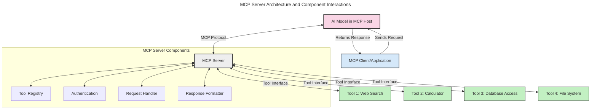
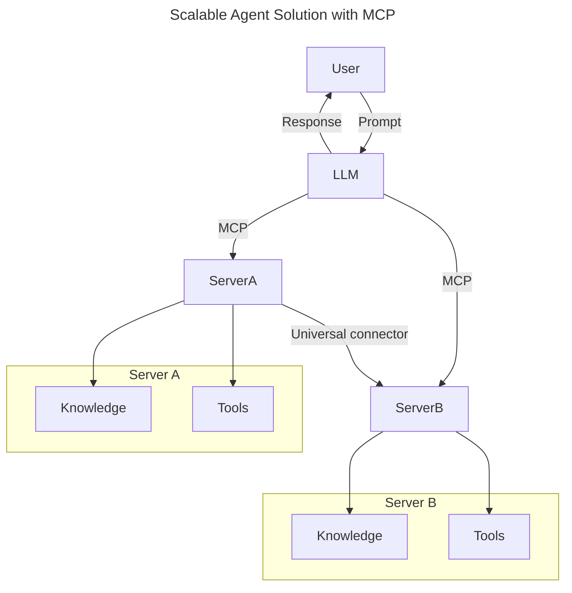
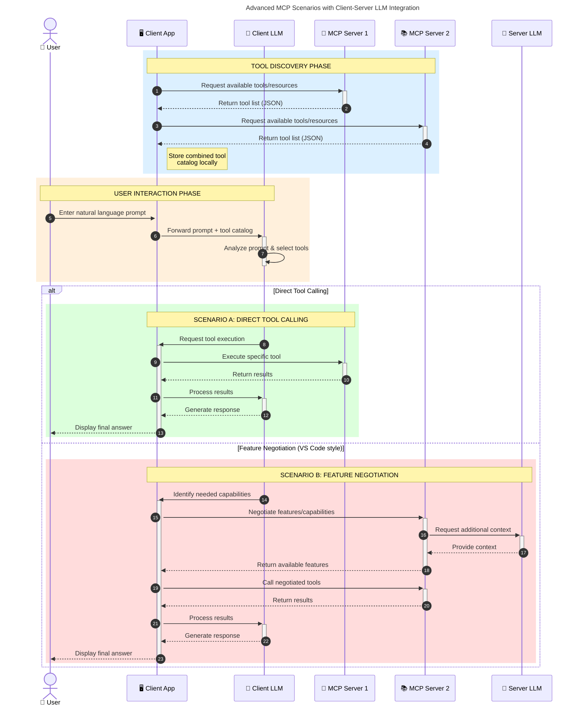

<!--
CO_OP_TRANSLATOR_METADATA:
{
  "original_hash": "2bbbcded256d46a24e3f448384a2b4a2",
  "translation_date": "2025-07-29T01:00:01+00:00",
  "source_file": "00-Introduction/README.md",
  "language_code": "de"
}
-->
# Einführung in das Model Context Protocol (MCP): Warum es für skalierbare KI-Anwendungen wichtig ist

_(Klicken Sie auf das Bild oben, um das Video zu dieser Lektion anzusehen)_

Generative KI-Anwendungen sind ein großer Fortschritt, da sie es den Nutzern oft ermöglichen, mit der App über natürliche Sprachbefehle zu interagieren. Doch je mehr Zeit und Ressourcen in solche Apps investiert werden, desto wichtiger wird es, Funktionen und Ressourcen so zu integrieren, dass sie leicht erweiterbar sind, mehrere Modelle unterstützen und mit verschiedenen Modellbesonderheiten umgehen können. Kurz gesagt: Der Einstieg in die Entwicklung von generativen KI-Apps ist einfach, aber mit zunehmender Komplexität wird es notwendig, eine Architektur zu definieren und sich wahrscheinlich auf einen Standard zu verlassen, um sicherzustellen, dass die Apps konsistent aufgebaut sind. Hier kommt MCP ins Spiel, um Ordnung zu schaffen und einen Standard bereitzustellen.

---

## **🔍 Was ist das Model Context Protocol (MCP)?**

Das **Model Context Protocol (MCP)** ist eine **offene, standardisierte Schnittstelle**, die es großen Sprachmodellen (LLMs) ermöglicht, nahtlos mit externen Tools, APIs und Datenquellen zu interagieren. Es bietet eine konsistente Architektur, um die Funktionalität von KI-Modellen über ihre Trainingsdaten hinaus zu erweitern und so intelligentere, skalierbare und reaktionsfähigere KI-Systeme zu schaffen.

---

## **🎯 Warum Standardisierung in der KI wichtig ist**

Mit zunehmender Komplexität generativer KI-Anwendungen wird es entscheidend, Standards zu übernehmen, die **Skalierbarkeit, Erweiterbarkeit** und **Wartbarkeit** gewährleisten. MCP erfüllt diese Anforderungen durch:

- Vereinheitlichung der Integration von Modellen und Tools
- Reduzierung von anfälligen, einmaligen Sonderlösungen
- Ermöglichung der Koexistenz mehrerer Modelle innerhalb eines Ökosystems

---

## **📚 Lernziele**

Am Ende dieses Artikels können Sie:

- **Model Context Protocol (MCP)** und seine Anwendungsfälle definieren
- Verstehen, wie MCP die Kommunikation zwischen Modellen und Tools standardisiert
- Die Kernkomponenten der MCP-Architektur identifizieren
- Reale Anwendungen von MCP in Unternehmens- und Entwicklungsumgebungen erkunden

---

## **💡 Warum das Model Context Protocol (MCP) ein Wendepunkt ist**

### **🔗 MCP löst Fragmentierung in KI-Interaktionen**

Vor MCP erforderte die Integration von Modellen mit Tools:

- Maßgeschneiderten Code für jedes Tool-Modell-Paar
- Nicht standardisierte APIs für jeden Anbieter
- Häufige Ausfälle durch Updates
- Schlechte Skalierbarkeit bei mehr Tools

### **✅ Vorteile der MCP-Standardisierung**

| **Vorteil**               | **Beschreibung**                                                                |
|---------------------------|---------------------------------------------------------------------------------|
| Interoperabilität         | LLMs arbeiten nahtlos mit Tools verschiedener Anbieter zusammen                 |
| Konsistenz                | Einheitliches Verhalten über Plattformen und Tools hinweg                       |
| Wiederverwendbarkeit      | Einmal erstellte Tools können in verschiedenen Projekten und Systemen genutzt werden |
| Beschleunigte Entwicklung | Reduzierung der Entwicklungszeit durch standardisierte, Plug-and-Play-Schnittstellen |

---

## **🧱 Überblick über die MCP-Architektur**

MCP folgt einem **Client-Server-Modell**, bei dem:

- **MCP Hosts** die KI-Modelle ausführen
- **MCP Clients** Anfragen initiieren
- **MCP Server** Kontext, Tools und Funktionen bereitstellen

### **Wichtige Komponenten:**

- **Ressourcen** – Statische oder dynamische Daten für Modelle  
- **Prompts** – Vorgefertigte Workflows für geführte Generierung  
- **Tools** – Ausführbare Funktionen wie Suche, Berechnungen  
- **Sampling** – Agentisches Verhalten durch rekursive Interaktionen  

---

## Wie MCP-Server funktionieren

MCP-Server arbeiten wie folgt:

- **Anfragefluss**:  
    1. Der MCP-Client sendet eine Anfrage an das KI-Modell, das auf einem MCP-Host läuft.  
    2. Das KI-Modell erkennt, wann es externe Tools oder Daten benötigt.  
    3. Das Modell kommuniziert mit dem MCP-Server über das standardisierte Protokoll.

- **Funktionen des MCP-Servers**:  
    - Tool-Registry: Führt einen Katalog verfügbarer Tools und deren Funktionen.  
    - Authentifizierung: Überprüft Berechtigungen für den Zugriff auf Tools.  
    - Anfrage-Handler: Verarbeitet eingehende Tool-Anfragen vom Modell.  
    - Antwort-Formatter: Strukturiert Tool-Ausgaben in einem Format, das das Modell verstehen kann.

- **Tool-Ausführung**:  
    - Der Server leitet Anfragen an die entsprechenden externen Tools weiter.  
    - Tools führen ihre spezialisierten Funktionen aus (Suche, Berechnung, Datenbankabfragen usw.).  
    - Ergebnisse werden dem Modell in einem konsistenten Format zurückgegeben.

- **Antwortabschluss**:  
    - Das KI-Modell integriert die Tool-Ausgaben in seine Antwort.  
    - Die endgültige Antwort wird an die Client-Anwendung zurückgesendet.

## 👨‍💻 Wie man einen MCP-Server erstellt (mit Beispielen)

MCP-Server ermöglichen es, die Fähigkeiten von LLMs durch Bereitstellung von Daten und Funktionen zu erweitern.

Bereit, es auszuprobieren? Hier sind Beispiele für die Erstellung eines einfachen MCP-Servers in verschiedenen Sprachen:

- **Python-Beispiel**: https://github.com/modelcontextprotocol/python-sdk  
- **TypeScript-Beispiel**: https://github.com/modelcontextprotocol/typescript-sdk  
- **Java-Beispiel**: https://github.com/modelcontextprotocol/java-sdk  
- **C#/.NET-Beispiel**: https://github.com/modelcontextprotocol/csharp-sdk  

---

## 🌍 Reale Anwendungsfälle für MCP

MCP ermöglicht eine Vielzahl von Anwendungen, indem es die Fähigkeiten von KI erweitert:

| **Anwendung**               | **Beschreibung**                                                                |
|-----------------------------|---------------------------------------------------------------------------------|
| Unternehmensdatenintegration | Verbindung von LLMs mit Datenbanken, CRMs oder internen Tools                  |
| Agentische KI-Systeme        | Ermöglichung autonomer Agenten mit Tool-Zugriff und Entscheidungsworkflows      |
| Multimodale Anwendungen      | Kombination von Text-, Bild- und Audiotools in einer einzigen KI-App            |
| Echtzeit-Datenintegration    | Einbindung von Live-Daten in KI-Interaktionen für genauere, aktuelle Ergebnisse |

---

### 🧠 MCP = Universeller Standard für KI-Interaktionen

Das Model Context Protocol (MCP) fungiert als universeller Standard für KI-Interaktionen, ähnlich wie USB-C physische Verbindungen für Geräte standardisiert hat. In der Welt der KI bietet MCP eine konsistente Schnittstelle, die es Modellen (Clients) ermöglicht, nahtlos mit externen Tools und Datenanbietern (Servern) zu interagieren. Dies eliminiert die Notwendigkeit für diverse, maßgeschneiderte Protokolle für jede API oder Datenquelle.

Unter MCP folgt ein MCP-kompatibles Tool (als MCP-Server bezeichnet) einem einheitlichen Standard. Diese Server können die Tools oder Aktionen, die sie anbieten, auflisten und diese Aktionen ausführen, wenn sie von einem KI-Agenten angefordert werden. KI-Agentenplattformen, die MCP unterstützen, können die verfügbaren Tools der Server entdecken und sie über dieses standardisierte Protokoll aufrufen.

---

### 💡 Erleichtert den Zugang zu Wissen

Neben der Bereitstellung von Tools erleichtert MCP auch den Zugang zu Wissen. Es ermöglicht Anwendungen, Kontext für große Sprachmodelle (LLMs) bereitzustellen, indem sie mit verschiedenen Datenquellen verbunden werden. Beispielsweise könnte ein MCP-Server das Dokumentenarchiv eines Unternehmens darstellen und Agenten ermöglichen, relevante Informationen bei Bedarf abzurufen. Ein anderer Server könnte spezifische Aktionen wie das Versenden von E-Mails oder das Aktualisieren von Datensätzen übernehmen. Aus Sicht des Agenten sind dies einfach Tools, die er nutzen kann – einige Tools liefern Daten (Wissenskontext), andere führen Aktionen aus. MCP verwaltet beides effizient.

Ein Agent, der sich mit einem MCP-Server verbindet, lernt automatisch die verfügbaren Funktionen und zugänglichen Daten des Servers durch ein standardisiertes Format kennen. Diese Standardisierung ermöglicht eine dynamische Tool-Verfügbarkeit. Beispielsweise macht das Hinzufügen eines neuen MCP-Servers zu einem Agentensystem dessen Funktionen sofort nutzbar, ohne dass weitere Anpassungen der Agentenanweisungen erforderlich sind.

Diese nahtlose Integration entspricht dem Fluss, der im Mermaid-Diagramm dargestellt ist, bei dem Server sowohl Tools als auch Wissen bereitstellen und eine reibungslose Zusammenarbeit zwischen Systemen gewährleisten.

---

### 👉 Beispiel: Skalierbare Agentenlösung

---

### 🔄 Erweiterte MCP-Szenarien mit LLM-Integration auf der Client-Seite

Über die grundlegende MCP-Architektur hinaus gibt es erweiterte Szenarien, bei denen sowohl Client als auch Server LLMs enthalten, um komplexere Interaktionen zu ermöglichen:

---

## 🔐 Praktische Vorteile von MCP

Hier sind die praktischen Vorteile der Verwendung von MCP:

- **Aktualität**: Modelle können auf aktuelle Informationen zugreifen, die über ihre Trainingsdaten hinausgehen  
- **Erweiterung der Fähigkeiten**: Modelle können spezialisierte Tools für Aufgaben nutzen, für die sie nicht trainiert wurden  
- **Reduzierte Halluzinationen**: Externe Datenquellen bieten eine faktische Grundlage  
- **Datenschutz**: Sensible Daten können in sicheren Umgebungen bleiben, anstatt in Prompts eingebettet zu werden  

---

## 📌 Wichtige Erkenntnisse

Die folgenden Erkenntnisse sind wichtig für die Nutzung von MCP:

- **MCP** standardisiert, wie KI-Modelle mit Tools und Daten interagieren  
- Fördert **Erweiterbarkeit, Konsistenz und Interoperabilität**  
- MCP hilft, **Entwicklungszeit zu reduzieren, Zuverlässigkeit zu verbessern und Modellfähigkeiten zu erweitern**  
- Die Client-Server-Architektur ermöglicht **flexible, erweiterbare KI-Anwendungen**  

---

## 🧠 Übung

Denken Sie an eine KI-Anwendung, die Sie gerne entwickeln würden.

- Welche **externen Tools oder Daten** könnten ihre Fähigkeiten verbessern?  
- Wie könnte MCP die Integration **einfacher und zuverlässiger machen**?  

---

## Zusätzliche Ressourcen

- [MCP GitHub Repository](https://github.com/modelcontextprotocol)

---

## Was kommt als Nächstes?

Weiter: [Kapitel 1: Kernkonzepte](../01-CoreConcepts/README.md)

**Haftungsausschluss**:  
Dieses Dokument wurde mit dem KI-Übersetzungsdienst [Co-op Translator](https://github.com/Azure/co-op-translator) übersetzt. Obwohl wir uns um Genauigkeit bemühen, weisen wir darauf hin, dass automatisierte Übersetzungen Fehler oder Ungenauigkeiten enthalten können. Das Originaldokument in seiner ursprünglichen Sprache sollte als maßgebliche Quelle betrachtet werden. Für kritische Informationen wird eine professionelle menschliche Übersetzung empfohlen. Wir übernehmen keine Haftung für Missverständnisse oder Fehlinterpretationen, die aus der Nutzung dieser Übersetzung entstehen.