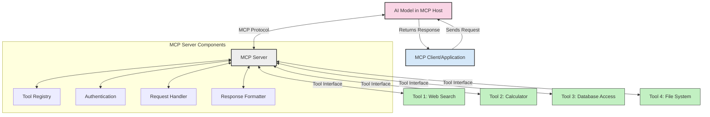
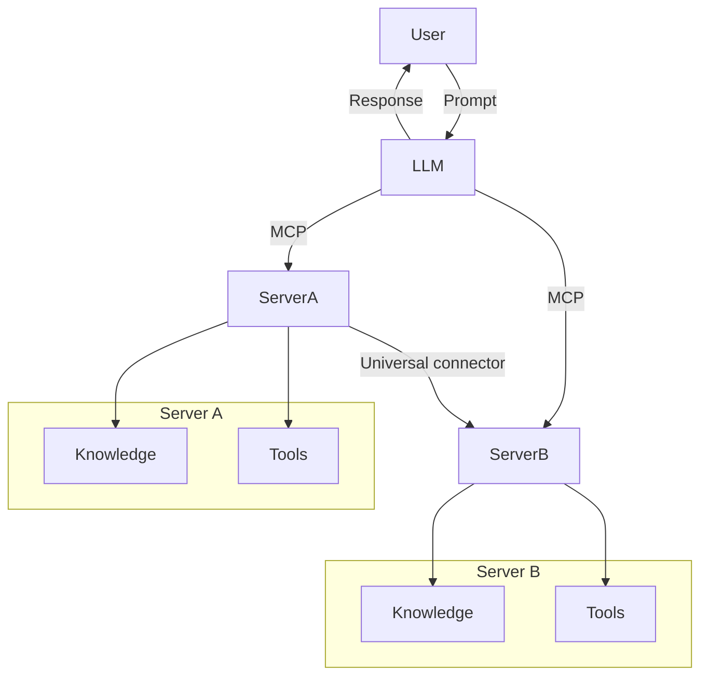

<!--
CO_OP_TRANSLATOR_METADATA:
{
  "original_hash": "1d88dee994dcbb3fa52c271d0c0817b5",
  "translation_date": "2025-05-20T20:13:15+00:00",
  "source_file": "00-Introduction/README.md",
  "language_code": "de"
}
-->
# Einführung in das Model Context Protocol (MCP): Warum es für skalierbare KI-Anwendungen wichtig ist

Generative KI-Anwendungen sind ein großer Fortschritt, da sie es dem Nutzer oft ermöglichen, mit der App über natürliche Spracheingaben zu interagieren. Doch je mehr Zeit und Ressourcen in solche Apps investiert werden, desto wichtiger ist es, Funktionen und Ressourcen so zu integrieren, dass Erweiterungen einfach möglich sind, die App mehrere Modelle unterstützen kann und verschiedene Modellbesonderheiten berücksichtigt werden. Kurz gesagt: Gen AI Apps zu entwickeln ist anfangs einfach, aber mit wachsender Komplexität wird es notwendig, eine Architektur zu definieren und sich auf einen Standard zu stützen, der eine konsistente Entwicklung sicherstellt. Hier kommt MCP ins Spiel, um Ordnung zu schaffen und einen Standard bereitzustellen.

---

## **🔍 Was ist das Model Context Protocol (MCP)?**

Das **Model Context Protocol (MCP)** ist eine **offene, standardisierte Schnittstelle**, die es Large Language Models (LLMs) ermöglicht, nahtlos mit externen Tools, APIs und Datenquellen zu interagieren. Es bietet eine einheitliche Architektur, um die Funktionalität von KI-Modellen über ihre Trainingsdaten hinaus zu erweitern und dadurch intelligentere, skalierbare und reaktionsfähigere KI-Systeme zu schaffen.

---

## **🎯 Warum Standardisierung in der KI wichtig ist**

Mit zunehmender Komplexität generativer KI-Anwendungen ist es entscheidend, Standards zu etablieren, die **Skalierbarkeit, Erweiterbarkeit** und **Wartbarkeit** gewährleisten. MCP erfüllt diese Anforderungen durch:

- Vereinheitlichung der Modell-Tool-Integrationen  
- Reduzierung von fragilen, individuellen Lösungen  
- Ermöglichung des gleichzeitigen Einsatzes mehrerer Modelle in einem Ökosystem  

---

## **📚 Lernziele**

Am Ende dieses Artikels wirst du in der Lage sein:

- Das **Model Context Protocol (MCP)** und seine Anwendungsfälle zu definieren  
- Zu verstehen, wie MCP die Kommunikation zwischen Modell und Tools standardisiert  
- Die Kernkomponenten der MCP-Architektur zu identifizieren  
- Praxisbeispiele für MCP in Unternehmens- und Entwicklerkontexten zu erkunden  

---

## **💡 Warum das Model Context Protocol (MCP) ein Game-Changer ist**

### **🔗 MCP löst Fragmentierung in der KI-Interaktion**

Vor MCP erforderte die Integration von Modellen mit Tools:

- Individuellen Code für jedes Tool-Modell-Paar  
- Nicht standardisierte APIs je Anbieter  
- Häufige Ausfälle durch Updates  
- Schlechte Skalierbarkeit bei zunehmender Tool-Anzahl  

### **✅ Vorteile der MCP-Standardisierung**

| **Vorteil**              | **Beschreibung**                                                                |
|--------------------------|--------------------------------------------------------------------------------|
| Interoperabilität        | LLMs arbeiten nahtlos mit Tools verschiedener Anbieter zusammen                |
| Konsistenz               | Einheitliches Verhalten über Plattformen und Tools hinweg                      |
| Wiederverwendbarkeit     | Einmal entwickelte Tools können in verschiedenen Projekten und Systemen genutzt werden |
| Beschleunigte Entwicklung| Entwicklungszeit durch standardisierte, sofort einsatzbereite Schnittstellen verkürzen |

---

## **🧱 Überblick über die MCP-Architektur auf hoher Ebene**

MCP folgt einem **Client-Server-Modell**, bei dem:

- **MCP Hosts** die KI-Modelle ausführen  
- **MCP Clients** Anfragen initiieren  
- **MCP Servers** Kontext, Tools und Funktionen bereitstellen  

### **Wichtige Komponenten:**

- **Resources** – Statische oder dynamische Daten für Modelle  
- **Prompts** – Vorgefertigte Abläufe für gesteuerte Generierung  
- **Tools** – Ausführbare Funktionen wie Suche, Berechnungen  
- **Sampling** – Agentenverhalten durch rekursive Interaktionen  

---

## Wie MCP-Server funktionieren

MCP-Server arbeiten folgendermaßen:

- **Anfragefluss**:  
    1. Der MCP Client sendet eine Anfrage an das KI-Modell, das in einem MCP Host läuft.  
    2. Das KI-Modell erkennt, wann es externe Tools oder Daten benötigt.  
    3. Das Modell kommuniziert mit dem MCP Server über das standardisierte Protokoll.  

- **Funktionalität des MCP Servers**:  
    - Tool-Register: Führt einen Katalog verfügbarer Tools und deren Funktionen.  
    - Authentifizierung: Prüft Berechtigungen für den Tool-Zugriff.  
    - Anfrage-Handler: Verarbeitet eingehende Tool-Anfragen vom Modell.  
    - Antwort-Formatter: Formatiert Tool-Ausgaben in ein für das Modell verständliches Format.  

- **Tool-Ausführung**:  
    - Der Server leitet Anfragen an die passenden externen Tools weiter.  
    - Tools führen ihre spezialisierten Funktionen aus (Suche, Berechnung, Datenbankabfragen etc.).  
    - Ergebnisse werden in einem konsistenten Format an das Modell zurückgegeben.  

- **Abschluss der Antwort**:  
    - Das KI-Modell integriert die Tool-Ausgaben in seine Antwort.  
    - Die finale Antwort wird an die Client-Anwendung zurückgesendet.  

## 👨‍💻 Wie man einen MCP-Server baut (mit Beispielen)

MCP-Server ermöglichen es, die Fähigkeiten von LLMs durch Bereitstellung von Daten und Funktionen zu erweitern.

Bereit, es auszuprobieren? Hier sind Beispiele, wie man einen einfachen MCP-Server in verschiedenen Sprachen erstellt:

- **Python Beispiel**: https://github.com/modelcontextprotocol/python-sdk

- **TypeScript Beispiel**: https://github.com/modelcontextprotocol/typescript-sdk

- **Java Beispiel**: https://github.com/modelcontextprotocol/java-sdk

- **C#/.NET Beispiel**: https://github.com/modelcontextprotocol/csharp-sdk

## 🌍 Anwendungsfälle für MCP in der Praxis

MCP ermöglicht eine Vielzahl von Anwendungen durch Erweiterung der KI-Fähigkeiten:

| **Anwendung**              | **Beschreibung**                                                                |
|----------------------------|--------------------------------------------------------------------------------|
| Enterprise Datenintegration | Verbindung von LLMs mit Datenbanken, CRMs oder internen Tools                  |
| Agentenbasierte KI-Systeme | Ermöglichen autonomer Agenten mit Tool-Zugriff und Entscheidungsabläufen       |
| Multimodale Anwendungen    | Kombination von Text-, Bild- und Audio-Tools in einer einzigen KI-App          |
| Echtzeit-Datenintegration  | Einbindung von Live-Daten in KI-Interaktionen für genauere und aktuelle Ergebnisse |

### 🧠 MCP = Universeller Standard für KI-Interaktionen

Das Model Context Protocol (MCP) fungiert als universeller Standard für KI-Interaktionen, ähnlich wie USB-C physische Verbindungen für Geräte standardisiert hat. Im KI-Bereich bietet MCP eine konsistente Schnittstelle, die es Modellen (Clients) erlaubt, sich nahtlos mit externen Tools und Datenanbietern (Servern) zu verbinden. Dadurch entfällt die Notwendigkeit unterschiedlicher, kundenspezifischer Protokolle für jede API oder Datenquelle.

Unter MCP folgt ein MCP-kompatibles Tool (als MCP-Server bezeichnet) einem einheitlichen Standard. Diese Server können die angebotenen Tools oder Aktionen auflisten und diese ausführen, wenn ein KI-Agent sie anfordert. Plattformen für KI-Agenten, die MCP unterstützen, sind in der Lage, verfügbare Tools von den Servern zu entdecken und über dieses Standardprotokoll aufzurufen.

### 💡 Erleichtert den Zugang zu Wissen

Über das Angebot von Tools hinaus erleichtert MCP auch den Zugang zu Wissen. Es ermöglicht Anwendungen, Kontext für Large Language Models (LLMs) bereitzustellen, indem sie mit verschiedenen Datenquellen verknüpft werden. Zum Beispiel könnte ein MCP-Server das Dokumentenarchiv eines Unternehmens repräsentieren, sodass Agenten bei Bedarf relevante Informationen abrufen können. Ein anderer Server könnte bestimmte Aktionen übernehmen, wie E-Mails senden oder Datensätze aktualisieren. Aus Sicht des Agenten sind das einfach Tools – einige liefern Daten (Wissenskontext), andere führen Aktionen aus. MCP verwaltet beides effizient.

Ein Agent, der sich mit einem MCP-Server verbindet, lernt automatisch die verfügbaren Funktionen und zugänglichen Daten des Servers über ein standardisiertes Format kennen. Diese Standardisierung ermöglicht eine dynamische Verfügbarkeit von Tools. Zum Beispiel macht das Hinzufügen eines neuen MCP-Servers zum System eines Agenten dessen Funktionen sofort nutzbar, ohne dass die Agentenanweisungen weiter angepasst werden müssen.

Diese reibungslose Integration entspricht dem im Mermaid-Diagramm dargestellten Ablauf, bei dem Server sowohl Tools als auch Wissen bereitstellen und so eine nahtlose Zusammenarbeit zwischen Systemen gewährleisten.

### 👉 Beispiel: Skalierbare Agentenlösung

## 🔐 Praktische Vorteile von MCP

Hier sind die praktischen Vorteile der Nutzung von MCP:

- **Aktualität**: Modelle können auf aktuelle Informationen über ihre Trainingsdaten hinaus zugreifen  
- **Funktionserweiterung**: Modelle können spezialisierte Tools für Aufgaben nutzen, für die sie nicht trainiert wurden  
- **Reduzierte Halluzinationen**: Externe Datenquellen sorgen für faktische Grundlage  
- **Datenschutz**: Sensible Daten bleiben in sicheren Umgebungen und müssen nicht in Prompts eingebettet werden  

## 📌 Wichtige Erkenntnisse

Folgende Punkte sind zentrale Erkenntnisse zur Nutzung von MCP:

- **MCP** standardisiert die Interaktion von KI-Modellen mit Tools und Daten  
- Fördert **Erweiterbarkeit, Konsistenz und Interoperabilität**  
- MCP hilft, **Entwicklungszeit zu reduzieren, Zuverlässigkeit zu verbessern und Modellfähigkeiten zu erweitern**  
- Die Client-Server-Architektur ermöglicht **flexible, erweiterbare KI-Anwendungen**  

## 🧠 Übung

Denke an eine KI-Anwendung, die du gerne entwickeln möchtest.

- Welche **externen Tools oder Daten** könnten ihre Fähigkeiten verbessern?  
- Wie könnte MCP die Integration **einfacher und zuverlässiger** machen?  

## Zusätzliche Ressourcen

- [MCP GitHub Repository](https://github.com/modelcontextprotocol)

## Was kommt als Nächstes

Weiter zu: [Kapitel 1: Kernkonzepte](/01-CoreConcepts/README.md)

**Haftungsausschluss**:  
Dieses Dokument wurde mit dem KI-Übersetzungsdienst [Co-op Translator](https://github.com/Azure/co-op-translator) übersetzt. Obwohl wir uns um Genauigkeit bemühen, beachten Sie bitte, dass automatisierte Übersetzungen Fehler oder Ungenauigkeiten enthalten können. Das Originaldokument in seiner Ausgangssprache ist als maßgebliche Quelle zu betrachten. Für wichtige Informationen wird eine professionelle menschliche Übersetzung empfohlen. Wir übernehmen keine Haftung für Missverständnisse oder Fehlinterpretationen, die aus der Nutzung dieser Übersetzung entstehen.