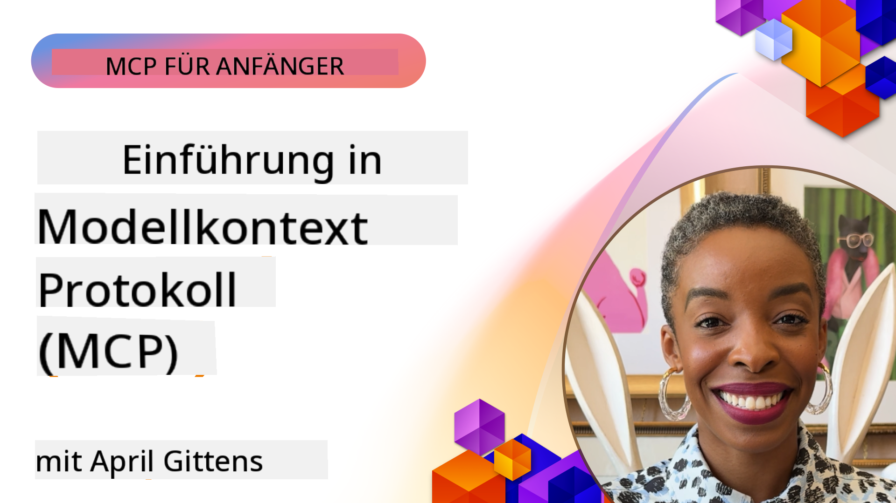
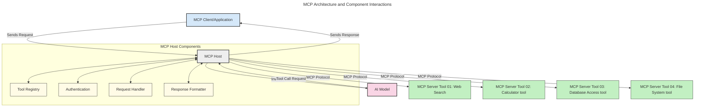
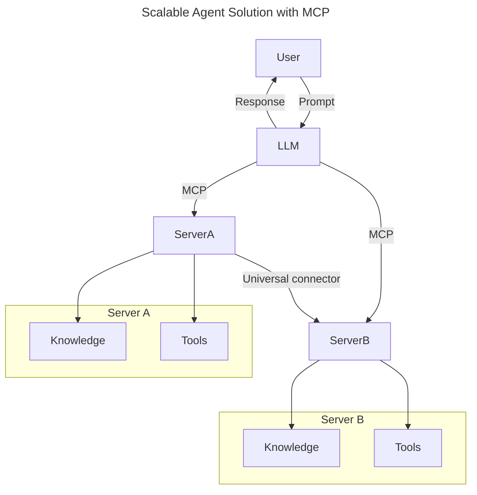
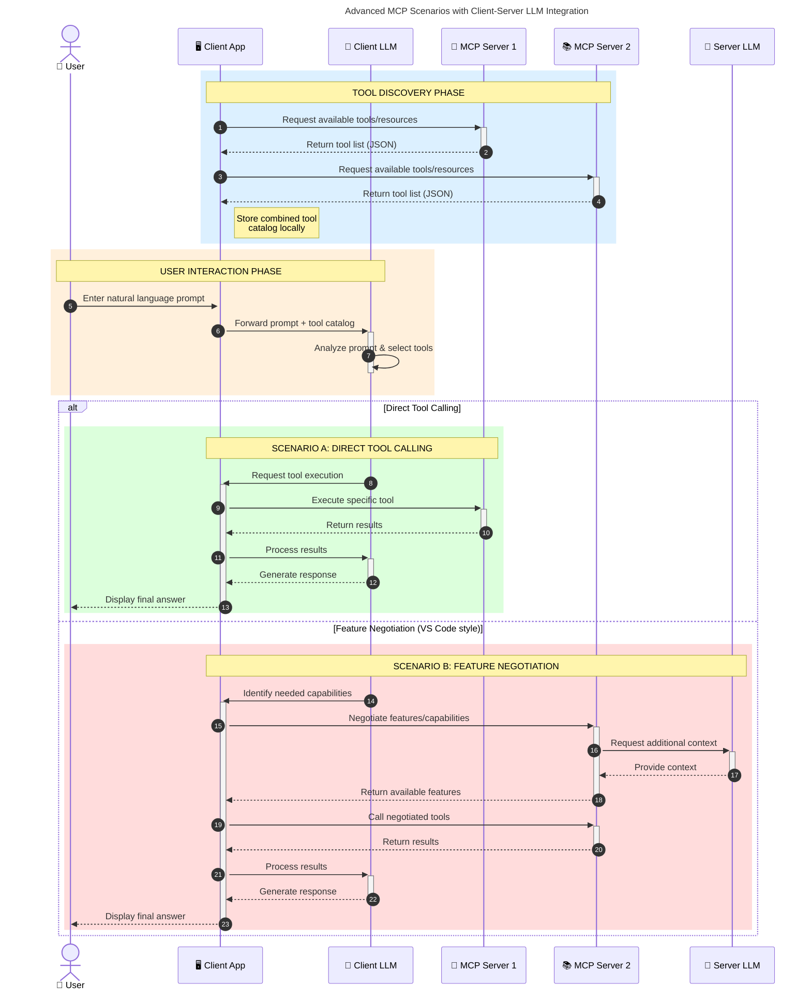

<!--
CO_OP_TRANSLATOR_METADATA:
{
  "original_hash": "0df1ee78a6dd8300f3a040ca5b411c2e",
  "translation_date": "2025-08-12T08:02:56+00:00",
  "source_file": "00-Introduction/README.md",
  "language_code": "de"
}
-->
# Einführung in das Model Context Protocol (MCP): Warum es für skalierbare KI-Anwendungen wichtig ist

_(Klicken Sie auf das Bild oben, um das Video zu dieser Lektion anzusehen)_

Generative KI-Anwendungen sind ein großer Fortschritt, da sie oft ermöglichen, dass Benutzer mit der App über natürliche Sprachaufforderungen interagieren. Doch je mehr Zeit und Ressourcen in solche Apps investiert werden, desto wichtiger wird es, Funktionen und Ressourcen so zu integrieren, dass sie leicht erweiterbar sind, mehrere Modelle unterstützen und verschiedene Modellbesonderheiten handhaben können. Kurz gesagt: Der Einstieg in die Entwicklung von Gen-KI-Apps ist einfach, aber mit zunehmender Komplexität wird es notwendig, eine Architektur zu definieren und auf Standards zu setzen, um Konsistenz zu gewährleisten. Hier kommt MCP ins Spiel, um Ordnung zu schaffen und einen Standard bereitzustellen.

---

## **🔍 Was ist das Model Context Protocol (MCP)?**

Das **Model Context Protocol (MCP)** ist eine **offene, standardisierte Schnittstelle**, die es großen Sprachmodellen (LLMs) ermöglicht, nahtlos mit externen Tools, APIs und Datenquellen zu interagieren. Es bietet eine konsistente Architektur, um die Funktionalität von KI-Modellen über ihre Trainingsdaten hinaus zu erweitern und intelligentere, skalierbare und reaktionsfähigere KI-Systeme zu ermöglichen.

---

## **🎯 Warum Standardisierung in der KI wichtig ist**

Mit zunehmender Komplexität generativer KI-Anwendungen ist es entscheidend, Standards zu übernehmen, die **Skalierbarkeit, Erweiterbarkeit, Wartbarkeit** und **Vermeidung von Anbieterabhängigkeit** gewährleisten. MCP erfüllt diese Anforderungen durch:

- Vereinheitlichung der Integration von Modellen und Tools
- Reduzierung von anfälligen, einmaligen Sonderlösungen
- Ermöglichung der Koexistenz mehrerer Modelle von verschiedenen Anbietern innerhalb eines Ökosystems

**Hinweis:** Obwohl MCP sich als offener Standard präsentiert, gibt es keine Pläne, MCP durch bestehende Standardisierungsgremien wie IEEE, IETF, W3C, ISO oder andere zu standardisieren.

---

## **📚 Lernziele**

Am Ende dieses Artikels werden Sie in der Lage sein:

- **Model Context Protocol (MCP)** und seine Anwendungsfälle zu definieren
- Verstehen, wie MCP die Kommunikation zwischen Modellen und Tools standardisiert
- Die Kernkomponenten der MCP-Architektur identifizieren
- Reale Anwendungen von MCP in Unternehmens- und Entwicklungsumgebungen erkunden

---

## **💡 Warum das Model Context Protocol (MCP) ein Wendepunkt ist**

### **🔗 MCP löst Fragmentierung in KI-Interaktionen**

Vor MCP erforderte die Integration von Modellen mit Tools:

- Maßgeschneiderten Code für jedes Tool-Modell-Paar
- Nicht standardisierte APIs für jeden Anbieter
- Häufige Ausfälle durch Updates
- Schlechte Skalierbarkeit bei mehr Tools

### **✅ Vorteile der MCP-Standardisierung**

| **Vorteil**               | **Beschreibung**                                                                |
|---------------------------|---------------------------------------------------------------------------------|
| Interoperabilität         | LLMs arbeiten nahtlos mit Tools verschiedener Anbieter zusammen                 |
| Konsistenz                | Einheitliches Verhalten über Plattformen und Tools hinweg                       |
| Wiederverwendbarkeit      | Einmal erstellte Tools können in verschiedenen Projekten und Systemen genutzt werden |
| Beschleunigte Entwicklung | Reduzierung der Entwicklungszeit durch standardisierte, Plug-and-Play-Schnittstellen |

---

## **🧱 Überblick über die MCP-Architektur**

MCP folgt einem **Client-Server-Modell**, bei dem:

- **MCP Hosts** die KI-Modelle ausführen
- **MCP Clients** Anfragen initiieren
- **MCP Server** Kontext, Tools und Funktionen bereitstellen

### **Kernkomponenten:**

- **Ressourcen** – Statische oder dynamische Daten für Modelle  
- **Prompts** – Vorgefertigte Workflows für geführte Generierung  
- **Tools** – Ausführbare Funktionen wie Suche, Berechnungen  
- **Sampling** – Agentisches Verhalten durch rekursive Interaktionen  

---

## Wie MCP-Server funktionieren

MCP-Server arbeiten wie folgt:

- **Ablauf einer Anfrage**:
    1. Eine Anfrage wird von einem Endbenutzer oder einer Software, die in seinem Auftrag handelt, initiiert.
    2. Der **MCP Client** sendet die Anfrage an einen **MCP Host**, der die KI-Modell-Laufzeit verwaltet.
    3. Das **KI-Modell** erhält die Benutzeraufforderung und kann Zugriff auf externe Tools oder Daten über einen oder mehrere Tool-Aufrufe anfordern.
    4. Der **MCP Host**, nicht das Modell direkt, kommuniziert mit den entsprechenden **MCP Servern** über das standardisierte Protokoll.
- **Funktionen des MCP Hosts**:
    - **Tool-Registry**: Führt einen Katalog verfügbarer Tools und deren Funktionen.
    - **Authentifizierung**: Überprüft Berechtigungen für den Tool-Zugriff.
    - **Anfrage-Handler**: Verarbeitet eingehende Tool-Anfragen vom Modell.
    - **Antwort-Formatter**: Strukturiert Tool-Ausgaben in einem Format, das das Modell verstehen kann.
- **Ausführung durch MCP-Server**:
    - Der **MCP Host** leitet Tool-Aufrufe an einen oder mehrere **MCP Server** weiter, die spezialisierte Funktionen bereitstellen (z. B. Suche, Berechnungen, Datenbankabfragen).
    - Die **MCP Server** führen ihre jeweiligen Operationen aus und senden Ergebnisse in einem konsistenten Format an den **MCP Host** zurück.
    - Der **MCP Host** formatiert und übermittelt diese Ergebnisse an das **KI-Modell**.
- **Abschluss der Antwort**:
    - Das **KI-Modell** integriert die Tool-Ausgaben in eine endgültige Antwort.
    - Der **MCP Host** sendet diese Antwort zurück an den **MCP Client**, der sie dem Endbenutzer oder der aufrufenden Software liefert.

## 👨‍💻 Wie man einen MCP-Server erstellt (mit Beispielen)

MCP-Server ermöglichen es, die Fähigkeiten von LLMs durch Bereitstellung von Daten und Funktionen zu erweitern.

Bereit, es auszuprobieren? Hier sind sprach- und/oder stack-spezifische SDKs mit Beispielen zur Erstellung einfacher MCP-Server in verschiedenen Sprachen/Stacks:

- **Python SDK**: https://github.com/modelcontextprotocol/python-sdk

- **TypeScript SDK**: https://github.com/modelcontextprotocol/typescript-sdk

- **Java SDK**: https://github.com/modelcontextprotocol/java-sdk

- **C#/.NET SDK**: https://github.com/modelcontextprotocol/csharp-sdk

---

## 🌍 Reale Anwendungsfälle für MCP

MCP ermöglicht eine Vielzahl von Anwendungen, indem es die Fähigkeiten von KI erweitert:

| **Anwendung**              | **Beschreibung**                                                                |
|----------------------------|---------------------------------------------------------------------------------|
| Unternehmensdatenintegration | Verbindung von LLMs mit Datenbanken, CRMs oder internen Tools                  |
| Agentische KI-Systeme       | Ermöglichung autonomer Agenten mit Tool-Zugriff und Entscheidungsworkflows      |
| Multimodale Anwendungen     | Kombination von Text-, Bild- und Audiotools in einer einzigen KI-App           |
| Echtzeit-Datenintegration   | Einbindung von Live-Daten in KI-Interaktionen für genauere, aktuelle Ergebnisse |

---

### 🧠 MCP = Universeller Standard für KI-Interaktionen

Das Model Context Protocol (MCP) fungiert als universeller Standard für KI-Interaktionen, ähnlich wie USB-C physische Verbindungen für Geräte standardisiert hat. In der Welt der KI bietet MCP eine konsistente Schnittstelle, die es Modellen (Clients) ermöglicht, nahtlos mit externen Tools und Datenanbietern (Servern) zu interagieren. Dies eliminiert die Notwendigkeit für diverse, maßgeschneiderte Protokolle für jede API oder Datenquelle.

Unter MCP folgt ein MCP-kompatibles Tool (als MCP-Server bezeichnet) einem einheitlichen Standard. Diese Server können die Tools oder Aktionen, die sie anbieten, auflisten und diese Aktionen ausführen, wenn sie von einem KI-Agenten angefordert werden. KI-Agentenplattformen, die MCP unterstützen, sind in der Lage, verfügbare Tools von den Servern zu entdecken und sie über dieses Standardprotokoll aufzurufen.

---

### 💡 Erleichtert den Zugang zu Wissen

Neben der Bereitstellung von Tools erleichtert MCP auch den Zugang zu Wissen. Es ermöglicht Anwendungen, Kontext für große Sprachmodelle (LLMs) bereitzustellen, indem sie mit verschiedenen Datenquellen verbunden werden. Beispielsweise könnte ein MCP-Server das Dokumentenarchiv eines Unternehmens darstellen und Agenten ermöglichen, relevante Informationen bei Bedarf abzurufen. Ein anderer Server könnte spezifische Aktionen wie das Versenden von E-Mails oder das Aktualisieren von Datensätzen ausführen. Aus Sicht des Agenten sind dies einfach Tools, die er nutzen kann – einige Tools liefern Daten (Wissenskontext), während andere Aktionen ausführen. MCP verwaltet beides effizient.

Ein Agent, der sich mit einem MCP-Server verbindet, lernt automatisch die verfügbaren Funktionen und zugänglichen Daten des Servers durch ein standardisiertes Format kennen. Diese Standardisierung ermöglicht eine dynamische Tool-Verfügbarkeit. Beispielsweise macht das Hinzufügen eines neuen MCP-Servers zu einem Agentensystem dessen Funktionen sofort nutzbar, ohne dass weitere Anpassungen der Agentenanweisungen erforderlich sind.

---

### 👉 Beispiel: Skalierbare Agentenlösung

---

### 🔄 Erweiterte MCP-Szenarien mit Client-seitiger LLM-Integration

Über die grundlegende MCP-Architektur hinaus gibt es erweiterte Szenarien, bei denen sowohl Client als auch Server LLMs enthalten, um komplexere Interaktionen zu ermöglichen. Im folgenden Diagramm könnte die **Client-App** eine IDE sein, die eine Reihe von MCP-Tools für die Nutzung durch das LLM bereitstellt:

---

## 🔐 Praktische Vorteile von MCP

Hier sind die praktischen Vorteile der Nutzung von MCP:

- **Aktualität**: Modelle können auf aktuelle Informationen zugreifen, die über ihre Trainingsdaten hinausgehen
- **Erweiterung der Fähigkeiten**: Modelle können spezialisierte Tools für Aufgaben nutzen, für die sie nicht trainiert wurden
- **Reduzierte Halluzinationen**: Externe Datenquellen bieten eine faktische Grundlage
- **Datenschutz**: Sensible Daten können in sicheren Umgebungen bleiben, anstatt in Prompts eingebettet zu werden

---

## 📌 Wichtige Erkenntnisse

Die folgenden Erkenntnisse sind für die Nutzung von MCP entscheidend:

- **MCP** standardisiert, wie KI-Modelle mit Tools und Daten interagieren
- Fördert **Erweiterbarkeit, Konsistenz und Interoperabilität**
- MCP hilft, **Entwicklungszeit zu reduzieren, Zuverlässigkeit zu verbessern und Modellfähigkeiten zu erweitern**
- Die Client-Server-Architektur ermöglicht **flexible, erweiterbare KI-Anwendungen**

---

## 🧠 Übung

Denken Sie an eine KI-Anwendung, die Sie gerne entwickeln würden.

- Welche **externen Tools oder Daten** könnten ihre Fähigkeiten verbessern?
- Wie könnte MCP die Integration **einfacher und zuverlässiger machen**?

---

## Zusätzliche Ressourcen

- [MCP GitHub Repository](https://github.com/modelcontextprotocol)

---

## Was kommt als Nächstes?

Weiter: [Kapitel 1: Kernkonzepte](../01-CoreConcepts/README.md)

**Haftungsausschluss**:  
Dieses Dokument wurde mit dem KI-Übersetzungsdienst [Co-op Translator](https://github.com/Azure/co-op-translator) übersetzt. Obwohl wir uns um Genauigkeit bemühen, beachten Sie bitte, dass automatisierte Übersetzungen Fehler oder Ungenauigkeiten enthalten können. Das Originaldokument in seiner ursprünglichen Sprache sollte als maßgebliche Quelle betrachtet werden. Für kritische Informationen wird eine professionelle menschliche Übersetzung empfohlen. Wir übernehmen keine Haftung für Missverständnisse oder Fehlinterpretationen, die sich aus der Nutzung dieser Übersetzung ergeben.