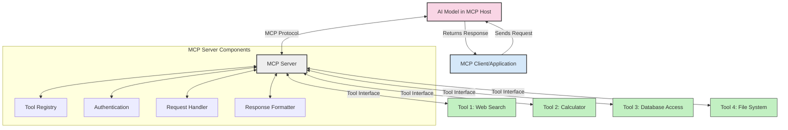
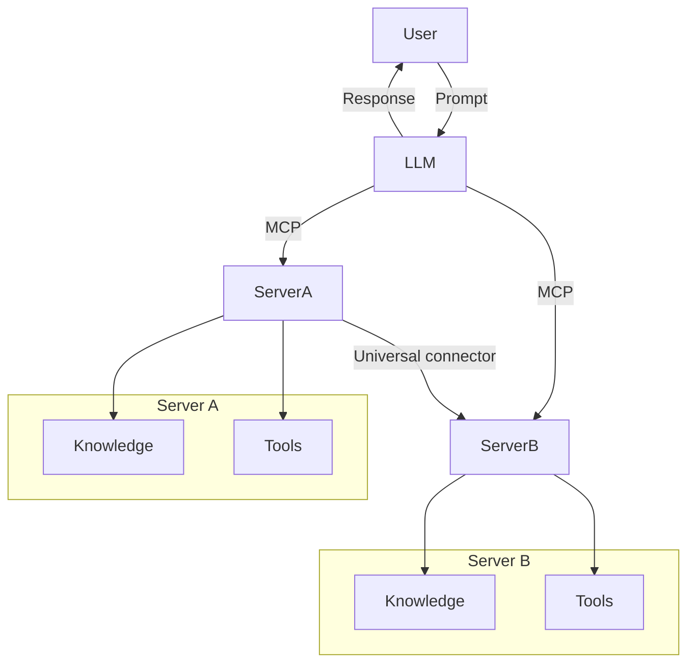
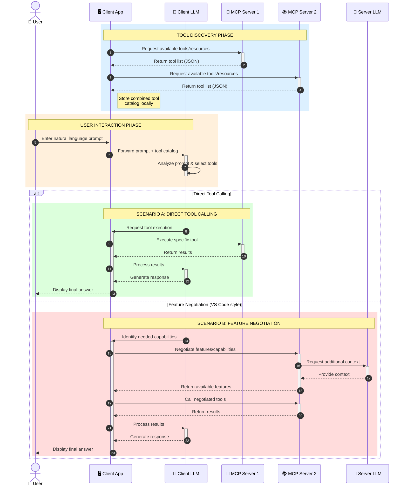

<!--
CO_OP_TRANSLATOR_METADATA:
{
  "original_hash": "25a94c681cf43612ff394d8cf78a74de",
  "translation_date": "2025-05-27T15:54:24+00:00",
  "source_file": "00-Introduction/README.md",
  "language_code": "de"
}
-->
# Einführung in das Model Context Protocol (MCP): Warum es für skalierbare KI-Anwendungen wichtig ist

Generative KI-Anwendungen sind ein großer Fortschritt, da sie es dem Nutzer oft ermöglichen, mit der App über natürliche Sprache zu interagieren. Doch je mehr Zeit und Ressourcen in solche Apps investiert werden, desto wichtiger ist es, Funktionen und Ressourcen so zu integrieren, dass Erweiterungen einfach möglich sind, mehrere Modelle unterstützt werden können und verschiedene Modellbesonderheiten berücksichtigt werden. Kurz gesagt: Gen KI-Apps zu entwickeln ist anfangs einfach, aber mit wachsender Komplexität müssen Sie eine Architektur definieren und wahrscheinlich auf einen Standard setzen, um eine konsistente Entwicklung sicherzustellen. Genau hier kommt MCP ins Spiel, um Ordnung zu schaffen und einen Standard bereitzustellen.

---

## **🔍 Was ist das Model Context Protocol (MCP)?**

Das **Model Context Protocol (MCP)** ist eine **offene, standardisierte Schnittstelle**, die es großen Sprachmodellen (LLMs) ermöglicht, nahtlos mit externen Tools, APIs und Datenquellen zu interagieren. Es bietet eine konsistente Architektur, um die Funktionalität von KI-Modellen über ihre Trainingsdaten hinaus zu erweitern und so intelligentere, skalierbare und reaktionsfähigere KI-Systeme zu ermöglichen.

---

## **🎯 Warum Standardisierung in der KI wichtig ist**

Mit zunehmender Komplexität generativer KI-Anwendungen ist es entscheidend, Standards zu etablieren, die **Skalierbarkeit, Erweiterbarkeit** und **Wartbarkeit** gewährleisten. MCP erfüllt diese Anforderungen durch:

- Vereinheitlichung der Integration von Modellen und Tools  
- Reduzierung von fragilen, individuellen Lösungen  
- Ermöglichung der Koexistenz mehrerer Modelle innerhalb eines Ökosystems  

---

## **📚 Lernziele**

Am Ende dieses Artikels können Sie:

- Das **Model Context Protocol (MCP)** und seine Anwendungsfälle definieren  
- Verstehen, wie MCP die Kommunikation zwischen Modell und Tool standardisiert  
- Die Kernkomponenten der MCP-Architektur identifizieren  
- Praxisbeispiele für MCP in Unternehmen und der Entwicklung erkunden  

---

## **💡 Warum das Model Context Protocol (MCP) ein Game-Changer ist**

### **🔗 MCP löst Fragmentierung bei KI-Interaktionen**

Vor MCP erforderte die Integration von Modellen mit Tools:

- Individuellen Code für jedes Tool-Modell-Paar  
- Nicht standardisierte APIs je Anbieter  
- Häufige Ausfälle durch Updates  
- Schlechte Skalierbarkeit mit zunehmender Toolanzahl  

### **✅ Vorteile der MCP-Standardisierung**

| **Vorteil**              | **Beschreibung**                                                                |
|--------------------------|--------------------------------------------------------------------------------|
| Interoperabilität        | LLMs arbeiten nahtlos mit Tools verschiedener Anbieter zusammen                |
| Konsistenz               | Einheitliches Verhalten über Plattformen und Tools hinweg                      |
| Wiederverwendbarkeit     | Einmal entwickelte Tools können in verschiedenen Projekten und Systemen genutzt werden |
| Schnellere Entwicklung   | Verkürzte Entwicklungszeit durch standardisierte, Plug-and-Play-Schnittstellen |

---

## **🧱 Überblick zur MCP-Architektur auf hoher Ebene**

MCP folgt einem **Client-Server-Modell**, bei dem:

- **MCP Hosts** die KI-Modelle ausführen  
- **MCP Clients** Anfragen initiieren  
- **MCP Server** Kontext, Tools und Funktionen bereitstellen  

### **Wichtige Komponenten:**

- **Ressourcen** – Statische oder dynamische Daten für Modelle  
- **Prompts** – Vorgefertigte Abläufe für geführte Generierung  
- **Tools** – Ausführbare Funktionen wie Suche, Berechnungen  
- **Sampling** – Agentenverhalten durch rekursive Interaktionen  

---

## Wie MCP-Server funktionieren

MCP-Server arbeiten folgendermaßen:

- **Anfrageablauf**:  
    1. Der MCP Client sendet eine Anfrage an das KI-Modell, das in einem MCP Host läuft.  
    2. Das KI-Modell erkennt, wann externe Tools oder Daten benötigt werden.  
    3. Das Modell kommuniziert mit dem MCP Server über das standardisierte Protokoll.  

- **Funktionalitäten des MCP Servers**:  
    - Tool-Register: Führt einen Katalog verfügbarer Tools und deren Funktionen.  
    - Authentifizierung: Prüft Zugriffsrechte auf Tools.  
    - Anfragen-Handler: Verarbeitet eingehende Tool-Anfragen vom Modell.  
    - Antwort-Formatter: Strukturiert Tool-Ausgaben in ein für das Modell verständliches Format.  

- **Tool-Ausführung**:  
    - Der Server leitet Anfragen an die entsprechenden externen Tools weiter.  
    - Tools führen spezialisierte Funktionen aus (Suche, Berechnung, Datenbankabfragen usw.).  
    - Ergebnisse werden in einem konsistenten Format an das Modell zurückgegeben.  

- **Abschluss der Antwort**:  
    - Das KI-Modell integriert die Tool-Ausgaben in seine Antwort.  
    - Die finale Antwort wird an die Client-Anwendung gesendet.  

## 👨‍💻 Wie man einen MCP-Server baut (mit Beispielen)

MCP-Server ermöglichen es, die Fähigkeiten von LLMs durch Bereitstellung von Daten und Funktionen zu erweitern.

Bereit, es auszuprobieren? Hier sind Beispiele für die Erstellung eines einfachen MCP-Servers in verschiedenen Sprachen:

- **Python Beispiel**: https://github.com/modelcontextprotocol/python-sdk

- **TypeScript Beispiel**: https://github.com/modelcontextprotocol/typescript-sdk

- **Java Beispiel**: https://github.com/modelcontextprotocol/java-sdk

- **C#/.NET Beispiel**: https://github.com/modelcontextprotocol/csharp-sdk

## 🌍 Praxisbeispiele für MCP

MCP ermöglicht eine Vielzahl von Anwendungen durch Erweiterung der KI-Fähigkeiten:

| **Anwendung**              | **Beschreibung**                                                                |
|----------------------------|--------------------------------------------------------------------------------|
| Integration von Unternehmensdaten | Anbindung von LLMs an Datenbanken, CRMs oder interne Tools                 |
| Agentenbasierte KI-Systeme | Ermöglicht autonome Agenten mit Tool-Zugriff und Entscheidungsabläufen        |
| Multimodale Anwendungen    | Kombination von Text-, Bild- und Audio-Tools in einer einzigen KI-Anwendung    |
| Echtzeit-Datenintegration  | Einbindung von Live-Daten in KI-Interaktionen für genauere und aktuelle Ergebnisse |

### 🧠 MCP = universeller Standard für KI-Interaktionen

Das Model Context Protocol (MCP) fungiert als universeller Standard für KI-Interaktionen, ähnlich wie USB-C physische Verbindungen standardisiert hat. Im KI-Bereich stellt MCP eine konsistente Schnittstelle bereit, die es Modellen (Clients) ermöglicht, sich nahtlos mit externen Tools und Datenanbietern (Servern) zu verbinden. Dadurch entfällt die Notwendigkeit vielfältiger, individueller Protokolle für jede API oder Datenquelle.

Ein MCP-kompatibles Tool (als MCP-Server bezeichnet) folgt einem einheitlichen Standard. Diese Server können die angebotenen Tools oder Aktionen auflisten und ausführen, wenn ein KI-Agent sie anfordert. KI-Agenten-Plattformen, die MCP unterstützen, sind in der Lage, verfügbare Tools auf den Servern zu entdecken und diese über das standardisierte Protokoll aufzurufen.

### 💡 Erleichtert den Zugang zu Wissen

Neben der Bereitstellung von Tools erleichtert MCP auch den Zugang zu Wissen. Es ermöglicht Anwendungen, großen Sprachmodellen (LLMs) Kontext zu liefern, indem sie mit verschiedenen Datenquellen verbunden werden. Beispielsweise könnte ein MCP-Server das Dokumentenarchiv eines Unternehmens repräsentieren, sodass Agenten bei Bedarf relevante Informationen abrufen können. Ein anderer Server könnte spezifische Aktionen wie das Versenden von E-Mails oder das Aktualisieren von Datensätzen übernehmen. Aus Sicht des Agenten sind dies einfach Tools, die genutzt werden können – einige liefern Daten (Wissenskontext), andere führen Aktionen aus. MCP verwaltet beides effizient.

Ein Agent, der sich mit einem MCP-Server verbindet, lernt automatisch die verfügbaren Funktionen und zugänglichen Daten des Servers über ein standardisiertes Format kennen. Diese Standardisierung ermöglicht eine dynamische Verfügbarkeit von Tools. Zum Beispiel macht das Hinzufügen eines neuen MCP-Servers zum System eines Agenten dessen Funktionen sofort nutzbar, ohne dass die Anweisungen des Agenten angepasst werden müssen.

Diese reibungslose Integration entspricht dem Ablauf im Mermaid-Diagramm, bei dem Server sowohl Tools als auch Wissen bereitstellen und so eine nahtlose Zusammenarbeit zwischen Systemen gewährleisten.

### 👉 Beispiel: Skalierbare Agentenlösung

### 🔄 Erweiterte MCP-Szenarien mit clientseitiger LLM-Integration

Über die grundlegende MCP-Architektur hinaus gibt es fortgeschrittene Szenarien, in denen sowohl Client als auch Server LLMs enthalten, was komplexere Interaktionen ermöglicht:

## 🔐 Praktische Vorteile von MCP

Die praktischen Vorteile von MCP sind:

- **Aktualität**: Modelle können auf aktuelle Informationen zugreifen, die über ihre Trainingsdaten hinausgehen  
- **Fähigkeitserweiterung**: Modelle können spezialisierte Tools für Aufgaben nutzen, für die sie nicht trainiert wurden  
- **Reduzierte Halluzinationen**: Externe Datenquellen bieten faktische Grundlage  
- **Datenschutz**: Sensible Daten bleiben in sicheren Umgebungen und müssen nicht in Prompts eingebettet werden  

## 📌 Wichtige Erkenntnisse

Folgende Punkte sind entscheidend für den Einsatz von MCP:

- **MCP** standardisiert die Interaktion von KI-Modellen mit Tools und Daten  
- Fördert **Erweiterbarkeit, Konsistenz und Interoperabilität**  
- MCP hilft, **Entwicklungszeit zu verkürzen, Zuverlässigkeit zu erhöhen und Modellfähigkeiten zu erweitern**  
- Die Client-Server-Architektur **ermöglicht flexible, erweiterbare KI-Anwendungen**  

## 🧠 Übung

Denken Sie über eine KI-Anwendung nach, die Sie entwickeln möchten.

- Welche **externen Tools oder Daten** könnten deren Fähigkeiten verbessern?  
- Wie könnte MCP die Integration **einfacher und zuverlässiger** machen?  

## Zusätzliche Ressourcen

- [MCP GitHub Repository](https://github.com/modelcontextprotocol)

## Was kommt als Nächstes

Weiter zu: [Kapitel 1: Kernkonzepte](/01-CoreConcepts/README.md)

**Haftungsausschluss**:  
Dieses Dokument wurde mithilfe des KI-Übersetzungsdienstes [Co-op Translator](https://github.com/Azure/co-op-translator) übersetzt. Obwohl wir uns um Genauigkeit bemühen, beachten Sie bitte, dass automatisierte Übersetzungen Fehler oder Ungenauigkeiten enthalten können. Das Originaldokument in seiner Originalsprache gilt als maßgebliche Quelle. Für wichtige Informationen wird eine professionelle menschliche Übersetzung empfohlen. Wir übernehmen keine Haftung für Missverständnisse oder Fehlinterpretationen, die aus der Nutzung dieser Übersetzung entstehen.