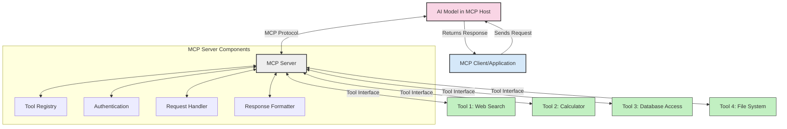
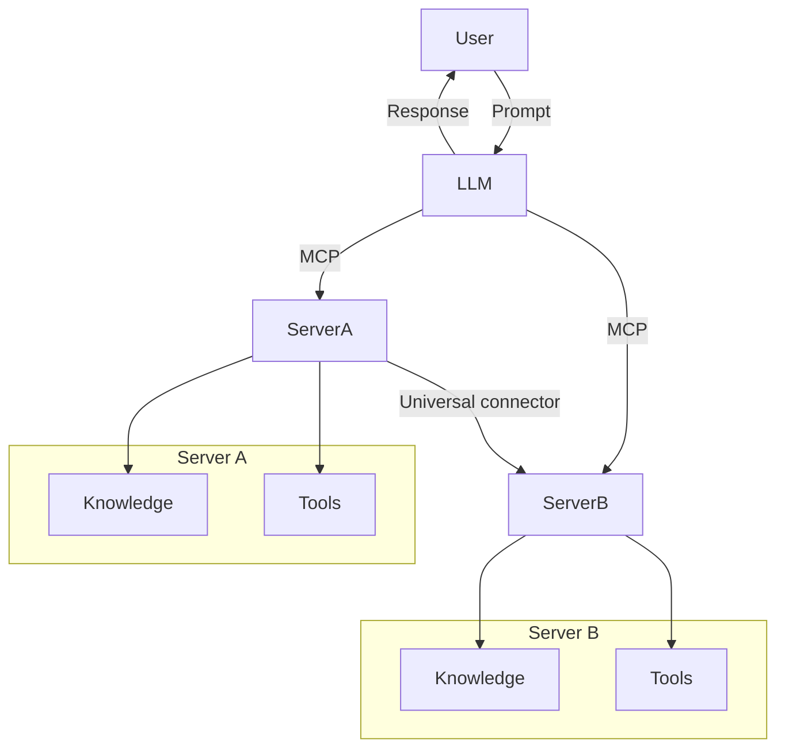

<!--
CO_OP_TRANSLATOR_METADATA:
{
  "original_hash": "cf84f987e1b771d2201408e110dfd2db",
  "translation_date": "2025-05-20T15:39:36+00:00",
  "source_file": "00-Introduction/README.md",
  "language_code": "de"
}
-->
# Einführung in das Model Context Protocol (MCP): Warum es für skalierbare KI-Anwendungen wichtig ist

Generative KI-Anwendungen sind ein großer Fortschritt, da sie es den Nutzern oft ermöglichen, mit der App über natürliche Spracheingaben zu interagieren. Doch je mehr Zeit und Ressourcen in solche Apps investiert werden, desto wichtiger ist es, Funktionen und Ressourcen so zu integrieren, dass sie leicht erweiterbar sind, mehrere Modelle unterstützt werden können und deren Besonderheiten berücksichtigt werden. Kurz gesagt: Gen KI-Apps zu starten ist einfach, aber mit zunehmender Komplexität muss man eine Architektur definieren und sich wahrscheinlich auf einen Standard stützen, um sicherzustellen, dass die Apps konsistent aufgebaut sind. Hier kommt MCP ins Spiel, um Ordnung zu schaffen und einen Standard bereitzustellen.

---

## **🔍 Was ist das Model Context Protocol (MCP)?**

Das **Model Context Protocol (MCP)** ist eine **offene, standardisierte Schnittstelle**, die es großen Sprachmodellen (LLMs) ermöglicht, nahtlos mit externen Tools, APIs und Datenquellen zu interagieren. Es bietet eine einheitliche Architektur, um die Funktionalität von KI-Modellen über ihre Trainingsdaten hinaus zu erweitern und so intelligentere, skalierbare und reaktionsfähigere KI-Systeme zu ermöglichen.

---

## **🎯 Warum Standardisierung in der KI wichtig ist**

Mit zunehmender Komplexität generativer KI-Anwendungen ist es entscheidend, Standards zu übernehmen, die **Skalierbarkeit, Erweiterbarkeit** und **Wartbarkeit** gewährleisten. MCP adressiert diese Anforderungen durch:

- Vereinheitlichung der Integration von Modellen und Tools  
- Reduzierung von brüchigen, einmaligen Eigenentwicklungen  
- Ermöglichung des gleichzeitigen Betriebs mehrerer Modelle in einem Ökosystem

---

## **📚 Lernziele**

Am Ende dieses Artikels wirst du in der Lage sein:

- Das **Model Context Protocol (MCP)** und seine Anwendungsfälle zu definieren  
- Zu verstehen, wie MCP die Kommunikation zwischen Modell und Tool standardisiert  
- Die Kernkomponenten der MCP-Architektur zu identifizieren  
- Praxisbeispiele für MCP in Unternehmens- und Entwicklungsumgebungen zu erkunden

---

## **💡 Warum das Model Context Protocol (MCP) ein Game-Changer ist**

### **🔗 MCP löst die Fragmentierung in der KI-Interaktion**

Vor MCP erforderte die Integration von Modellen und Tools:

- Individuellen Code für jede Tool-Modell-Kombination  
- Nicht standardisierte APIs für jeden Anbieter  
- Häufige Unterbrechungen durch Updates  
- Schlechte Skalierbarkeit bei zunehmender Tool-Anzahl

### **✅ Vorteile der MCP-Standardisierung**

| **Vorteil**               | **Beschreibung**                                                               |
|---------------------------|--------------------------------------------------------------------------------|
| Interoperabilität         | LLMs arbeiten nahtlos mit Tools verschiedener Anbieter zusammen                |
| Konsistenz                | Einheitliches Verhalten über Plattformen und Tools hinweg                      |
| Wiederverwendbarkeit      | Einmal entwickelte Tools können in verschiedenen Projekten und Systemen genutzt werden |
| Beschleunigte Entwicklung | Verkürzung der Entwicklungszeit durch standardisierte, Plug-and-Play-Schnittstellen |

---

## **🧱 Überblick über die MCP-Architektur auf hoher Ebene**

MCP folgt einem **Client-Server-Modell**, bei dem:

- **MCP Hosts** die KI-Modelle ausführen  
- **MCP Clients** Anfragen initiieren  
- **MCP Server** Kontext, Tools und Funktionen bereitstellen

### **Wichtige Komponenten:**

- **Resources** – Statische oder dynamische Daten für Modelle  
- **Prompts** – Vorgefertigte Abläufe für gesteuerte Generierung  
- **Tools** – Ausführbare Funktionen wie Suche, Berechnungen  
- **Sampling** – Agentenverhalten durch rekursive Interaktionen

---

## Wie MCP-Server funktionieren

MCP-Server arbeiten folgendermaßen:

- **Anfragefluss**:  
    1. Der MCP Client sendet eine Anfrage an das KI-Modell, das in einem MCP Host läuft.  
    2. Das KI-Modell erkennt, wann es externe Tools oder Daten benötigt.  
    3. Das Modell kommuniziert über das standardisierte Protokoll mit dem MCP Server.

- **Funktionalitäten des MCP Servers**:  
    - Tool-Registry: Pflegt einen Katalog verfügbarer Tools und deren Funktionen.  
    - Authentifizierung: Überprüft Berechtigungen für den Tool-Zugriff.  
    - Request Handler: Verarbeitet eingehende Tool-Anfragen vom Modell.  
    - Response Formatter: Strukturiert Tool-Ausgaben in einem für das Modell verständlichen Format.

- **Tool-Ausführung**:  
    - Der Server leitet Anfragen an die passenden externen Tools weiter.  
    - Tools führen ihre spezialisierten Funktionen aus (Suche, Berechnung, Datenbankabfragen etc.).  
    - Ergebnisse werden in einem einheitlichen Format an das Modell zurückgegeben.

- **Abschluss der Antwort**:  
    - Das KI-Modell integriert die Tool-Ausgaben in seine Antwort.  
    - Die finale Antwort wird an die Client-Anwendung zurückgesendet.

## 👨‍💻 Wie man einen MCP-Server baut (mit Beispielen)

MCP-Server ermöglichen es, die Fähigkeiten von LLMs durch Bereitstellung von Daten und Funktionen zu erweitern.

Bereit zum Ausprobieren? Hier findest du Beispiele für die Erstellung eines einfachen MCP-Servers in verschiedenen Sprachen:

- **Python Beispiel**: https://github.com/modelcontextprotocol/python-sdk

- **TypeScript Beispiel**: https://github.com/modelcontextprotocol/typescript-sdk

- **Java Beispiel**: https://github.com/modelcontextprotocol/java-sdk

- **C#/.NET Beispiel**: https://github.com/modelcontextprotocol/csharp-sdk

## 🌍 Praxisbeispiele für MCP

MCP ermöglicht eine Vielzahl von Anwendungen durch Erweiterung der KI-Fähigkeiten:

| **Anwendung**              | **Beschreibung**                                                              |
|----------------------------|-------------------------------------------------------------------------------|
| Enterprise Data Integration | Anbindung von LLMs an Datenbanken, CRMs oder interne Tools                    |
| Agentische KI-Systeme       | Ermöglicht autonome Agenten mit Tool-Zugriff und Entscheidungsworkflows       |
| Multimodale Anwendungen     | Kombination von Text-, Bild- und Audio-Tools in einer einzigen einheitlichen KI-App |
| Echtzeit-Datenintegration   | Einbindung von Live-Daten in KI-Interaktionen für genauere, aktuelle Ergebnisse |

### 🧠 MCP = Universeller Standard für KI-Interaktionen

Das Model Context Protocol (MCP) fungiert als universeller Standard für KI-Interaktionen, ähnlich wie USB-C physische Verbindungen für Geräte standardisiert hat. In der KI-Welt bietet MCP eine konsistente Schnittstelle, die es Modellen (Clients) ermöglicht, sich nahtlos mit externen Tools und Datenanbietern (Servern) zu verbinden. So entfällt die Notwendigkeit für vielfältige, individuelle Protokolle für jede API oder Datenquelle.

Ein MCP-kompatibles Tool (als MCP-Server bezeichnet) folgt einem einheitlichen Standard. Diese Server können die angebotenen Tools oder Aktionen auflisten und diese bei Anfrage durch einen KI-Agenten ausführen. Plattformen für KI-Agenten, die MCP unterstützen, können verfügbare Tools von den Servern entdecken und über dieses Standardprotokoll aufrufen.

### 💡 Erleichtert den Zugriff auf Wissen

Neben der Bereitstellung von Tools erleichtert MCP auch den Zugriff auf Wissen. Es ermöglicht Anwendungen, großen Sprachmodellen (LLMs) Kontext zu bieten, indem sie mit verschiedenen Datenquellen verknüpft werden. Ein MCP-Server könnte beispielsweise das Dokumentenarchiv eines Unternehmens repräsentieren, sodass Agenten bei Bedarf relevante Informationen abrufen können. Ein anderer Server könnte spezifische Aktionen wie das Versenden von E-Mails oder das Aktualisieren von Datensätzen übernehmen. Aus Sicht des Agenten sind das einfach Tools – einige liefern Daten (Wissenskontext), andere führen Aktionen aus. MCP verwaltet beides effizient.

Ein Agent, der sich mit einem MCP-Server verbindet, lernt automatisch die verfügbaren Funktionen und zugänglichen Daten des Servers über ein Standardformat kennen. Diese Standardisierung ermöglicht eine dynamische Verfügbarkeit von Tools. Beispielsweise kann durch das Hinzufügen eines neuen MCP-Servers zum System eines Agenten dessen Funktionen sofort genutzt werden, ohne dass die Agenten-Anweisungen angepasst werden müssen.

Diese nahtlose Integration entspricht dem im mermaid-Diagramm dargestellten Ablauf, bei dem Server sowohl Tools als auch Wissen bereitstellen und so eine reibungslose Zusammenarbeit zwischen Systemen sicherstellen.

### 👉 Beispiel: Skalierbare Agentenlösung

## 🔐 Praktische Vorteile von MCP

Das sind die praktischen Vorteile von MCP:

- **Aktualität**: Modelle können auf aktuelle Informationen zugreifen, die über ihre Trainingsdaten hinausgehen  
- **Fähigkeitserweiterung**: Modelle können spezialisierte Tools für Aufgaben nutzen, für die sie nicht trainiert wurden  
- **Reduzierte Halluzinationen**: Externe Datenquellen sorgen für faktische Grundlage  
- **Datenschutz**: Sensible Daten bleiben in sicheren Umgebungen und müssen nicht in Prompts eingebettet werden

## 📌 Wichtige Erkenntnisse

Das sind die wichtigsten Erkenntnisse zur Nutzung von MCP:

- **MCP** standardisiert die Interaktion von KI-Modellen mit Tools und Daten  
- Fördert **Erweiterbarkeit, Konsistenz und Interoperabilität**  
- MCP hilft, **Entwicklungszeit zu reduzieren, Zuverlässigkeit zu verbessern und Modellfähigkeiten zu erweitern**  
- Die Client-Server-Architektur **ermöglicht flexible, erweiterbare KI-Anwendungen**

## 🧠 Übung

Denke über eine KI-Anwendung nach, die du entwickeln möchtest.

- Welche **externen Tools oder Daten** könnten ihre Fähigkeiten verbessern?  
- Wie könnte MCP die Integration **einfacher und zuverlässiger** machen?

## Zusätzliche Ressourcen

- [MCP GitHub Repository](https://github.com/modelcontextprotocol)

## Was kommt als Nächstes

Weiter zu: [Kapitel 1: Kernkonzepte](/01-CoreConcepts/README.md)

**Haftungsausschluss**:  
Dieses Dokument wurde mit dem KI-Übersetzungsdienst [Co-op Translator](https://github.com/Azure/co-op-translator) übersetzt. Obwohl wir uns um Genauigkeit bemühen, beachten Sie bitte, dass automatisierte Übersetzungen Fehler oder Ungenauigkeiten enthalten können. Das Originaldokument in seiner Ursprungssprache gilt als maßgebliche Quelle. Für wichtige Informationen wird eine professionelle menschliche Übersetzung empfohlen. Wir übernehmen keine Haftung für Missverständnisse oder Fehlinterpretationen, die aus der Nutzung dieser Übersetzung entstehen.