```mermaid
---
title: Advanced MCP Scenarios with Client-Server LLM Integration
description: A sequence diagram showing the detailed interaction flow between user, client application, client LLM, multiple MCP servers, and server LLM, illustrating tool discovery, user interaction, direct tool calling, and feature negotiation phases
---
sequenceDiagram
    autonumber
    actor User as 👤 User
    participant ClientApp as 🖥️ Client App
    participant ClientLLM as 🧠 Client LLM
    participant Server1 as 🔧 MCP Server 1
    participant Server2 as 📚 MCP Server 2
    participant ServerLLM as 🤖 Server LLM
    
    %% Discovery Phase
    rect rgb(220, 240, 255)
        Note over ClientApp, Server2: TOOL DISCOVERY PHASE
        ClientApp->>+Server1: Request available tools/resources
        Server1-->>-ClientApp: Return tool list (JSON)
        ClientApp->>+Server2: Request available tools/resources
        Server2-->>-ClientApp: Return tool list (JSON)
        Note right of ClientApp: Store combined tool<br/>catalog locally
    end
    
    %% User Interaction
    rect rgb(255, 240, 220)
        Note over User, ClientLLM: USER INTERACTION PHASE
        User->>+ClientApp: Enter natural language prompt
        ClientApp->>+ClientLLM: Forward prompt + tool catalog
        ClientLLM->>-ClientLLM: Analyze prompt & select tools
    end
    
    %% Scenario A: Direct Tool Calling
    alt Direct Tool Calling
        rect rgb(220, 255, 220)
            Note over ClientApp, Server1: SCENARIO A: DIRECT TOOL CALLING
            ClientLLM->>+ClientApp: Request tool execution
            ClientApp->>+Server1: Execute specific tool
            Server1-->>-ClientApp: Return results
            ClientApp->>+ClientLLM: Process results
            ClientLLM-->>-ClientApp: Generate response
            ClientApp-->>-User: Display final answer
        end
    
    %% Scenario B: Feature Negotiation (VS Code style)
    else Feature Negotiation (VS Code style)
        rect rgb(255, 220, 220)
            Note over ClientApp, ServerLLM: SCENARIO B: FEATURE NEGOTIATION
            ClientLLM->>+ClientApp: Identify needed capabilities
            ClientApp->>+Server2: Negotiate features/capabilities
            Server2->>+ServerLLM: Request additional context
            ServerLLM-->>-Server2: Provide context
            Server2-->>-ClientApp: Return available features
            ClientApp->>+Server2: Call negotiated tools
            Server2-->>-ClientApp: Return results
            ClientApp->>+ClientLLM: Process results
            ClientLLM-->>-ClientApp: Generate response
            ClientApp-->>-User: Display final answer
        end
    end
```

<!--
CO_OP_TRANSLATOR_METADATA:
{
  "original_hash": "1446979020432f512c883848d7eca144",
  "translation_date": "2025-05-29T21:40:35+00:00",
  "source_file": "00-Introduction/README.md",
  "language_code": "de"
}
-->
# Einführung in das Model Context Protocol (MCP): Warum es für skalierbare KI-Anwendungen wichtig ist

Generative KI-Anwendungen sind ein großer Fortschritt, da sie es dem Nutzer oft ermöglichen, mit der App über natürliche Spracheingaben zu interagieren. Doch je mehr Zeit und Ressourcen in solche Apps investiert werden, desto wichtiger ist es, Funktionen und Ressourcen so zu integrieren, dass die Erweiterung einfach ist, die App mehrere Modelle unterstützen kann und verschiedene Modellbesonderheiten berücksichtigt werden. Kurz gesagt: Gen KI-Apps zu bauen ist anfangs einfach, aber mit wachsender Komplexität muss man eine Architektur definieren und sich wahrscheinlich auf einen Standard stützen, um eine konsistente Entwicklung sicherzustellen. Hier kommt MCP ins Spiel, um Ordnung zu schaffen und einen Standard bereitzustellen.

---

## **🔍 Was ist das Model Context Protocol (MCP)?**

Das **Model Context Protocol (MCP)** ist eine **offene, standardisierte Schnittstelle**, die es Large Language Models (LLMs) ermöglicht, nahtlos mit externen Tools, APIs und Datenquellen zu interagieren. Es bietet eine konsistente Architektur, um die Funktionalität von KI-Modellen über deren Trainingsdaten hinaus zu erweitern und so intelligentere, skalierbare und reaktionsfähigere KI-Systeme zu ermöglichen.

---

## **🎯 Warum Standardisierung in der KI wichtig ist**

Mit zunehmender Komplexität generativer KI-Anwendungen ist es entscheidend, Standards einzuführen, die **Skalierbarkeit, Erweiterbarkeit** und **Wartbarkeit** gewährleisten. MCP adressiert diese Anforderungen durch:

- Vereinheitlichung der Modell-Tool-Integrationen  
- Reduzierung fragiler, einmaliger Eigenentwicklungen  
- Ermöglichung des gleichzeitigen Einsatzes mehrerer Modelle in einem Ökosystem  

---

## **📚 Lernziele**

Am Ende dieses Artikels wirst du in der Lage sein:

- Das **Model Context Protocol (MCP)** und seine Anwendungsfälle zu definieren  
- Zu verstehen, wie MCP die Kommunikation zwischen Modell und Tool standardisiert  
- Die Kernkomponenten der MCP-Architektur zu identifizieren  
- Anwendungsbeispiele von MCP in Unternehmens- und Entwicklungsumgebungen zu erkunden  

---

## **💡 Warum das Model Context Protocol (MCP) ein Game-Changer ist**

### **🔗 MCP löst Fragmentierung bei KI-Interaktionen**

Vor MCP erforderte die Integration von Modellen mit Tools:

- Individuellen Code pro Tool-Modell-Kombination  
- Nicht standardisierte APIs für jeden Anbieter  
- Häufige Unterbrechungen durch Updates  
- Schlechte Skalierbarkeit bei zunehmender Anzahl an Tools  

### **✅ Vorteile der MCP-Standardisierung**

| **Vorteil**              | **Beschreibung**                                                              |
|--------------------------|--------------------------------------------------------------------------------|
| Interoperabilität        | LLMs arbeiten nahtlos mit Tools verschiedener Anbieter zusammen               |
| Konsistenz               | Einheitliches Verhalten über Plattformen und Tools hinweg                     |
| Wiederverwendbarkeit     | Einmal entwickelte Tools können in verschiedenen Projekten und Systemen genutzt werden |
| Schnellere Entwicklung   | Verkürzte Entwicklungszeit durch standardisierte, sofort einsatzbereite Schnittstellen |

---

## **🧱 Überblick über die MCP-Architektur auf hoher Ebene**

MCP folgt einem **Client-Server-Modell**, bei dem:

- **MCP Hosts** die KI-Modelle ausführen  
- **MCP Clients** Anfragen initiieren  
- **MCP Server** Kontext, Tools und Funktionen bereitstellen  

### **Wichtige Komponenten:**

- **Resources** – Statische oder dynamische Daten für Modelle  
- **Prompts** – Vorgefertigte Workflows für geführte Generierung  
- **Tools** – Ausführbare Funktionen wie Suche, Berechnungen  
- **Sampling** – Agentenverhalten durch rekursive Interaktionen  

---

## Wie MCP Server funktionieren

MCP-Server arbeiten folgendermaßen:

- **Anfrageablauf**:  
    1. Der MCP Client sendet eine Anfrage an das KI-Modell, das in einem MCP Host läuft.  
    2. Das KI-Modell erkennt, wann externe Tools oder Daten benötigt werden.  
    3. Das Modell kommuniziert mit dem MCP Server über das standardisierte Protokoll.

- **Funktionalitäten des MCP Servers**:  
    - Tool-Register: Führt einen Katalog verfügbarer Tools und deren Fähigkeiten.  
    - Authentifizierung: Überprüft Zugriffsrechte auf Tools.  
    - Anfrage-Handler: Verarbeitet eingehende Tool-Anfragen vom Modell.  
    - Antwort-Formatter: Strukturierte Aufbereitung der Tool-Ausgaben in einem für das Modell verständlichen Format.

- **Tool-Ausführung**:  
    - Der Server leitet Anfragen an die passenden externen Tools weiter.  
    - Tools führen spezialisierte Funktionen aus (Suche, Berechnung, Datenbankabfragen etc.).  
    - Ergebnisse werden im einheitlichen Format an das Modell zurückgegeben.

- **Abschluss der Antwort**:  
    - Das KI-Modell integriert die Tool-Ausgaben in seine Antwort.  
    - Die finale Antwort wird an die Client-Anwendung gesendet.

## 👨‍💻 Wie man einen MCP Server baut (mit Beispielen)

MCP-Server ermöglichen es, die Fähigkeiten von LLMs durch Bereitstellung von Daten und Funktionen zu erweitern.

Bereit, es auszuprobieren? Hier findest du Beispiele für die Erstellung eines einfachen MCP Servers in verschiedenen Sprachen:

- **Python Beispiel**: https://github.com/modelcontextprotocol/python-sdk

- **TypeScript Beispiel**: https://github.com/modelcontextprotocol/typescript-sdk

- **Java Beispiel**: https://github.com/modelcontextprotocol/java-sdk

- **C#/.NET Beispiel**: https://github.com/modelcontextprotocol/csharp-sdk

## 🌍 Anwendungsfälle aus der Praxis für MCP

MCP ermöglicht eine Vielzahl von Anwendungen durch die Erweiterung der KI-Fähigkeiten:

| **Anwendung**                 | **Beschreibung**                                                               |
|------------------------------|--------------------------------------------------------------------------------|
| Unternehmensdatenintegration  | Verbindung von LLMs mit Datenbanken, CRMs oder internen Tools                  |
| Agentenbasierte KI-Systeme   | Ermöglicht autonome Agenten mit Tool-Zugriff und Entscheidungs-Workflows       |
| Multimodale Anwendungen      | Kombination von Text-, Bild- und Audio-Tools in einer einzigen KI-Anwendung    |
| Echtzeit-Datenintegration    | Einbindung von Live-Daten in KI-Interaktionen für genauere, aktuelle Ergebnisse|

### 🧠 MCP = Universeller Standard für KI-Interaktionen

Das Model Context Protocol (MCP) fungiert als universeller Standard für KI-Interaktionen, ähnlich wie USB-C physische Verbindungen für Geräte standardisiert hat. In der KI-Welt stellt MCP eine konsistente Schnittstelle bereit, die es Modellen (Clients) erlaubt, sich nahtlos mit externen Tools und Datenanbietern (Servern) zu verbinden. Dadurch entfällt die Notwendigkeit für unterschiedliche, individuelle Protokolle für jede API oder Datenquelle.

Ein MCP-kompatibles Tool (genannt MCP Server) folgt einem einheitlichen Standard. Diese Server können die angebotenen Tools oder Aktionen auflisten und diese ausführen, wenn sie von einem KI-Agenten angefragt werden. Plattformen für KI-Agenten, die MCP unterstützen, können verfügbare Tools von den Servern entdecken und über dieses Standardprotokoll aufrufen.

### 💡 Ermöglicht Zugang zu Wissen

Über die Bereitstellung von Tools hinaus erleichtert MCP auch den Zugang zu Wissen. Es ermöglicht Anwendungen, großen Sprachmodellen (LLMs) Kontext zu bieten, indem sie mit verschiedenen Datenquellen verknüpft werden. Ein MCP Server könnte beispielsweise das Dokumentenarchiv eines Unternehmens repräsentieren, sodass Agenten bei Bedarf relevante Informationen abrufen können. Ein anderer Server könnte spezielle Aktionen wie das Versenden von E-Mails oder das Aktualisieren von Datensätzen übernehmen. Aus Sicht des Agenten sind dies einfach nur Tools – manche liefern Daten (Wissenskontext), andere führen Aktionen aus. MCP verwaltet beides effizient.

Ein Agent, der sich mit einem MCP Server verbindet, lernt automatisch die verfügbaren Funktionen und zugänglichen Daten des Servers über ein standardisiertes Format kennen. Diese Standardisierung ermöglicht eine dynamische Verfügbarkeit von Tools. Zum Beispiel macht das Hinzufügen eines neuen MCP Servers zum System eines Agenten dessen Funktionen sofort nutzbar, ohne dass die Anweisungen des Agenten weiter angepasst werden müssen.

Diese reibungslose Integration entspricht dem Ablauf im Mermaid-Diagramm, bei dem Server sowohl Tools als auch Wissen bereitstellen und so eine nahtlose Zusammenarbeit zwischen Systemen gewährleisten.

### 👉 Beispiel: Skalierbare Agentenlösung

### 🔄 Erweiterte MCP-Szenarien mit Client-seitiger LLM-Integration

Über die grundlegende MCP-Architektur hinaus gibt es erweiterte Szenarien, in denen sowohl Client als auch Server LLMs enthalten, was komplexere Interaktionen ermöglicht:

## 🔐 Praktische Vorteile von MCP

Hier sind die praktischen Vorteile der Nutzung von MCP:

- **Aktualität**: Modelle können auf aktuelle Informationen zugreifen, die über ihre Trainingsdaten hinausgehen  
- **Funktionserweiterung**: Modelle können spezialisierte Tools für Aufgaben nutzen, für die sie nicht trainiert wurden  
- **Reduzierung von Halluzinationen**: Externe Datenquellen bieten faktische Grundlage  
- **Datenschutz**: Sensible Daten können in sicheren Umgebungen verbleiben, anstatt in Prompts eingebettet zu werden  

## 📌 Wichtige Erkenntnisse

Folgendes solltest du über MCP mitnehmen:

- **MCP** standardisiert die Interaktion von KI-Modellen mit Tools und Daten  
- Fördert **Erweiterbarkeit, Konsistenz und Interoperabilität**  
- MCP hilft, **Entwicklungszeit zu verkürzen, Zuverlässigkeit zu verbessern und Modellfähigkeiten zu erweitern**  
- Die Client-Server-Architektur ermöglicht **flexible, erweiterbare KI-Anwendungen**  

## 🧠 Übung

Denke an eine KI-Anwendung, die du gerne entwickeln möchtest.

- Welche **externen Tools oder Daten** könnten deren Fähigkeiten verbessern?  
- Wie könnte MCP die Integration **einfacher und zuverlässiger** machen?  

## Zusätzliche Ressourcen

- [MCP GitHub Repository](https://github.com/modelcontextprotocol)

## Was kommt als Nächstes

Weiter zu: [Kapitel 1: Kernkonzepte](/01-CoreConcepts/README.md)

**Haftungsausschluss**:  
Dieses Dokument wurde mit dem KI-Übersetzungsdienst [Co-op Translator](https://github.com/Azure/co-op-translator) übersetzt. Obwohl wir uns um Genauigkeit bemühen, beachten Sie bitte, dass automatisierte Übersetzungen Fehler oder Ungenauigkeiten enthalten können. Das Originaldokument in seiner ursprünglichen Sprache gilt als maßgebliche Quelle. Für wichtige Informationen wird eine professionelle menschliche Übersetzung empfohlen. Wir übernehmen keine Haftung für Missverständnisse oder Fehlinterpretationen, die aus der Nutzung dieser Übersetzung entstehen.