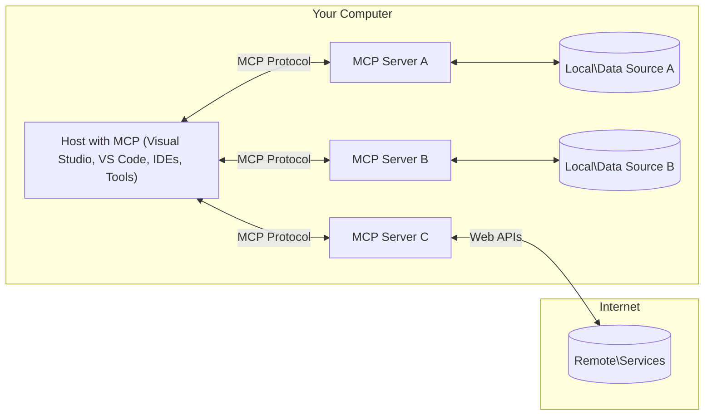

<!--
CO_OP_TRANSLATOR_METADATA:
{
  "original_hash": "11010ad254e48628bb6a457be2211640",
  "translation_date": "2025-08-12T08:01:18+00:00",
  "source_file": "01-CoreConcepts/README.md",
  "language_code": "de"
}
-->
# 📖 MCP Kernkonzepte: Das Model Context Protocol für KI-Integration meistern

[](https://youtu.be/earDzWGtE84)

_(Klicken Sie auf das Bild oben, um das Video zu dieser Lektion anzusehen)_

Das [Model Context Protocol (MCP)](https://github.com/modelcontextprotocol) ist ein leistungsstarkes, standardisiertes Framework, das die Kommunikation zwischen großen Sprachmodellen (LLMs) und externen Tools, Anwendungen und Datenquellen optimiert. Dieser Leitfaden führt Sie durch die Kernkonzepte von MCP, damit Sie dessen Client-Server-Architektur, wesentliche Komponenten, Kommunikationsmechanismen und bewährte Implementierungspraktiken verstehen.

## Überblick

Diese Lektion untersucht die grundlegende Architektur und die Komponenten, die das Model Context Protocol (MCP)-Ökosystem ausmachen. Sie lernen die Client-Server-Architektur, die Schlüsselkomponenten und die Kommunikationsmechanismen kennen, die MCP-Interaktionen ermöglichen.

## 👩‍🎓 Wichtige Lernziele

Am Ende dieser Lektion werden Sie:

- Die MCP-Client-Server-Architektur verstehen.
- Rollen und Verantwortlichkeiten von Hosts, Clients und Servern identifizieren.
- Die Kernmerkmale analysieren, die MCP zu einer flexiblen Integrationsschicht machen.
- Verstehen, wie Informationen innerhalb des MCP-Ökosystems fließen.
- Praktische Einblicke durch Codebeispiele in .NET, Java, Python und JavaScript gewinnen.

## 🔎 MCP-Architektur: Ein tieferer Einblick

Das MCP-Ökosystem basiert auf einem Client-Server-Modell. Diese modulare Struktur ermöglicht es KI-Anwendungen, effizient mit Tools, Datenbanken, APIs und kontextuellen Ressourcen zu interagieren. Lassen Sie uns diese Architektur in ihre Kernkomponenten aufschlüsseln.

Im Kern folgt MCP einer Client-Server-Architektur, bei der eine Host-Anwendung mehrere Server verbinden kann:



- **MCP Hosts**: Programme wie VSCode, Claude Desktop, IDEs oder KI-Tools, die über MCP auf Daten zugreifen möchten.
- **MCP Clients**: Protokoll-Clients, die 1:1-Verbindungen mit Servern aufrechterhalten.
- **MCP Servers**: Leichte Programme, die jeweils spezifische Funktionen über das standardisierte Model Context Protocol bereitstellen.
- **Lokale Datenquellen**: Dateien, Datenbanken und Dienste Ihres Computers, auf die MCP-Server sicher zugreifen können.
- **Externe Dienste**: Systeme, die über das Internet verfügbar sind und mit denen MCP-Server über APIs verbunden werden können.

Das MCP-Protokoll ist ein sich weiterentwickelnder Standard. Die neuesten Updates zur [Protokollspezifikation](https://modelcontextprotocol.io/specification/2025-06-18/) finden Sie hier.

### 1. Hosts

Im Model Context Protocol (MCP) spielen Hosts eine entscheidende Rolle als primäre Schnittstelle, über die Benutzer mit dem Protokoll interagieren. Hosts sind Anwendungen oder Umgebungen, die Verbindungen zu MCP-Servern initiieren, um auf Daten, Tools und Eingabeaufforderungen zuzugreifen. Beispiele für Hosts sind integrierte Entwicklungsumgebungen (IDEs) wie Visual Studio Code, KI-Tools wie Claude Desktop oder speziell entwickelte Agenten für bestimmte Aufgaben.

**Hosts** sind Anwendungen, die Verbindungen zu LLMs initiieren. Sie:

- Führen KI-Modelle aus oder interagieren mit ihnen, um Antworten zu generieren.
- Initiieren Verbindungen zu MCP-Servern.
- Verwalten den Gesprächsfluss und die Benutzeroberfläche.
- Kontrollieren Berechtigungen und Sicherheitsbeschränkungen.
- Handhaben die Zustimmung der Benutzer für die Datenfreigabe und Toolausführung.

### 2. Clients

Clients sind wesentliche Komponenten, die die Interaktion zwischen Hosts und MCP-Servern erleichtern. Sie fungieren als Vermittler und ermöglichen es Hosts, die von MCP-Servern bereitgestellten Funktionen zu nutzen. Sie spielen eine entscheidende Rolle bei der Sicherstellung einer reibungslosen Kommunikation und eines effizienten Datenaustauschs innerhalb der MCP-Architektur.

**Clients** sind Verbindungsstellen innerhalb der Host-Anwendung. Sie:

- Senden Anfragen an Server mit Eingabeaufforderungen/Anweisungen.
- Verhandeln Fähigkeiten mit Servern.
- Verwalten Toolausführungsanfragen von Modellen.
- Verarbeiten und zeigen Antworten für Benutzer an.

### 3. Server

Server sind dafür verantwortlich, Anfragen von MCP-Clients zu bearbeiten und entsprechende Antworten bereitzustellen. Meistens fungieren Server als Tools, die dem LLM eine spezifische Funktionalität bieten. Sie verwalten verschiedene Operationen wie Datenabruf, Toolausführung und Eingabeaufforderungserstellung. Server sorgen dafür, dass die Kommunikation zwischen Clients und Hosts effizient und zuverlässig ist und die Integrität des Interaktionsprozesses gewahrt bleibt.

**Servers** sind Dienste, die Kontext und Funktionen bereitstellen. Sie:

- Registrieren verfügbare Funktionen (Ressourcen, Eingabeaufforderungen, Tools).
- Empfangen und führen Toolaufrufe vom Client aus.
- Stellen kontextuelle Informationen bereit, um Modellantworten zu verbessern.
- Geben Ausgaben zurück an den Client.
- Halten den Zustand über Interaktionen hinweg aufrecht, wenn erforderlich.

Server können von jedem entwickelt werden, um die Modellfähigkeiten mit spezialisierter Funktionalität zu erweitern.

### 4. Server-Funktionen

Server im Model Context Protocol (MCP) bieten grundlegende Bausteine, die reichhaltige Interaktionen zwischen Clients, Hosts und Sprachmodellen ermöglichen. Diese Funktionen sind darauf ausgelegt, die Fähigkeiten von MCP durch strukturierten Kontext, Tools und Eingabeaufforderungen zu erweitern.

MCP-Server können folgende Funktionen anbieten:

#### 📑 Ressourcen

Ressourcen im Model Context Protocol (MCP) umfassen verschiedene Arten von Kontext und Daten, die von Benutzern oder KI-Modellen genutzt werden können. Dazu gehören:

- **Kontextuelle Daten**: Informationen und Kontext, die Benutzer oder KI-Modelle für Entscheidungsfindung und Aufgabenbearbeitung nutzen können.
- **Wissensdatenbanken und Dokumenten-Repositories**: Sammlungen von strukturierten und unstrukturierten Daten wie Artikel, Handbücher und Forschungspapiere, die wertvolle Einblicke und Informationen bieten.
- **Lokale Dateien und Datenbanken**: Daten, die lokal auf Geräten oder in Datenbanken gespeichert sind und für Verarbeitung und Analyse zugänglich sind.
- **APIs und Webdienste**: Externe Schnittstellen und Dienste, die zusätzliche Daten und Funktionen bieten und die Integration mit verschiedenen Online-Ressourcen und Tools ermöglichen.

Ein Beispiel für eine Ressource könnte ein Datenbankschema oder eine Datei sein, die wie folgt zugänglich ist:

```text
file://log.txt
database://schema
```

### 🤖 Eingabeaufforderungen
Eingabeaufforderungen im Model Context Protocol (MCP) umfassen verschiedene vordefinierte Vorlagen und Interaktionsmuster, die darauf ausgelegt sind, Benutzerabläufe zu optimieren und die Kommunikation zu verbessern. Dazu gehören:

- **Vorstrukturierte Nachrichten und Abläufe**: Vordefinierte Nachrichten und Prozesse, die Benutzer durch spezifische Aufgaben und Interaktionen führen.
- **Vordefinierte Interaktionsmuster**: Standardisierte Abfolgen von Aktionen und Antworten, die eine konsistente und effiziente Kommunikation ermöglichen.
- **Spezialisierte Gesprächsvorlagen**: Anpassbare Vorlagen, die für bestimmte Arten von Gesprächen maßgeschneidert sind und relevante und kontextuell passende Interaktionen gewährleisten.

Eine Eingabeaufforderungsvorlage könnte wie folgt aussehen:

```markdown
Generate a product slogan based on the following {{product}} with the following {{keywords}}
```

#### ⛏️ Tools

Tools im Model Context Protocol (MCP) sind Funktionen, die das KI-Modell ausführen kann, um spezifische Aufgaben zu erledigen. Diese Tools sind darauf ausgelegt, die Fähigkeiten des KI-Modells durch strukturierte und zuverlässige Operationen zu erweitern. Wichtige Aspekte sind:

- **Funktionen, die das KI-Modell ausführen kann**: Tools sind ausführbare Funktionen, die das KI-Modell aufrufen kann, um verschiedene Aufgaben auszuführen.
- **Eindeutiger Name und Beschreibung**: Jedes Tool hat einen eindeutigen Namen und eine detaillierte Beschreibung, die seinen Zweck und seine Funktionalität erklärt.
- **Parameter und Ausgaben**: Tools akzeptieren spezifische Parameter und geben strukturierte Ausgaben zurück, um konsistente und vorhersehbare Ergebnisse zu gewährleisten.
- **Diskrete Funktionen**: Tools führen diskrete Funktionen wie Websuchen, Berechnungen und Datenbankabfragen aus.

Ein Beispiel-Tool könnte wie folgt aussehen:

```typescript
server.tool(
  "GetProducts",
  {
    pageSize: z.string().optional(),
    pageCount: z.string().optional()
  }, () => {
    // return results from API
  }
)
```

## Client-Funktionen
Im Model Context Protocol (MCP) bieten Clients mehrere wichtige Funktionen für Server, die die Gesamtfunktionalität und Interaktion innerhalb des Protokolls verbessern. Eine der bemerkenswerten Funktionen ist Sampling.

### 👉 Sampling

- **Server-initiierte agentische Verhaltensweisen**: Clients ermöglichen es Servern, spezifische Aktionen oder Verhaltensweisen autonom zu initiieren, wodurch die dynamischen Fähigkeiten des Systems erweitert werden.
- **Rekursive LLM-Interaktionen**: Diese Funktion ermöglicht rekursive Interaktionen mit großen Sprachmodellen (LLMs), wodurch komplexere und iterative Aufgabenverarbeitungen möglich werden.
- **Anforderung zusätzlicher Modellabschlüsse**: Server können zusätzliche Abschlüsse vom Modell anfordern, um sicherzustellen, dass die Antworten gründlich und kontextuell relevant sind.

## Informationsfluss in MCP

Das Model Context Protocol (MCP) definiert einen strukturierten Informationsfluss zwischen Hosts, Clients, Servern und Modellen. Das Verständnis dieses Flusses hilft, zu klären, wie Benutzeranfragen verarbeitet werden und wie externe Tools und Daten in Modellantworten integriert werden.

- **Host initiiert Verbindung**  
  Die Host-Anwendung (z. B. eine IDE oder Chat-Oberfläche) stellt eine Verbindung zu einem MCP-Server her, typischerweise über STDIO, WebSocket oder eine andere unterstützte Transportmethode.

- **Fähigkeitsverhandlung**  
  Der Client (eingebettet im Host) und der Server tauschen Informationen über ihre unterstützten Funktionen, Tools, Ressourcen und Protokollversionen aus. Dies stellt sicher, dass beide Seiten verstehen, welche Fähigkeiten für die Sitzung verfügbar sind.

- **Benutzeranfrage**  
  Der Benutzer interagiert mit dem Host (z. B. gibt eine Eingabeaufforderung oder einen Befehl ein). Der Host sammelt diese Eingabe und gibt sie zur Verarbeitung an den Client weiter.

- **Ressourcen- oder Toolnutzung**  
  - Der Client kann zusätzliche Kontexte oder Ressourcen vom Server anfordern (z. B. Dateien, Datenbankeinträge oder Artikel aus Wissensdatenbanken), um das Verständnis des Modells zu bereichern.
  - Wenn das Modell feststellt, dass ein Tool benötigt wird (z. B. um Daten abzurufen, eine Berechnung durchzuführen oder eine API aufzurufen), sendet der Client eine Toolaufrufanfrage an den Server, wobei der Toolname und die Parameter angegeben werden.

- **Serverausführung**  
  Der Server empfängt die Ressourcen- oder Toolanfrage, führt die erforderlichen Operationen aus (z. B. eine Funktion ausführen, eine Datenbank abfragen oder eine Datei abrufen) und gibt die Ergebnisse in einem strukturierten Format an den Client zurück.

- **Antwortgenerierung**  
  Der Client integriert die Antworten des Servers (Ressourcendaten, Toolausgaben usw.) in die laufende Modellinteraktion. Das Modell verwendet diese Informationen, um eine umfassende und kontextuell relevante Antwort zu generieren.

- **Ergebnispräsentation**  
  Der Host erhält die endgültige Ausgabe vom Client und präsentiert sie dem Benutzer, oft einschließlich sowohl des vom Modell generierten Textes als auch der Ergebnisse von Toolausführungen oder Ressourcenabfragen.

Dieser Fluss ermöglicht es MCP, fortschrittliche, interaktive und kontextbewusste KI-Anwendungen zu unterstützen, indem Modelle nahtlos mit externen Tools und Datenquellen verbunden werden.

## Protokolldetails

MCP (Model Context Protocol) basiert auf [JSON-RPC 2.0](https://www.jsonrpc.org/) und bietet ein standardisiertes, sprachunabhängiges Nachrichtenformat für die Kommunikation zwischen Hosts, Clients und Servern. Diese Grundlage ermöglicht zuverlässige, strukturierte und erweiterbare Interaktionen über verschiedene Plattformen und Programmiersprachen hinweg.

### Wichtige Protokollfunktionen

MCP erweitert JSON-RPC 2.0 um zusätzliche Konventionen für Toolaufrufe, Ressourcenzugriff und Eingabeaufforderungsverwaltung. Es unterstützt mehrere Transportschichten (STDIO, WebSocket, SSE) und ermöglicht sichere, erweiterbare und sprachunabhängige Kommunikation zwischen Komponenten.

#### 🧢 Basisprotokoll

- **JSON-RPC-Nachrichtenformat**: Alle Anfragen und Antworten verwenden die JSON-RPC 2.0-Spezifikation, um eine konsistente Struktur für Methodenaufrufe, Parameter, Ergebnisse und Fehlerbehandlung zu gewährleisten.
- **Zustandsbehaftete Verbindungen**: MCP-Sitzungen halten den Zustand über mehrere Anfragen hinweg aufrecht und unterstützen laufende Gespräche, Kontextakkumulation und Ressourcenverwaltung.
- **Fähigkeitsverhandlung**: Während der Verbindungsherstellung tauschen Clients und Server Informationen über unterstützte Funktionen, Protokollversionen, verfügbare Tools und Ressourcen aus. Dies stellt sicher, dass beide Seiten die Fähigkeiten des anderen verstehen und sich entsprechend anpassen können.

#### ➕ Zusätzliche Hilfsfunktionen

Nachfolgend sind einige zusätzliche Hilfsfunktionen und Protokollerweiterungen aufgeführt, die MCP bietet, um die Entwicklererfahrung zu verbessern und fortgeschrittene Szenarien zu ermöglichen:

- **Konfigurationsoptionen**: MCP ermöglicht die dynamische Konfiguration von Sitzungsparametern wie Toolberechtigungen, Ressourcenzugriff und Modelleinstellungen, die auf jede Interaktion zugeschnitten sind.
- **Fortschrittsverfolgung**: Langlaufende Operationen können Fortschrittsaktualisierungen melden, wodurch reaktionsfähige Benutzeroberflächen und eine bessere Benutzererfahrung bei komplexen Aufgaben ermöglicht werden.
- **Anfrageabbruch**: Clients können laufende Anfragen abbrechen, sodass Benutzer Operationen unterbrechen können, die nicht mehr benötigt werden oder zu lange dauern.
- **Fehlermeldung**: Standardisierte Fehlermeldungen und Codes helfen, Probleme zu diagnostizieren, Fehler elegant zu behandeln und umsetzbares Feedback für Benutzer und Entwickler bereitzustellen.
- **Protokollierung**: Sowohl Clients als auch Server können strukturierte Protokolle für Audits, Debugging und Überwachung von Protokollinteraktionen ausgeben.

Durch die Nutzung dieser Protokollfunktionen stellt MCP eine robuste, sichere und flexible Kommunikation zwischen Sprachmodellen und externen Tools oder Datenquellen sicher.

### 🔐 Sicherheitsüberlegungen

MCP-Implementierungen sollten mehrere wichtige Sicherheitsprinzipien einhalten, um sichere und vertrauenswürdige Interaktionen zu gewährleisten:

- **Benutzerzustimmung und Kontrolle**: Benutzer müssen ausdrücklich zustimmen, bevor Daten abgerufen oder Operationen ausgeführt werden. Sie sollten klare Kontrolle darüber haben, welche Daten geteilt und welche Aktionen autorisiert werden, unterstützt durch intuitive Benutzeroberflächen zur Überprüfung und Genehmigung von Aktivitäten.

- **Datenschutz**: Benutzerdaten sollten nur mit ausdrücklicher Zustimmung offengelegt und durch geeignete Zugriffskontrollen geschützt werden. MCP-Implementierungen müssen sicherstellen, dass keine unbefugte Datenübertragung erfolgt und die Privatsphäre während aller Interaktionen gewahrt bleibt.

- **Toolsicherheit**: Vor der Ausführung eines Tools ist eine ausdrückliche Benutzerzustimmung erforderlich. Benutzer sollten ein klares Verständnis der Funktionalität jedes Tools haben, und robuste Sicherheitsgrenzen müssen durchgesetzt werden, um unbeabsichtigte oder unsichere Toolausführungen zu verhindern.

Durch die Einhaltung dieser Prinzipien stellt MCP sicher, dass Benutzervertrauen, Datenschutz und Sicherheit bei allen Protokollinteraktionen gewahrt bleiben.

## Codebeispiele: Schlüsselkomponenten

Nachfolgend finden Sie Codebeispiele in mehreren beliebten Programmiersprachen, die zeigen, wie Sie wichtige MCP-Serverkomponenten und Tools implementieren können.

### .NET-Beispiel: Erstellen eines einfachen MCP-Servers mit Tools

Hier ist ein praktisches .NET-Codebeispiel, das zeigt, wie Sie einen einfachen MCP-Server mit benutzerdefinierten Tools implementieren. Dieses Beispiel zeigt, wie Tools definiert und registriert, Anfragen bearbeitet und der Server mit dem Model Context Protocol verbunden wird.

```csharp
using System;
using System.Threading.Tasks;
using ModelContextProtocol.Server;
using ModelContextProtocol.Server.Transport;
using ModelContextProtocol.Server.Tools;

public class WeatherServer
{
    public static async Task Main(string[] args)
    {
        // Create an MCP server
        var server = new McpServer(
            name: "Weather MCP Server",
            version: "1.0.0"
        );
        
        // Register our custom weather tool
        server.AddTool<string, WeatherData>("weatherTool", 
            description: "Gets current weather for a location",
            execute: async (location) => {
                // Call weather API (simplified)
                var weatherData = await GetWeatherDataAsync(location);
                return weatherData;
            });
        
        // Connect the server using stdio transport
        var transport = new StdioServerTransport();
        await server.ConnectAsync(transport);
        
        Console.WriteLine("Weather MCP Server started");
        
        // Keep the server running until process is terminated
        await Task.Delay(-1);
    }
    
    private static async Task<WeatherData> GetWeatherDataAsync(string location)
    {
        // This would normally call a weather API
        // Simplified for demonstration
        await Task.Delay(100); // Simulate API call
        return new WeatherData { 
            Temperature = 72.5,
            Conditions = "Sunny",
            Location = location
        };
    }
}

public class WeatherData
{
    public double Temperature { get; set; }
    public string Conditions { get; set; }
    public string Location { get; set; }
}
```

### Java-Beispiel: MCP-Server-Komponenten

Dieses Beispiel zeigt die gleiche MCP-Server- und Toolregistrierung wie das .NET-Beispiel oben, jedoch in Java implementiert.

```java
import io.modelcontextprotocol.server.McpServer;
import io.modelcontextprotocol.server.McpToolDefinition;
import io.modelcontextprotocol.server.transport.StdioServerTransport;
import io.modelcontextprotocol.server.tool.ToolExecutionContext;
import io.modelcontextprotocol.server.tool.ToolResponse;

public class WeatherMcpServer {
    public static void main(String[] args) throws Exception {
        // Create an MCP server
        McpServer server = McpServer.builder()
            .name("Weather MCP Server")
            .version("1.0.0")
            .build();
            
        // Register a weather tool
        server.registerTool(McpToolDefinition.builder("weatherTool")
            .description("Gets current weather for a location")
            .parameter("location", String.class)
            .execute((ToolExecutionContext ctx) -> {
                String location = ctx.getParameter("location", String.class);
                
                // Get weather data (simplified)
                WeatherData data = getWeatherData(location);
                
                // Return formatted response
                return ToolResponse.content(
                    String.format("Temperature: %.1f°F, Conditions: %s, Location: %s", 
                    data.getTemperature(), 
                    data.getConditions(), 
                    data.getLocation())
                );
            })
            .build());
        
        // Connect the server using stdio transport
        try (StdioServerTransport transport = new StdioServerTransport()) {
            server.connect(transport);
            System.out.println("Weather MCP Server started");
            // Keep server running until process is terminated
            Thread.currentThread().join();
        }
    }
    
    private static WeatherData getWeatherData(String location) {
        // Implementation would call a weather API
        // Simplified for example purposes
        return new WeatherData(72.5, "Sunny", location);
    }
}

class WeatherData {
    private double temperature;
    private String conditions;
    private String location;
    
    public WeatherData(double temperature, String conditions, String location) {
        this.temperature = temperature;
        this.conditions = conditions;
        this.location = location;
    }
    
    public double getTemperature() {
        return temperature;
    }
    
    public String getConditions() {
        return conditions;
    }
    
    public String getLocation() {
        return location;
    }
}
```

### Python-Beispiel: Aufbau eines MCP-Servers

In diesem Beispiel zeigen wir, wie ein MCP-Server in Python erstellt wird. Es werden auch zwei verschiedene Möglichkeiten gezeigt, Tools zu erstellen.

```python
#!/usr/bin/env python3
import asyncio
from mcp.server.fastmcp import FastMCP
from mcp.server.transports.stdio import serve_stdio

# Create a FastMCP server
mcp = FastMCP(
    name="Weather MCP Server",
    version="1.0.0"
)

@mcp.tool()
def get_weather(location: str) -> dict:
    """Gets current weather for a location."""
    # This would normally call a weather API
    # Simplified for demonstration
    return {
        "temperature": 72.5,
        "conditions": "Sunny",
        "location": location
    }

# Alternative approach using a class
class WeatherTools:
    @mcp.tool()
    def forecast(self, location: str, days: int = 1) -> dict:
        """Gets weather forecast for a location for the specified number of days."""
        # This would normally call a weather API forecast endpoint
        # Simplified for demonstration
        return {
            "location": location,
            "forecast": [
                {"day": i+1, "temperature": 70 + i, "conditions": "Partly Cloudy"}
                for i in range(days)
            ]
        }

# Instantiate the class to register its tools
weather_tools = WeatherTools()

# Start the server using stdio transport
if __name__ == "__main__":
    asyncio.run(serve_stdio(mcp))
```

### JavaScript-Beispiel: Erstellen eines MCP-Servers
Dieses Beispiel zeigt die Erstellung eines MCP-Servers in JavaScript und wie zwei wetterbezogene Tools registriert werden.

```javascript
// Using the official Model Context Protocol SDK
import { McpServer } from "@modelcontextprotocol/sdk/server/mcp.js";
import { StdioServerTransport } from "@modelcontextprotocol/sdk/server/stdio.js";
import { z } from "zod"; // For parameter validation

// Create an MCP server
const server = new McpServer({
  name: "Weather MCP Server",
  version: "1.0.0"
});

// Define a weather tool
server.tool(
  "weatherTool",
  {
    location: z.string().describe("The location to get weather for")
  },
  async ({ location }) => {
    // This would normally call a weather API
    // Simplified for demonstration
    const weatherData = await getWeatherData(location);
    
    return {
      content: [
        { 
          type: "text", 
          text: `Temperature: ${weatherData.temperature}°F, Conditions: ${weatherData.conditions}, Location: ${weatherData.location}` 
        }
      ]
    };
  }
);

// Define a forecast tool
server.tool(
  "forecastTool",
  {
    location: z.string(),
    days: z.number().default(3).describe("Number of days for forecast")
  },
  async ({ location, days }) => {
    // This would normally call a weather API
    // Simplified for demonstration
    const forecast = await getForecastData(location, days);
    
    return {
      content: [
        { 
          type: "text", 
          text: `${days}-day forecast for ${location}: ${JSON.stringify(forecast)}` 
        }
      ]
    };
  }
);

// Helper functions
async function getWeatherData(location) {
  // Simulate API call
  return {
    temperature: 72.5,
    conditions: "Sunny",
    location: location
  };
}

async function getForecastData(location, days) {
  // Simulate API call
  return Array.from({ length: days }, (_, i) => ({
    day: i + 1,
    temperature: 70 + Math.floor(Math.random() * 10),
    conditions: i % 2 === 0 ? "Sunny" : "Partly Cloudy"
  }));
}

// Connect the server using stdio transport
const transport = new StdioServerTransport();
server.connect(transport).catch(console.error);

console.log("Weather MCP Server started");
```

Dieses JavaScript-Beispiel demonstriert, wie ein MCP-Client erstellt wird, der sich mit einem Server verbindet, eine Eingabeaufforderung sendet und die Antwort verarbeitet, einschließlich aller aufgerufenen Tools.

## Sicherheit und Autorisierung

MCP enthält mehrere integrierte Konzepte und Mechanismen zur Verwaltung von Sicherheit und Autorisierung im gesamten Protokoll:

1. **Tool-Berechtigungssteuerung**:  
   Clients können festlegen, welche Tools ein Modell während einer Sitzung verwenden darf. Dies stellt sicher, dass nur ausdrücklich autorisierte Tools zugänglich sind, wodurch das Risiko unbeabsichtigter oder unsicherer Operationen minimiert wird. Berechtigungen können dynamisch basierend auf Benutzerpräferenzen, organisatorischen Richtlinien oder dem Kontext der Interaktion konfiguriert werden.

2. **Authentifizierung**:  
   Server können eine Authentifizierung verlangen, bevor sie Zugriff auf Tools, Ressourcen oder sensible Operationen gewähren. Dies kann API-Schlüssel, OAuth-Tokens oder andere Authentifizierungsmethoden umfassen. Eine ordnungsgemäße Authentifizierung stellt sicher, dass nur vertrauenswürdige Clients und Benutzer serverseitige Funktionen aufrufen können.

3. **Validierung**:  
   Die Parameterüberprüfung wird für alle Tool-Aufrufe durchgesetzt. Jedes Tool definiert die erwarteten Typen, Formate und Einschränkungen für seine Parameter, und der Server validiert eingehende Anfragen entsprechend. Dies verhindert, dass fehlerhafte oder bösartige Eingaben die Tool-Implementierungen erreichen, und trägt zur Integrität der Operationen bei.

4. **Ratenbegrenzung**:  
   Um Missbrauch zu verhindern und eine faire Nutzung der Serverressourcen sicherzustellen, können MCP-Server eine Ratenbegrenzung für Tool-Aufrufe und Ressourcenzugriffe implementieren. Ratenbegrenzungen können pro Benutzer, pro Sitzung oder global angewendet werden und helfen, Angriffe wie Denial-of-Service oder übermäßigen Ressourcenverbrauch zu verhindern.

Durch die Kombination dieser Mechanismen bietet MCP eine sichere Grundlage für die Integration von Sprachmodellen mit externen Tools und Datenquellen, während Benutzern und Entwicklern eine feingranulare Kontrolle über Zugriff und Nutzung ermöglicht wird.

## Protokollnachrichten

Die MCP-Kommunikation verwendet strukturierte JSON-Nachrichten, um klare und zuverlässige Interaktionen zwischen Clients, Servern und Modellen zu ermöglichen. Die Hauptnachrichtentypen umfassen:

- **Client-Anfrage**  
  Vom Client an den Server gesendet, enthält diese Nachricht typischerweise:
  - Die Eingabeaufforderung oder den Befehl des Benutzers
  - Gesprächsverlauf für Kontext
  - Tool-Konfiguration und Berechtigungen
  - Zusätzliche Metadaten oder Sitzungsinformationen

- **Modellantwort**  
  Vom Modell (über den Client) zurückgegeben, enthält diese Nachricht:
  - Generierten Text oder eine Vervollständigung basierend auf der Eingabeaufforderung und dem Kontext
  - Optionale Tool-Aufrufanweisungen, falls das Modell entscheidet, dass ein Tool aufgerufen werden sollte
  - Verweise auf Ressourcen oder zusätzlichen Kontext, falls erforderlich

- **Tool-Anfrage**  
  Vom Client an den Server gesendet, wenn ein Tool ausgeführt werden muss. Diese Nachricht enthält:
  - Den Namen des aufzurufenden Tools
  - Parameter, die vom Tool benötigt werden (validiert anhand des Schemas des Tools)
  - Kontextinformationen oder Identifikatoren zur Nachverfolgung der Anfrage

- **Tool-Antwort**  
  Vom Server nach der Ausführung eines Tools zurückgegeben. Diese Nachricht liefert:
  - Die Ergebnisse der Tool-Ausführung (strukturierte Daten oder Inhalte)
  - Fehler- oder Statusinformationen, falls der Tool-Aufruf fehlgeschlagen ist
  - Optional zusätzliche Metadaten oder Protokolle zur Ausführung

Diese strukturierten Nachrichten stellen sicher, dass jeder Schritt im MCP-Workflow explizit, nachvollziehbar und erweiterbar ist, und unterstützen fortgeschrittene Szenarien wie mehrstufige Gespräche, Tool-Verkettung und robuste Fehlerbehandlung.

## Wichtige Erkenntnisse

- MCP verwendet eine Client-Server-Architektur, um Modelle mit externen Funktionen zu verbinden.  
- Das Ökosystem besteht aus Clients, Hosts, Servern, Tools und Datenquellen.  
- Die Kommunikation kann über STDIO, SSE oder WebSockets erfolgen.  
- Tools sind die grundlegenden Funktionseinheiten, die Modellen zur Verfügung gestellt werden.  
- Strukturierte Kommunikationsprotokolle gewährleisten konsistente Interaktionen.  

## Übung

Entwerfen Sie ein einfaches MCP-Tool, das in Ihrem Fachgebiet nützlich wäre. Definieren Sie:  
1. Wie das Tool heißen würde  
2. Welche Parameter es akzeptieren würde  
3. Welche Ausgabe es zurückgeben würde  
4. Wie ein Modell dieses Tool nutzen könnte, um Benutzerprobleme zu lösen  

---

## Was kommt als Nächstes

Weiter: [Kapitel 2: Sicherheit](../02-Security/README.md)

**Haftungsausschluss**:  
Dieses Dokument wurde mit dem KI-Übersetzungsdienst [Co-op Translator](https://github.com/Azure/co-op-translator) übersetzt. Obwohl wir uns um Genauigkeit bemühen, beachten Sie bitte, dass automatisierte Übersetzungen Fehler oder Ungenauigkeiten enthalten können. Das Originaldokument in seiner ursprünglichen Sprache sollte als maßgebliche Quelle betrachtet werden. Für kritische Informationen wird eine professionelle menschliche Übersetzung empfohlen. Wir übernehmen keine Haftung für Missverständnisse oder Fehlinterpretationen, die sich aus der Nutzung dieser Übersetzung ergeben.